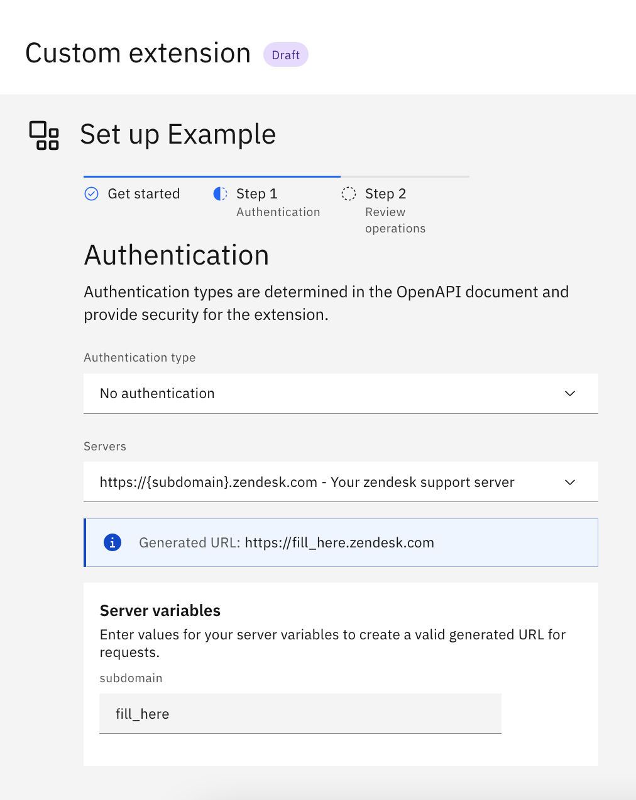
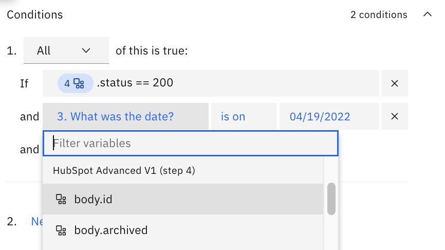
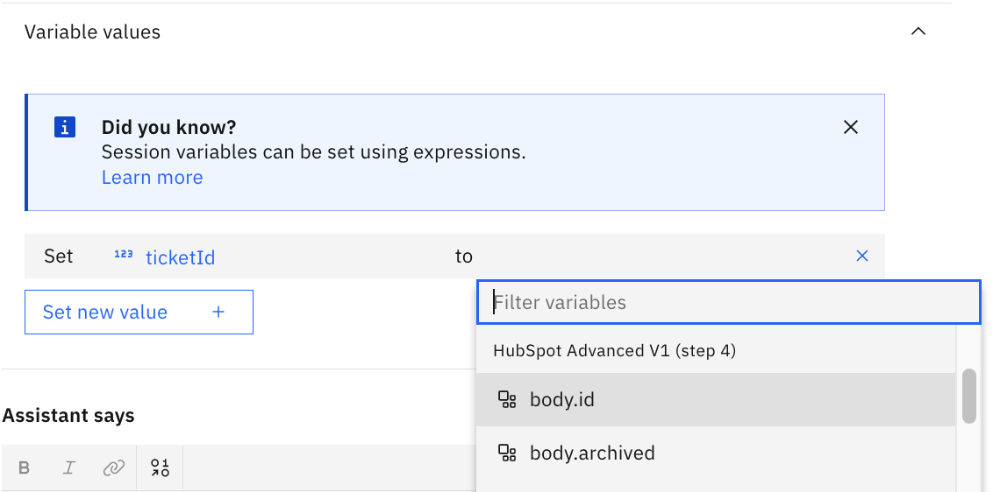
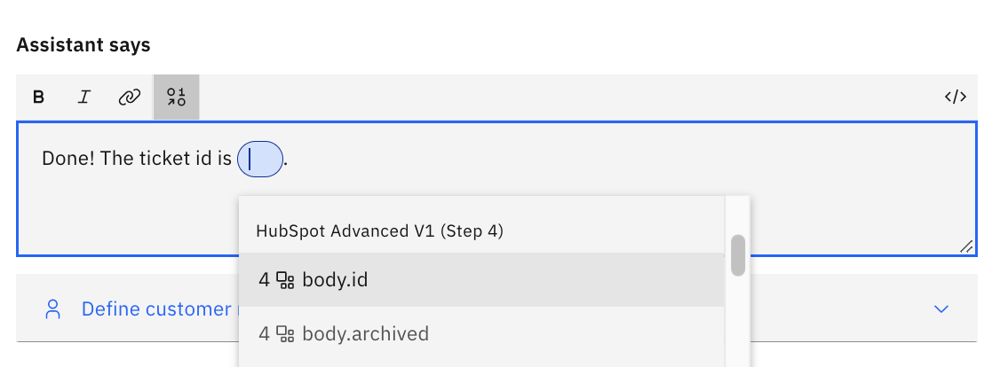
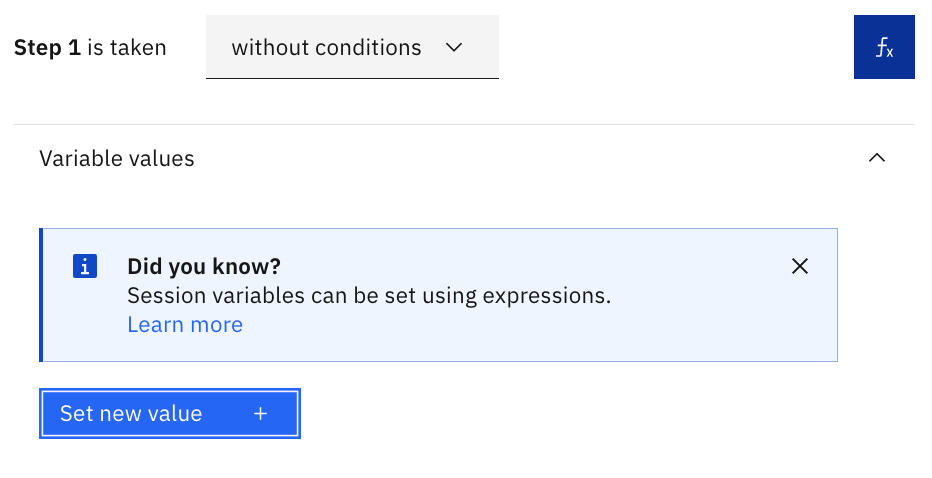

# Advanced Usage

In [Getting Started](../README.md#getting-started), we used simple OpenAPI specs to get you familiarized with how the spec works with extensions. Here, you will find a more in-depth guide on:
- [Topic 1](#configuring-auth): How to configure Auth schemes in your OpenAPI spec
- [Topic 2](#using-refs-in-openapi): OpenAPI Refs support
- [Topic 3](#parameters-variables-and-complex-actions): Using parameters and variables
- [Topic 4](#linking-multiple-extensions): Linking multiple extensions in your Actions skill

These topics will help you expand and exercise various capabilities of custom extensions, and hopefully will inspire more creative ways to use IBM watsonx Assistant through extensions.

Some notes before you get started:

- **Pro Tip**: [swagger.io](https://swagger.io/specification/) provides a easy-to-use interface, equipped with great documentation, for building and exporting OpenAPI specifications. Their SwaggerHub tool may prove extremely useful, especially if you are building out many API calls.
- **Limitations**: Our current list of OpenAPI support limitations can be found [here](https://cloud.ibm.com/docs/watson-assistant?topic=watson-assistant-build-custom-extension#build-custom-extension-openapi-file).


## Configuring Auth
When you click `Add +` in order to add your extension to your assistant, you will be prompted to choose a server and an authentication method as well as the credentials.



### Authentication Type
Our support for types of authentication are specified in our official documentation [here](https://cloud.ibm.com/docs/watson-assistant?topic=watson-assistant-build-custom-extension#build-custom-extension-openapi-file). Depending on which auth method you specify, you will need to fill out different fields. No Authentication is the default setting.

In order to use authentication types, you will need to add a `securitySchemes` object into your OpenAPI specification at the root level, similar to the following:
```
    "components": {
        "securitySchemes": {
            "bearerAuth": {
                "type": "http",
                "scheme": "bearer"
            },
            "basicAuth": {
                "type": "http",
                "scheme": "basic"
            }
        }
    },
```
As shown above, you can add multiple security schemes. Upon adding your extension, you will be asked to choose **one** of your provided schemes, which will be the scheme that will be used for all API calls using that extension.

There are various ways to write the security schemes in - this is simply an example. You will find variations of how to add security across the starter kit OpenAPI specs.

## Using Refs in OpenAPI
You may have noticed in quite a few of the example starter kits, for instance [here in HubSpot](../starter-kits/hubspot/basic/hubspot.basic.openapi.json), that there are `refs` that refer to specific schemas within the OpenAPI spec. Refs (references) is a concept that allows for reuse of data structures in order to make your OpenAPI spec more readable. If your API has a commonly used data type used as a response or a request object, you can store the object into a ref and use it to simplify your endpoint definitions in the spec.

These data objects, or schemas, can be stored in the root level of the OpenAPI spec, under a structure such as `components.schemas`. You can then refer to these data objects by specifying
```
"schema" : {
    "$ref" : "#/components/schemas/{your_object_name}"
}
```
for your `content` body.

Note that relative references are currently [not supported](https://cloud.ibm.com/docs/watson-assistant?topic=watson-assistant-build-custom-extension#build-custom-extension-openapi-file).

### Servers and Server Variables
You can specify multiple servers in your OpenAPI spec. This may be necessary for some use cases, i.e where there are multiple base URLs that you want to interact with within an API. Server variables can also be specified, where the designated variable can be replaced with the value you enter into this `Authentication` section.

To add server variables in your OpenAPI spec, you can write something similar to:
```
    "servers": [
        {
            "url": "https://{subdomain}.zendesk.com",
            "description": "Your zendesk support server",
            "variables": {
                "subdomain": {
                    "default": "fill_here",
                    "description": "The domain provided for you by Zendesk."
                }
            }
        }
    ],
```
Then, the respective fillable fields will render as an option in your `Authentication` setup step.

## Parameters, Variables, and Complex Actions
In your actions skills, you are able to parse the response information from the extension in any consequent steps. For instance, you can observe in `Action 2` of the [MetaWeather (advanced) skill](../starter-kits/docs/metaweather-deprecated/README.md#using-this-starter-kit) how the WOE-ID returned from the first extension step is retrieved, then passed in as an argument to the second extension step. This allows you to build your own flexible workflow around the API, directly inside IBM watsonx Assistant.

To do this, you want to access the response variables from an extension. These can be accessed in various places, including your condition statements:



your session variables (refer to [Session Variables](#session-variables)):



and your Assistant response text:



### Session Variables
These allow you to access information within and outside of a step, since they persist once they are stored. You can create a session variable by clicking on the `fX` button that appears to the right of the conditional section of within a step creation. 



To create and set a session variable:
1. Click `Set new value +`
1. Click `+ New session variable` at the bottom of the dropdown
1. Here, you can name your variable and select a type. You can also give it an initial value (i.e. a default) if you'd like. Click `Apply`
1. You will now see your Session Variable under the `Set new value +` dropdown. Select your session variable to set it.
1. Now, you have two options:
    - Set your session variable equal to a response variable from your extension. Simply select which value you want to assign from the `to` dropdown.
    - Set to an `expression`. Expressions are handy if you are trying to parse out a specific array item from an array response type. An example would be:

        

        Detailed documentation on expressions can be found on our official documentation [here](https://cloud.ibm.com/docs/watson-assistant?topic=watson-assistant-expressions).

## Linking Multiple Extensions
You are not limited to one extension per action nor assistant! You can add **multiple** extensions to an action, or across multiple actions within the same assistant (using [session variables](#parameters-variables-and-complex-actions)), and essentially mix APIs in order to create a completely custom workflow.

For illustration purposes, let's say your business wants to be able to automatically add a customer's local weather data when adding a ticket to your system. You can achieve this with custom extensions by following the flow (using your choice of a weather API and the Zendesk API in this example):

1. Ask for the customer's name, email, then the location and date of the reserved event.
1. Retrieve the weather information for that location and date via a weather API, then create a ticket in Zendesk including that information.
1. Provide the Zendesk ticket number to the customer.

A weather and Zendesk skill that shows this sequence can be found [here](../starter-kits/docs/metaweather-deprecated/readme.md#even-more-advanced-using-the-metaweather-extension-with-another-extension) in the starter kit. Note that since the MetaWeather API has been permanently removed, this example will not work end to end. It is still relevant, however, as reference material -- uploading the skill will allow you to see how extensions can be linked.

There are endless combinations that you can create with extensions, in order to provide customers a personalized help experience. So get creative!
