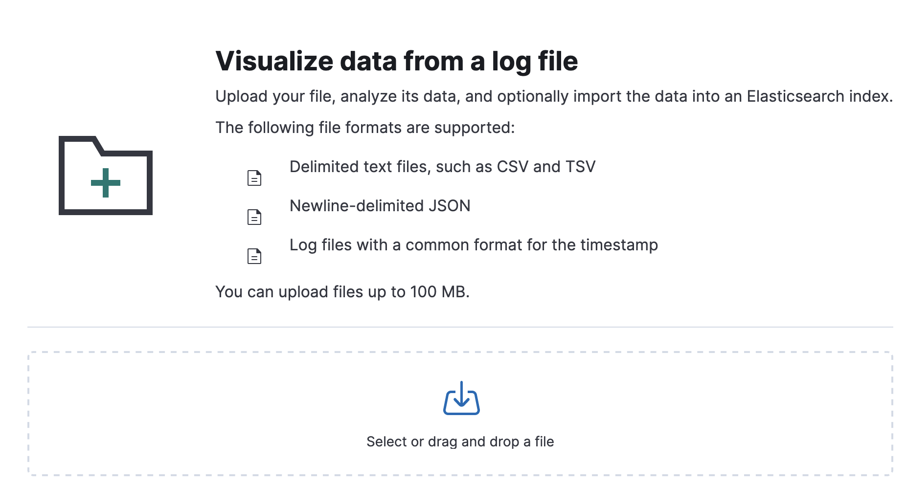
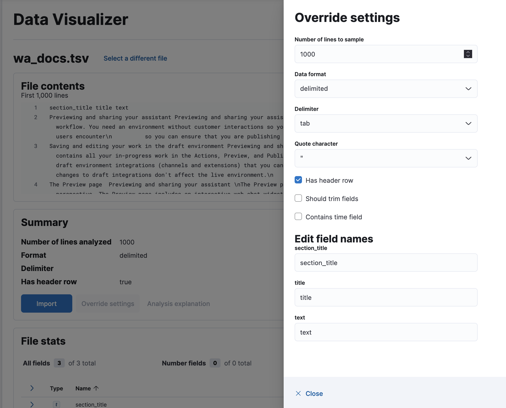
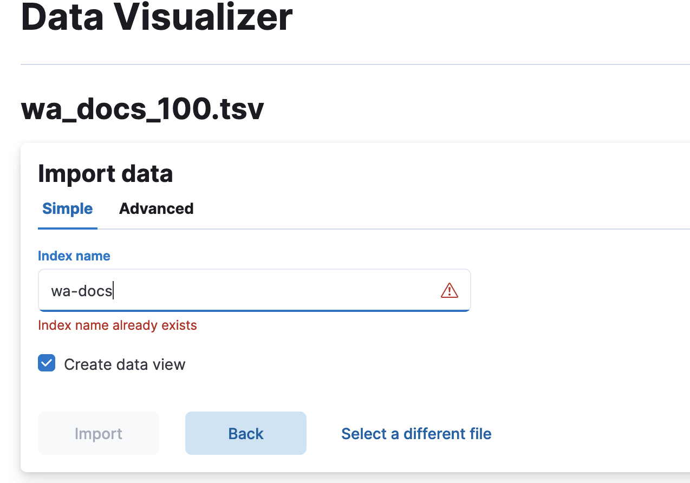
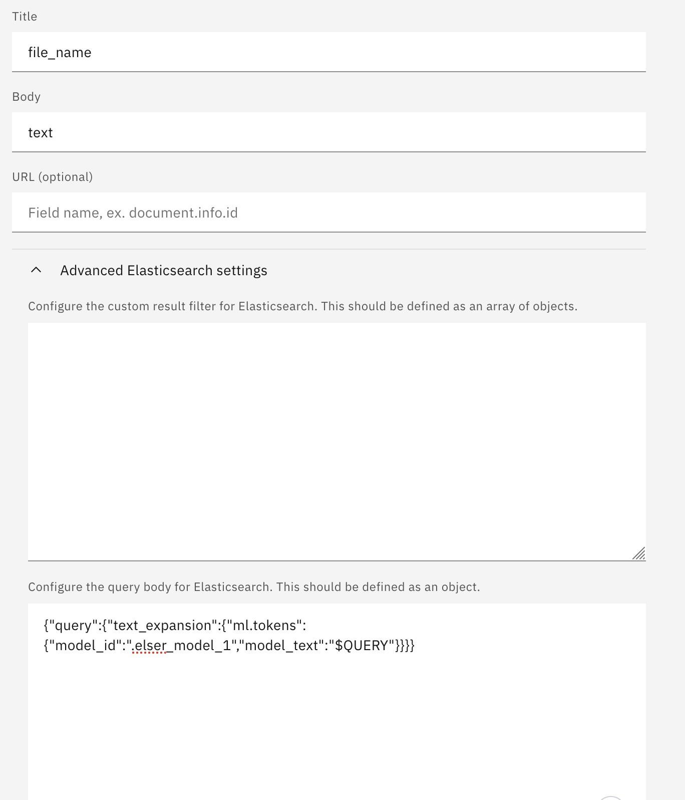

# How to set up Elasticsearch from IBM Cloud and integrate it with Watson Assistant
This is a documentation about how to set up Elasticsearch from IBM Cloud and create Watson Assistant search extension using Elasticsearch index.

## Table of contents:
* [Step 1: Provision an Elasticsearch instance on IBM Cloud](#step-1-provision-an-elasticsearch-instance-on-ibm-cloud)
* [Step 2: Set up Kibana to connect to Elasticsearch](#step-2-set-up-kibana-to-connect-to-elasticsearch)
* [Step 3: Create an Elasticsearch index (keyword-search)](#step-3-create-an-elasticsearch-index-keyword-search)
* [Step 4: Set up Watson Assistant search extension using Elasticsearch index](#step-4-set-up-watson-assistant-search-extension-using-elasticsearch-index)
* [Step 5: Enable semantic search with ELSER](#step-5-enable-semantic-search-with-elser)


## Step 1: Provision an Elasticsearch instance on IBM Cloud
* Create an [IBM Cloud account](https://cloud.ibm.com/registration) if you don't have one.
* Provision a Databases for Elasticsearch instance from the [IBM Cloud catalog](https://cloud.ibm.com/catalog/databases-for-elasticsearch).  
  **A platinum plan with at least 4GB RAM is required in order to use the advanced ML features,
  such as [Elastic Learned Sparse EncodeR (ELSER)](https://www.elastic.co/guide/en/machine-learning/current/ml-nlp-elser.html)**
* Create a service credentials from the left-side menu and find the `hostname`, `port`, `username` and `password`.
  The credentials will be used to connect to Kibana and Watson Assistant at next steps. You can use admin userid and password as well.
  Please refer to [this doc](https://cloud.ibm.com/docs/databases-for-elasticsearch?topic=databases-for-elasticsearch-user-management&interface=ui#user-management-elasticsearch-ibm-superuser) to learn more about different user roles.


## Step 2: Set up Kibana to connect to Elasticsearch
* Install Docker so that you can pull the Kibana container image later. You can follow the detailed [docker install guide](./how_to_install_docker.md)
* Create a kibana config folder, for example
  `mkdir -p ~/.kibana/config`
* Download the certificate from the Elasticsearch instance overview page, and move the downloaded file to the kibana config folder
* Under the kibana config folder, create a YAML file called `kibana.yml`. Inside the file, you need the following Kibana configuration settings:
    ```YAML
    elasticsearch.ssl.certificateAuthorities: "/usr/share/kibana/config/<your-certificate-file-name>"
    elasticsearch.username: "<username>"
    elasticsearch.password: "<password>"
    elasticsearch.hosts: ["https://<hostname:port>"]
    server.name: "kibana"
    server.host: "0.0.0.0"
    ```
  Notes:
    - Find the `hostname`, `port`, `username`, `password` from the service credentials created at Step 1
    - `elasticsearch.ssl.certificateAuthorities` is the location where the kibana deployment will look for the certificate in the docker container.
      `/usr/share/kibana/config/` is the default Kibana's config directory in the container

* Verify the Elasticsearch instance endpoint and find its version
    * Run
      ```bash
      curl -u <username>:<password> --cacert <path-to-cert> https://<hostname:port>
      ```
    * Find the version number from the output

* Download and start the Kibana container
  ```bash
  docker run -it --name kibana --rm \
  -v <path_to_your_kibana_config_folder>:/usr/share/kibana/config \
  -p 5601:5601 docker.elastic.co/kibana/kibana:<kibana_version>
  ```
  Once Kibana has connected to your Databases for Elasticsearch deployment and is running successfully, you will see the output in your terminal.
  ```
  [2024-01-02T16:43:29.378+00:00][INFO ][http.server.Kibana] http server running at http://0.0.0.0:5601
  [2024-01-02T16:46:13.777+00:00][INFO ][status] Kibana is now available
  ```

## Step 3: Create an Elasticsearch index (keyword-search)
This step is to create an Elasticsearch index with default settings for quick testing and verification.
With default settings, an Elasticsearch index does keyword search.

* Open http://0.0.0.0:5601 in browser and log into Kibana using the `username` and `password` from the service credentials of the Elasticsearch instance
* Navigate to the indices page http://localhost:5601/app/enterprise_search/content/search_indices
* Click on `Create a new index`, choose `Use the API`, and follow the steps there to create a new Elasticsearch index with default settings
* Go to the overview page for your newly created index, follow the steps there to verify your Elasticsearch index.  
  Notes:
    * Generate an API key, and you will use the API key for authentication and authorization for this specific Elasticsearch index
    * Use your `hostname` and `port` from the service credentials of the Elasticsearch instance to build `ES_URL`
      ```bash 
      export ES_URL=https://<hostname:port>
      ```
    * Append `--cacert <path-to-your-cert>` to the cURL for SSL connection or append `--insecure` to the cURL commands to ignore the certificate
    * If you are able to run the `Build your first search query` command at the last step, your Elasticsearch index has been set up successfully!

## Step 4: Set up Watson Assistant search extension using Elasticsearch index
* Provision a Watson Assistant instance from the [IBM cloud catalog](https://cloud.ibm.com/catalog/services/watsonx-assistant)
* Create a new Assistant in the new experience 
* Add a Search extension to your Assistant  
  Please follow the [Elasticsearch search integration set up](https://cloud.ibm.com/docs/watson-assistant?topic=watson-assistant-search-elasticsearch-add) documentation for more details.  

* Verify the Search extension  
  If you have used your index created at Step 3 to set up the Search integration, you can verify it by the following examples:
    * Verify the basic search  
      In your preview chat or draft webchat, type in `Who wrote 1984?`. If you see the Elasticsearch search results, your search extension has been set up successfully.  
      
    * Verify Conversational Search (beta)  
      Go to your Search extension, find the Conversation Search toggle, toggle it on and save it. Then go to your preview chat or draft webchat, type in `Who wrote 1984?`.
      If you see an answer instead of a list of research result, your conversational search is working properly.  
      


## Step 5: Enable semantic search with ELSER
This step is to enable semantic search using ELSER. Here are the tutorials from Elasticsearch doc:  
ELSER v1: https://www.elastic.co/guide/en/elasticsearch/reference/8.10/semantic-search-elser.html  
ELSER v2: https://www.elastic.co/guide/en/elasticsearch/reference/current/semantic-search-elser.html

**IMPORTANT NOTE**: ELSER v2 has become available since Elasticsearch 8.11. It is preferred to use ELSER v2 if it is available.

The following steps are based on ELSER v2 model:
### Create environment variables for ES credentials
  ```bash
  export ES_URL=https://<hostname:port>
  export ES_USER=<username>
  export ES_PASSWORD=<password>
  export ES_CACERT=<path-to-your-cert>
  ```  
You can find the credentials from the service credentials of your Elasticsearch instance.
&nbsp;
### Enable ELSER model (v2)
ELSER model is not enabled by default, but you can enable it in Kibana. Please follow the [download-deploy-elser instructions](https://www.elastic.co/guide/en/machine-learning/current/ml-nlp-elser.html#download-deploy-elser) to do it.

Note: `.elser_model_2_linux-x86_64` is an optimized version of the ELSER v2 model and is preferred to use if it is available. Otherwise, use `.elser_model_2` for the regular ELSER v2 model or `.elser_model_1` for ELSER v1.


### Load data into Elasticsearch
In Kibana, you can upload a data file to Elasticsearch cluster using the Data Visualizer in the Machine Learning UI http://localhost:5601/app/ml/filedatavisualizer.  

As an example, you can download [wa-docs-100](./assets/wa_docs_100.tsv) TSV data and upload it to Elasticsearch. 
This dataset contains documents processed from the watsonx Assistant product documents. There are three columns in this TSV file, 
`title`, `section_title` and `text`. The columns are extracted from the original documents. Specifically, 
each `text` value is a small chunk of text split from the original document. 

In Kibana,
* Select your downloaded file to upload  
  
* Click `Override settings` and then check `Has header row` checkbox because the example dataset has header row  
  
* Import the data to a new Elasticsearch index and name it `wa-docs`  
    
Once finished, you have created an index for the data you just uploaded.
### Create an index with mappings for ELSER output
  ```bash
  curl -X PUT "${ES_URL}/search-wa-docs?pretty" -u "${ES_USER}:${ES_PASSWORD}" \
  -H "Content-Type: application/json" --cacert "${ES_CACERT}" -d'
  {
    "mappings": {
      "_source": {
          "excludes": [
            "ml.tokens"
          ]
      },
      "properties": {
        "ml.tokens": {
          "type": "sparse_vector"
        },
        "text": {
          "type": "text"
        }
      }
    }
  }'
  ```
Notes:
* `search-wa-docs` will be your index name.
* `ml.tokens` is the field that will keep ELSER output when data is ingested.
* `text` is the input filed for the inference processor. In the example dataset, the name of the input field is `text` which will be used by ELSER model to process.
* `sparse_vector` type is for ELSER v2. For ELSER v1, please use `rank_features` type.
* Learn more about [elser-mappings](https://www.elastic.co/guide/en/elasticsearch/reference/current/semantic-search-elser.html#elser-mappings) from the tutorial.

### Create an ingest pipeline with an inference processor
Create an ingest pipeline with an inference processor to use ELSER to infer against the data that will be ingested in the pipeline.
  ```bash
  curl -X PUT "${ES_URL}/_ingest/pipeline/elser-v2-test?pretty" -u "${ES_USER}:${ES_PASSWORD}" \
  -H "Content-Type: application/json" --cacert "${ES_CACERT}" -d'
  {
    "processors": [
      {
        "inference": {
          "model_id": ".elser_model_2_linux-x86_64",
          "target_field": "ml",
          "field_map": {
            "text": "text_field"
          },
          "inference_config": {
            "text_expansion": {
              "results_field": "tokens"
            }
          }
        }
      }
    ]
  }'
  ```
Notes:
* `elser-v2-test` is the name of the ingest pipeline with an inference processor using ELSER v2 model.
* `.elser_model_2_linux-x86_64` is an optimized version of the ELSER v2 model and is preferred to use if it is available. Otherwise, use `.elser_model_2` for the regular ELSER v2 model or `.elser_model_1` for ELSER v1.
* `"text": "text_field"` maps the `text` field from an index to the input field of the ELSER model. `text_field` is the default input field of the ELSER model when it is deployed. You may need to update it if you configure a different input field when deploying your ELSER model.
* Learn more about [inference-ingest-pipeline](https://www.elastic.co/guide/en/elasticsearch/reference/current/semantic-search-elser.html#inference-ingest-pipeline) from the tutorial

### Ingest the data through the inference ingest pipeline
Create the tokens from the text by reindexing the data through the inference pipeline that uses ELSER as the inference model.
  ```bash
  curl -X POST "${ES_URL}/_reindex?wait_for_completion=false&pretty" -u "${ES_USER}:${ES_PASSWORD}" \
  -H "Content-Type: application/json" --cacert "${ES_CACERT}" -d'
  {
    "source": {
      "index": "wa-docs"
    },
    "dest": {
      "index": "search-wa-docs",
      "pipeline": "elser-v2-test"
    }
  }'
  ```
* `wa-docs` is the index you created when uploading the example file to Elasticsearch cluster. It contains the text data.
* `search-wa-docs` is the search index that has ELSER output field.
* `elser-v2-test` is the ingest pipeline with an inference processor using ELSER v2 model.
### Semantic search by using the text_expansion query
To perform semantic search, use the `text_expansion` query, and provide the query text and the ELSER model ID.
The example below uses the query text "How to set up custom extension?", the `ml.tokens` field contains
the generated ELSER output:
  ```bash
  curl -X GET "${ES_URL}/search-wa-docs/_search?pretty" -u "${ES_USER}:${ES_PASSWORD}" \
  -H "Content-Type: application/json" --cacert "${ES_CACERT}" -d'
  {
     "query":{
        "text_expansion":{
           "ml.tokens":{
              "model_id":".elser_model_2_linux-x86_64",
              "model_text":"how to set up custom extension?"
           }
        }
     }
  }'
  ```
Notes:
* You can also use `API_KEY` for authorization. You can generate an `API_KEY` for your search index on the index overview page in Kibana.
* Learn more about [text-expansion-query](https://www.elastic.co/guide/en/elasticsearch/reference/current/semantic-search-elser.html#text-expansion-query) from the tutorial.

### Enable semantic search for your Search extension on Watson Assistant
To enable semantic search for your Search extension on Watson Assistant, you just need to specify the following query body in the Search extension settings:
  ```json
  {
    "query":{
      "text_expansion":{
        "ml.tokens":{
          "model_id":".elser_model_2_linux-x86_64",
          "model_text":"$QUERY"
        }
      }
    }
  }
  ```
    

Notes:
* `$QUERY` is the query variable that contains the user search query by default.
* `.elser_model_2_linux-x86_64` is an optimized version of the ELSER v2 model and is preferred to use if it is available. Otherwise, use `.elser_model_2` for the regular ELSER v2 model or `.elser_model_1` for ELSER v1.
