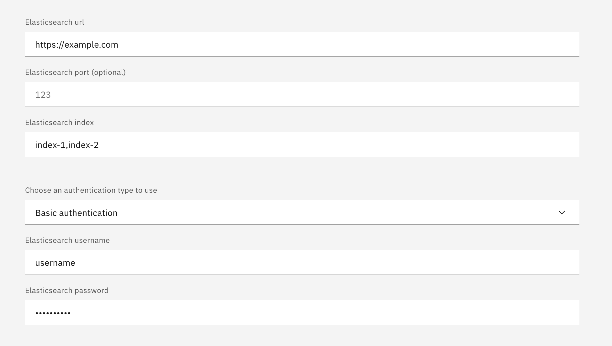
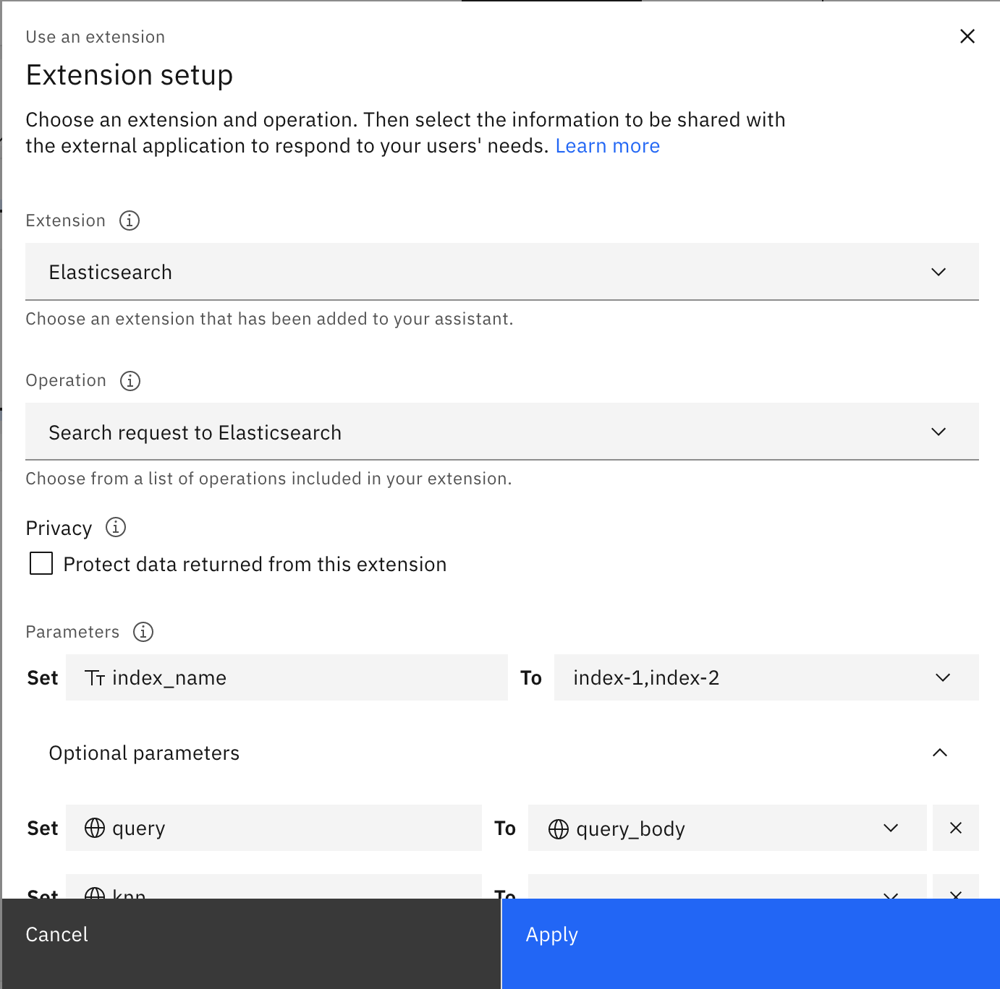

# Federated Search in Elasticsearch

This guide dives into performing a single search query across multiple indexes within an Elasticsearch cluster. It assumes these indexes share the same relevant fields for your search results.

## Methods for Multi-Index Search

There are several approaches to searching across multiple indexes in Elasticsearch:

### 1. Comma-Separated Indices:

This method involves listing all relevant indexes separated by commas in the search URL. Here's an example using elser model for semantic search across "index-1" and "index-2":

```bash
curl -X GET "${ES_URL}/index-1,index-2/_search?pretty" -u "${ES_USER}:${ES_PASSWORD}" \
-H "Content-Type: application/json" --cacert "${ES_CACERT}" -d'
{
   "query":{
      "text_expansion":{
         "ml.tokens":{
            "model_id":".elser_model_1",
            "model_text":"how to set up custom extension?"
         }
      }
   }
}'
```

### 2. Index Patterns:

Index patterns allow you to target multiple indexes using a wildcard pattern. Here's how to search across "index-1" and "index-2" using the same example:

```bash
curl -X GET "${ES_URL}/index-*/_search?pretty" -u "${ES_USER}:${ES_PASSWORD}" \
-H "Content-Type: application/json" --cacert "${ES_CACERT}" -d'
{
   "query":{
      "text_expansion":{
         "ml.tokens":{
            "model_id":".elser_model_1",
            "model_text":"how to set up custom extension?"
         }
      }
   }
}'
```

### 3. Searching All Indices:

To search across all indexes in the cluster, you can omit the index name entirely or use `_all` or `*`:

```bash
# Omit index name
curl -X GET "${ES_URL}/_search?pretty" -u "${ES_USER}:${ES_PASSWORD}" \
-H "Content-Type: application/json" --cacert "${ES_CACERT}" -d'
{
   "query":{
      "text_expansion":{
         "ml.tokens":{
            "model_id":".elser_model_1",
            "model_text":"how to set up custom extension?"
         }
      }
   }
}'

# Using _all
curl -X GET "${ES_URL}/_all_/_search?pretty" -u "${ES_USER}:${ES_PASSWORD}" \
-H "Content-Type: application/json" --cacert "${ES_CACERT}" -d'
{
   "query":{
      "text_expansion":{
         "ml.tokens":{
            "model_id":".elser_model_1",
            "model_text":"how to set up custom extension?"
         }
      }
   }
}'

# Using *
curl -X GET "${ES_URL}/*/_search?pretty" -u "${ES_USER}:${ES_PASSWORD}" \
-H "Content-Type: application/json" --cacert "${ES_CACERT}" -d'
{
   "query":{
      "text_expansion":{
         "ml.tokens":{
            "model_id":".elser_model_1",
            "model_text":"how to set up custom extension?"
         }
      }
   }
}'
```

## Using these Methods with WatsonX Assistant

### Built-in Search Extension

For similar functionality with WatsonX Assistant's built-in search extension, follow the [official Elasticsearch search integration set up documentation](https://cloud.ibm.com/docs/watson-assistant?topic=watson-assistant-search-elasticsearch-add). The key difference is specifying your `Elasticsearch index` field using one of the methods described above. For example:



### Custom Extension

When building a custom extension in WatsonX Assistant with the Elasticsearch API, you can leverage these same index name patterns when setting the `index_name` parameter. Follow the guide on [building a custom extension in watsonx Assistant with Elasticsearch API](../../starter-kits/elasticsearch/README.md#build-a-custom-extension-in-watsonx-assistant-with-elasticsearch-api).

Then follow one of the methods listed above when setting the `index_name` parameter to search across multiple indexes within your Elasticsearch cluster. For example:

