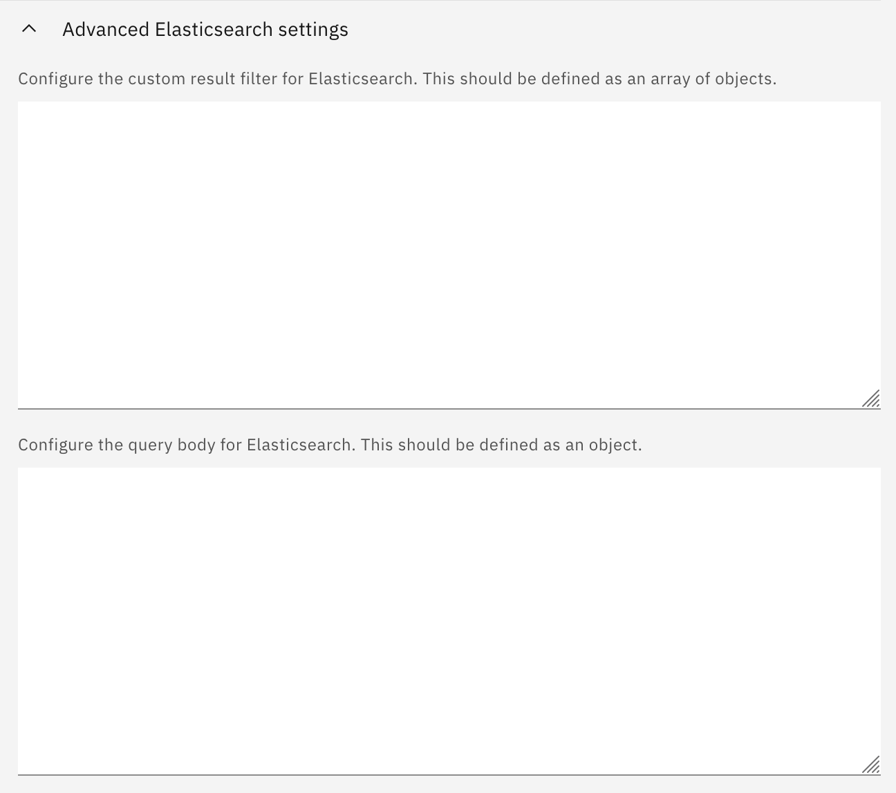
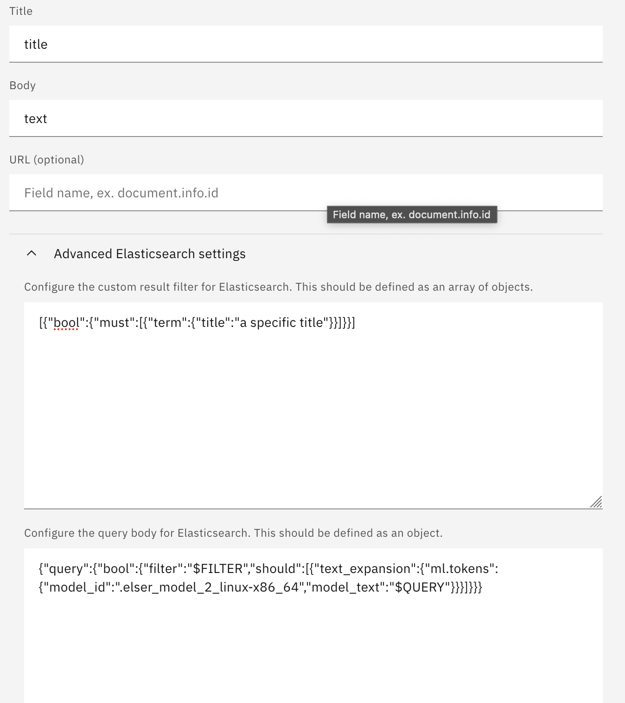
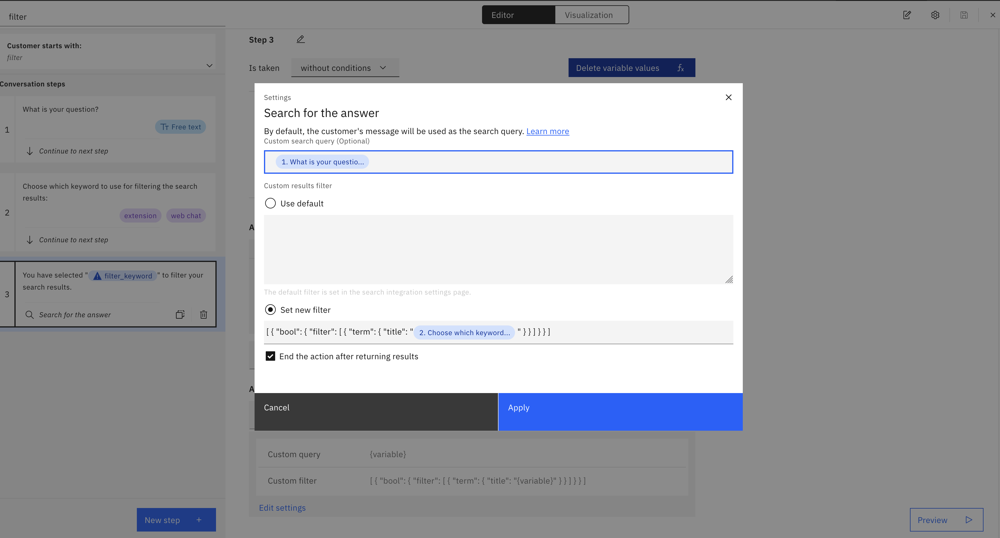

# How to configure the advanced Elasticsearch settings
This guide shows how to configure the advanced Elasticsearch settings in watsonx Assistant's Search integration. Specifically, there are two types of settings under `Advanced Elasticsearch settings`: custom filters and query body.



## Table of contents:
* [How to configure the custom filters](#how-to-configure-the-custom-filters)
  * [Global filters within the Search integration](#global-filters-within-the-search-integration)
  * [Local filters within an action step](#local-filters-within-an-action-step)
  * [Filter object examples](#filter-object-examples)
    * [AND](#and)
    * [OR](#or)
    * [NOT](#not)
    * [(a AND b) OR c](#a-and-b-or-c)
* [How to configure the query body](#how-to-configure-the-query-body)
  * [Semantic search with ELSER](#semantic-search-with-elser)
  * [KNN dense vector search](#knn-dense-vector-search)
  * [Using a nested query to search over nested documents with ELSER](#using-a-nested-query-to-search-over-nested-documents-with-elser)
  * [Hybrid search with combined keyword search and dense vector search](#hybrid-search-with-combined-keyword-search-and-dense-vector-search)
  * [Search on semantic text field](#using-a-nested-query-to-search-on-a-semantic-text-field)

## How to configure the custom filters
There are two ways to configure the custom filters: 

### Global filters within the Search integration
You can configure custom filters for your Elasticsearch integration under `Advanced Elasticsearch settings`. These custom filters will be used as global filters and apply to all user queries. If a custom query body is provided, the `$FILTER` variable needs to be included in the query body to use the custom filters. For example,




### Local filters within an action step
You can also configure custom filters within an action step when calling the Search integration via `Search for the answer` option. These custom filters will overwrite the global filters defined in the Search integration.

**Session variables or step variables can be used in the custom filters to achieve more dynamic filtering use cases.**

For example,



The above sceenshot shows the settings for `Search for the answer` in an action step where,
* A custom search query is provided using a step variable, and
* An array of custom filters are provided using the `Set new filter` option, and
* A step variable from the second step is used to build a dynamic filter clause.

Note: double quotes are needed for using variables in building the custom filters.

### Filter object examples
Using the custom filters, you can achieve advanced filtering use cases for search and conversational search. Here are some examples:

**Note: The below examples assume `title`, `text`, and `id` fields are available in your Elasticsearch index. Among them, `title` and `text` are text type fields, while `id` is a keyword type field.**

#### AND
```json
[
    {
        "match": {
            "title": "A_keyword_in_title"
        }
    },
    {
        "match": {
            "text": "A_keyword_in_text"
        }
    },
    {
        "match": {
            "id": "A_specific_ID"
        }
    }
]
```
This filter object will filter the search results using the following conditions:
* `title` contains "A_keyword_in_title", AND
* `text` contains "A_keyword_in_text", AND
* `id` is equal to "A_specific_ID".


#### OR
```json
[
  {
    "bool": {
        "should": [
            {
                "match": {
                    "title": "A_keyword_in_title"
                }
            },
            {
                "match": {
                    "text": "A_keyword_in_text"
                }
            },
            {
                "match": {
                     "id": "A_specific_ID"
                }
            }
        ]
    }
  }
]
```
This filter object will filter the search results using the following conditions:
* `title` contains "A_keyword_in_title", OR
* `text` contains "A_keyword_in_text", OR
* `id` is equal to "A_specific_ID".

#### NOT
```json
[
  {
    "bool": {
        "must_not": [
            {
                "match": {
                    "title": "A_keyword_in_title"
                }
            },
            {
                "match": {
                    "text": "A_keyword_in_text"
                }
            },
            {
                "match": {
                     "id": "A_specific_ID"
                }
            }
        ]
    }
  }
]
```
This filter object will filter the search results using the following conditions:
* `title` does not contain "A_keyword_in_title", AND
* `text` does not contain "A_keyword_in_text", AND
* `id` is not equal to "A_specific_ID".

#### (a AND b) OR c
```json
[
  {
    "bool": {
        "should": [
            {
                "match": {
                    "id": "A_specific_ID"
                }
            }
            {
                "bool": {
                    "filter": [
                        {
                            "match": {
                                "title": "A_keyword_in_title"
                            }
                        },
                        {
                            "match": {
                                "text": "A_keyword_in_text"
                            }
                        }
                    ]
                }
            }
        ]
    }
  }
]
```
This filter object will filter the search results using the following conditions:
* `title` contains "A_keyword_in_title" AND `text` contains "A_keyword_in_text", OR
* `id` is not equal to "A_specific_ID"


Learn more about Elasticsearch filters from the [Elasticsearch boolean query documentation](https://www.elastic.co/guide/en/elasticsearch/reference/current/query-dsl-bool-query.html)

## How to configure the query body
By default, keyword search is used for your Search integration, but you can configure the query body in the `Advanced Elasticsearch settings` to enable more advanced search techniques such as:
* semantic search with ELSER
* KNN dense vector search
* using a nested query to search nested documents
* hybrid search
* search on a semantic text field

Here are some examples:

### Semantic search with ELSER
```json
{
  "query": {
    "bool": {
      "should": [
        {
          "text_expansion": {
            "ml.tokens": {
              "model_id": ".elser_model_2_linux-x86_64",
              "model_text": "$QUERY"
            }
          }
        }
      ],
      "filter": "$FILTER"
    }
  }
}
```
* `ml.tokens` refers to the field that stores the ELSER tokens. You may need to update it if you use a different field in your index. If the ELSER tokens are not available, you can also use the field that contains the raw text, but the search quality may degrade.
* `.elser_model_2_linux-x86-64` is the model ID for the optimized version of ELSER v2. It is recommended to use if it is available in your Elasticsearch deployment. Otherwise, use `.elser_model_2` for the regular ELSER v2 model, or `.elser_model_1` for ELSER v1.
* `$QUERY` is the variable for accesing the user query. It will make sure that the user query will be passed to the query body.
* `$FILTER` is the variable for accessing the custom filters configured either in the `Advanced Elasticsearch settings` or when calling the search in an action step. It will make sure that the custom filters will be used in the query body.
* Learn more about ELSER from [here](https://www.elastic.co/guide/en/elasticsearch/reference/current/semantic-search-elser.html)
* Learn more about Elasticsearch boolean query and filters from [here](https://www.elastic.co/guide/en/elasticsearch/reference/current/query-dsl-bool-query.html)

### KNN dense vector search
```json
{
  "knn": {
    "field": "text_embedding.predicted_value",
    "query_vector_builder": {
      "text_embedding": {
        "model_id": "intfloat__multilingual-e5-small",
        "model_text": "$QUERY"
      }
    },
    "k": 10,
    "num_candidates": 100,
    "filter" : "$FILTER"
  }
}
```
Notes:
* `text_embedding.predicted_value` refers to the field that stores the dense vectors. You may need to update it if you use a different field in your index.
* `text_embedding` under `query_vector_builder` is the natural language processing task to perform. It has to be `text_embedding` for KNN search.
* `intfloat__multilingual-e5-small` is the embedding model ID. You may need to update it if you want to use a different embedding model.
* `$QUERY` is the variable for accesing the user query. It will make sure that the user query will be passed to the query body.
* `$FILTER` is the variable for accessing the custom filters configured either in the `Advanced Elasticsearch settings` or when calling the search in an action step. It will make sure that the custom filters will be used in the query body.
* Learn more about knn search from [here](https://www.elastic.co/guide/en/elasticsearch/reference/current/knn-search.html).
* Learn more about how to set up a text embedding model in Elasticsearch from [here](text_embedding_deploy_and_use.md).

### Using a nested query to search over nested documents with ELSER
If there are inner documents in your Elasticsearch index, you can use a nested query to search over the inner documents. If there is a match, the query returns the root parent document with matched inner documents. So, if applying filters to the search results, you can choose to filter the outer or inner documents.

#### Filtering the outer documents
```json
{
  "query": {
    "bool": {
      "must": [
        {
          "nested": {
            "path": "passages",
            "query": {
              "text_expansion": {
                "passages.sparse.tokens": {
                  "model_id": ".elser_model_2_linux-x86_64",
                  "model_text": "$QUERY"
                  }
              }
            },
            "inner_hits": {"_source": {"excludes": ["passages.sparse"]}}
          }
        }
      ],
      "filter": "$FILTER"
    }
  },
  "_source": false
}
```

#### Filtering the inner documents
```json
{
  "query": {
    "nested": {
      "path": "passages",
      "query": {
        "bool": {
          "should": [
            {
              "text_expansion": {
                "passages.sparse.tokens": {
                  "model_id": ".elser_model_2_linux-x86_64",
                  "model_text": "$QUERY"
                }
              }
            }
          ],
          "filter": "$FILTER"
        }
      },
      "inner_hits": {"_source": {"excludes": ["passages.sparse"]}}
    }
  },
  "_source": false
}
```
Notes:
* `passages` is the nested field that stores inner documents within a parent document. You may need to update it if you use a different nested field in your index.
* `passages.sparse.tokens` refers to the field that stores the ELSER tokens or raw text for the inner documents. You may need to update it if you use a different nested field in your index. If the ELSER tokens are not available, you can also use the field that contains the raw text, but the search quality may degrade.
* `"inner_hits": {"_source": {"excludes": ["passages.sparse"]}}` is to exclude the ELSER tokens from the inner documents in the search results.
* `"_source": false` is to exclude all the top-level fields in the search results because only the inner documents in the search results will be used.
* `$QUERY` is the variable for accesing the user query. It will make sure that the user query will be passed to the query body.
* `$FILTER` is the variable for accessing the custom filters configured either in the `Advanced Elasticsearch settings` or when calling the search in an action step. It will make sure that the custom filters will be used in the query body. If applied on the outer documents, only outer fields are available to use in the filters. If applied on the inner documents, only inner fields are available to use in the filters.
* Learn more about nested queries and fields from [here](https://www.elastic.co/guide/en/elasticsearch/reference/current/query-dsl-nested-query.html)

### Hybrid search with combined keyword search and dense vector search
```json
{
    "query": {
        "bool": {
          "should": [
            {
              "query_string": {
                    "query": "$QUERY",
                    "fields": ["$BODY_FIELD_NAME", "$TITLE_FIELD_NAME"],
                    }
            }
          ],
          "filter" : "$FILTER"
        }
    },
    "knn": {
        "field": "text_embedding.predicted_value",
        "query_vector_builder": {
        "text_embedding": {
            "model_id": "intfloat__multilingual-e5-small",
            "model_text": "$QUERY"
        }
        },
        "k": 10,
        "num_candidates": 100,
        "filter" : "$FILTER"
    },
    "rank": {
        "rrf": {}
    },
    "size": 10,
    "_source": {"excludes": ["text_embedding.predicted_value"]}
}
```
Notes:
* `text_embedding.predicted_value` refers to the field that stores the dense vectors. You may need to update it if you use a different field in your index.
* `text_embedding` under `query_vector_builder` is the natural language processing task to perform. It has to be `text_embedding` for KNN search.
* `intfloat__multilingual-e5-small` is the embedding model ID. You may need to update it if you want to use a different embedding model.
* `$QUERY` is the variable for accesing the user query. It makes sure that the user query will be passed to the query body.
* `$BODY_FIELD_NAME` and `$TITLE_FIELD_NAME` are the variables for accessing the Body field and Title field configured in the Search integration, respectively.
* `$FILTER` is the variable for accessing the custom filters configured either in the `Advanced Elasticsearch settings` or when calling the search in an action step. It makes sure that the custom filters will be used in the query body.
* `rank.rrf` is the Reciprocal rank fusion (rrf) method to combine the search results from keyword search and dense vector search.
* `"_source": {"excludes": ["text_embedding.predicted_value"]}` is to exclude the unnecessary dense vector field in the search results.

### Using a nested query to search on a semantic text field
To make semantic text field work properly with the Elasticsearch integration on watsonx Assistant/Orchestrate, a nested query like below is needed:
```json
{
  "query": {
    "nested": {
      "path": "semtext.inference.chunks",
      "query": {
        "sparse_vector": {
          "field": "semtext.inference.chunks.embeddings",
          "inference_id": ".elser_model_2_linux-x86_64",
          "query": "$QUERY"
        }
      },
      "inner_hits": {"_source": {"excludes": ["semtext.inference.chunks.embeddings"]}}
    }
  },
  "_source": false
}
```
Notes:
* `semtext` is the name of the semantic field. You may need to update it if your semantic field has a different name. See [Elasticsearch semantic-text](https://www.elastic.co/guide/en/elasticsearch/reference/current/semantic-text.html) for more details.
* `semtext.inference.chunks` refers to the field that stores the chunked texts and embeddings.
* `sparse_vector` specifies the type of the query, in this case, a sparse_vector query. It is a similar but newer type of query compared to the `text_expansion` query.
* `semtext.inference.chunks.embeddings` refers to the field that stores the embeddings for the chunked texts.
