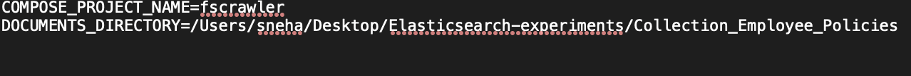
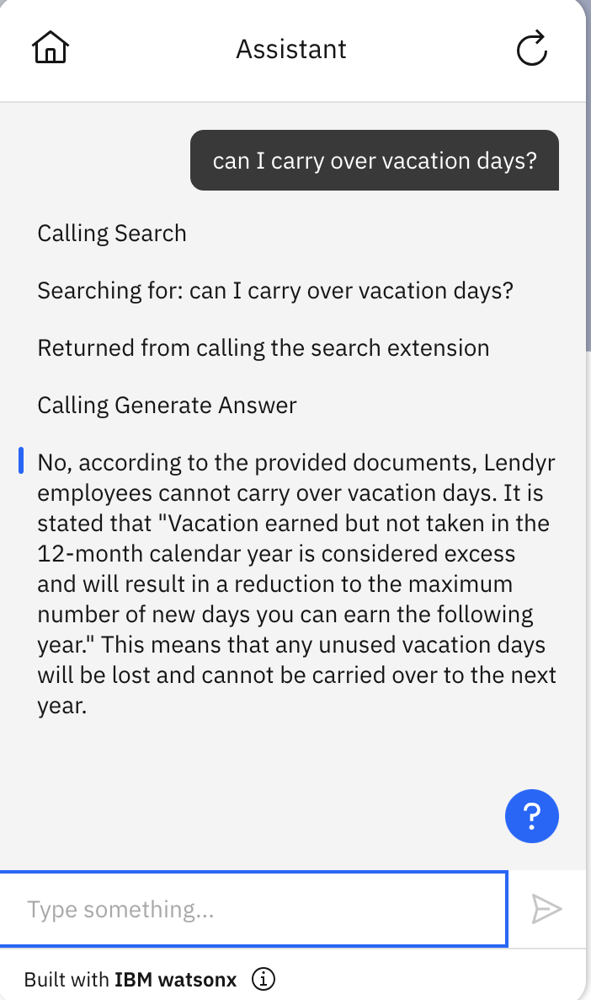

# Working with PDF and Office Documents in Elasticsearch

## Table of contents:
* [Step 1: Create all the necessary environment variables](#step-1-create-all-the-necessary-environment-variables)
* [Step 2: Create an Elasticsearch index with specific nested mapping](#step-2-create-an-index-with-a-nested-mapping-for-storing-chunked-text-and-tokens)
* [Step 3: Create an ELSER ingest pipeline with regex based chunking](#step-3-create-an-elser-ingest-pipeline-with-regex-based-chunking)
* [Step 4: Run fscrawler app using docker](#step-4-running-the-fscrawler-as-a-docker-service)
* [Step 5: Connecting Watson Assistant to Elasticsearch for Conversational Search](#step-5-connecting-watson-assistant-to-elasticsearch-for-conversational-search)

## Pre-requisites:

1. The following tutorial assumes there exists a folder of documents having the supported file [types](https://fscrawler.readthedocs.io/en/latest/user/formats.html) that you would like to index into Elasticsearch. 

	Optional: If using IBM COS or other Cloud Object Storage for your files, you can follow instructions to use [s3fs](https://cloud.ibm.com/docs/cloud-object-storage?topic=cloud-object-storage-s3fs) or [rclone](https://cloud.ibm.com/docs/cloud-object-storage?topic=cloud-object-storage-rclone) to synchronize your data to a local mounted filesystem

2. If you do not have `docker` and `docker-compose`, you can install them by following the [docker and compose install guide](./how_to_install_docker.md). These are needed to run the `fscrawler` app.


## Introduction

Before you start, ensure you have set up your Elasticsearch cluster:

* For Elasticsearch on IBM Cloud, please refer to [ICD-elasticsearch-install-and-setup](./ICD_Elasticsearch_install_and_setup.md) for more details.
* For Elasticsearch (watsonx Discovery) on CloudPak, please refer to [watsonx-discovery-install-and-setup](./watsonx_discovery_install_and_setup.md) for more details.

We will use the filesystem crawler [fscrawler](https://fscrawler.readthedocs.io/en/latest/index.html) to help sync the documents from a local filesystem on to an index on Elasticsearch. You can read more in detail about the configuration options available for `fscrawler` in their linked documentation.

### Step 1: Create all the necessary environment variables

The `ES_INDEX_NAME` and `ES_PIPELINE_NAME` variables can be whatever you would like to name your index and ingestion pipeline for use throughout this process/guide as references in various steps below.

  ```bash
  export ES_URL=https://<hostname:port>
  export ES_USER=<username>
  export ES_PASSWORD=<password>
  export ES_CACERT=<path-to-your-cert>
  export ES_INDEX_NAME=<name-of-index>
  export ES_PIPELINE_NAME=<name-of-ingest-pipeline>
  ```  


### Step 2: Create an index with a nested mapping for storing chunked text and tokens

```bash
curl -X PUT "${ES_URL}/${ES_INDEX_NAME}?pretty" -u "${ES_USER}:${ES_PASSWORD}" \
-H "Content-Type: application/json" --cacert "${ES_CACERT}" -d'
{
  "mappings": {
    "properties": {
      "passages": {
        "type": "nested",
        "properties": {
          "text": {
            "type": "text"
          },
          "sparse": {
            "properties": {
              "tokens": {
                "type": "sparse_vector"
              }
            }
          }
        }
      }
    }
  }
}'
```

Note: `sparse_vector` type is for ELSER v2. For ELSER v1, please use `rank_features`. ELSER v2 has been available since Elasticsearch 8.11 and is preferred to use if it is available. Learn more about ELSER v2 from [here](https://www.elastic.co/guide/en/machine-learning/current/ml-nlp-elser.html)


### Step 3: Create an ELSER ingest pipeline with regex based chunking

Below is a sample request to create a pipeline that transforms the "content" field [extracted](https://fscrawler.readthedocs.io/en/latest/admin/fs/elasticsearch.html#generated-fields) by `fscrawler` using the ELSER model. 

You will be able to reference this pipeline in the next few steps as a part of indexing the documents of choice.

**NOTE**: You can update the `model_limit` param in the request below if you would like to experiment with different chunk sizes for your data. This controls the length of the chunks in characters.

In this case, it has been set to `1024` since we are working with the ELSER model which has a 512 token limit( produces tokens only on the first 512 tokens of the text ). A chunk length of `1024` is unlikely to produce more than 512 tokens thereby staying within the token limit of the model. 

```bash
curl -X PUT "${ES_URL}/_ingest/pipeline/${ES_PIPELINE_NAME}?pretty" -u "${ES_USER}:${ES_PASSWORD}" \
-H "Content-Type: application/json" --cacert "${ES_CACERT}" -d'
{
  "processors": [
  {
    "script": {
      "source": " String[] envSplit = /((?<!M(r|s|rs)\\.)(?<=\\.) |(?<=\\!) |(?<=\\?) )/.split(ctx['\''content'\'']);\n          ctx['\''passages'\''] = new ArrayList();\n          int i = 0;\n          boolean remaining = true;\n          if (envSplit.length == 0) {\n            return\n          } else if (envSplit.length == 1) {\n            Map passage = ['\''text'\'': envSplit[0]];ctx['\''passages'\''].add(passage)\n          } else {\n            while (remaining) {\n              Map passage = ['\''text'\'': envSplit[i++]];\n              while (i < envSplit.length && passage.text.length() + envSplit[i].length() < params.model_limit) {passage.text = passage.text + '\'' '\'' + envSplit[i++]}\n              if (i == envSplit.length) {remaining = false}\n              ctx['\''passages'\''].add(passage)\n            }\n          }",
      "params": {
        "model_limit": 1024
      }
    }
  },
  {
    "foreach": {
      "field": "passages",
      "processor": {
        "inference": {
          "model_id": ".elser_model_2_linux-x86_64",
          "target_field": "_ingest._value.sparse",
          "field_map": {
            "_ingest._value.text": "text_field"
          },
          "inference_config": {
            "text_expansion": {
              "results_field": "tokens"
            }
          }
        }
      }
    }
  }
]}'
```
#### (Optional) Enable chunking with overlapping
In the above ingest pipeline defintion, the `script` processor splits `content` into sentences and then combines them into `passages`. If you want to add overlapping between the adjacent chunks, you can replace the `script` processor with the following one:
```shell
{
  "script": {
    "source": "String[] envSplit = /((?<!M(r|s|rs)\\.)(?<=\\.) |(?<=\\!) |(?<=\\?) )/.split(ctx['\''content'\'']);\nctx['\''passages'\''] = [];\n\nStringBuilder overlappingText = new StringBuilder();\n\nint i = 0;\nwhile (i < envSplit.length) {\n    StringBuilder passageText = new StringBuilder(envSplit[i]);\n    int accumLength = envSplit[i].length();\n    ArrayList accumLengths = [];\n    accumLengths.add(accumLength);\n\n    int j = i + 1;\n    while (j < envSplit.length && passageText.length() + envSplit[j].length() < params.model_limit) {\n        passageText.append('\'' '\'').append(envSplit[j]);\n        accumLength += envSplit[j].length();\n        accumLengths.add(accumLength);\n        j++;\n    }\n\n    ctx['\''passages'\''].add(['\''text'\'': overlappingText.toString() + passageText.toString()]);\n    def startLength = passageText.length() * (1 - params.overlap_percentage) + 1;\n    \n    int k = Collections.binarySearch(accumLengths, (int)startLength);\n    if (k < 0) {\n        k = -k - 1;\n    }\n    overlappingText = new StringBuilder();\n    for (int l = i + k; l < j; l++) {\n        overlappingText.append(envSplit[l]).append('\'' '\'');\n    }\n\n    i = j;\n}",
    "params": {
      "model_limit": 2048,
      "overlap_percentage": 0.25
    }
  }
}
```
Note: the `overlap_percentage` parameter controls how much overlapping there will be between adjacent chunks. 25% is recommended. 


### Step 4: Running the fscrawler as a docker service

### Step 4a. Download necessary files from the kit

To get started, download the [fscrawler-docker-config.zip](./assets/fscrawler-docker-config.zip) file, extract the zip file to a directory and navigate to that directory:

```
unzip fscrawler-docker-config.zip -d fscrawler-docker-config
cd fscrawler-docker-config
rm ../fscrawler-docker-config.zip
```

### Step 4b. Edit the settings

The `_settings.yaml` under `config/idx` is used to configure your fscrawler. Some minimal updates are needed to ensure your elasticsearch settings are updated in the `_settings.yaml`. 

Run the provided `update_settings.sh` script as follows to automatically replace the placeholder variables using the values configured by you in [Step 1](#step-1-create-all-the-necessary-environment-variables).

```bash
./update_settings.sh
```


### Step 4c. Edit the environment file

Use the provided `.env` (located at the root of `fscrawler-docker-config`) to configure which directory you would like to upload files from. 

Open the file for editing and add the complete path to the documents directory you would like to use for uploading to elasticsearch, against the `DOCUMENTS_DIRECTORY` variable. An example after updating looks like this:



NOTE: There are some example documents available [here](./assets/sample_pdf_docs), if you would like to test the setup.


### Step 4d. Run fscrawler

You can now run the fscrawler to ingest your documents.

NOTE: If the updated date of the documents are older than the current date, you would have to follow instructions as mentioned [here](https://fscrawler.readthedocs.io/en/latest/user/tips.html#moving-files-to-a-watched-directory) to ensure the fscrawler is able to pick it up for indexing.

Next, navigate to the `fscrawler-docker-config` directory and run:

```
docker-compose up -d
```

This will start the `fscrawler` app and begin to ingest the documents from the directory it was pointed at. 

a. If you have installed Kibana locally following [ICD-elasticsearch-install-and-setup](./ICD_Elasticsearch_install_and_setup.md#step-2-set-up-kibana-to-connect-to-elasticsearch),  then you can verify this by bringing up Kibana. Once Kibana is up and running successfully:

	1. Navigate to http://localhost:5601/app/enterprise_search/elasticsearch
	2. Click on "Indices" and click on your chosen index. 
		* The "Overview" tab will be updated with the number of documents indexed or being indexed. 
		* You can verify the index to make sure the crawler ingested all documents successfully

b. If not, you can use the following to check the document ingestion count as well which will be displayed in the `count` field of the output from the below API request

```bash
curl -X GET "${ES_URL}/${ES_INDEX_NAME}/_count?pretty" -u "${ES_USER}:${ES_PASSWORD}" \
-H "Content-Type: application/json" --cacert "${ES_CACERT}"
```

OPTIONAL: Once all documents are indexed, you can stop the `fscrawler` app or if you would like to, you can leave it running to keep the filesystem in sync if new documents are added or old ones removed. To stop the app , run the following:

```
docker-compose down
```

Your documents are now available in the index, ready for searching and querying. Follow the steps outlined below to use this index in a RAG based setup with Watson Assistant. 

### Step 5: Connecting Watson Assistant to Elasticsearch for Conversational Search

#### Using custom extensions

Follow the steps outlined in guide to [connect your assistant to elasticsearch and watsonx using custom extensions](../../starter-kits/language-model-conversational-search#example-1-connect-your-assistant-to-elasticsearch-and-watsonx-via-custom-extensions) 

> ⛔️
> **Caution**  
> 
> * After uploading the sample workspace JSON file to your Assistant, make sure to update the session variable `has_inner_hits` to `True`. This will ensure that the appropriate `query_body` will be used for your index. 
> 
> * Remember to update the `query_source` session variable as needed when setting up your Elasticsearch extension, to limit the results to only contain certain document source fields. This will limit the length of the query response, 
	potentially avoiding the 500 error that may be encountered due to length limits. For example, you can set it to the below, if you'd like it to return only the title and text in the results `_source` field:
>   ```
>   ["title", "text"]
>   ```
> 
> * Also make sure to set the `es_index_name` to the name of the index you would like to use.

##### Example usage:

Here is an example of how to use the `Search` action for this starter kit conversational search example:




#### Using built-in search integration
To configure your index in the built-in search integration, you need to follow the [product documentation](https://cloud.ibm.com/docs/watson-assistant?topic=watson-assistant-search-elasticsearch-add) to set up the search integration.  

Importantly, you need to use the right fields to configure your result content (In this guide, use `title` for Title and `text` for Body). You also need to use the right query body to make the search integration work with your web crawler index. Here is an screenshot of the configuration:  


Here is the query body you need in the `Advanced Elasticsearch Settings` to search over the chunked passages:
```json
{
  "query": {
    "nested": {
      "path": "passages",
      "query": {
        "text_expansion": {
          "passages.sparse.tokens": {
            "model_id": ".elser_model_2_linux-x86_64",
            "model_text": "$QUERY"
          }
        }
      },
      "inner_hits": {"_source": {"excludes": ["passages.sparse"]}}
    }
  },
  "_source": false
}
```
Notes:
* `.elser_model_2_linux-x86_64` is an optimized version of the ELSER v2 model and is preferred to use if it is available. Otherwise, use `.elser_model_2` for the regular ELSER v2 model or `.elser_model_1` for ELSER v1.
* `passages` is the nested field that stores nested documents. You may need to update it if you use a different nested field in your index.
* `passages.sparse.tokens` refers to the field that stores the ELSER tokens for the nested documents.
* `"inner_hits": {"_source": {"excludes": ["passages.sparse"]}}` is to exclude the ELSER tokens from the nested documents in the search results.
* `"_source": false` is to exclude top-level fields in the search results.
* Learn more about nested queries and fields from [here](https://www.elastic.co/guide/en/elasticsearch/reference/current/query-dsl-nested-query.html)
