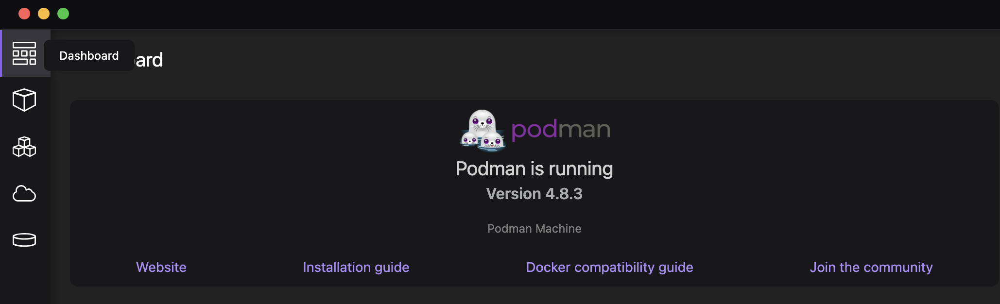
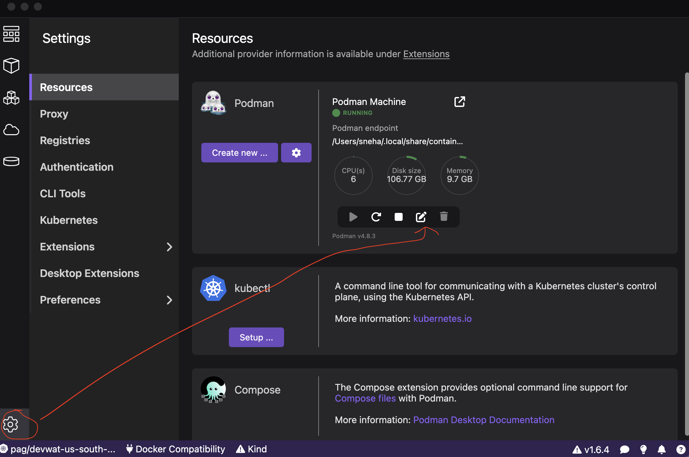
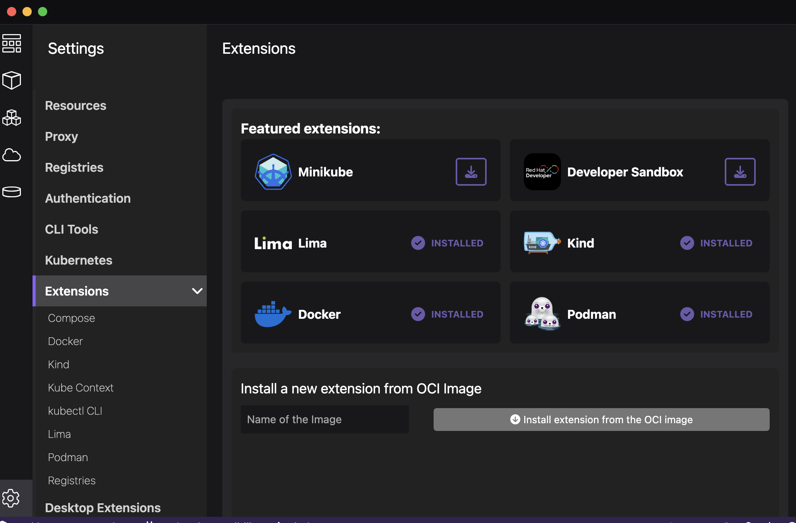

# Guide to installing Docker or Docker alternatives

## What is Docker?

Docker is a software platform that allows you to build, test, and deploy applications quickly. Docker packages software into standardized units called containers that have everything the software needs to run including libraries, system tools, code, and runtime. Using Docker, you can quickly deploy and scale applications into any environment and know your code will run.

And Docker Compose is a tool for defining and running multi-container applications. It is the key to unlocking a streamlined and efficient development and deployment experience.

You will see references to `docker` and `docker-compose` as you work through some of our guides and this document serves to guide anyone who needs a starting point to install that software or its alternatives.

Useful links:

1. [Docker Compose Overview](https://docs.docker.com/compose/)
2. [Docker Overview](https://docs.docker.com/get-docker/) 

## Option 1: Docker Desktop

**IMPORTANT NOTE**: Docker Desktop is free for small businesses (fewer than 250 employees AND less than 10 dollar million in annual revenue), personal use, education, and non-commercial open source projects. Otherwise, it requires a paid subscription

Docker provides a simple and easy to use desktop platform that comes integrated with the `docker` engine as well as `docker-compose`. It is easy to use and is maintained regularly by Docker. 

If you have an existing subscription or if your enterprise is able to provide you with a subscription, you can follow instrutions to download and install ***Docker Desktop*** for the OS that you are working with, either [Mac](https://docs.docker.com/desktop/install/mac-install/), [Windows](https://docs.docker.com/desktop/install/windows-install/) or [Linux](https://docs.docker.com/desktop/install/linux-install/).

Keep in mind that you would need to activate a subscription in case you are not eligible for the free version of Docker Desktop.

## Option 2: Rancher Desktop

**IMPORTANT NOTE**: Recommended for users who are new to Docker and prefer an easy one-click install of basic functionality

### For Mac and Windows: 

Go to the Rancher Desktop [homepage](https://rancherdesktop.io/) and download the appropriate installer for your OS, then proceed to install using your respective installer file which should help install the software automatically on your machine

### For Linux (non RHEL and Fedora related distributions):

You can install using either the [.deb](https://docs.rancherdesktop.io/getting-started/installation/#installation-via-deb-package) or [.rpm](https://docs.rancherdesktop.io/getting-started/installation/#installation-via-deb-package) package

### For Linux (RHEL and Fedora related distributions):

You can install using [AppImage](https://docs.rancherdesktop.io/getting-started/installation/#installation-via-deb-package)

### Verifying the install

Upon completion of the install, open and start the `Rancher Desktop` program and you will see a screen with options as shown in the image.


Here, select `dockerd` as the container engine and select `automatic` PATH configuration and click `OK`

You can now verify your install. To do so:

1. Close any open shell(or terminal consoles) and restart a new shell.
2. Run the below command to ensure your can work with `docker` successfully.

```bash
docker run hello-world
```


#### Useful Links:

* [https://medium.com/@praveenmidde/seamlessly-switch-to-rancher-desktop-as-a-replacement-for-docker-desktop-on-mac-for-1abcf5844c4d](https://medium.com/@praveenmidde/seamlessly-switch-to-rancher-desktop-as-a-replacement-for-docker-desktop-on-mac-for-1abcf5844c4d)
* [https://docs.rancherdesktop.io/getting-started/installation/](https://docs.rancherdesktop.io/getting-started/installation/)


## Option 3: Podman

**IMPORTANT NOTE**: For Windows and MacOS users, running Podman requires a Linux distribution/subsystem or Linux in a virtual machine

Make sure to check the [prerequisites](https://podman-desktop.io/docs/podman/installing#prerequisites) before proceeding with the install. Then,

1. Go to the [downloads](https://podman-desktop.io/downloads) page and download the binary suitable for your machine 
2. Follow the steps listed in the [procedure](https://podman-desktop.io/docs/podman/installing#procedure) section to perform the necessary checks and install podman along with other necessities. 

Once installed, Podman initializes a machine with standard configuration and your Podman Desktop dashboard should show `Podman is running` like below



However, it is recommended to update the configurations of the machine by :

* clicking on the edit button
* choosing a reasonable CPU, Memory and Disk Size 
* click on "Update"



This will restart the machine with the updated configurations.

### Install Docker and Compose Extensions

Under Settings > Extensions, click on the "install" icon for the Docker and Compose extensions. Follow the prompts on the screen.



### Emulating Docker CLI 

In order to run `docker` commands using podman, you would have to follow steps as listed in the Step 1 and 3 of the [documentation](https://podman-desktop.io/docs/migrating-from-docker/emulating-docker-cli-with-podman#procedure)

This creates a proxy to podman using the `docker` command on the interface and podman behind the scenes

### Verifying the install

You can now run the below on your terminal or console to verify the setup is working.

```bash
docker run hello-world
```

#### Useful Links:

* [https://thenewstack.io/install-and-use-podman-desktop-gui-to-manage-containers/](https://thenewstack.io/install-and-use-podman-desktop-gui-to-manage-containers/)
* [https://developers.redhat.com/articles/2023/09/27/how-install-and-use-podman-desktop-windows#getting_started_with_podman_desktop](https://developers.redhat.com/articles/2023/09/27/how-install-and-use-podman-desktop-windows#getting_started_with_podman_desktop)
* [https://ubuntuhandbook.org/index.php/2023/05/podman-desktop-1-0-install-in-ubuntu/](https://ubuntuhandbook.org/index.php/2023/05/podman-desktop-1-0-install-in-ubuntu/)

## Option 4: Colima

**IMPORTANT NOTE**: This approach requires using a CLI(Command Line Interface) and does not have a GUI. This is recommended for users who prefer a CLI-focused approach to Docker Desktop's GUI focus.

[Colima](https://github.com/abiosoft/colima) is a new open-source project that bundles the container management tool [lima](https://github.com/lima-vm/lima) with a docker (linux) back-end. This is similar to what Docker Desktop actually does, but Colima and Lima are entirely open-source and just focused on running containers. They work on both `amd64` and `arm64` (M1) macs. Colima does not require installation of Docker Desktop or paying a licensing fee to Docker, Inc.


### For MacOS and Linux

1. First, install `homebrew` package manager by running the below command on a shell:
	
	```shell
	/bin/bash -c "$(curl -fsSL https://raw.githubusercontent.com/Homebrew/install/HEAD/install.sh)"
	```

2. Next, install `colima`, `docker` and `compose` using homebrew 

	```shell
	brew install colima
	brew install docker docker-compose
	```
3. 	Start `colima` with the following command. This may take a while the first time, so wait for it to fully complete

	```shell
	colima start
	```
	NOTE: The default VM created by Colima has 2 CPUs, 2GiB memory and 60GiB storage. You can customize the CPUs and Memory by instead starting `colima` and specifying the cpu and memory. For example, the below will start up colima with 4 cpu and 6GiB memory:
	
	```shell
	colima start --cpu 4 --memory 6
	```
	
	Learn more about how to customize colima from [here](https://github.com/abiosoft/colima?tab=readme-ov-file#customizing-the-vm)
	
4. You can now verify that `docker` and `compose` can be run successfully

	```shell
	docker run hello-world
	```
	
	```shell
	docker-compose
	```
	
#### Useful Links:

* [https://smallsharpsoftwaretools.com/tutorials/use-colima-to-run-docker-containers-on-macos/](https://smallsharpsoftwaretools.com/tutorials/use-colima-to-run-docker-containers-on-macos/)
* [https://www.linkedin.com/pulse/colima-better-way-run-docker-macos-linux-asutosh-pandya/](https://www.linkedin.com/pulse/colima-better-way-run-docker-macos-linux-asutosh-pandya/)
	


