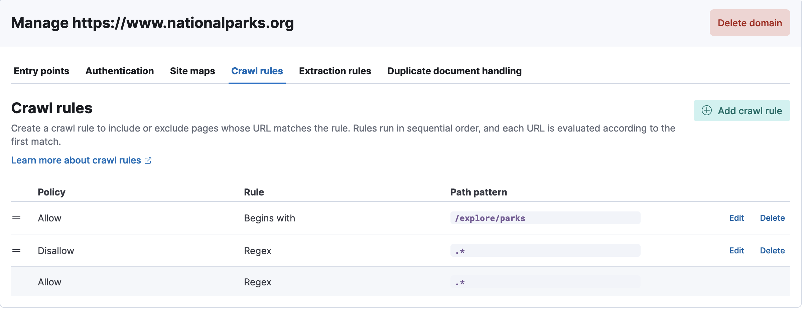
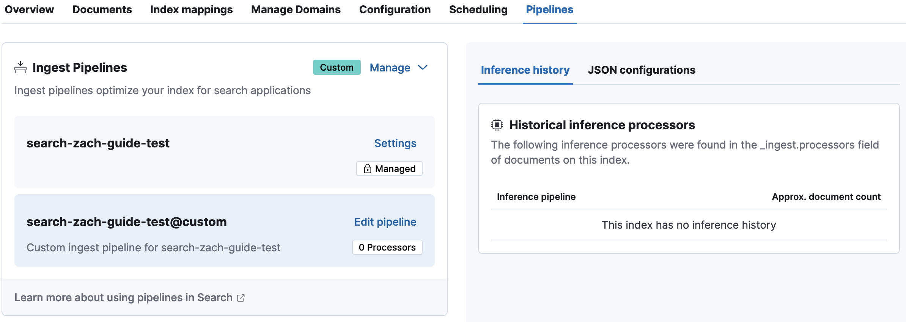
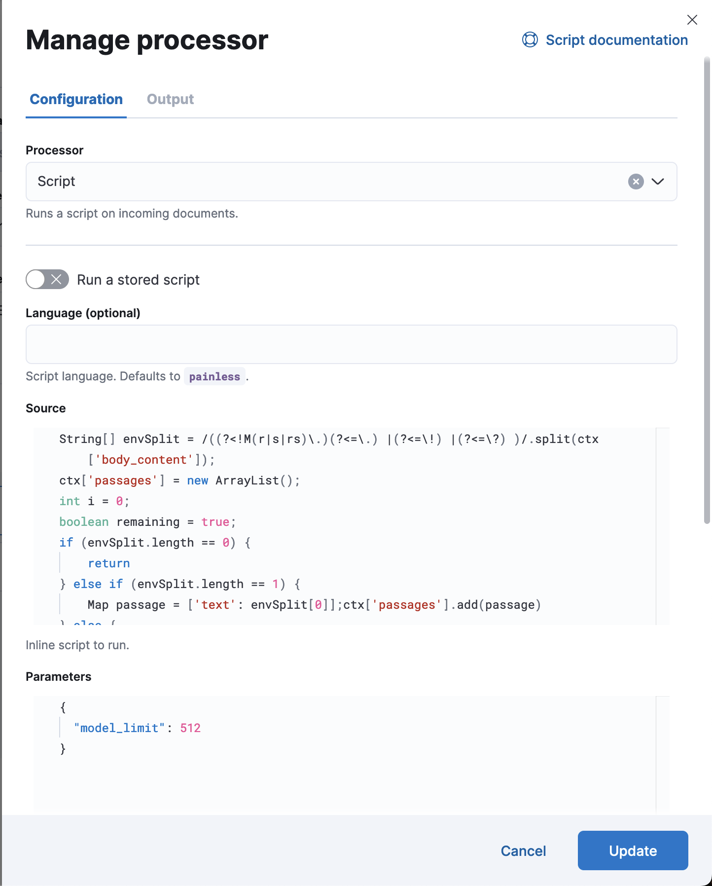
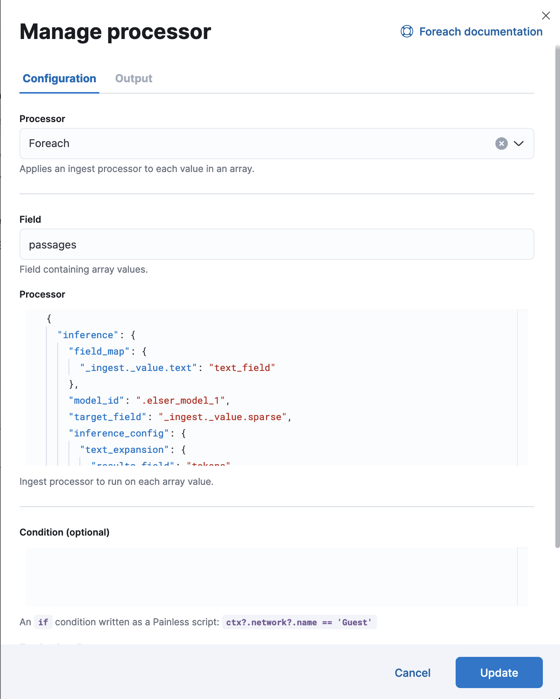
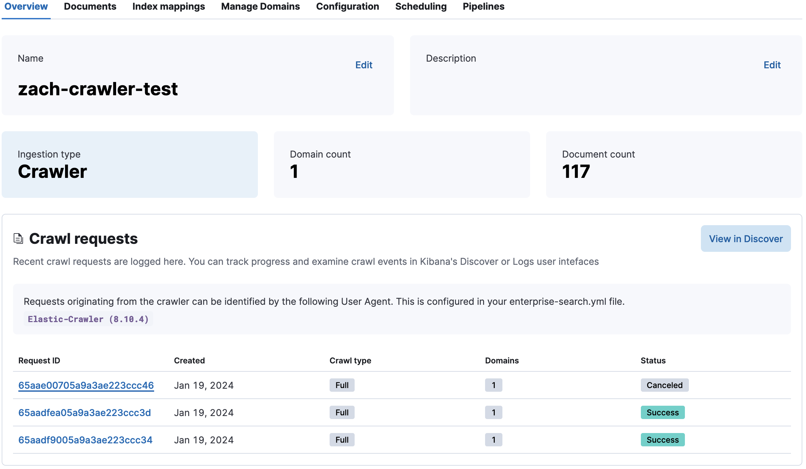
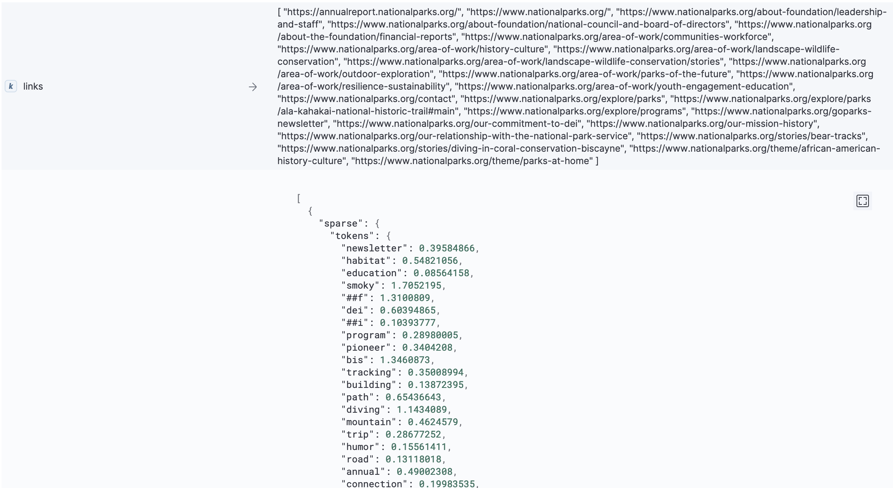
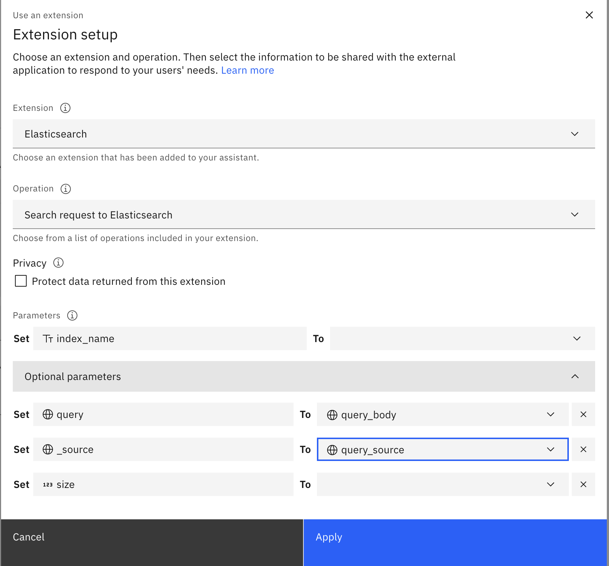
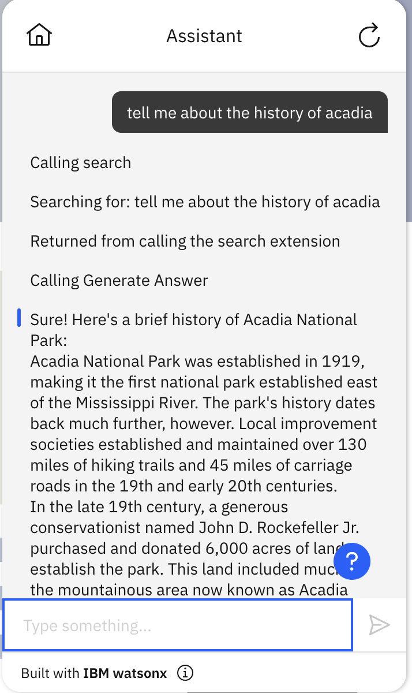
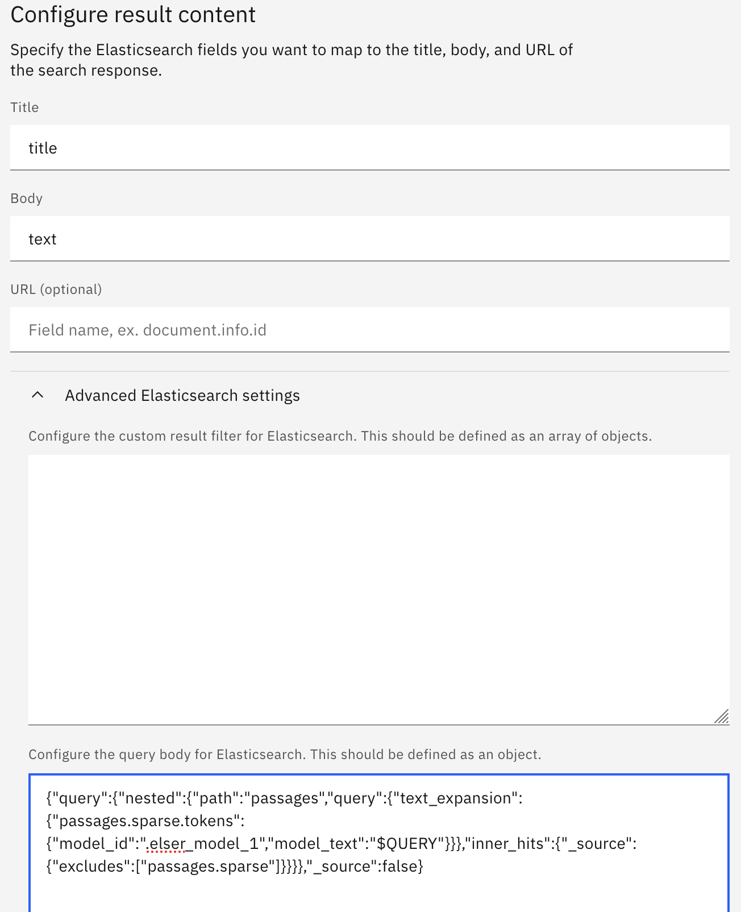

# How to set up and use the web crawler in Elasticsearch
This is a documentation about how to set up and use the web crawler in Elasticsearch and connect it to watsonx Assistant for Conversational Search.

## Tabel of contents:
* [Step 1: Set up Enterprise Search to enable the web crawler in Elasticsearch](#step-1-set-up-enterprise-search-to-enable-the-web-crawler-in-elasticsearch)
* [Step 2: Create and configure a web crawler in Elasticsearch](#step-2-create-and-configure-a-web-crawler-in-elasticsearch)
* [Step 3: Build an ELSER ingest pipeline with a chunking processor](#step-3-build-an-elser-ingest-pipeline-with-a-chunking-processor)
* [Step 4: Connect a web crawler index to watsonx Assistant for conversational search](#step-4-connect-a-web-crawler-index-to-watsonx-assistant-for-conversational-search)

## Step 1: Set up Enterprise Search to enable the web crawler in Elasticsearch
Before you start, you will need to install and set up your Elasticsearch cluster,
* For Elasticsearch on IBM Cloud, please refer to [ICD-elasticsearch-install-and-setup](../../docs/elasticsearch-install-and-setup/ICD_Elasticsearch_install_and_setup.md) for more details.
* For Elasticsearch (watsonx Discovery) on CloudPak, please refer to [watsonx-discovery-install-and-setup](../../docs/elasticsearch-install-and-setup/watsonx_discovery_install_and_setup.md) for more details.

### Set up Enterprise Search for Elasticsearch on IBM Cloud 
Assuming you have installed Kibana locally following [ICD-elasticsearch-install-and-setup](../../docs/elasticsearch-install-and-setup/ICD_Elasticsearch_install_and_setup.md), 
follow these steps to set up Enterprise Search in Elasticsearch:  
**NOTE: Enterprise Search requires at least 4GB of memory, so please make sure you have enough memory allocated to your Docker Engine.**
* Create a docker network
    ```shell
    docker network create elastic
    ```
  NOTE: `elastic` will be the name of your docker network.


* Restart Kibana within a network and with enterprise search host
  ```shell
  KIBANA_CONFIG_FOLDER=<path-to-your-kibana-config-folder>
  KIBANA_VERSION=<kibana-version>
  ```
  NOTE: `KIBANA_VERSION` needs to be compatible with the Elasticsearch version. It can be the same as the Elasticsearch version.
  Learn more about the compatibility with Elasticsearch from [here](https://www.elastic.co/support/matrix#matrix_compatibility)
  ```shell
  docker run -it --name kibana --network elastic --rm \
  -v ${KIBANA_CONFIG_FOLDER}:/usr/share/kibana/config \
  -p 5601:5601 \
  --env "ENTERPRISESEARCH_HOST=http://enterprise-search:3002" \
  docker.elastic.co/kibana/kibana:${KIBANA_VERSION}
  ```
  NOTE: Instead of passing `ENTERPRISESEARCH_HOST` as an environment variable, another option is to add the enterprise search 
  host to your kibana config YAML file, for example, 
  ```shell
  enterpriseSearch.host: "http://enterprise-search:3002"
  ```

* Generate an encryption key for Enterprise Search  
In a new terminal window, run the following command to generate an encryption key which will be used in the next step:
  ```shell
  ENCRYPT_KEY=$( openssl rand -hex 32 )
  ```

* Create environment variables for elasticsearch credentials:
    ```shell
    ES_URL=<your-elasticsearch-host>
    ES_USER=<your-elasticsearch-username>
    ES_PASSWORD=<your-elasticsearch-password>
    
    ES_VERSION=<your-elasticsearch-version>
    ES_CACERT_FOLDER=<your-config-folder-containing-elasticsearch-cert>
    ES_CACERT_NAME=<your-es-cert-file-name>
    ```
  NOTE: `ES_CACERT_FOLDER` can be your kibana config folder if you have stored the elasticsearch certificate in the folder following [ICD-elasticsearch-install-and-setup](../../docs/elasticsearch-install-and-setup/ICD_Elasticsearch_install_and_setup.md)

* Download and start Enterprise Search
    ```shell
    docker run \
    --name "enterprise-search" \
    --network "elastic" \
    --publish "3002:3002" \
    -v "${ES_CACERT_FOLDER}:/usr/share/enterprise-search/es-config:ro" \
    --interactive \
    --tty \
    --rm \
    --env "secret_management.encryption_keys=[${ENCRYPT_KEY}]" \
    --env "allow_es_settings_modification=true" \
    --env "elasticsearch.host=${ES_URL}" \
    --env "elasticsearch.username=${ES_USER}" \
    --env "elasticsearch.password=${ES_PASSWORD}" \
    --env "elasticsearch.ssl.enabled=true" \
    --env "elasticsearch.ssl.certificate_authority=/usr/share/enterprise-search/es-config/${ES_CACERT_NAME}" \
    --env "kibana.external_url=http://kibana:5601" \
    --env "connector.crawler.content_extraction.enabled=true" \
    --env "connector.crawler.content_extraction.mime_types=["application/pdf", "application/msword"]" \
    --env "connector.crawler.http.response_size.limit=10485760" \
    "docker.elastic.co/enterprise-search/enterprise-search:${ES_VERSION}"
    ```
  NOTES:
  * `connector.crawler.content_extraction.enabled=true` enables binary content extraction. It is required to extract content from downloadable binary files, such as PDF and DOCX files.
  * `connector.crawler.content_extraction.mime_types=["application/pdf", "application/msword"]` specifies which MIME types should have their contents extracted.
  * `connector.crawler.http.response_size.limit=10485760` set the maximum size of an HTTP response (in bytes) supported by the Elastic web crawler. The default limit is `10485760` bytes or 10MB. You can increase it if needed.
  * To learn more, see [Elastic web crawler configuration](https://www.elastic.co/guide/en/enterprise-search/current/configuration.html#configuration-settings-elastic-crawler).
* Verify the installation 
  * Open http://localhost:5601 in your browser and log into Kibana using your Elasticsearch username and password.
  * Navigate to the Search Overview page http://localhost:5601/app/enterprise_search/overview.
  * If you can see `Web Crawler` available as an option to ingest content, your Enterprise Search has been set up successfully.

### Set up Enterprise Search for watsonx Discovery on CloudPak
Assuming you have successfully installed an Elasticsearch instance in a CloudPak cluster following [watsonx-discovery-install-and-setup](../../docs/elasticsearch-install-and-setup/watsonx_discovery_install_and_setup.md), 
you can follow these steps to set up Enterprise Search: 

* Log into your CloudPak cluster following the instructions [here](../../docs/elasticsearch-install-and-setup/watsonx_discovery_install_and_setup.md#log-in-to-your-cloudpak-cluster)


* Create environment variables for installation
  ```shell
  export ES_NAMESPACE="elastic"
  export ES_CLUSTER="wxd"
  export ENTERPRISE_SEARCH_NAME="enterprise-search-wxd"
  export ES_VERSION="8.11.1"
  ```
  NOTES: 
  * `ES_NAMESPACE` is your Elasticsearch namespace. 
  * `ES_CLUSTER` is your Elasticsearch instance name in your CloudPak cluster.
  * `ENTERPRISE_SEARCH_NAME` can be whatever you would like to name your Enterprise Search instance. 
  * `ES_VERSION` is your Elasticsearch version, and it needs to be the same for Enterprise Search. 


* Create an Enterprise Search instance and associate it with your Elasticsearch cluster
  ```shell
  cat <<EOF | oc -n ${ES_NAMESPACE} apply -f -
  apiVersion: enterprisesearch.k8s.elastic.co/v1
  kind: EnterpriseSearch
  metadata:
    name: ${ENTERPRISE_SEARCH_NAME}
  spec:
    version: ${ES_VERSION}
    count: 1
    elasticsearchRef:
      name: ${ES_CLUSTER}
  EOF
  ```
  
  Monitor the health and creation progress of your Enterprise Search instance
  ```shell
  oc get EnterpriseSearch -n ${ES_NAMESPACE}
  ```
  Make sure the health status of your Enterprise Search instance is green, for example, 
  ```
  NAME                    HEALTH   NODES   VERSION   AGE
  enterprise-search-wxd   green    1       8.11.1    3m9s
  ```
  Check that the Enterprise Search pods are running
  ```shell
  oc get pods -n ${ES_NAMESPACE} | grep ${ENTERPRISE_SEARCH_NAME}
  ```


* Associate your Enterprise Search instance with your Kibana instance
  * Edit your Kibana resource
    ```shell
    oc edit Kibana -n ${ES_NAMESPACE}
    ```
  * Add your Enterprise Search instance name as `enterpriseSearchRef` to the spec, for example,
    ```shell
    spec:
      enterpriseSearchRef:
        name: enterprise-search-wxd  # make sure to use your Enterprise Search instance name here
    ```
  * Once the Kibana instance spec is edited, check that your Kibana instance is healthy (with green health status) and the pods have restarted successfully
    ```shell
    oc get Kibana -n ${ES_NAMESPACE}
    ```
    ```shell
    oc get pods -n ${ES_NAMESPACE} | grep kb
    ```


* Verify the installation
  * Use `port-forward` to access Kibana locally:
    ```shell
    oc port-forward service/${ES_CLUSTER}-kb-http 5601 -n ${ES_NAMESPACE}
    ```
  * Open https://localhost:5601 in your browser and log into Kibana using your Elasticsearch credentials. You can obtain 
  the credentials following the instructions [here](../../docs/elasticsearch-install-and-setup/watsonx_discovery_install_and_setup.md#verify-the-installation).
  * Navigate to the `Search Overview` page https://localhost:5601/app/enterprise_search/overview.
  * If you can see `Web Crawler` available as an option to ingest content, your Enterprise Search has been set up successfully.

## Step 2: Create and configure a web crawler in Elasticsearch 
* In Kibana, navigate to the `Search Overview` page by clicking on `Search` from the home page, and you will see `Web Crawler` 
as an option to ingest content. Choose `Web Crawler` option, click on `Start`, and follow the steps to create a Web Crawler index. 


* On the `Manage Domains` tab, add a domain, for example, `https://www.nationalparks.org`.  
  NOTE: If the domain you are crawling has pages that require authentication, you can manage the authentication settings 
  in the Kibana UI. The web crawler supports two authentication methods:
  1. Basic authentication (username and password)
  2. Authentication header (e.g. bearer tokens)  
  
  Please refer to [the Elastic documentation](https://www.elastic.co/guide/en/enterprise-search/current/crawler-managing.html#crawler-managing-authentication) 
  for more details about Authentication. 


* Add an entry point under the domain `Entry points` tab, for example, `https://www.nationalparks.org/explore/parks`


* From the domain `Crawl Rules` tab, add two additional rules like below:  
    
  NOTE: The two rules tell the web crawler to only crawl URLs that begin with https://www.nationalparks.org/explore/parks. 
  Learn more about crawl rules from [here](https://www.elastic.co/guide/en/app-search/current/web-crawler-reference.html#web-crawler-reference-crawl-rule)


* Don't start the web crawler (by clicking on `Crawl` in the upper right corner) yet, because that would cause it to 
  start ingesting with the default index mappings and pipeline. Instead, continue on to the next section to build a 
  custom ingest pipeline before starting the crawl. 


## Step 3: Build an ELSER ingest pipeline with a chunking processor
To use ELSER for text expansion queries on chunked texts, you need to build an ingest pipeline with a chunking processor 
that uses the ELSER model.

NOTE: ELSER model is not enabled by default, and you can enable it in Kibana, following the [download-deploy-elser instructions](https://www.elastic.co/guide/en/machine-learning/current/ml-nlp-elser.html#download-deploy-elser).
Depending on your Elasticsearch version, you can choose to deploy either ELSER v1 or v2 model. `.elser_model_2_linux-x86_64` is an optimized version of the ELSER v2 model and is preferred to use if it is available. Otherwise, use `.elser_model_2` for the regular ELSER v2 model or `.elser_model_1` for ELSER v1.

### Update the index mappings of your web crawler
Define your web crawler index name as an environment variable:  
```shell
ES_INDEX_NAME=<your-web-crawler-index-name>
```
Update the index mappings:  
```shell
curl -X PUT "${ES_URL}/${ES_INDEX_NAME}/_mapping?pretty" -k \
-u "${ES_USER}:${ES_PASSWORD}" \
-H 'Content-Type: application/json' \
-d'
{
  "properties": {
    "passages": {
      "type": "nested",
      "properties": {
        "sparse.tokens": {
          "type": "sparse_vector"
        }
      }
    }
  }
}'
```
The above command will update the index mappings to specify `passages` to be `nested` type and `passages.sparse.tokens` to be `sparse_vector` type, because the default dynamic index mappings of the web crawler cannot recognize these types correctly during document ingestion.

NOTE: `sparse_vector` type is for the ELSER v2 model. For ELSER v1, please use `rank_features` type. ELSER v2 has become available since Elasticsearch 8.11. It is preferred to use ELSER v2 if it is avaiable. Learn more about ELSER v2 from [here](https://www.elastic.co/guide/en/machine-learning/current/ml-nlp-elser.html)

### Build a custom ingest pipeline with two processors
Now you can build a custom ingest pipeline for your web crawler index on Kibana, following these steps:

* Open http://localhost:5601 or https://localhost:5601 (for Kibana port-forwarded from CloudPak) and log into Kibana with your Elasticsearch credentials. Navigate to the indices page
  from the left-side menu via `Content` under `Search`, find your web crawler index, and click on it to go to the index page.


* Under `Pipelines` tab, click on `Copy and customize` to create a custom ingest pipeline, and you will see a new ingest pipeline named `<your-web-crawler-index-name>@custom`.  
  For example,  
  


* Click on `edit pipeline` and then `Manage` -> `Edit`, it will take you to the ingest pipeline `Edit` page 
  where you can add processors to the pipeline.


* Add a `Script` processor for chunking  
  In the ingest pipeline page, click on `Add a processor`, choose `Script` processor, and then add [a painless script](https://www.elastic.co/guide/en/elasticsearch/reference/current/modules-scripting-painless.html) to the `Source` field.  
  For example,  
  

  ```Groovy
  String[] envSplit = /((?<!M(r|s|rs)\.)(?<=\.) |(?<=\!) |(?<=\?) )/.split(ctx['body_content']);
  ctx['passages'] = new ArrayList();
  int i = 0;
  boolean remaining = true;
  if (envSplit.length == 0) {
      return
  } else if (envSplit.length == 1) {
      Map passage = ['text': envSplit[0]];
      ctx['passages'].add(passage)
  } else {
      while (remaining) {
          Map passage = ['text': envSplit[i++]];
          while (i < envSplit.length && passage.text.length() + envSplit[i].length() < params.model_limit) {passage.text = passage.text + ' ' + envSplit[i++]}
          if (i == envSplit.length) {remaining = false}
          ctx['passages'].add(passage)
          }
  }
  ```
  The above script splits `body_content` into sentences using regex and then combines sentences into passages with 
  a `model_limit` parameter to control the character length of each passage. `model_limit` is configured in `Parameters` field, for example,  
  ```json
  {
    "model_limit": 2048
  }
  ```
  Since ELSER v1 model is limited to 512 tokens per field for inference, it is better not to have more than 512 tokens for each passage. 
  `2048` is a reasonable character length limit because a text with 2048 characters is unlikely to have more than 512 tokens. 
  Depending on how you want to chunk the `body_content` and which sematic search model you want to use, you may need to use 
  different `model_limit` values to optimize the chunking processor.  

  #### (Optional) Considerations for customizing the chunking processor
  You can update the above script to customize the chunking process. 
  * Include more metadata to the chunked passages  
    For example, the `passage` definition statement can be updated. The original `passage` definition in the above script is 
    ```Groovy
    Map passage = ['text': envSplit[i++]];
    ```
    * If you need to include `title` and `url` as fields in each passage object, use the following `passage` definition statement:
      ```Groovy
      Map passage = ['text': envSplit[i++], 'title': ctx['title'], 'url': ctx['url']];
      ```
    * If you need to insert `title` to the beginning of each chunked text, use the following `passage` definition statement:
      ```Groovy
      Map passage = ['text': ctx['title'] + '. ' + envSplit[i++], 'title': ctx['title'], 'url': ctx['url']];
      ```
  

  * Support chunking with overlapping  
    You can use the following script in the `Source` field for the `Script` processor to support chunking with overlapping
    ```Groovy
    String[] envSplit = /((?<!M(r|s|rs)\.)(?<=\.) |(?<=\!) |(?<=\?) )/.split(ctx['body_content']);
    ctx['passages'] = [];

    StringBuilder overlappingText = new StringBuilder();

    int i = 0;
    while (i < envSplit.length) {
        StringBuilder passageText = new StringBuilder(envSplit[i]);
        int accumLength = envSplit[i].length();
        ArrayList accumLengths = [];
        accumLengths.add(accumLength);

        int j = i + 1;
        while (j < envSplit.length && passageText.length() + envSplit[j].length() < params.model_limit) {
            passageText.append(' ').append(envSplit[j]);
            accumLength += envSplit[j].length();
            accumLengths.add(accumLength);
            j++;
        }

        ctx['passages'].add(['text': overlappingText.toString() + passageText.toString(), 'title': ctx['title'], 'url': ctx['url']]);
        def startLength = passageText.length() * (1 - params.overlap_percentage) + 1;
        
        int k = Collections.binarySearch(accumLengths, (int)startLength);
        if (k < 0) {
            k = -k - 1;
        }
        overlappingText = new StringBuilder();
        for (int l = i + k; l < j; l++) {
            overlappingText.append(envSplit[l]).append(' ');
        }

        i = j;
    }
    ```
    This script splits the `body_content` into sentences using regex and combines them into `passages`. The maximum number of characters in each paggase is controlled by the `model_limit` parameter. There is a overlapping between two adjacent passages, and it is controled by the `overlap_percentage` parameter. So, `model_limit` and `overlap_percentage` need to be configured in the `Parameters` field, for example, 
    ```json
    {
      "model_limit": 2048,
      "overlap_percentage": 0.25
    }
    ```
    NOTE: Chunking with 512 tokens and 25% overlapping was shown to perform better than other strategies in the experiment results published in [this blog](https://techcommunity.microsoft.com/t5/ai-azure-ai-services-blog/azure-ai-search-outperforming-vector-search-with-hybrid/ba-p/3929167), so the above `Parameters` configuration is recommeded for your chunking processor. 


* Add a `Foreach` processor to process chunked texts using the ELSER model  
  In the ingest pipeline `Edit` page, click on `Add a processor`, choose `Foreach` processor, specify `passages` as the `Field`, and then add a JSON processor config to the `Processors` field.  
  For example,  
  
  ```json
  {
    "inference": {
      "field_map": {
        "_ingest._value.text": "text_field"
      },
      "model_id": ".elser_model_2_linux-x86_64",
      "target_field": "_ingest._value.sparse",
      "inference_config": {
        "text_expansion": {
          "results_field": "tokens"
        }
      },
      "on_failure": [
        {
          "append": {
            "field": "_source._ingest.inference_errors",
            "value": [
              {
                "message": "Processor 'inference' in pipeline '{{ _ingest.on_failure_pipeline }}' failed with message '{{ _ingest.on_failure_message }}'",
                "pipeline": "search-crawler-with-chunking@custom",
                "timestamp": "{{{ _ingest.timestamp }}}"
              }
            ]
          }
        }
      ]
    }
  }
  ```
  NOTES:
  * `.elser_model_2_linux-x86_64` is an optimized version of the ELSER v2 model and is preferred to use if it is available. Otherwise, use `.elser_model_2` for the regular ELSER v2 model or `.elser_model_1` for ELSER v1.
  * `inference_config.text_expansion` is required in the config to tell the Foreach processor to use `text_expansion` 
    and store the results in `tokens` field for each chunked text.
  * `_ingest._value.sparse` expects a `sparse` field for each chunk object as the target field.
  * `_ingest._value.text` expects a `text` field for each chunk object as the input field.
  * `"_ingest._value.text": "text_field"` means ELSER uses `text_field` as the input field. You may need to update it if your ELSER input field is different.
  * `search-crawler-with-chunking@custom` is the name of the ingest pipeline. You need to update it with your ingest pipeline name.  
  

  > ⛔️
  > **Caution**  
  > Don't forget to click on `Save pipeline` to save your changes!


* Start your web crawler and monitor its progress  
  Once you have added the processors to your ingest pipeline, you can kick off your web crawler to crawl the website URLs 
  you have configured at earlier steps, following these steps:  
  * Go to your web crawler index page, and click on `Crawl` in the upper right corner to start it.  

  * You will see new crawl requests on the overview page, and you can click on the request ids to see more details and to monitor the progress of your crawl requests.
      
  
  * If you see your crawler is running and the number of documents is increasing, you can now inspect the documents to 
    see if they have the expected fields with content. For example, you should see chunked `passages`, each passage with
    `sparse.tokens` and a chunked `text`,  
      
    Learn more about the web crawler from [Elastic documentation](https://www.elastic.co/guide/en/enterprise-search/current/crawler.html) to improve or customize your web crawler.

  * If you don't see expected documents with chunked passages, or you want to update any processors in the ingest 
    pipeline to customize your web crawler, you may need to delete the existing documents first before starting the crawl again. 
    You can delete all the documents in an index using the following cURL command:
    ```shell
    curl -k -X POST "${ES_URL}/${ES_INDEX_NAME}/_delete_by_query" \
    -u "${ES_USER}:${ES_PASSWORD}" \
    -H 'Content-Type: application/json' -d'
    {
       "query":{
         "match_all":{}
       }
    }'
    ```


* Run a nested `text_expansion` query using cURL
  ```shell
  curl -k -X GET "${ES_URL}/${ES_INDEX_NAME}/_search?pretty" \
  -u "${ES_USER}:${ES_PASSWORD}" \
  -H 'Content-Type: application/json' -d'
  {
    "query": {
      "nested": {
        "path": "passages",
        "query": {
          "text_expansion": {
            "passages.sparse.tokens": {
              "model_id": ".elser_model_2_linux-x86_64",
              "model_text": "Tell me about Acadia"
            }
          }
        },
        "inner_hits": {"_source": {"excludes": ["passages.sparse"]}}
      }
    }
  }'
  ```
  The above command sends a nested query to the Elasticsearch index. `text_expansion` is used in this query on the ELSER tokens 
  generated for each chunked text by the ingest pipeline. So, the search happens on the chunked texts. Learn more about nested 
  query from the [Elastic documentation](https://www.elastic.co/guide/en/elasticsearch/reference/current/query-dsl-nested-query.html).

  If you see successful results from the above query, you have successfully created a web crawler index with an ELSER ingest pipeline with a chunking processor.
  

  NOTES:
  * If you run this query while the crawling is taking place, you might get a timeout error, because the ELSER model 
  is busy indexing and thus might not respond quickly enough to your query. If that happens, you should just wait until the crawl finishes.
  * `.elser_model_2_linux-x86_64` is an optimized version of the ELSER v2 model and is preferred to use if it is available. Otherwise, use `.elser_model_2` for the regular ELSER v2 model or `.elser_model_1` for ELSER v1.

## Step 4: Connect a web crawler index to watsonx Assistant for conversational search 

### Using custom extensions

* Follow the instructions in [Language Model Conversational Search Starter Kit](../../starter-kits/language-model-conversational-search/README.md#example-1--connect-your-assistant-to-elasticsearch-and-watsonx-via-custom-extensions) 
  to build custom extensions with Elasticsearch and watsonx.ai to enable Conversational Search in watsonx Assistant.


> ⛔️
> **Caution**  
> * After uploading the [sample actions JSON file](../../starter-kits/language-model-conversational-search/elasticsearch-watsonx-actions.json) to your Assistant following the instructions [here](../../starter-kits/language-model-conversational-search/README.md#upload-sample-actions), 
    you need to switch the session variable `has_inner_hits` to `True` so that the right `query_body` will be used for your web crawler index. 
> 
> * Remember to update the `query_source` session variable as needed when setting up your Elasticsearch extension, to limit the results to only contain certain document source fields. This will limit the length of the query response, 
	potentially avoiding the 500 error that may be encountered due to length limits. For example, you can set it to the below, if you'd like it to return only the title and text in the results `_source` field:
>   ```
>   ["title", "text"]
>   ```
>   Otherwise, you may encounter 500 errors due to the response body exceeding the length limit `102400`.
> 
> * Also make sure to set the `es_index_name` to the name of the index you would like to use.



#### Example usage:  



### Using built-in Search integration
To configure your web crawler index in the built-in search integration, you need to follow the [product documentation](https://cloud.ibm.com/docs/watson-assistant?topic=watson-assistant-search-elasticsearch-add) to set up the search integration first.  

Importantly, you need to use the right fields to configure your result content (In this guide, use `title` for Title and `text` for Body). You also need to use the right query body to make the search integration work with your web crawler index. Here is an screenshot of the configuration:  



Here is the query body you need in the `Advanced Elasticsearch Settings` to search over the chunked passages:
```json
{
  "query": {
    "nested": {
      "path": "passages",
      "query": {
        "text_expansion": {
          "passages.sparse.tokens": {
            "model_id": ".elser_model_2_linux-x86_64",
            "model_text": "$QUERY"
          }
        }
      },
      "inner_hits": {"_source": {"excludes": ["passages.sparse"]}}
    }
  },
  "_source": false
}
```
Notes:
* `passages` is the nested field that stores nested documents. You may need to update it if you use a different nested field in your index.
* `passages.sparse.tokens` refers to the field that stores the ELSER tokens for the nested documents.
* `"inner_hits": {"_source": {"excludes": ["passages.sparse"]}}` is to exclude the ELSER tokens from the nested documents in the search results.
* `"_source": false` is to exclude the unnecessary top-level fields in the search results.
* Learn more about nested queries and fields from [here](https://www.elastic.co/guide/en/elasticsearch/reference/current/query-dsl-nested-query.html)

