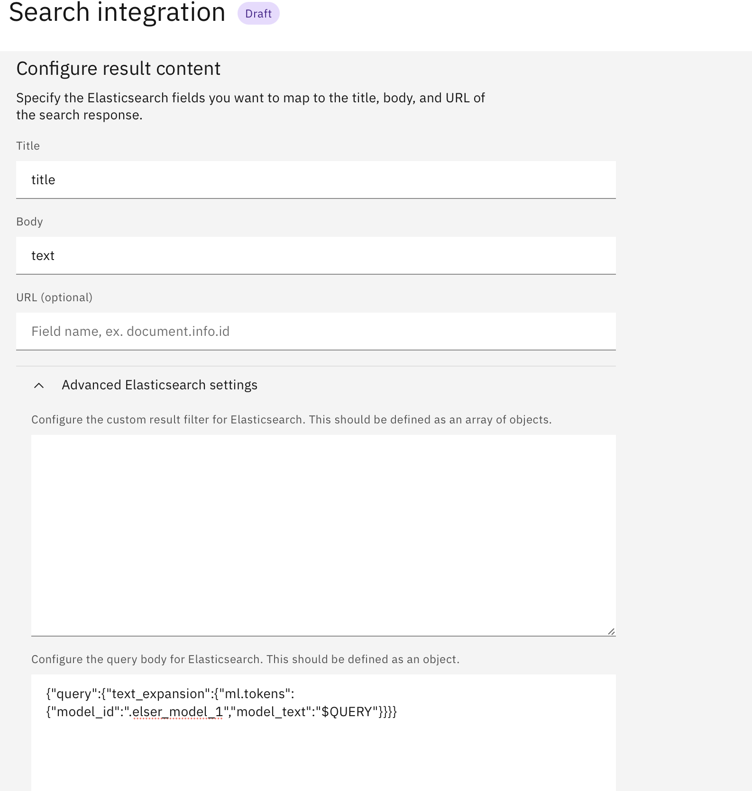

# Working with PDF and Office Documents in Elasticsearch

## Table of contents:
* [Step 1: Create a python virtual environment and upgrade pip](#step-1-create-a-python-virtual-environment-and-upgrade-pip)
* [Step 2: Create all the necessary environment variables](#step-2-create-all-the-necessary-environment-variables)
* [Step 3: Create an ELSER ingest pipeline with an inference processor](#step-3-create-an-elser-ingest-pipeline-with-an-inference-processor)
* [Step 4: Create an index for storing tokens as rank features](#step-4-create-an-index-for-storing-tokens-as-rank-features)
* [Step 5: Running the python notebook](#step-5-running-the-python-notebook)

## Pre-requisites:

1. The following tutorial assumes there exists a folder of documents that you would like to index into Elasticsearch. These can be PDF, Microsoft Office, OpenOffice, HTML, Text files etc... See full list of supported types [here](https://tika.apache.org/2.9.1/formats.html) 

	Optional: If using IBM COS or other Cloud Object Storage for your files, you can follow instructions to use [s3fs](https://cloud.ibm.com/docs/cloud-object-storage?topic=cloud-object-storage-s3fs) or [rclone](https://cloud.ibm.com/docs/cloud-object-storage?topic=cloud-object-storage-rclone) to synchronize your data to a local mounted filesystem

2. You will need a working install of [python](https://www.python.org/downloads/) and Java 8+ on your machine.

## Introduction

Before you start, ensure you have set up your Elasticsearch cluster:

* For Elasticsearch on IBM Cloud, please refer to [ICD-elasticsearch-install-and-setup](./ICD_Elasticsearch_install_and_setup.md) for more details.
* For Elasticsearch (watsonx Discovery) on CloudPak, please refer to [watsonx-discovery-install-and-setup](./watsonx_discovery_install_and_setup.md) for more details.


### Step 1: Create a python virtual environment and upgrade pip

`venv` allows you to manage separate package installations for different projects. It creates a “virtual” isolated Python installation. When you switch projects, you can create a new virtual environment which is isolated from other virtual environments. You benefit from the virtual environment since packages can be installed confidently and will not interfere with another project’s environment.

```bash
python3 -m venv .venv
source .venv/bin/activate
python3 -m pip install --upgrade pip
```


### Step 2: Create all the necessary environment variables

The `ES_INDEX_NAME` and `ES_PIPELINE_NAME` variables can be whatever you would like to name your index and ingestion pipeline for use throughout this process/guide as references in various steps below.

  ```bash
  export ES_URL=https://<hostname:port>
  export ES_USER=<username>
  export ES_PASSWORD=<password>
  export ES_CACERT=<path-to-your-cert>
  export ES_INDEX_NAME=<name-of-index>
  export ES_PIPELINE_NAME=<name-of-pipeline>
  export DOCS_DIR=<full-path-to-your-directory-of-documents>
  ``` 

### Step 3: Create an ELSER ingest pipeline with an inference processor

If you already have an existing pipeline in your Elasticsearch instance that uses an inference processor with ELSER against the "text" field, you can choose to reuse that and skip creation of a new pipeline.

If not, please continue reading below regarding the creation of a new pipeline.

To use ELSER for text expansion queries on chunked texts, you need to build a pipeline with an inference processor that uses the ELSER model.

NOTE: ELSER model is not enabled by default, and you can enable it in Kibana, following the [download-deploy-elser instructions](https://www.elastic.co/guide/en/machine-learning/8.11/ml-nlp-elser.html#download-deploy-elser).

Depending on your Elasticsearch version, you can choose to deploy either ELSER v1 or v2 model. The following steps and commands are based on ELSER v1 model, but you can find what change is needed for ELSER v2 in the notes of each step. 

You will be able to reference this pipeline in the next few steps as a part of indexing the documents of choice. It transforms the "text" field using the ELSER model and produces the terms along with weights as a sparse vector in the "ml" field at index time.

Learn more about [inference-ingest-pipeline](https://www.elastic.co/guide/en/elasticsearch/reference/8.11/semantic-search-elser.html#inference-ingest-pipeline) from the tutorial 

Create the pipeline using the command below: 

```bash
curl -X PUT "${ES_URL}/_ingest/pipeline/${ES_PIPELINE_NAME}?pretty" -u "${ES_USER}:${ES_PASSWORD}" \
-H "Content-Type: application/json" --cacert "${ES_CACERT}" -d'
{
  "processors": [
    {
      "inference": {
        "model_id": ".elser_model_1",
        "target_field": "ml",
        "field_map": {
          "text": "text_field"
        },
        "inference_config": {
          "text_expansion": {
            "results_field": "tokens"
          }
        }
      }
    }
  ]
}'
```	 

NOTES:

* `.elser_model_1` is the `model_id` for ELSER v1 model, and the `model_id` can be `.elser_model_2` or `.elser_model_2_linux-x86_64` 
  for ELSER v2 model depending on which one you want to use and have deployed in your Elasticsearch cluster.
* `inference_config.text_expansion` is required in the config to tell the processor to use `text_expansion` and store the results in `tokens` field for each text.
* `target_field` will contain the field name where the ELSER tokens should be stored
* `field_map` expects a key pointing to the input "text" field. In this example, the source `text` field is being read for processing by ELSER


### Step 4: Create an index for storing tokens as rank features 

```bash
curl -X PUT "${ES_URL}/${ES_INDEX_NAME}?pretty" -u "${ES_USER}:${ES_PASSWORD}" \
-H "Content-Type: application/json" --cacert "${ES_CACERT}" -d'
{
  "settings":{
  "index":{
  "default_pipeline":"'"${ES_PIPELINE_NAME}"'"
  }
},
  "mappings": {
    "properties": {
      "ml.tokens": {
        "type": "rank_features"
      },
      "text": {
        "type": "text"
      }
    }
  }
}'
```

NOTE: `rank_features` only works for ELSER v1 model. ELSER v2 requires `sparse_vector` type. ELSER v2 has only been available since Elastic 8.11. Learn more about ELSER v2 from [here](https://www.elastic.co/guide/en/machine-learning/current/ml-nlp-elser.html)


### Step 5: Running the python notebook

### Step 5a. Install the required libraries

To get started, navigate to the `python-document-ingestion` directory and install the requirements provided in the `requirements.txt` directory:

```bash
cd python-document-ingestion
pip3 install -r requirements.txt
```

### Step 5b. Run the provided notebook to ingest documents

Start the notebook environment using the below command from within your created `venv` from [Step 1](#step-1-create-a-python-virtual-environment-and-upgrade-pip). Then, open the `doc-ingestion.ipynb` notebook on your web browser.

```bash
jupyter notebook
```

Run each cell in order using the "Shift + Enter" shortcut or by clicking the  button.

After the last cell has completed execution, you will see a message like "**Indexed n/n documents**" that indicates that your documents were successfully chunked and ingested into Elasticsearch. 
If you see an error and only a few of your documents got indexed, you may want to delete the index through the [Kibana dashboard](../ICD_Elasticsearch_install_and_setup.md#step-2-set-up-kibana-to-connect-to-elasticsearch) or using the [delete index API](https://www.elastic.co/guide/en/elasticsearch/reference/current/indices-delete-index.html)
and restart again by attempting with smaller number of documents at a time. 

If you'd like to update the number of documents to send per request in the Elasticsearch API, you can update the 
`chunk_size` parameter in the call to `helpers.streaming_bulk` method in the final cell of the notebook.

Your documents are now available in the index, ready for searching and querying. Follow the steps outlined below to use this index in a RAG based setup with Watson Assistant. 

**NOTE**: There are some example documents available [here](../assets/sample_pdf_docs), if you would like to test the setup.

### Step 5: Connecting Watson Assistant to Elasticsearch for Conversational Search

There are two options to connect your elasticsearch instance to your assistant for conversational search:


#### Step 5a. Using the built-in watsonX Assistant Conversational Search

Follow instructions in the [elasticsearch integration documentation](https://cloud.ibm.com/docs/watson-assistant?topic=watson-assistant-search-elasticsearch-add#setup-elasticsearch) to configure your elasticsearch index for conversational search

**NOTES**

1. In `Step 3` , use `title` for the **Title** field and `text` for the **Text** field
2. In `Step 4` , configure the custom query body using the snippet below: 

	```
	{
	  "query": {
	    "text_expansion": {
	      "ml.tokens": {
	        "model_id": ".elser_model_1",
	        "model_text": "$QUERY"
	      }
	    }
	  }
	}
	```

3. Remember to enable the **conversational search** toggle to `on` to activate it




#### Step 5b. Using custom extensions

Follow the steps outlined in guide to [connect your assistant to elasticsearch and watsonx using custom extensions](../../../starter-kits/language-model-conversational-search#example-1-connect-your-assistant-to-elasticsearch-and-watsonx-via-custom-extensions) 

> ⛔️
> **Caution**  
> 
> * Remember to update the `query_source` session variable as needed when setting up your Elasticsearch extension, to limit the results to only contain certain document source fields. This will limit the length of the query response, 
	potentially avoiding the 500 error that may be encountered due to length limits. For example, you can set it to the below, if you'd like it to return only the title and text in the results `_source` field:
>   ```
>   ["title", "text"]
>   ```
> 
> * Also make sure to set the `es_index_name` to the name of the index you would like to use.

#### Example usage:

Here is an example of how to use the `Search` action for this starter kit conversational search example:

