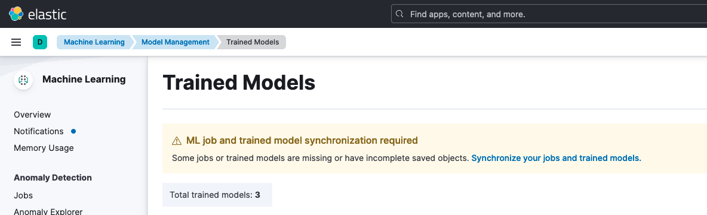

# How to set up and use 3rd-party text embeddings for dense vector search in Elasticsearch
This guide demonstrates how to deploy and use a text embedding model in Elasticsearch. The model will generate vector representations for text, enabling vector similarity (k-nearest neighbours) search.

Please refer to [this guide](./ICD_Elasticsearch_install_and_setup.md) first to create an Elasticsearch instance and set up Kibana if you haven't already.

## Install the eland library
Run the command below to install the [eland](https://github.com/elastic/eland) library.
```bash
python -m pip install "eland[pytorch]"
```
This library allows us to pull and deploy a 3rd-party text embedding model to our Elasticsearch instance.

> CAUTION: Open source and 3rd party models are not in scope of IBM or Elastic indemnity clauses. Customers must accept relevant terms and conditions to choose or bring their own models. Additionally, IBM has not assessed Elastic's supported multi-lingual models so any use of Elastic-supported models should be understood thoroughly both with respect to the terms of use for those models and the terms of use of all of the data that was used to train those models.

NOTE: As of the time this documentation was written, `eland` only supports Python 3.8, 3.9, and 3.10. Please refer to the eland library [compatibility section](https://github.com/elastic/eland?tab=readme-ov-file#compatibility) to make sure you're using compatible Python and Elasticsearch versions.

NOTE: You can also use eland without installing the library in case you run into any issues with the library. This can be done by using the docker image provided [here](https://github.com/elastic/eland?tab=readme-ov-file#docker).

## Create environment variables for ES credentials
  ```bash
  export ES_URL=https://<hostname:port>
  export ES_USER=<username>
  export ES_PASSWORD=<password>
  export ES_CACERT=<path-to-your-cert>
  ```  
You can find the credentials from the service credentials of your Elasticsearch instance.
## Pull and deploy an embedding model
Run the command below to pull your desired model from the [Huggingface Models Hub](https://huggingface.co/models) and deploy it on your Elasticsearch instance:
```bash
eland_import_hub_model \
  --url $ES_URL \
  -u $ES_USER -p $ES_PASSWORD --insecure \
  --hub-model-id intfloat/multilingual-e5-small \
  --task-type text_embedding \
  --start
```

In this example, we are using the `multilingual-e5-small` model which is a multi-lingual model that supports text embeddings in 100 languages. You can read more about this model [here](https://huggingface.co/intfloat/multilingual-e5-small)

## Synchronize your deployed model
Go to the **Machine Learning > Trained Models** page http://localhost:5601/app/ml/trained_models and synchronize your trained models. A warning message is displayed at the top of the page that says "ML job and trained model synchronization required". Follow the link to "Synchronize your jobs and trained models." Then click Synchronize.



Once you synchronize your model you should see your deployed model on the **Machine Learning > Model Management** page in Kibana.


## Test your deployed model
Run the command below to test the model using the _infer API
```bash
curl -X POST "${ES_URL}/_ml/trained_models/intfloat__multilingual-e5-small/_infer" -u "${ES_USER}:${ES_PASSWORD}" -H "Content-Type: application/json" --cacert $ES_CACERT -d '{
  "docs": {
    "text_field": "how to set up custom extension?"
  }
}'
```
You should see a response containing the predicted embedding vector.

```bash
{
  "inference_results": [
    {
      "predicted_value": [
        0.016921168193221092,
        -0.035475824028253555,
        -0.0497407428920269,
        ...
```

## Load sample data
Refer to the [Load data into Elasticsearch](./ICD_Elasticsearch_install_and_setup.md#load-data-into-elasticsearch) section in the Elasticsearch setup guide to upload a sample data to Elasticsearch using Kabana.

## Add your embedding model to an inference ingest pipeline
Create an ingest pipeline called `text-embeddings` using the command below:
```bash
curl -X PUT "${ES_URL}/_ingest/pipeline/text-embeddings" \
  -u "${ES_USER}:${ES_PASSWORD}" --cacert "${ES_CACERT}"\
  -H 'Content-Type: application/json' -d '{
  "description": "Text embedding pipeline",
  "processors": [
    {
      "inference": {
        "model_id": "intfloat__multilingual-e5-small",
        "target_field": "text_embedding",
        "field_map": {
          "text": "text_field"
        }
      }
    }
  ],
  "on_failure": [
    {
      "set": {
        "description": "Index document to '\''failed-<index>'\''",
        "field": "_index",
        "value": "failed-{{{_index}}}"
      }
    },
    {
      "set": {
        "description": "Set error message",
        "field": "ingest.failure",
        "value": "{{_ingest.on_failure_message}}"
      }
    }
  ]
}'
```

You can verify that the `text-embeddings` ingest pipeline was created by locating it in the list of your ingest pipelines on Kibana http://localhost:5601/app/management/ingest/ingest_pipelines

## Create a mapping for the destination index containing the embeddings
Then run the command below to create the mappings of the destination index called `wa-docs-with-embeddings`:
```bash
curl -X PUT "${ES_URL}/wa-docs-with-embeddings" \
  -u "${ES_USER}:${ES_PASSWORD}" --cacert $ES_CACERT \
  -H 'Content-Type: application/json' -d '{
  "mappings": {
    "properties": {
      "text_embedding.predicted_value": {
        "type": "dense_vector",
        "dims": 384,
        "index": true,
        "similarity": "cosine"
      },
      "text": {
        "type": "text"
      }
    }
  }
}'
```

* `text_embedding.predicted_value` is the field where the ingest processor stores the embeddings
* `dims` is the embedding size of the deployed model which is 384 for the `intfloat/multilingual-e5-small` model we are using here

## Create the text embeddings
Run the `text-embeddings` ingest pipeline to reindex the data to the `wa-docs-with-embeddings` index
```bash
curl -X POST "${ES_URL}/_reindex?wait_for_completion=false" \
  -u "${ES_USER}:${ES_PASSWORD}" --cacert $ES_CACERT \
  -H 'Content-Type: application/json' -d '{
  "source": {
    "index": "wa-docs",
    "size": 50
  },
  "dest": {
    "index": "wa-docs-with-embeddings",
    "pipeline": "text-embeddings"
  }
}'
```

This command will return a task id that looks like this:
```json
{"task":<task-id>}
```

The reindexing process can take around 10 minutes. You can use the task id that is returned above to check the status of the process.

```bash
curl -X GET "${ES_URL}/_tasks/<task-id>" \
  -u "${ES_USER}:${ES_PASSWORD}" --cacert $ES_CACERT
```

You can check the completion status by monitoring the `"completed"` field in the response:

```bash
{
  "completed": true,
  ...
}
```

Once the process is completed, you should see `wa-docs-with-embeddings` in the list of your indices http://localhost:5601/app/enterprise_search/content/search_indices

## Run semantic search
After the dataset has been enriched with vector embeddings, you can query the data using semantic search. 
```bash
curl -X GET "${ES_URL}/wa-docs-with-embeddings/_search" \
  -u "${ES_USER}:${ES_PASSWORD}" --cacert $ES_CACERT \
  -H 'Content-Type: application/json' -d '{
  "knn": {
    "field": "text_embedding.predicted_value",
    "query_vector_builder": {
      "text_embedding": {
        "model_id": "intfloat__multilingual-e5-small",
        "model_text": "how to set up custom extension?"
      }
    },
    "k": 10,
    "num_candidates": 100
  },
  "_source": [
    "id",
    "text"
  ]
}'
```