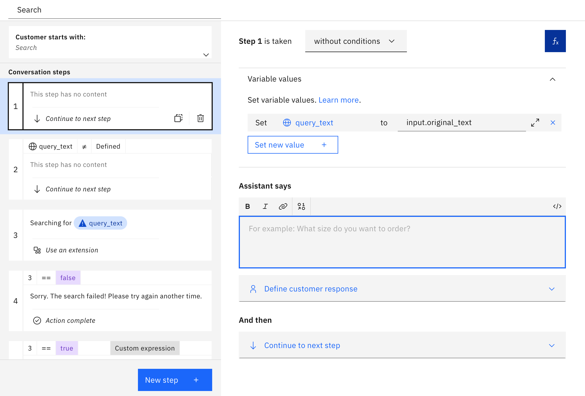
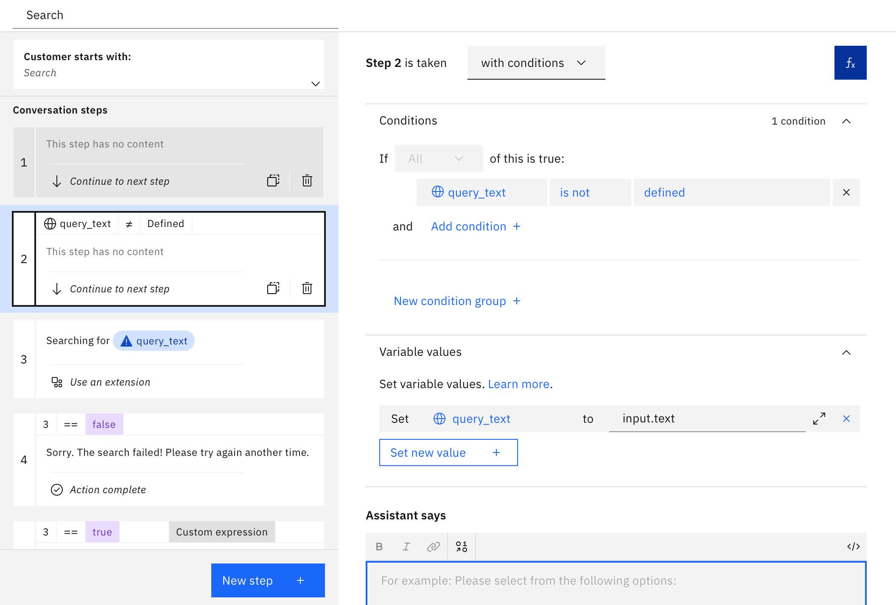
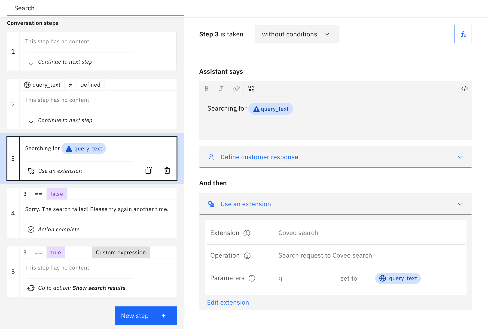
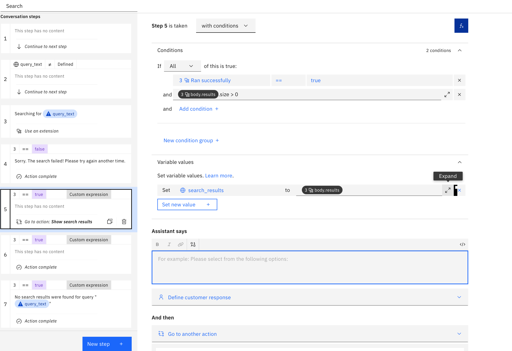
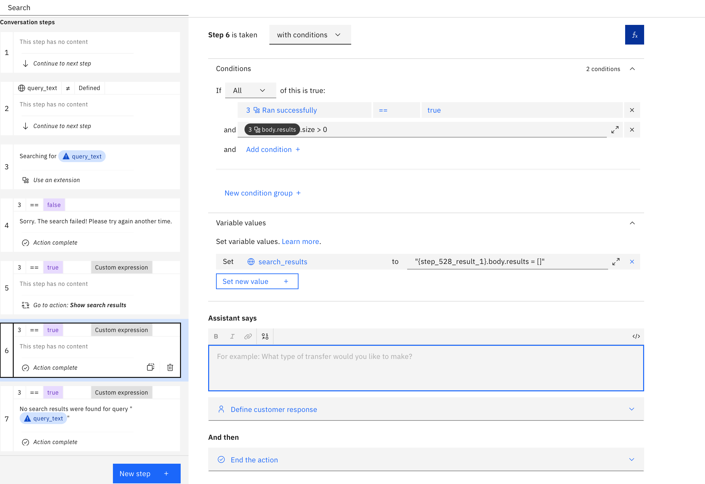
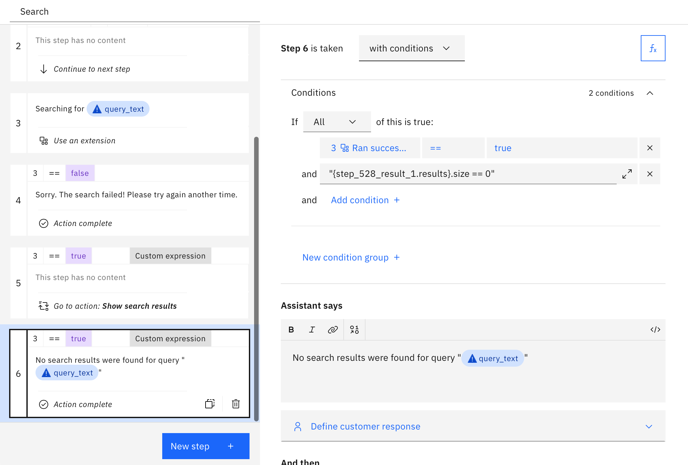
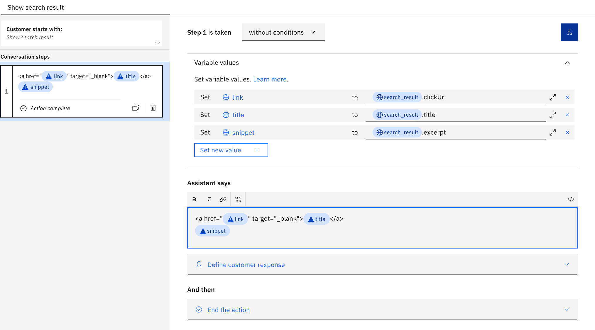

# Coveo Search

## Background

This is a starter kit for accessing the Coveo Search which lets you create and manage source documents and most importantly lets you perform search query on an index  [Coveo Search API](https://docs.coveo.com/en/52/build-a-search-ui/use-the-search-api) and is a configurable search that allows you to customize search features based on your use-case.

The OpenAPI spec in this starter kit includes the following endpoint:

- `GET /rest/search/v2`: Search for content relevant to a given query in set of sources or documents.

The endpoints are described in detail at:

1. **Search Query**: https://docs.coveo.com/en/1445/build-a-search-ui/perform-a-query

This starter kit exposes only the minimal functionality needed for simple use cases, and you will need to extend it if you want to cover more advanced ones.

## Pre-Requisite Steps

Follow the steps listed in the [Coveo Overview](https://docs.coveo.com/en/3361/coveo-overview) section to create the API key to identify your application. Make sure your API key is enabled for Search and "Execute queries" is allowed.

## Other Setup Info

### Setup in a new Assistant

If you want to make a _new_ Assistant using this starter kit, take the following steps:

- Download the OpenAPI specification (`coveo.openapi.json`) and Actions JSON file (`coveo.actions.json`) in this starter kit.
- Use the OpenAPI specification to [build a custom extension](https://cloud.ibm.com/docs/watson-assistant?topic=watson-assistant-build-custom-extension#building-the-custom-extension).
- [Add the extension to your assistant](https://cloud.ibm.com/docs/watson-assistant?topic=watson-assistant-add-custom-extension) using the API key you obtained in the pre-requisites above.
- [Upload the Actions JSON file](https://cloud.ibm.com/docs/watson-assistant?topic=watson-assistant-admin-backup-restore#backup-restore-import). In `Actions`, you will see three actions: `Search`, `Show search results`, and `Show search result` from the starter kit in the `Created by you` section.
- Use either method listed in [Configuring Your Actions Skill to use an Extension](https://github.com/watson-developer-cloud/assistant-toolkit/blob/master/integrations/extensions/README.md#configuring-your-actions-skill-to-use-an-extension) to configure the actions you uploaded to invoke the custom extension you built.
  - In the third step of the "Search" action, in the "Use an extension" section (in "And then") set the following parameter value:
    - q = query_text

Your starter kit is now ready to use. If you are setting up in a new assistant, skip to the section `Using this Starter Kit`.  

### Setup in a pre-existing Assistant

If you want to add this starter kit to an _existing_ assistant, you cannot use the Actions JSON file since it will overwrite your existing configuration.  So instead, follow the following process:

- Download the OpenAPI specification in this starter kit.
- Use the OpenAPI specification to [build a custom extension](https://cloud.ibm.com/docs/watson-assistant?topic=watson-assistant-build-custom-extension#building-the-custom-extension).
- [Add the extension to your assistant](https://cloud.ibm.com/docs/watson-assistant?topic=watson-assistant-add-custom-extension) using the API key you obtained in the pre-requisites step above.
- Go to `Variables > Created by you` and add `query_text`, `search_results`, `search_result`, `link`, `title`, and `snippet`.
- Go to `Actions > Created by you` and create three actions: `Search`, `Show search results`, and `Show search result`.
- Click on the `Search` action and put "Search" in "What does your customer say to start this interaction?".  Add step 1:
    - Click the fX button to add a variable and add new session variable `query_text` and select "Expression" type and then put `input.original_text` as the expression. As noted in the [documentation for spell checking](https://cloud.ibm.com/docs/assistant?topic=assistant-dialog-runtime-spell-check#dialog-runtime-spell-check-how-it-works), `input.original_text` is set _only_ if the utterance from the user was altered due to spell correction and then it records the original request from the user and not the spell corrected text. Spell correction can be very counter productive for searching because it can take specialized domain vocabulary and "correct" those terms to generic words in the language, so it is often better to apply the search on the original text, as we are doing here.

    <br>

    - Add step 2, and change "without conditions" to "with conditions" and set the condition `query_text` is not defined. Then set the variable `query_text` to `input.text`. This is needed because the `input.original_text` is only set when spell correction changed the text. When there was no spell correction, you need to use `input.text` instead. After step 2, `query_text` is guaranteed to be the exact original query issued by the user.

    <br>

    - Add step 3 to run the search on the query using your extension. In "Assistant says", put `Searching for: ${query_text}`. In "And then", select "Use an extension", select your Coveo extension, and select the operation "Search request to Coveo search", and set the `q` parameter to the `query_text` session variable. Optionally set the `partialMatch` variable to `true` (via the `Expression` option) to increase the possible answer matches for a query.

    <br>

    - Click "New Step" and change "without conditions" to "with conditions" and set "Ran successfully" to "false", and set "And then" to "End the action".  Then add the following to the "Assistant says": "Sorry. The search failed. Please try again another time."

    <br>

    - Still in the "Search" action, add another "New Step".  In the new step:
    - In "Assistant says" hit `$` and select "Ran Successfully" and then click on `</>` in the upper right of that box to see the full JSON for the response.  In there, you should see a field called `variable` with a value that looks something like `step_123_result_1`.  Copy that value. (Note that you will need to replace `step_123_result_1` with the actual variable name in your environment).
    - Click "abc" in the upper right and delete the variable in "Assistant says" (we only put it there to copy the variable name).
    - Change "without conditions" to "with conditions" and select "true" for "Ran successfully" and `${step_123_result_1.body.results}.size > 0`
    - Click on "Variable values" and set `search_results` to `${step_123_result_1.body.results}`. This allows you to pass the search results to action that displays them.
    - Set "And then" to "Go to another action" and select "Show search results" and "Continue" upon return.

      <br>

    - Click "New Step", change "without conditions" to "with conditions", and set "Ran successfully" to "true" and `${step_123_result_1.results.body}.size > 0`. Then set the `search_results` variable to the expression `${step_123_result_1}.results.body = []`, and set "And then" to "End the action". This step clears the search results to help prevent exceeding result size limitations.

        <br>

  - Click "New Step", change "without conditions" to "with conditions", and set "Ran successfully" to "true" and `${step_123_result_1.results}.size == 0`. Also set "And then" to "End the action".  Then add the following to the "Assistant says": `Sorry. No results found for ${query_text}`.

    <br>

    - Close the "Search" action.

- Click on the "Show search results" action and Add step 1:
  - Change "without conditions" to "with conditions" and add the expression `${search_results}.size > 0`.
  - In "Variable values" set `search_result` to `${search_results}.get(0)`
  - Set "And then" to "Go to another action" and select "Show search result" and "Continue" upon return.
  - Duplicate this step by clicking on the "duplicate" icon in the left menu to show the next result.
  - Update the condition and the `search_result` variable assignment to the next available result. For the second result, set the condition to `${search_results}.size > 1`, and the `search_result` to `${search_results}.get(1)`.
  - Duplicate this step for as many results as you want to display. For example, if you want to show 3 results, you will have 3 steps in this action, with `search_result` set to `${search_results}.get(0)`, `${search_results}.get(1)`, and `${search_results}.get(2)`, respectively.
  - Close the "Show search results" action.

  <br>

- Click on the "Show search result" action and Add step 1:
  - In "Variable values" set `link` to `$search_result.clickUri`, set `title` to `$search_result.title`, and set `snippet` to `$search_result.excerpt`
  - Then add the following to the "Assistant says" to display the result and then set "And then" to "End the action".

    ```
    <a href="${link}" target="_blank">${title}</a>
    ${snippet}
    ```

  - Close the "Show search result" action.

  <br>

- Close the action editor (by clicking X in the upper right)
- Go to "Actions" > "Set by assistant" > "No action matches" and remove all the steps from the action.  Add in a new step.  Under "And then" select "Go to another action" and select "Search" and click "End this action after the subaction is completed".
- You may also want to go to "Actions" > "Set by assistant" > "Fallback" and do the same thing as in the previous step.  Note, however, that this will prevent your assistant from escalating to a human agent when a customer asks to connect to a human agent (which is part of the default behavior for "Fallback") so only do this if you do not have your bot connected to a human agent chat service.  For more details on connecting to human agents within IBM watsonx Assistant see [our documentation](https://cloud.ibm.com/docs/watson-assistant?topic=watson-assistant-human-agent) and [blog post](https://medium.com/ibm-watson/bring-your-own-service-desk-to-watson-assistant-b39bc920075c).
- Go to the Search action and remove "Search" from the "Customer starts with" list so that the search action _only_ triggers via the "Go to another action" settings described in steps above.  If you skip this, then the "Search" action will also be considered by the intent recognizer as a possible intent, which adds unnecessary complexity to the intent recognition and thus could result in lower overall intent recognition accuracy.

<br>

## Using this Starter Kit

Once this starter kit is properly installed, you can issue a query to your bot and if there is no other action that you've configured that matched that query then it will generate search results for that query.

Feel free to contribute to this starter kit or add other starter kits by following these [contribution guidelines](../../docs/CONTRIBUTING.md).
