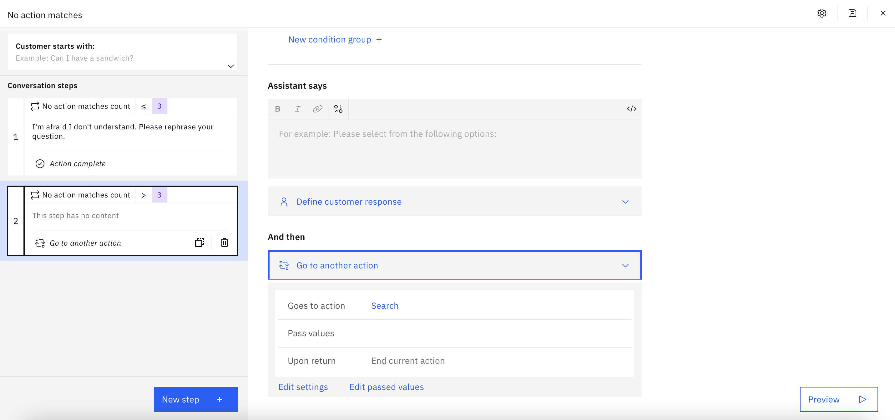

# Coveo Search

## Background

These are instructions for accessing Coveo Search through an extension to your Assistant, using the Coveo template. These instructions assume that you are using a template. If you are not using a template, see the `README.md` in this directory.

Coveo Search lets you create and manage source documents and most importantly lets you perform search query on an index  [Coveo Search API](https://docs.coveo.com/en/52/build-a-search-ui/use-the-search-api) and is a configurable search that allows you to customize search features based on your use-case.

The OpenAPI spec in this directory includes the following endpoint:

- `GET /rest/search/v2`: Search for content relevant to a given query in set of sources or documents.

The endpoints are described in detail at:

1. **Search Query**: https://docs.coveo.com/en/1445/build-a-search-ui/perform-a-query

This starter kit exposes only the minimal functionality needed for simple use cases, and you will need to extend it if you want to cover more advanced ones.

## Pre-Requisite Steps

Follow the steps listed in the [Coveo Overview](https://docs.coveo.com/en/3361/coveo-overview) section to create the API key to identify your application. Make sure your API key is enabled for Search and "Execute queries" is allowed.

## Other Setup Info

To set up the Coveo extension in your assistant, take the following steps:
- Download the OpenAPI specification (`coveo.openapi.json`) in this directory.
- Use the OpenAPI specification to [build a custom extension](https://cloud.ibm.com/docs/watson-assistant?topic=watson-assistant-build-custom-extension#building-the-custom-extension).
- [Add the extension to your assistant](https://cloud.ibm.com/docs/watson-assistant?topic=watson-assistant-add-custom-extension) using the API key you obtained in the pre-requisites above.

### Using a template to create a new action
- Click on `Actions` in the left menu
- Select `Quick start with templates` to see the templates
- Select the `Do more with starter kits` section of the template catalog
- Select the `Coveo starter kit` template
- Add the template to your assistant
- On the `Actions` page, you will see three actions: `Coveo Search`, `Show Coveo search results`, and `Show Coveo search result` that were added by the template.
- Use either method listed in [Configuring Your Actions Skill to use an Extension](https://github.com/watson-developer-cloud/assistant-toolkit/blob/master/integrations/extensions/README.md#configuring-your-actions-skill-to-use-an-extension) to configure the actions you uploaded to invoke the custom extension you built.
  - In the third step of the `Coveo Search` action, in the `Use an extension` section (in "And then")
  - Click on the "Edit extension" at the bottom of the step
  - Select the Coveo extension that you created earlier
  - Select the "Search request to Coveo search" endpoint
  - Set the following parameter value:
    - q = query_text

### Link Actions to No Action matches state
- Go to "Actions" > "Set by assistant" > "No action matches" and remove all the steps from the action.  Add in a new step.  Under "And then" select "Go to another action" and select "Coveo Search" and click "End this action after the subaction is completed".
- You may also want to go to "Actions" > "Set by assistant" > "Fallback" and do the same thing as in the previous step.  Note, however, that this will prevent your assistant from escalating to a human agent when a customer asks to connect to a human agent (which is part of the default behavior for "Fallback") so only do this if you do not have your bot connected to a human agent chat service.  For more details on connecting to human agents within Watson Assistant see [our documentation](https://cloud.ibm.com/docs/watson-assistant?topic=watson-assistant-human-agent) and [blog post](https://medium.com/ibm-watson/bring-your-own-service-desk-to-watson-assistant-b39bc920075c).

 

## Using your Coveo Search extension

Once you have completed these setup instructions, you can issue a query to your bot and if there is no other action that matches that query, then it will generate search results for that query.
