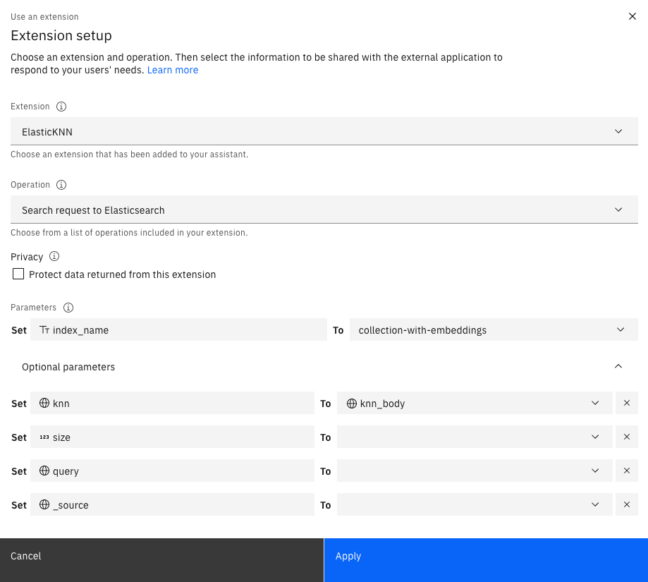

# Elasticsearch

## Background 

This is a starter kit for accessing the IBM Cloud Databases for Elasticsearch via a custom extension to IBM watsonx Assistant.
The purpose of doing so is to allow a chatbot built in IBM watsonx Assistant to search for information in Elasticsearch 
and show what it finds in the chat.  This starter kit uses the custom extensions feature in [the new IBM watsonx Assistant experience](https://cloud.ibm.com/docs/watson-assistant?topic=watson-assistant-watson-assistant-faqs#faqs-new-experience) 
using actions.  Anyone with an older IBM watsonx Assistant instance based on the classic experience and dialogs will 
need to upgrade to the new IBM watsonx Assistant experience before they can use the features described here.

## Install and set up Elasticsearch

Before starting, you will need to provision a Elasticsearch instance and set up a search index.  

* If you are using Elasticsearch on IBM Cloud, you can follow the steps in our
[IBM Cloud Elasticsearch install and setup guide](../../docs/elasticsearch-install-and-setup/ICD_Elasticsearch_install_and_setup.md) 
for more details. 
* If you are using Elasticsearch on some other cloud or network, that should also work with this starter kit, 
but you will need to find set-up instructions appropriate to that environment.

## Build a custom extension in watsonx Assistant with Elasticsearch API

* Download the OpenAPI specification [elasticsearch-generic-openapi.json](elasticsearch-generic-openapi.json)
* Use the OpenAPI specification to [build a custom extension](https://cloud.ibm.com/docs/watson-assistant?topic=watson-assistant-build-custom-extension#building-the-custom-extension)
* [Add the extension to your assistant](https://cloud.ibm.com/docs/watson-assistant?topic=watson-assistant-add-custom-extension)
  * Choose Draft or Live environment to add your extension (use Draft for testing and verification)
  * Configure the authentication with your Elasticsearch credentials 
* Verify the custom extension
  * Find the `No action matches` action under `Set by assistant` from the Actions menu
  * In the first conversation step `No action matches count <= 3`, choose `use a extension`, 
  * Choose your Elasticsearch extension, and choose the operation, and then specify the index name and query body. For example,  
    
  * You can set `query_body` as a session variable. The following are query body examples for different types of queries:
    * Basic keyword search
      ```json
      {
        "query_string":{
          "query":"how to set up a custom extension?"
        }
      }
      ```
    * Semantic search with ELSER v1
      ```json
      {
        "text_expansion":{
          "ml.tokens":{
            "model_id":".elser_model_1",
            "model_text":"how to set up a custom extension?"
          }
        }
      }
      ```
      NOTE: Learn more about ELSER v1 from [here](https://www.elastic.co/guide/en/elasticsearch/reference/8.10/semantic-search-elser.html) 
    * Semantic search with ELSER v2
    ```json
      {
        "text_expansion": {
          "content_embedding": {
            "model_id": ".elser_model_2",
            "model_text": "how to set up a custom extension?"
          }
         }
      }
      ```
    NOTE: Learn more about ELSER v2 from [here](https://www.elastic.co/guide/en/elasticsearch/reference/8.11/semantic-search-elser.html). 
    ELSER v2 is only available for the 8.11 version of Elasticsearch
    * Compound search  
      You can combine different types of queries in a compound query. Learn more about it from this [Elasticsearch tutorial](https://www.elastic.co/guide/en/elasticsearch/reference/8.10/semantic-search-elser.html#text-expansion-compound-query).
  * To use dense vector search (k-nearest neighbours search), you need to set `knn_body` as a session variable and set the `knn` variable to `knn_body` as shown below:
    * Here is an example knn body you can use when setting up the `knn_body` session variable
    ```json
      {
        "field": "text_embedding.predicted_value",
        "query_vector_builder": {
          "text_embedding": {
            "model_id": "elastic__multilingual-e5-small-optimized",
            "model_text": "how to set up custom extension?"
          }
        },
        "k": 10,
        "num_candidates": 100
      }
      ```
      
  
  * Try typing in anything in your preview chat to trigger `No action matches` action. 
    If you see a successful extension call with valid response in the Extension Inspector, your Elasticsearch custom extension has been set up successfully.

**NOTE**: This kit does not provide a sample actions json file that shows how to use the kit in a real assistant. 
There is a simple example that shows how to setup your `No Action Matches` action to call the search on a single fixed query, 
but no instructions for making it work with user queries. The reason we have left this out is that most of the interest 
we've been seeing lately has not been from plain search but rather from search combined with generative AI to produce 
concise answers, which is sometimes called [retrieval-augmented generation (RAG)](https://research.ibm.com/blog/retrieval-augmented-generation-RAG) or conversational search. 
We have sample actions for doing this with Elasticsearch in our [conversational search starter kit](../language-model-conversational-search/README.md#example-1-connect-your-assistant-to-elasticsearch-and-watsonx-via-custom-extensions). That kit builds on 
this one and adds a connection to watsonx.ai to generate answers from the search results.