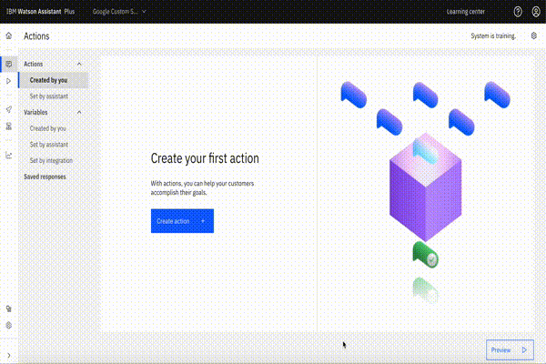

# Google custom search

## Background

This is a starter kit for accessing the Google "Custom Search" JSON API. The "Custom Search" API allows search over a website, collection of websites or the world wide web using the [Google Programmable Search Engine](https://developers.google.com/custom-search/docs/overview) which is a configurable search that allows you to customize search features based on your use-case.

The OpenAPI spec in this starter kit includes the following endpoints:

- `GET /customsearch/v1`: Search for content relevant to a given query over the entire web.
- `GET /customsearch/v1/siterestrict`: Search for content relevant to a given query over a specific collection of websites.

The endpoints are described in detail at:
 
1. **Custom Search**: https://developers.google.com/custom-search/v1/reference/rest/v1/cse/list 
2. **Custom Search Site Restricted**: https://developers.google.com/custom-search/v1/reference/rest/v1/cse.siterestrict/list

The Site Restricted API is similar to the Custom Search JSON API except that it has no daily query [limit](https://developers.google.com/custom-search/v1/overview#pricing). It is important to note that the Site Restricted API is used to be run with a Programmable Search Engine which is restricted to only searching specific sites (10 or fewer) whereas the regular Custom Search API can be run with a search engine which searches over the entire web.

This starter kit exposes both basic and advanced search techniques. 

## Pre-Requisite Steps

- Follow the steps listed in the [Before you start](https://developers.google.com/custom-search/v1/introduction#before_you_start) section to create the custom programmable search engine ( and thereafter obtain the ID of that Programmable Search Engine) as well as the [API key](https://developers.google.com/custom-search/v1/introduction#identify_your_application_to_google_with_api_key) to identify your application.
- Create a session variable with name `cx` and set its value to the `ID of that Programmable Search Engine`.

## Other Setup Info

### Setup in a new Assistant

If you want to make a _new_ Assistant using this starter kit, take the following steps:

- Download the OpenAPI specification (`google-custom-search-openapi.json`) and Actions JSON file (`google-custom-search-actions.json`) in this starter kit.
- Use (`./basic`) directory for basic search functionality and (`./advanced`) directory for extending the basic search with advanced filtered search.
- Use the OpenAPI specification to [build a custom extension](https://cloud.ibm.com/docs/watson-assistant?topic=watson-assistant-build-custom-extension#building-the-custom-extension).
- [Add the extension to your assistant](https://cloud.ibm.com/docs/watson-assistant?topic=watson-assistant-add-custom-extension) using the API key you obtained in the pre-requisites above.
- Select "Custom Search" or "Custom Search Site Restricted" as the endpoint at this step. If search is over more than 10 different web sites (which can include an unlimited number of pages on each site), we would recommend using "Custom Search Site Restricted" since it doesn't have a limit on the number of queries you can run per day.
- [Upload the Actions JSON file](https://cloud.ibm.com/docs/watson-assistant?topic=watson-assistant-admin-backup-restore#backup-restore-import).
- Use either method listed in [Configuring Your Actions Skill to use an Extension](https://github.com/watson-developer-cloud/assistant-toolkit/blob/master/integrations/extensions/README.md#configuring-your-actions-skill-to-use-an-extension) to configure the actions you uploaded to invoke the custom extension you built. Set the `query` parameter to the `query_text` session variable and the `cx` parameter to an `cx` session variable you obtained during the pre-requisites step and `num` parameter to `num_of_results` session variable or default value to 3.


### Setup in a pre-existing Assistant

If you want to add this starter kit to an _existing_ assistant, you cannot use the Actions JSON file since it will overwrite your existing configuration.  So instead, follow the following process:

- Download the OpenAPI specification in this starter kit. `basic` directory contains basic search openapi specification, while the `advanced` directory contains the filtered search openapi specification.
- Use the OpenAPI specification to [build a custom extension](https://cloud.ibm.com/docs/watson-assistant?topic=watson-assistant-build-custom-extension#building-the-custom-extension).
- [Add the extension to your assistant](https://cloud.ibm.com/docs/watson-assistant?topic=watson-assistant-add-custom-extension) using the API key you obtained in the pre-requisites step above.
- Create session variables to be used for storing the intermediate results.
- Go to `Variables > Created by you` and add `query_text`, `cx`,`search_result`,`link`, `title`, `snippet`, `extension_result`,`exclude_terms`, `include_terms`,`exact_terms`,`date_restrict`.
- Create variable `num_of_results` and set it to maximum number of results you want from the search api or set it `3` as default max number of results.
- Follow the `basic` step below to get started with search and test it in the Preview chat.
- Results can be filtered or scoped based on the given parameters with `advanced` filtered search. Once you are done with basic steps, follow the filtered search section for advanced setup using filter parameters in search api.
  <br>


### Basic
Once this starter kit is properly installed, you can issue a query to your bot and if there is no other action that you've configured that matched that query then it will generate search results for that query. 

#### Search
- Create new action and name it `Search`.
- Click the fX button to add a variable and add new session variable `query_text` and select "Expression" type and then put `input.text` or `input.original_text` as the expression.  The former will employ spelling correction to fix any detected spelling errors before sending the query, which can be helpful but it can also be counterproductive if your documents include specialized terminology that is not in our dictionary (such as product names) so you can use `input.original_text` as the alternative in such cases.
- Optional: In "Assistant says", put `Searching for: ${query_text}`.
- In "And then", select "Use an extension", and select the search endpoint and set the `query` parameter to the `query_text` session variable and the `cx` parameter to `cx` session variable you set in pre-requisite step and `num` parameter to `num_of_results` session variable. 
- In new step, Store the results returned by extension in variable `extension_result`.
- In next steps, call the `Process Result` action to do further processing on the results stored in previous step.
- If you are planning for advanced `Filtered Search` action. Then you need to add extra step asking user the type of filter they want to apply on the result. Based on the user response each filter will be selected at runtime.
  <br>

#### Process Result
- Create new action and name it `Process Result`
- change "without conditions" to "with conditions" and "check if  or `extension_result is not defined`  or `extension_result.success==false`.
- In "Assistant says" provide failure response "Sorry search failed! Please try again". 
- Add new step for checking `extension_result.body == null` or `extension_result.body.items == null` or `extension_result.body.items.size == 0`
- In "Assistant says" provide failure response "Search results are empty". 
- Add new step for the success response if results are not empty.
- Change "without conditions" to "with conditions" and "check if `extension_result.success==true` and In "And then" section select "Go to another action" and type "Show Search Results" which we will create in further sections.
  <br>

#### Show Search Results
- Create new action and name it `Show Search Results`
- In following steps, Iterate over each search results and check if it exists, For example if we would like to show 3 results then there will be 3 more steps.
- Next step, Change without conditions to "with conditions" and check if `${extension_result.body.items}.size>0` then 
  - Click fx and change variable value `search_result` to expression `${extension_result.body.items}.get(0)`
- Next step, Change without conditions to "with conditions" and check if `${extension_result.body.items}.size>1` then
  - Click fx and change variable value `search_result` to expression `${extension_result.body.items}.get(1)`
- Next step, Change without conditions to "with conditions" and check if `${extension_result.body.items}.size>2` then
  - Click fx and change variable value `search_result` to expression `${extension_result.body.items}.get(2)`
  <br>

#### Search Result
- Create new action and name it `Search Result`
- Add a "New Step", then:
  - Click the fX button to set session variables as below:
```
link = ${search_result}.link
title = ${search_result}.title
snippet = ${search_result}.htmlSnippet
```

- Add the following to the "Assistant says":

```
<a href="${link}" target="_blank">${title}</a>
${snippet}
```

<br>

#### Link Actions to No Action matches state
- Close the action editor (by clicking X in the upper right)
- Go to "Actions" > "Set by assistant" > "No action matches" and remove all the steps from the action.  Add in a new step.  Under "And then" select "Go to another action" and select "Search" and click "End this action after the subaction is completed".
- You may also want to go to "Actions" > "Set by assistant" > "Fallback" and do the same thing as in the previous step.  Note, however, that this will prevent your assistant from escalating to a human agent when a customer asks to connect to a human agent (which is part of the default behavior for "Fallback") so only do this if you do not have your bot connected to a human agent chat service.  For more details on connecting to human agents within Watson Assistant see [our documentation](https://cloud.ibm.com/docs/watson-assistant?topic=watson-assistant-human-agent) and [blog post](https://medium.com/ibm-watson/bring-your-own-service-desk-to-watson-assistant-b39bc920075c).
- Go to the all action and remove everything from the "Customer starts with" list so that the action _only_ triggers via the "Go to another action" settings.  If you skip this, then some action will also be considered by the intent recognizer as a possible intent, which adds unnecessary complexity to the intent recognition and thus could result in lower overall intent recognition accuracy.


### Advanced
#### Filtered Search
Once you have the basic search setup, you can setup a filtered search to scope the results on query parameters.
- Google custom search api provide list of customizable query parameters that can scope the results based on the parameters.
- Create new action and name it `Filtered Search`
  - Add new step where assistant says "Would you like to filter your search results based on parameters?" and user response should be one of the options `Date restrict`,`Include terms`,`Exclude terms`,`Exact terms`.
  - Create new step for each option and with condition set for each option. Redirect to action based on the condition for user response. For example, If user response is `Exact terms` then "Go to another action" will point to `Exact terms` action.
  - Please note the filtered search uses the same query input stored in `query_text` during the basic search setup. It just decorates the request with additional parameters for filtering.
- Create new action for each kind of filter
  - Date restrict
    - Create new action and name it `Date restrict`
    - Add new step, with Assistant says "Please provide the number of days old required?"
    - In second step, store the user provided number of days in session variable `number_of_days_old` and set `date_restrict` variable value to `d[${number_of_days_old}]`, Call the extension with the parameters `query_text` for `q`, `cx` for `cx` and `date_restrict` for `dateRestrict` query parameter and `num` parameter to `num_of_results` session variable. 
    - In third step, store the result in session variable `extension_result` and redirect to action `Process result`.
  - Include terms
    - Create new action and name it `Include terms`
    - Add new step, with Assistant says "Please provide the terms to include (comma separated)?"
    - In second step, store the user provided number of days in session variable `include_terms`, Call the extension with the parameters `query_text` for `q`, `cx` for `cx` and `include_terms` for `orTerms` query parameter and `num` parameter to `num_of_results` session variable.
    - In third step, store the result in session variable `extension_result` and redirect to action `Process result`.
  - Exclude terms
    - Create new action and name it `Exclude terms`
    - Add new step, with Assistant says "Please provide the terms to exclude (comma separated)?"
    - In second step, store the user provided number of days in session variable `exclude_terms`, Call the extension with the parameters `query_text` for `q`, `cx` for `cx` and `exclude_terms` for `excludeTerms` query parameter and `num` parameter to `num_of_results` session variable.
    - In third step, store the result in session variable `extension_result` and redirect to action `Process result`.
  - Exact terms
    - Create new action and name it `Exact terms`
    - Add new step, with Assistant says "Please provide the terms to exclude (comma separated)?"
    - In second step, store the user provided number of days in session variable `exact_terms`, Call the extension with the parameters `query_text` for `q`, `cx` for `cx` and `exact_terms` for `exactTerms` query parameter and `num` parameter to `num_of_results` session variable.
    - In third step, store the result in session variable `extension_result` and redirect to action `Process result`.
  <br>
  

## Using this Starter Kit

Once this starter kit is properly installed, you can issue a query to your bot and if there is no other action that you've configured that matched that query then it will generate search results for that query.

Feel free to contribute to this starter kit, or add other starter kits by following these [contribution guidelines](../../docs/CONTRIBUTING.md).