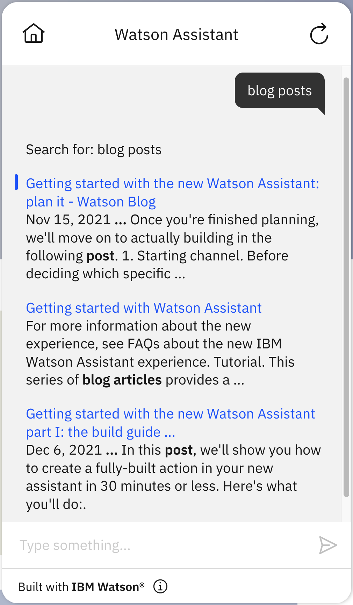

# Google custom search

## Background

These are instructions for accessing the Google Custom Search JSON API through an extension to your Assistant (note that these instructions assume that you are using a template. If you are not using a template, see the `README.md` in this directory). The Google Custom Search API allows search over a website, collection of websites or the world wide web using the [Google Programmable Search Engine](https://developers.google.com/custom-search/docs/overview), which is a configurable search that allows you to customize search features based on your use-case.

The OpenAPI spec used by the extension includes the following endpoints:

- `GET /customsearch/v1`: Search for content relevant to a given query over the entire web.
- `GET /customsearch/v1/siterestrict`: Search for content relevant to a given query over a specific collection of websites.

The endpoints are described in detail at:

1. **Custom Search**: https://developers.google.com/custom-search/v1/reference/rest/v1/cse/list
2. **Custom Search Site Restricted**: https://developers.google.com/custom-search/v1/reference/rest/v1/cse.siterestrict/list

These endpoints have the same arguments and responses.  However, there are two major differences between these endpoints:

- The *Custom Search Site Restricted* endpoint is restricted to searching 10 or fewer websites (each of which can have an unlimited number of pages).  In contrast, *Custom Search* can support any number of websites including all of the web that is indexed by Google.
- The *Custom Search* endpoint has a [daily query limit](https://developers.google.com/custom-search/v1/overview#pricing), and the *Custom Search Site Restricted* does not.

For a typical assistant focused on a specific topic, it is usually only necessary to search a single website or a small number of websites.  For assistants of this sort, *Custom Search Site Restricted* is a better fit since it doesn't have a limit on the number of queries that can be run per day.  Assistants that need to search more than 10 websites need to use *Custom Search* instead.

## Pre-Requisite Steps

- Follow the steps listed in the [Before you start](https://developers.google.com/custom-search/v1/introduction#before_you_start) section to create the custom programmable search engine (and thereafter obtain the ID of that Programmable Search Engine) as well as the [API key](https://developers.google.com/custom-search/v1/introduction#identify_your_application_to_google_with_api_key) to identify your application.

## Other Setup Info

- Download the OpenAPI specification (`google-custom-search-openapi.json`) from the `./basic` directory.
- Use the OpenAPI specification to [build a custom extension](https://cloud.ibm.com/docs/watson-assistant?topic=watson-assistant-build-custom-extension#building-the-custom-extension).
- [Add the extension to your assistant](https://cloud.ibm.com/docs/watson-assistant?topic=watson-assistant-add-custom-extension) using the API key you obtained in the pre-requisites above.
- Navigate to the Actions page. Under "variables"/"set by you", set the variable with name `cx` to the ID for the programmable search engine that you got in the Pre-Requisite Steps (replacing `0123456789abcdef0`, which is the dummy/placeholder value).
 - In the "Search" action, use the following configuration on the step that uses the extension:
      - Click on "Edit extension" at the bottom of the step
      - Select *Custom Search* or *Custom Search Site Restricted* as the endpoint at this step.  See the "Background" section of this document for information about the difference between the two.
      - Set the `query` parameter to the `query_text` session variable.
      - Set the `cx` parameter to the `cx` session variable.
      - Set the `num` optional parameter to the `num_of_results` session variable (which is set to 3 by default). For more on why it is important to set this parameter, see the "Limit on Size of Search Results" section of this document.

### Link Actions to No Action matches state
- Go to "Actions" > "Set by assistant" > "No action matches" and remove all the steps from the action.  Add in a new step.  Under "And then" select "Go to another action" and select "Search" and click "End this action after the subaction is completed".
- You may also want to go to "Actions" > "Set by assistant" > "Fallback" and do the same thing as in the previous step.  Note, however, that this will prevent your assistant from escalating to a human agent when a customer asks to connect to a human agent (which is part of the default behavior for "Fallback") so only do this if you do not have your bot connected to a human agent chat service.  For more details on connecting to human agents within Watson Assistant see [our documentation](https://cloud.ibm.com/docs/watson-assistant?topic=watson-assistant-human-agent) and [blog post](https://medium.com/ibm-watson/bring-your-own-service-desk-to-watson-assistant-b39bc920075c).

## Using your Google Custom Search Extension

Once you have completed these setup instructions, you can issue a query to your bot and if there is no other action that matches that query then it will generate search results for that query. Here is an example of what search results from the "Search" action can look like:

## Limit on Size of Search Results

Watson Assistant has a hard limit of 100kb on the size of information stored in Assistant context variables (which includes search results). If the results from your extension exceed that limit, the action will fail without any visible warning or error -- typically there is a long delay and then no response.  In our experience, this rarely happens with the Google Custom Search extension, but it _can_ happen if you are searching a site with extremely large volumes of metadata returned by Google custom search.  If you think that this might be a problem for you, you can try running the query in an API testing tool like curl, [Insomnia](https://insomnia.rest/), or [Postman](https://www.postman.com/) to see how many bytes of data you are getting as search results.  If the total is at or near 100kb, then this is your problem.  You may be able to work around the issue by reducing `num_of_results` (and getting fewer results for each query) and/or by excluding sites or pages with extremely large volumes of metadata from your Google Custom Search.

See also the [Limit on Size of Search Results section of the Watson Discovery search extension kit](https://github.com/watson-developer-cloud/assistant-toolkit/blob/master/integrations/extensions/starter-kits/watson-discovery/README.md#limit-on-size-of-search-results) for more details on this issue.
