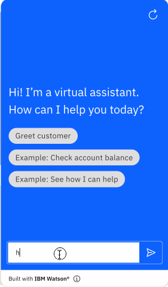
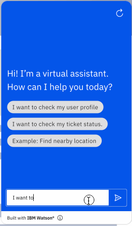
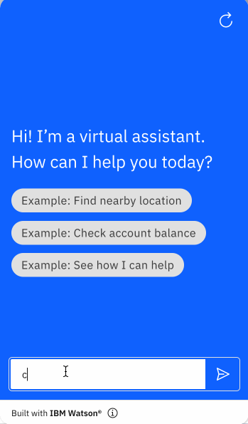

# HubSpot Custom Extension

HubSpot provides an API which allows for ticket creation, feedback submission, and quotes, amongst other business functions. HubSpot also offers a free version, which makes it great place to start for proof-of-concepts, testing, etc. with the option of upgrading your account/product as needed.

This example starter kit offers support for the following HubSpot API endpoints:

Basic:
- GET Get Contact by ID

Advanced:
- POST Create Ticket
- GET Get Contact by ID
- GET List Tickets
- GET Get Ticket Info
- DELETE Archive Ticket

HubSpot has a fantastic public API documentation that is very custom extensions friendly - [their docs](https://developers.hubspot.com/docs/api/crm/tickets) provide an OpenAPI doc as well as a Postman collection. The full documentation for their API endpoints can be found [here](https://api.hubspot.com/api-catalog-public/v1/apis?_ga=2.141533746.1208547948.1639927461-1206602246.1639927461). For their ticketing specific APIs, find them [here](https://api.hubspot.com/api-catalog-public/v1/apis/crm/v3/objects/tickets).

## Basic vs Advanced

The `basic` kit implements a single yet useful API call for retrieving contact information. If you are new to custom extensions, we recommend you start there to get an idea on how to use custom extensions with skills. The `advanced` folder contains a kit with more advanced functionality, which you can use as a creative springboard for complex use cases.

## Pre-Req 1: Getting Private Apps Access Token

Hubspot has increased their level of security for making API calls. They no longer support one API Key but rather support keys per Application. Hubspot now support two types of Apps: Private and Public. Public Apps require OAuth authentication which currently IBM Watson Assistant does not support. For the time being, we recommend using Private Apps which are based on Bearer Authentication. Please note, to follow Hubspot guidelines on sharing this Bearer token.

First, we need to create a Hubspot account.

1. [Create app developer account](https://developers.hubspot.com/get-started).
1. Once you have verified your email, click `Create a test account`, and select the test account.

1. Click on `Settings` (the cog wheel icon) at the top right of the page, then click `Integrations` in the left menu to open a drop-down, and select `Private Apps`.

1. If you do not already have one, `Create a private app`. Enter your app's name, then click the `Scopes` tab select the scopes `tickets` and `crm.objects.contacts.read`. Click `Create app` on the top right. Copy the access token and save for future steps.

[guidelines provided by Hubspot](https://developers.hubspot.com/docs/api/private-apps).

## Pre-Req 2: Adding Custom Properties in HubSpot
This starter kit focuses on the ticketing system and profile information retrieval of HubSpot. In order to use the provided JSON skill out of the box, you will need to create some custom properties - `charge_name`, `charge_amount`, `charge_date`, and `membership_status` - within your HubSpot account.

1. Navigate to `Settings` (the cog wheel icon) at the top right of the page, then click `Objects` in the left menu to open a drop-down, and select `Tickets`.

1. Click `Manage ticket properties`.

1. Click `Create property` with the following information, then click `Create`.
    - Object type: `Ticket`
    - Group: `Ticket information`
    - Label: `charge_name`
    - Description (optional): `<your-description-of-property>`
    - Field type: `Single-line text`

1. Repeat for: (fields not specified are identical with above)

    - Label: `charge_amount`
    - Field type: `Number`
    - Format: `Currency` 

    and
    - Label: `charge_date`
    - Field type: `Date picker`

    and:
    - Object type: `Contact`
    - Group: `Contact activity`
    - Label: `membership_status`
    - Field type: `Single-line text`

### When moving beyond this starter kit... 
In most cases you will want to customize these fields for your own POC or use case. You will need to access HubSpot and create your own custom properties as described in the above steps, as well as update the OpenAPI spec (the `.openapi.json` file) to expect your own custom properties. You should update the required parameters in the `$ref` for the request object. Then, edit the steps in your assistant's actions skill to match the expected parameters.

For helpful information on how to easily modify and use the skills/OpenAPI specifications, take a look at [Advanced Usage](../../docs/ADVANCED_USAGE.md) (hint: `swagger.io` is your friend).

## Using this Starter Kit

The following actions are provided in this starter kit. After upload, the actions should be configured to use the fields below for the skill to be fully functional. Follow the instructions [here](../../README.md#configuring-your-actions-skill-to-use-an-extension) and note the information below to do this.

- **Action 1: Greet customer** (basic + advanced)<br>
    ```
    Operation: Get Contact by ID
    Parameters:
      - contactId: 1. Hi! Please tell me your customer ID ...
    ```

- **Action 2:  I want to book an appointment** (basic + advanced)<br>
    This action does not use an extension - it is included to demonstrate the flow of session variables after using Action 1.
    ```
    Operation: N/A
    Parameters: N/A
    ```

- **Action 3:  I want to dispute a charge** (advanced)
    ```
    Operation: Create Ticket
    Parameters:
      - properties.subject: subject
      - properties.hs_pipeline_stage: hs_pipeline_stage
      - properties.charge_name: 1. Sure, we can help you ...
      - properties.charge_amount: 2. How much was the charge ...
      - properties.charge_date:  3. What was the date?
    ```

    **Note**: `subject` and `hs_pipeline_stage` exist by default in HubSpot's ticketing schema - the provided skill adds default values in `Step 4`. The `hs_pipeline_stage` field in the API corresponds to the `Ticket status` of a HubSpot ticket; we recommend submitting a value of `1` for the `hs_pipeline_stage` field, which will set the `Ticket status` to `New`.  The `subject` field in the API corresponds to the `Ticket name` of a HubSpot ticket.

- **Action 4: Pick a ticket subaction** (advanced)<br>
    Note that this is a subaction, and not meant to be called individually.
    ```
    Operation: List Tickets
    Parameters:
      - limit: 10
    ```

- **Action 5: I want to check my ticket status** (advanced)<br>
    Note that you will have to also configure action `Pick a ticket subaction` above, since it is used as a subaction within this action.
    ```
    Operation: Get Ticket Info
    Parameters:
      - ticketId: ticketId
    ```

- **Action 6: I want to delete my ticket** (advanced) 
    ```
    Operation: Archive Ticket
    Parameters:
      - ticketId: ticketId
    ```

## Example Usage
A conversation using this starter kit could look like the following. Note that the second example is only supported via the `advanced` spec and skill.





Feel free to contribute to this starter kit, or add other starter kits by following these [contribution guidelines](../../docs/CONTRIBUTING.md).
