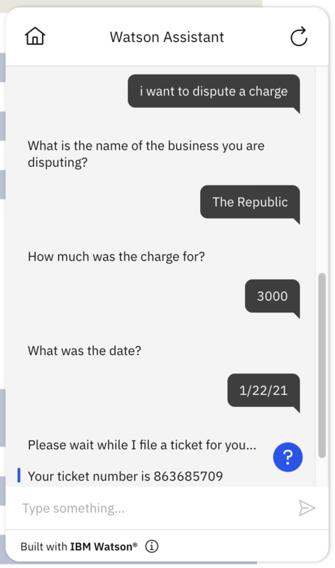

# HubSpot Custom Extension

## Background
HubSpot provides an API which allows for ticket creation, feedback submission, and quotes, amongst other business functions. HubSpot also offers a free version, which makes it great place to start for proof-of-concepts, testing, etc. with the option of upgrading your account/product as needed.

This example starter kit offers support for the following HubSpot API endpoints:
- POST Create a Ticket

Hubspot has a fantastic public API documentation that is very custom extensions friendly - [their docs](https://developers.hubspot.com/docs/api/crm/tickets) provide an OpenAPI doc as well as a Postman collection. The full documentation for their API endpoints can be found [here](https://api.hubspot.com/api-catalog-public/v1/apis?_ga=2.141533746.1208547948.1639927461-1206602246.1639927461). For their ticketing specific APIs, find them [here](https://api.hubspot.com/api-catalog-public/v1/apis/crm/v3/objects/tickets).

## Basic vs Advanced

This readme showcases the `basic` path, which implements single yet useful API call for ticket creation. If you are new to custom extensions, we recommend you start there. The `advanced` folder contains a kit with more advanced functionality, which you can use as a springboard for complex custom extensions that is tailored to your project's use cases.  

## Pre-Req 1: Getting Auth Keys
To call the HubSpot API, you will need an API key. To obtain this key:

1. Click on `Settings` (the cog wheel icon) at the top right of the page, then click `Integrations` in the left menu to open a drop-down, and select `API Key`.

1. If you do not already have one, `Create key`. Copy the API key and save for future steps. **Note:** You can also see a log of API calls using each key, which is helpful to debug API calls sent from your assistants that do not produce the expected outcome in HubSpot or in your assistants.

## Pre-Req 2: Adding Custom Properties in HubSpot
This starter kit focuses on the *ticketing system* of HubSpot. In order to use the provided JSON skill out of the box, you will need to create some custom properties - `charge_name`, `charge_amount`, and `charge_date` - within your HubSpot account.

1. Navigate to `Settings` (the cog wheel icon) at the top right of the page, then click `Objects` in the left menu to open a drop-down, and select `Tickets`.

1. Click `Manage ticket properties`.

1. Click `Create property` with the following information, then click `Create`.
    - Object type: `Ticket`
    - Group: `Ticket information`
    - Label: `charge_name`
    - Description (optional): `<your-description-of-property>`
    - Field type: `Single-line text`

1. Repeat for: (fields not specified are identical with above)

    - Label: `charge_amount`
    - Field type: `Number`
    - Format: `Currency` 

    and
    - Label: `charge_date`
    - Field type: `Date picker`

### When moving beyond this starter kit... 
In most cases you will want to customize these fields for your own POC or use case. You will need to access HubSpot and create your own custom properties as described in the above steps, as well as update the OpenAPI spec (the `.openapi.json` file) to expect your own custom properties. You should update the required parameters in the `$ref` for the request object. Then, edit the steps in your assistant's actions skill to match the expected parameters.

For helpful information on how to modify and use the skills/OpenAPI specifications, take a look at [../../docs/ADVANCED_USAGE.md](../../docs/ADVANCED_USAGE.md).

## Using this Starter Kit

The following actions are provided in this starter kit. When configuring your extension, the fields below should be populated accordingly for the skill to be fully functional.

- Action 1: I want to dispute a charge.
    ```
    Operation: Create Ticket
    Parameters:
      - properties.subject: subject
      - properties.hs_pipeline_stage: hs_pipeline_stage
      - properties.charge_name: 1. Sure, we can help you ...
      - properties.charge_amount: 2. How much was the charge ...
      - properties.charge_date:  3. What was the date?
    ```

    **Note**: `subject` and `hs_pipeline_stage` exist by default in HubSpot's ticketing schema -- the provided skill adds default values in **Step 4**. The `hs_pipeline_stage` field in the API corresponds to the `Ticket status` of a HubSpot ticket; we recommend submitting a value of `1` for the `hs_pipeline_stage` field, which will set the `Ticket status` to `New`.  The `subject` field in the API corresponds to the `Ticket name` of a HubSpot ticket.

## Example Usage
A conversation to create a dispute ticket using the provided spec and skill would look like:



Free free to contribute to this starter kit, or add other starter kits by following these [contribution guidelines](../../docs/CONTRIBUTING.md).