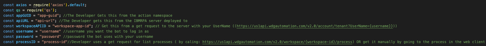
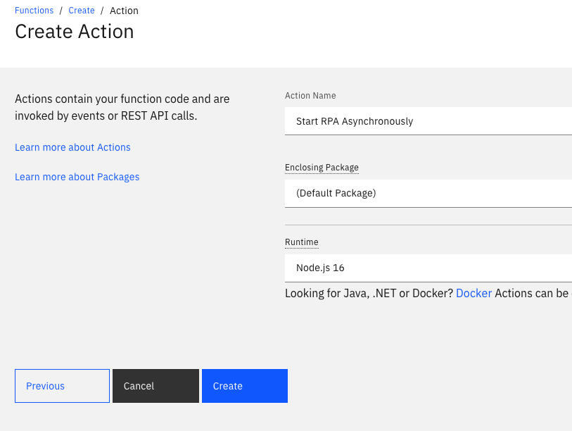
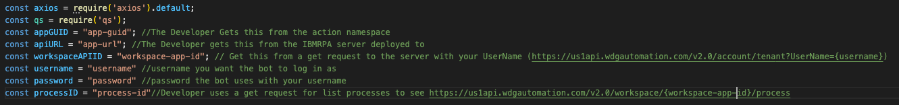
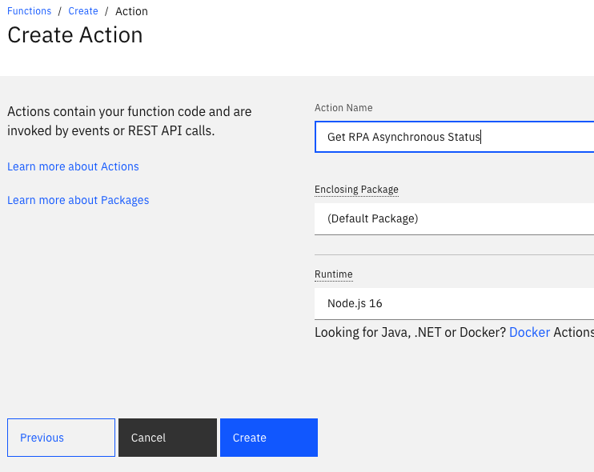
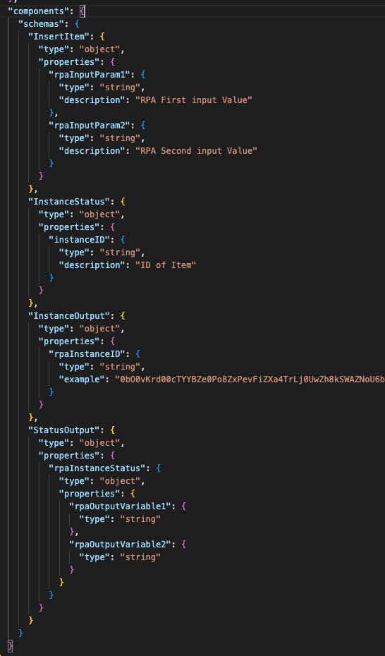
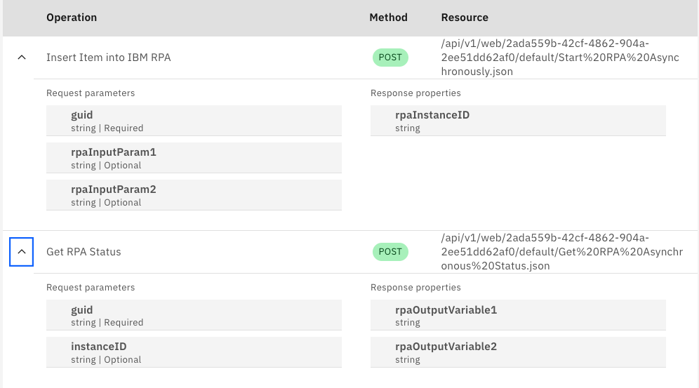
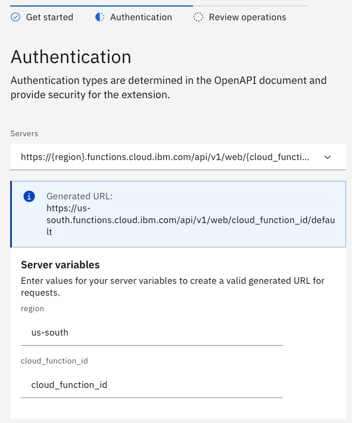

# IBM RPA Custom Extension

The IBM Robotic Process Automation (RPA) offering helps automate business and IT processes at scale with the ease and speed of traditional RPA. Software robots, or bots, can act on AI insights to complete tasks with no lag time and enable you to achieve digital transformation.

This extension starter kits shows how to integrate IBM RPA into a conversational flow built with Watson Assistant. The integration relies on two cloud functions included with this starter kit that sit between Watson Assistant and IBM RPA. These cloud functions handle things like IBM RPA authentication and conversion of the REST API calls defined in the OpenAPI spec imported into Watson Assistant (also included in the start kit) to APIs supported by IBM RPA.

One important caveate about this starter kit is that it does not contain the backend RPA distribution needed to complete an end-to-end demo. The purpose of the starter kit is to provide template assets needed to start building the integration but practitioners may need help from the IBM RPA client engineering team to build a working demo. IBM employees can put in a request for help through the Customer Care Jumpstart program. Please check the [intake process here through ISC](https://ibm.box.com/s/m715465sjeai35dz58rdp72t35z4z58m).

---
**NOTE:** It's important to understand that this starter kit is using generic RPA input and output parameters for illustration purposes. For example, rpaInputParam1 and rpaInputParam2 will likely need to change based on your actual RPA script. Throughout this starter kit you will be directed at the places these temporary parameters will need to be modified to match your actual RPA scripts.
___

### Starter Kit Overview

Here is a list of the components included with this starter kit along with details on the purpose of each file:

| File Name | Details |
|-----------|---------|
|cfInsert.js| Cloud function template used to insert an RPA item (e.g. job) into a queue to be executed. |
|cfGetStatus.js| Cloud function template used to query RPA for item status. This is needed because RPA jobs can take longer than 30 seconds to complete which means you most poll this cloud function for the jobs completion status. |
|ibm-rpa.openapi.json| OpenAPI spec template that needs to be imported into Watson Assistant in order to integrate with the two cloud functions.|
|RPAWA Integration.mp4| Very short video showing what this integration looks like when using the Watson Assistant preview panel.|
|ibm-rpa.actions.json| Action skill sample that calls out to the RPA cloud functions using the above OpenAPI spec. |

Note that the above templates will need to be modified according to the steps outlined below.

## Pre-Requisite Steps

To complete an end-to-end setup of this integration between Watson Assistant and IBM RPA you will need to provision accounts for all of the following:

 - Watson Assistant (a trial account)
 - IBM RPA
 - IBM Cloud Functions (or some equivalent)

 This solution does not include support for authentication to the RPA cloud functions. The cloud function namespace guid will be used for security in this example.

## Using this Starter Kit

### Setup RPA

Go [here](https://www.ibm.com/docs/en/rpa/21.0?topic=automation-deploying-scripts) first for details on building and deploying RPA scripts.

These instructions outline the basic steps: 

1. Add credentials to your local machine so it can be unlocked.
2. Build your script and publish (note the input and output variables as these will be used through out the setup of this integration).
3. Define a system queue to use on the server.
4. Workflow -> Processes -> Create Process
    - Ensure variables match script (step 2) variables.

Now ensure you can call that script via the rest api (Asynch/Synch). Note that this will require credentials.

### Setup Cloud Functions

First get the necessary parameters needed by the [cloud functions](https://cloud.ibm.com/functions/):

1. Call IBM RPA Tenants API from Postman or cURL and get the WorkspaceID.
2. Login to IBM RPA Web Client, Go to processes that you created and get the process ID in the URL. For example: https://us1app.wdgautomation.com/#/en-US/workflows/processes/2a88c404-926c-44fe-b1b9-66c1620cc2ca) -> 2a88c404-926c-44fe-b1b9-66c1620cc2ca
3. For security purposes go to the namespace section of cloud function and get the GUID.
4. Know the API URL for your RPA Tenant (us1/BR2,UK1, etc).
5. Know your RPA username and passowrd.

Next create a cloud function used to insert an item in the RPA queue:

1. Open the [cfInsert.js](./cfInsert.js) template file included with this starter kit in the text editor of your choice.
2. Write your personal values from above into the top of the cfInsert.js template script.
3. The following parameters should be updated based on your RPA setup above:

4. Build dynamic logic to insert the RPA expected variables (must match RPA script variables defined above). This involves modifying the script file variable names to match your RPA script (e.g., rpaInputParam1).
5. Create your action and name it "Start RPA Asynchronously"

6. Copy the edited javascript from the cfInsert.js file into the code section of the action.
7. Go to Endpoints and enable endpoint as a Web Action (.json will be used by the Extension to define the response format).

Next create the cloud function for reading status of an item in the queue:
1. Open the [cfGetStatus.js](./cfGetStatus.js) template file included with this starter kit in the text editor of your choice.
2. Write your personal values from above into the top of the cfGetStatus.js template script.
3. The following parameters should be updated based on your RPA setup above:

5. Create your action and name it "Get RPA Asynchronous Status"

6. Copy the edited javascript from the cfInsert.js file into the code section of the action.
7. Go to Endpoints and enable endpoint as a Web Action (.json will be used by the Extension to define the response format).

Next update the OpenAPI spec template included with this starter kit:
1. Open the [ibm-rpa.openapi.json](./ibm-rpa.openapi.json) template file included with this starter kit in the text editor of your choice.
2. Copy and paste over necessary lines in the template with the following based on what your RPA functions use for input and output parameters (e.g., rpaInputParam1):

3. Save changes

### Setup Watson Assistant

1. Within the new Watson Assistant environment, start by creating a new assistant. You can do this by importing the ibm-rpa.actions.json file. Note that the parameters and endpoints related to the RPA extension defined within this JSON file will have to be setup again after you import the Extension. 

2. After you create your assistant, you can upload the OpenAPI specification that you edited above to your assistant by following these [instructions](https://cloud.ibm.com/docs/watson-assistant?topic=watson-assistant-add-custom-extension).

You should see these two methods in the extension:

3. Add your newly created custom extension to your draft environment. Be sure to set the region and cloud_function_id server variables that are derived from your cloud function endpoints.

4. After you setup the new extension you will need to go into the two Action steps which call out to the extension and point them at the new methods associated with the extension. This includes setup of both the call out methods and the related parameters.

5. Now within the Action step that calls the extension setup the extenion input parameters including:
    - You will need to update the extension GUID parameter with the parameter pulled from the namespace section of the cloud function. 
    - The rpaInputParameters will be defined according to the use case.

6. Now, on the step that handles the extension reponse from the insert step, map the extension output parameters:
    - The rpaInstanceID returned from the cfInsert.js script is stored as a session variable and used to get status in subsequent request to the cfGetStatus.js based cloud function.

See it in action [here](./assets/RPAWA-Integration.mp4)!!
