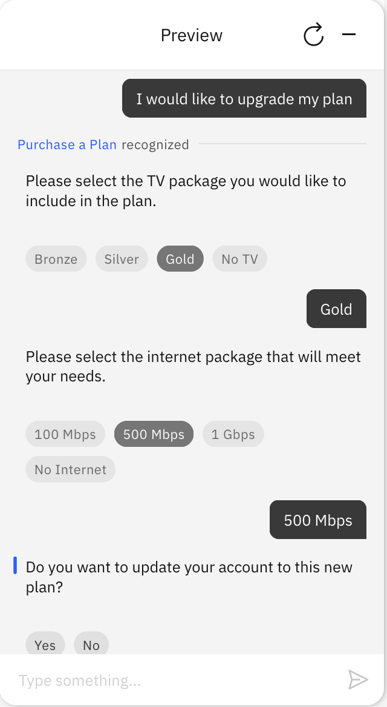
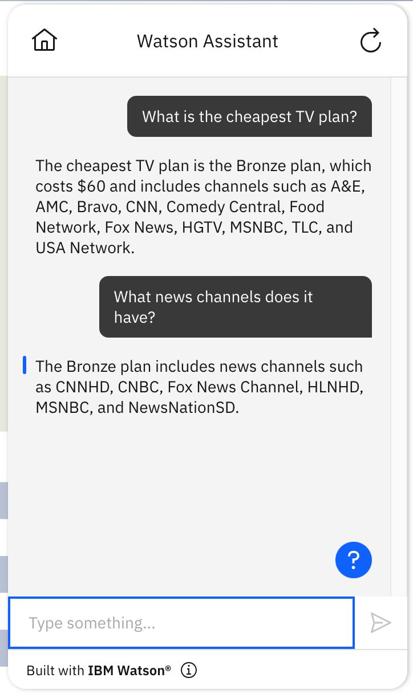
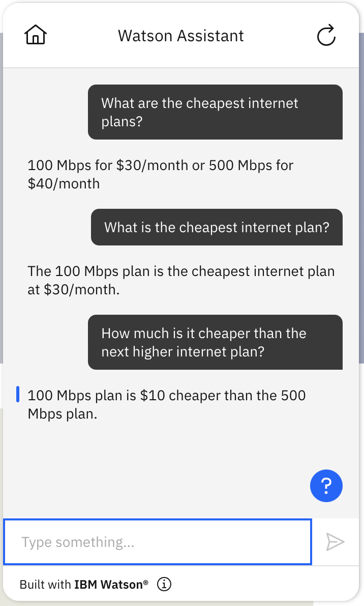

# Language Model Complex Informational Tasks Starter Kit

This starter kit has two examples of how to connect Watson Assistant with large language models (LLMs) to generate natural language answers for specific topics when there is only a small amount of relevant text available. For use cases that require only a small amount of text, all of the text can be sent directly into the model so there is no need to support document search.

These examples demonstrate an assistant that is configured with a mix of conventional actions and generative answering actions. The conventional actions are designed to assist users with programmatic tasks that can be accomplished with specific steps that have limited options, such as purchasing a TV plan or opening a bank account. Generative answering actions have more flexibility to provide a more powerful general question answering capability, illustrated in this kit with the "TV Plan Questions" and "Internet Plan Questions" actions.

## Prerequisites

This starter kit requires that you use the [new Watson Assistant](https://cloud.ibm.com/docs/watson-assistant?topic=watson-assistant-welcome-new-assistant).

Create a new, empty assistant that you can use to test this starter kit. For more information, see [Adding more assistants](https://cloud.ibm.com/docs/watson-assistant?topic=watson-assistant-assistant-add).

## Example 1: Connect your assistant to OpenAI

This starter kit uses [OpenAI](https://openai.com/) to generate natural language answers for queries over specific topics where all relevant text is loaded directly into the model.

Before you upload the sample actions for this starter kit, you first need to configure a [custom extension for OpenAI](../language-model-openai/README.md).

### Build and add a custom extension for OpenAI

Follow the steps [here](../language-model-openai/README.md#build-and-add-a-custom-extension-for-openai) to configure OpenAI as a custom extension.

### Upload sample actions

To use the sample actions:

1. **After having configured the extension**, download the sample actions from this starter kit: [`complex-info-openai-actions.json`](./complex-info-openai-actions.json).

1. Use **Actions Global Settings** to upload the JSON file to your assistant. For more information, see [Uploading](https://cloud.ibm.com/docs/watson-assistant?topic=watson-assistant-admin-backup-restore#backup-restore-import).

**NOTE**: If you import the actions _before_ configuring the extensions, you will see some errors on the actions because it could not find the extensions. Simply configure the extensions as described above and re-import the action JSON file.

#### The starter kit includes these sample actions:

| Action                                       | Description                                                                                                                                                                                                                                                                                                                                                                                                                                                                                                                                                         |
| -------------------------------------------- | ------------------------------------------------------------------------------------------------------------------------------------------------------------------------------------------------------------------------------------------------------------------------------------------------------------------------------------------------------------------------------------------------------------------------------------------------------------------------------------------------------------------------------------------------------------------- |
| Internet Plan Questions                      | A generative answering action to answer questions regarding Internet Plans. This action invokes the "Generate Answer" action to generate a response to the query.                                                                                                                                                                                                                                                                                                                                                                                                   |
| TV Plan Questions                            | A generative answering action to answer questions regarding TV Plans. This action invokes the "Generate Answer" action to generate a response to the query.                                                                                                                                                                                                                                                                                                                                                                                                         |
| Generate Answer                              | Configures the user query and the content resulting from the questions actions as input to the model and calls the subaction "Invoke GPT Chat Completion API with Messages". It is not meant to be invoked directly, but rather by the "TV Plan Questions" or the "Internet Plan Questions" actions.                                                                                                                                                                                                                                                                |
| Invoke GPT Chat Completion API with Messages | Connects to OpenAI with the content configured by the "Generate Answer" action and asks the language model to generate an answer to the user query. It is not meant to be invoked directly, but rather by the "Generate Answer" action. This action is slightly different from the "Invoke GPT Chat Completion API" used in the [generic OpenAI starter kit](../language-model-openai/README.md) because it invokes the model with prompts and content bundled into `messages`, rather than with this expression `{"role": "user", "content": "${model_prompt}"`}`. |
| Purchase a Plan                              | A conventional action that guides the user through steps with multiple choice options for purchasing or upgrading their TV and Internet plans. This action is included in this kit to demonstrate how language model actions and conventional actions can co-exist in the same assistant.                                                                                                                                                                                                                                                                           |

#### Session variables

Below is a list of the session variables used in this example. They are automatically set with defaults in the sample [complex-info-openai-actions.json](./complex-info-openai-actions.json), so you do not need to set them yourself unless you want to make changes.

- `internet_plan_messages`: Holds information from the Internet Plan Questions action that is used as input to the model.
- `internet_plan_prompt`: The prompt for the OpenAI model on the topic of internet plans. Specifically, this prompt is "You are an agent for a cable provider that helps customers determine which internet plan is best for them. Limit your response to 30 words and only discuss which plans are best for that customer unless prompted otherwise. The three plans are 1) The 100 Mbps plan which cost $30; 2) The 500 Mbps which cost $40; 3) The 1 Gbps plan which cost $50"
- `last_action_accessed`: Used by "No Action Matches" to support multiple conversational turns on the same topic. For example, the "Internet Plan Questions" action sets this value to "Internet Plan Questions" so after the first internet plan query, all subsequent queries will fall back to the Internet Plan Questions action if they do not directly match some other action. This is meant to illustrate extended conversational interaction. It is a current limitation of the starter kit that once this value is set, it does not automatically get reset when the conversation moves on past this topic.
- `messages` : Input to the OpenAI model.
- `model_for_chat` : The OpenAI model used, defaults to `gpt-3.5-turbo`.
- `model_max_tokens` : The maximum number of text fragments to input to the model. The starter kit uses 200.
- `model_response`: The text generated by the model in response to the model input `messages`.
- `tv_plan_messages`: Holds information from the TV Plan Questions action that is used as input to the model.
- `tv_plan_prompt`: The prompt for the OpenAI model on the topic of TV plans. It includes instructions and data for the model to use when generating an answer.
- `user_message`: This is used to add the user query to the model messages `{ "role": "user",  "content": input.text}`.
- `verbose`: When set to `True` prints debugging information. Default is `False`. In this starter kit, when `verbose` is `True`, a step in the "Generate Answer" action will print out the prompt that is being sent to the model.

### Example usage

#### An example of how to use the `Purchase a Plan` action for this starter kit:

#### An example of how to use the `TV Plan Questions` action for this starter kit:

## Use at your own risk

The prompts in this kit provide specific details for the models to pull information from, and often the models are quite good at focusing on those details. However, depending on the question, the details of the prompt, and the model used, the models can also provide additional information that is not in the prompt and may not always be what you want your assistant to say. We strongly recommend that anyone using this approach do a great deal of testing, and think carefully before deploying something like this. It can allow you to get some impressive results very quickly and easily, but it comes with some significant risk of producing misinformation in some cases. Careful revision of the prompts can reduce that risk, but probably will not eliminate it completely.

## Example 2: Connect your assistant to PaLM

This starter kit uses Google [PaLM](https://developers.generativeai.google/guide/palm_api_overview) to generate natural language answers for queries over specific topics where all relevant text is loaded directly into the model. The use of the PaLM API in this example was not made in partnership with, sponsorship with, or with endorsement from Google.

Before you upload the sample actions for this starter kit, you first need to configure a [custom extension for PaLM](../language-model-palm-api/README.md).

### Build and add a custom extension for PaLM

Follow the steps [here](../../language-model-palm-api/README.md) to configure PaLM as a custom extension.

### Upload sample actions

To use the sample actions:

1. **After having configured the extension**, download the sample actions from this starter kit: [`complex-info-palm-actions.json`](./complex-info-palm-actions.json).

1. Use **Actions Global Settings** to upload the JSON file to your assistant. For more information, see [Uploading](https://cloud.ibm.com/docs/watson-assistant?topic=watson-assistant-admin-backup-restore#backup-restore-import).

**NOTE**: If you import the actions _before_ configuring the extensions, you will see some errors on the actions because it could not find the extensions. Simply configure the extensions as described above and re-import the action JSON file.

#### The starter kit includes these sample actions:

| Action                  | Description                                                                                                                                                                                                                                                                               |
| ----------------------- | ----------------------------------------------------------------------------------------------------------------------------------------------------------------------------------------------------------------------------------------------------------------------------------------- |
| Internet Plan Questions | A generative answering action to answer questions regarding Internet Plans. This action invokes the "Generate Answer" action to generate a response to the query.                                                                                                                         |
| TV Plan Questions       | A generative answering action to answer questions regarding TV Plans. This action invokes the "Generate Answer" action to generate a response to the query.                                                                                                                               |
| Generate Answer         | Configures the user query and the content resulting from the questions actions as input to the model and calls the subaction "Invoke PaLM API". It is not meant to be invoked directly, but rather by the "TV Plan Questions" or the "Internet Plan Questions" actions.                   |
| Invoke PaLM API         | Connects to PaLM with the content configured by the "Generate Answer" action and asks the language model to generate an answer to the user query. It is not meant to be invoked directly, but rather by the "Generate Answer" action.                                                     |
| Purchase a Plan         | A conventional action that guides the user through steps with multiple choice options for purchasing or upgrading their TV and Internet plans. This action is included in this kit to demonstrate how language model actions and conventional actions can co-exist in the same assistant. |

#### Session variables

Below is a list of the session variables used in this example. They are automatically set with defaults in the sample [complex-info-palm-actions.json](./complex-info-palm-actions.json), so you do not need to set them yourself unless you want to make changes.

- `internet_plan_prompt`: The prompt for the PaLM model on the topic of internet plans. Specifically, this prompt is "You are an agent for a cable provider that helps customers determine which internet plan is best for them. Limit your response to 30 words and only discuss which plans are best for that customer unless prompted otherwise. The three plans are 1) The 100 Mbps plan which cost $30; 2) The 500 Mbps which cost $40; 3) The 1 Gbps plan which cost $50"
- `tv_plan_prompt`: The prompt for the PaLM model on the topic of TV plans. It includes instructions and data for the model to use when generating an answer.
- `model_prompt`: This is the prompt for PaLM model which is a concatinated string of internet_plan_prompt or tv_plan_prompt and the input text. This entire string is Context and instructions, relevent text as a knowledgebase and a user query which is fed to the LLM model.
- `verbose`: When set to `True` prints debugging information. Default is `False`. In this starter kit, when `verbose` is `True`, a step in the "Generate Answer" action will print out the prompt that is being sent to the model.
- `model_response`: The text generated by the model in response to the `model_prompt`.

### Example usage

#### An example of how to use the `Internet Plan Questions` action for this starter kit:

## Use at your own risk

The prompts in this kit provide specific details for the models to pull information from, and often the models are quite good at focusing on those details. However, depending on the question, the details of the prompt, and the model used, the models can also provide additional information that is not in the prompt and may not always be what you want your assistant to say. We strongly recommend that anyone using this approach do a great deal of testing, and think carefully before deploying something like this. It can allow you to get some impressive results very quickly and easily, but it comes with some significant risk of producing misinformation in some cases. Careful revision of the prompts can reduce that risk, but probably will not eliminate it completely.

Also this PaLM example, we found the chat model, which is `chat-Bison-001`, to be more prone to making up information when we tested it & hence for this example, we have used PaLM's text generation model, which is `text-Bison-001`.
However, if you want to experiment and use PaLM's chat language model, which is `chat-Bison-001`, you can change the operation of the PaLM extension in the 'Invoke PaLM API' action in step 1 and click on 'edit extension' as shown below.

