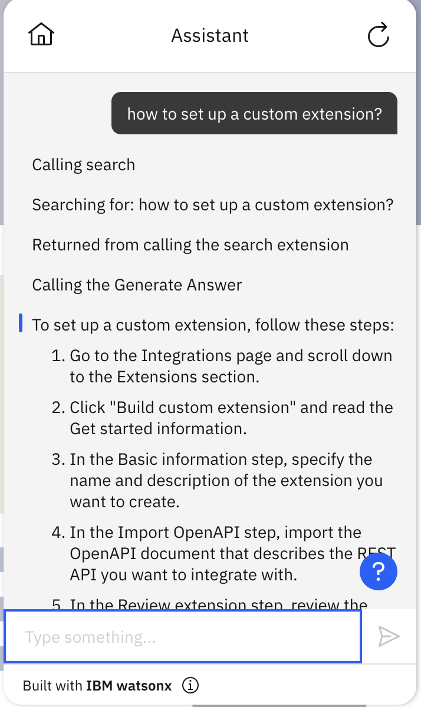
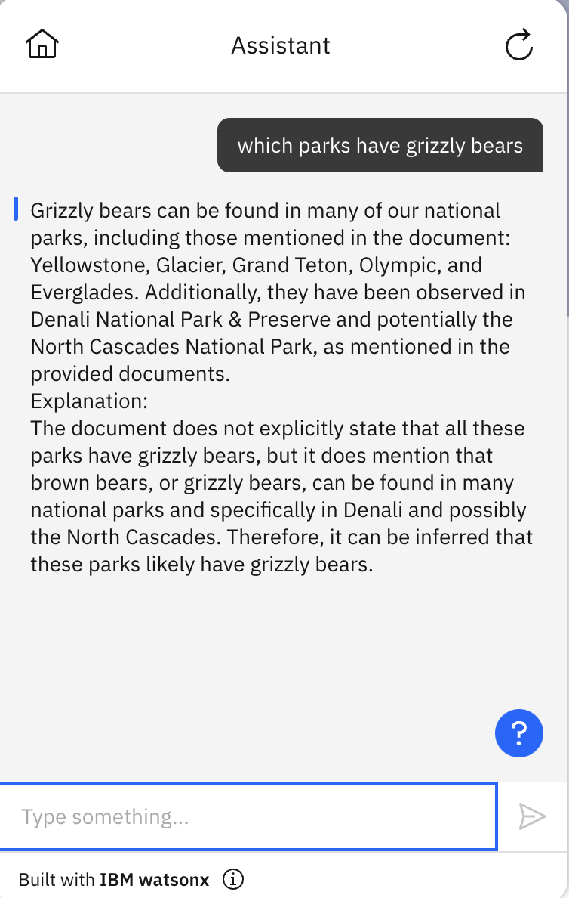
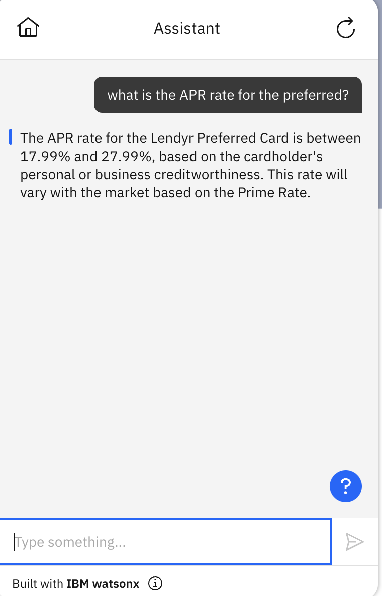
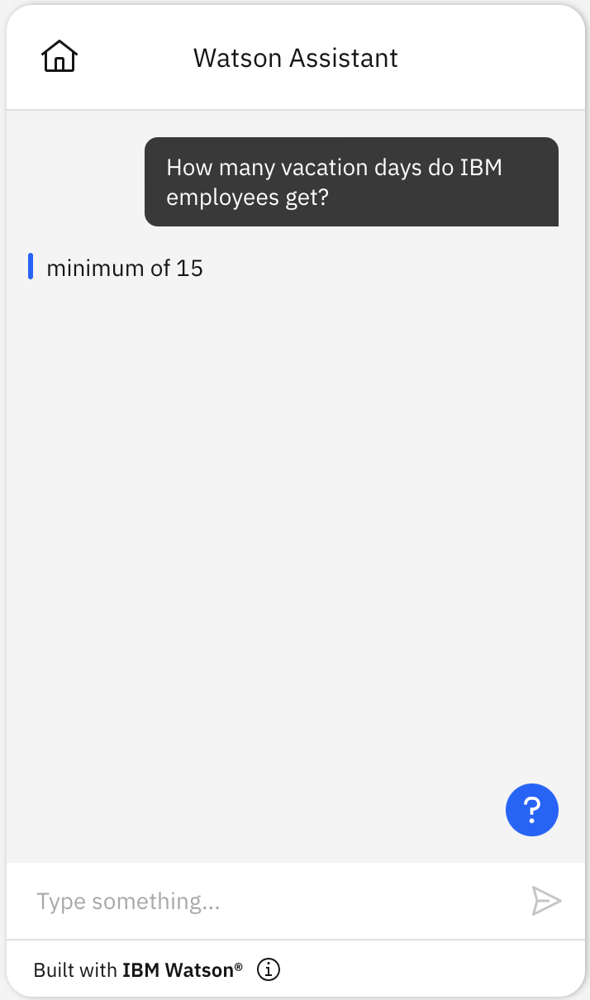
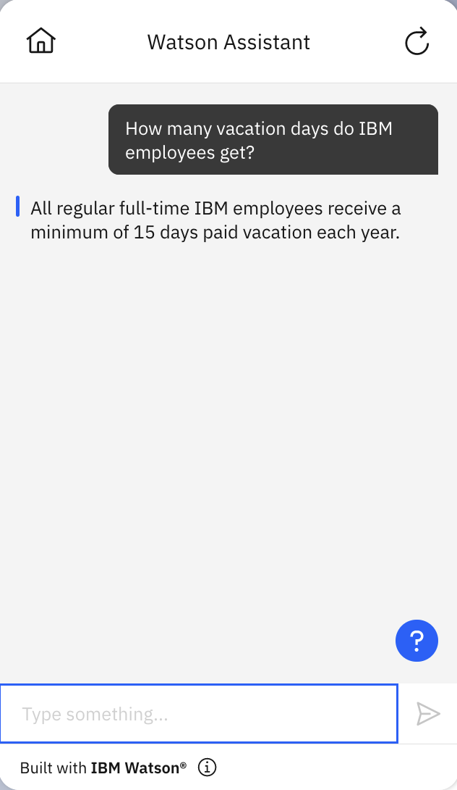

# Language Model Conversational Search starter kit

This starter kit has multiple examples of how to configure language models with IBM watsonx Assistant for conversational search.

1. The first example shows how to use [Elasticsearch search as input to a watsonx model](#example-1-connect-your-assistant-to-elasticsearch-and-watsonx-via-custom-extensions)
1. The second example shows how to use [Watson Discovery search as input to a watsonx model](#example-2-connect-your-assistant-to-watson-discovery-and-watsonx-via-custom-extensions)
1. The third example shows how to use [semantic search output as input to a watsonx model](#example-3-connect-your-assistant-to-hugging-face-milvus-and-watsonx-via-custom-extensions)
1. The fourth example shows how to use [Watson Discovery search as input to the IBM watsonx tech preview language model](#example-4-connect-your-assistant-to-watson-discovery-and-watsonx-tech-preview-language-model-via-custom-extensions).
1. The fifth example shows how to use [Watson Discovery search as input to an OpenAI model](#example-5-connect-your-assistant-to-watson-discovery-and-openai-via-custom-extensions)
1. The sixth example shows how to use [Watson Discovery search as input to Google PaLM](#example-6-connect-your-assistant-to-watson-discovery-and-palm-via-custom-extensions)

The [prerequisite for a new IBM watsonx Assistant](#prerequisites) applies for all examples.

## Prerequisites

All examples in this starter kit require that you use the [new IBM watsonx Assistant](https://cloud.ibm.com/docs/watson-assistant?topic=watson-assistant-welcome-new-assistant).

Create a new, empty assistant that you can use to test this starter kit. For more information, see [Adding more assistants](https://cloud.ibm.com/docs/watson-assistant?topic=watson-assistant-assistant-add).

## Example 1: Connect your assistant to Elasticsearch and watsonx via custom extensions

This starter kit example shows how to configure your assistant to use Elasticsearch for document search, and then use
those search results as input context for a watsonx large language model (LLM). The watsonx LLM generates a natural
language answer for the query based on the documents provided by the search.

Before you start, you need to install and set up your Elasticsearch index. 
* For Elasticsearch on IBM Cloud, please refer to [ICD-elasticsearch-install-and-setup](../../docs/elasticsearch-install-and-setup/ICD_Elasticsearch_install_and_setup.md) for more details. 
* For Elasticsearch (watsonx Discovery) on CloudPak, please refer to [watsonx-discovery-install-and-setup](../../docs/elasticsearch-install-and-setup/watsonx_discovery_install_and_setup.md) for more details.

Then follow the steps in the following two sections to configure your custom extensions.

### Configure Elasticsearch extension

Follow the steps [here](../elasticsearch/README.md) to configure the Elasticsearch custom extension

### Configure the watsonx answer generation extension

Follow the steps [here](../language-model-watsonx/README.md) to configure watsonx as a custom extension.

### Upload sample actions

The starter kit includes [a JSON file with these sample actions](./elasticsearch-watsonx-actions.json):

| Action                        | Description                                                                                                                                                                                                                                                                                                  |
| ----------------------------- | ------------------------------------------------------------------------------------------------------------------------------------------------------------------------------------------------------------------------------------------------------------------------------------------------------------ |
| Search                        | Connects to Elasticsearch to search for documents related to the user query. The "No Action Matches" action has been configured to send all input to this action, so whatever the user enters will be used as the search input. It invokes the "Generate Answer" action to generate a response to the query. |
| Generate Answer               | Configures the query prompt and document passages resulting from search, and calls the action "Invoke watsonx generation API". It is not meant to be invoked directly, but rather by the "Search" action.                                                                                                    |
| Invoke watsonx generation API | Connects to watsonx and, using as context the documents resulting from the search, asks the language model to generate an answer to the user query. It is not meant to be invoked directly, but rather by the "Generate Answer" action.                                                                      |

To use the sample actions:

1. **After having configured both extensions**, download the sample actions from this starter kit: [`elasticsearch-watsonx-actions.json`](./elasticsearch-watsonx-actions.json).

1. Use **Actions Global Settings** to upload the JSON file to your assistant. For more information, see [Uploading](https://cloud.ibm.com/docs/watson-assistant?topic=watson-assistant-admin-backup-restore#backup-restore-import).

> ⛔️
> **Caution**

- Please note that you **should not upload** the example actions directly into an _existing_ assistant because doing so will overwrite your existing actions.
  > Instead:
  >
  > - Create a new assistant in the same instance.
  > - Upload starter kit .json actions files to the new assistant.
  > - [Copy the actions from the new assistant to your main assistant](https://cloud.ibm.com/docs/watson-assistant?topic=watson-assistant-copy-action)

> ⛔️
> **Caution**

- Under "Variables"/"Created by you" (within the Actions page), you must set `watsonx_project_id` to the [watsonx project id](https://dataplatform.cloud.ibm.com/docs/content/wsj/manage-data/manage-projects.html) that you want to use for answer generation as well as the `es_index_name` to be the name of your Elasticsearch index to use for search.

**NOTE**: If you import the actions _before_ configuring the extensions, you will see some errors on the actions because it could not find the extensions. Simply configure the extensions as described above and re-import the action JSON file.

#### Session variables

Below is a list of the session variables used in this example. Most of them are automatically set with defaults in the sample [elasticsearch-watsonx-actions.json](elasticsearch-watsonx-actions.json), so you do not need to set them yourself unless you want to make changes. You must, however, set `watsonx_project_id` to the [watsonx project id](https://dataplatform.cloud.ibm.com/docs/content/wsj/manage-data/manage-projects.html) that you want to use for answer generation.

- `document_prompt_text`: set and used in the `Generate` action to build document text for the prompt sending to LLM.
- `es_model`: the ELSER model that will be used in Elasticsearch inference pipeline when processing a user query. It will be `.elser_model_1` for ELSER v1 and `.elser_model_2` for ELSER v2. We use ELSER v1 by default for this setup and ELSER v2 model will require a different query body.
- `es_index_name`: This **MUST** be set to the name of the index in Elasticsearch to be searched.
- `eq_query_results_size`: The number of documents you want Elasticsearch to return for your search query. Defaults to 3.
- `has_inner_hits`: a flag to decide which query_body to use by Elasticsearch extension based on whether there will be inner hits. If your query body is a nested query, it will have inner hits.
- `model_id`: The id of the watsonx model that you select for this action. Defaults to `ibm/granite-13b-chat-v2`. If you keep this default, be sure to comply with the [Acceptable Use Policy for this model](https://ai.meta.com/llama/use-policy/).
- `model_input`: The input to the watsonx model. This is set in an expression in Step 5 of the "Generate Answer" action. You MAY change that expression to do prompt engineering. If you wish to do so and are using the default model, be sure to research [guidelines for prompting Llama 2](https://www.pinecone.io/learn/llama-2/). In our experience, this combination of prompt and model is quite effective at producing high-quality answers when it has useful content and it does _often_ say that it doesn't know when it does not have useful content (as instructed in our prompt). However, it does _sometimes_ provide answers that are not supported by its evidence so consider other models, prompt expressions, or additional logic to reduce the generation of invalid answers.
- `model_parameters_max_new_tokens` : The maximum number of new tokens to be generated. Defaults to 256.
- `model_parameters_min_new_tokens`: The minimum number of the new tokens to be generated. Defaults to 1.
- `model_parameters_repetition_penalty`: Represents the penalty for penalizing tokens that have already been generated or belong to the context. The range is 1.0 to 2.0 and defaults to 1.1.
- `model_parameters_stop_sequences`: Stop sequences are one or more strings which will cause the text generation to stop if/when they are produced as part of the output. Stop sequences encountered prior to the minimum number of tokens being generated will be ignored. The list may contain up to 6 strings. Defaults to [].
  _Note_: For some models, you may want to set this to ["\n\n"] (i.e., stop whenever the model produces a double newline) because that can be a reliable indication that the model is shifting to a new topic. However, that is generally unhelpful for chat models like the one that we're using in this kit, because those models are unlikely to suddenly shift to a new topic. The model we're using in this kit does often include double newlines within a coherent answer, so we don't recommend that setting with this model.
- `model_parameters_temperature` : The value used to control the next token probabilities. The range is from 0 to 1.00; 0 makes it deterministic.
- `model_parameters_decoding_method`: The strategy used for picking the tokens during generation of the output text.
- `model_parameters_include_stop_sequence`: The value to control presence of matched stop sequences from the end of the output text.
- `model_parameters_random_seed`: A random number generator seed to use in sampling mode for experimental repeatability.
- `model_parameters_time_limit`: The amount of time in milliseconds to wait before stopping generation.
- `model_parameters_top_k`: The number of highest probability vocabulary tokens to keep for top-k-filtering.
- `model_parameters_top_p`: Similar to top_k except the candidates to generate the next token are the most likely tokens with probabilities that add up to at least top_p.
- `model_response`: The text generated by the model in response to the model input.
- `passages` : Concatenation of top search results.
- `query_body`: The query body that will be sent to Elasticsearch search index. The query body is set and used by the Search action.
- `query_body_generic`: set and used in the `Search` action to define a generic query_body.
- `query_body_nested`: set and used in the `Search` action to define a nested query_body.
- `query_source`: The query source that will be sent to Elasticsearch search index. The query source is set and used by the Search action. Defaults to `["title", "text"]`
- `query_text`: You MAY change this to pass queries to Watson Discovery. By default the Search action passes the user’s input.text directly.
- `search_results`: Response object from Elasticsearch search query. It is set and used by the Search action.
- `snippet` : Top results from the Watson Discovery document search.
- `title_prompt_text`: set and used in the `Generate` action to build title text for the prompt sending to LLM.
- `verbose`: A boolean that will print debugging output if true. Default is false. Note that if you turn this on, you will see the prompt we send to the model rendered as if it were HTML, which looks messy (all the text is crossed out because the start of the prompt is a tag that Llama uses to represent the start of a message but represents strike-through in HTML).
- `watsonx_api_version` - watsonx api date version. It currently defaults to `2023-05-29`.
- `watsonx_project_id`: You **MUST** set this value to be [a project ID value from watsonx](https://dataplatform.cloud.ibm.com/docs/content/wsj/manage-data/manage-projects.html). By default, this is a [sandbox project id](https://dataplatform.cloud.ibm.com/docs/content/wsj/manage-data/sandbox.html) that is automatically created for you when you sign up for watsonx.ai.

NOTE: `query_body` will be used as the value of the query parameter in the request body for the Elasticsearch Search API.
Depending on the type of search query, you may need to use different forms of `query_body`. You can find some `query_body` examples [here](../elasticsearch/README.md#build-a-custom-extension-in-watsonx-assistant-with-elasticsearch-api).
You also need to use the correct fields in the `query_body` when using ELSER model for semantic search. In the [smaple actions JSON](./elasticsearch-watsonx-actions.json),
a default `query_body` like below is set to work with the sample data and index using ELSER v1 model.

```json
{
  "text_expansion": {
    "ml.tokens": {
      "model_id": "$es_model",
      "model_text": "$query_text"
    }
  }
}
```

`ml.tokens` is the ELSER output field. You will need to change it if your ELSER output field is different.

### Example 1 usage:

Here is an example of how to use the `Search` action for this starter kit conversational search example:



**NOTE**: In this example, we have preprocessed the sample documents before ingesting them into Elasticsearch.
Each document contains a small chunk of text split from the original documents. You may want to do the same for your documents,
so that each document in the search results is short, and the prompt text to the LLM will not be too long.

## Example 2: Connect your assistant to Watson Discovery and watsonx via custom extensions

This starter kit example shows how to configure your assistant to use Watson Discovery for document search, and then use those search results as input context for a watsonx large language model. The watsonx LLM generates a natural language answer for the query based on the documents provided by the search.

Before you upload the sample action for this starter kit, you first need to configure two custom extensions: [Watson Discovery](../watson-discovery/README.md) and [watsonx](../language-model-watsonx/README.md).

Follow the steps in the following two sections to configure your extensions before proceeding.

### Configure Watson Discovery extension

Follow the steps [here](../watson-discovery/README.md) to configure the Watson Discovery extension.

### Configure the watsonx answer generation extension

Follow the steps [here](../language-model-watsonx/README.md) to configure watsonx as a custom extension.

### Upload sample action

The starter kit includes [a JSON file with these sample actions](./discovery-watsonx-actions.json):

| Action                        | Description                                                                                                                                                                                                                                                                                                     |
| ----------------------------- | --------------------------------------------------------------------------------------------------------------------------------------------------------------------------------------------------------------------------------------------------------------------------------------------------------------- |
| Search                        | Connects to Watson Discovery to search for documents related to the user query. The "No Action Matches" action has been configured to send all input to this action, so whatever the user enters will be used as the search input. It invokes the "Generate Answer" action to generate a response to the query. |
| Generate Answer               | Configures the query prompt and document passages resulting from search, and calls the action "Invoke watsonx generation API". It is not meant to be invoked directly, but rather by the "Search" action.                                                                                                       |
| Invoke watsonx generation API | Connects to watsonx and, using as context the documents resulting from the search, asks the language model to generate an answer to the user query. It is not meant to be invoked directly, but rather by the "Generate Answer" action.                                                                         |

To use the sample actions:

1. **After having configured both extensions**, download the sample actions from this starter kit: [`discovery-watsonx-actions.json`](./discovery-watsonx-actions.json).

1. Use **Actions Global Settings** to upload the JSON file to your assistant. For more information, see [Uploading](https://cloud.ibm.com/docs/watson-assistant?topic=watson-assistant-admin-backup-restore#backup-restore-import).

> ⛔️
> **Caution**

- Please note that you **should not upload** the example actions directly into an _existing_ assistant because doing so will overwrite your existing actions.
  > Instead:
  >
  > - Create a new assistant in the same instance.
  > - Upload starter kit .json actions files to the new assistant.
  > - [Copy the actions from the new assistant to your main assistant](https://cloud.ibm.com/docs/watson-assistant?topic=watson-assistant-copy-action)

> ⛔️
> **Caution**

1. Under "Variables"/"Created by you" (within the Actions page), set the `discovery_project_id` session variable using the project ID value you obtained [when configuring Watson Discovery above](#configure-watson-discovery-extension). You must also set `watsonx_project_id` to the [watsonx project id](https://dataplatform.cloud.ibm.com/docs/content/wsj/manage-data/manage-projects.html) that you want to use for answer generation.

**NOTE**: If you import the actions _before_ configuring the extensions, you will see some errors on the actions because it could not find the extensions. Simply configure the extensions as described above and re-import the action JSON file.

#### Session variables

Below is a list of the session variables used in this example. Most of them are automatically set with defaults in the sample [discovery-watsonx-actions.json](discovery-watsonx-actions.json), so you do not need to set them yourself unless you want to make changes. You must, however, [set](https://cloud.ibm.com/docs/watson-assistant?topic=watson-assistant-manage-info#store-session-variable) the `discovery_project_id` to point to the project id for your Watson Discovery collection, and set `watsonx_project_id` to the [watsonx project id](https://dataplatform.cloud.ibm.com/docs/content/wsj/manage-data/manage-projects.html) that you want to use for answer generation.

- `discovery_date_version` - Discovery date versions are documented in the [release notes](https://cloud.ibm.com/docs/discovery-data?topic=discovery-data-release-notes).
- `discovery_project_id`: You **MUST** set this value to be the project ID obtained [when configuring Watson Discovery above](#configure-watson-discovery-extension).
- `model_id`: The id of the watsonx model that you select for this action. Defaults to `meta-llama/llama-2-70b-chat`. If you keep this default, be sure to comply with the [Acceptable Use Policy for this model](https://ai.meta.com/llama/use-policy/).
- `model_input`: The input to the watsonx model. This is set in an expression in Step 5 of the "Generate Answer" action. You MAY change that expression to do prompt engineering. If you wish to do so and are using the default model, be sure to research [guidelines for prompting Llama 2](https://www.pinecone.io/learn/llama-2/). In our experience, this combination of prompt and model is quite effective at producing high-quality answers when it has useful content and it does _often_ say that it doesn't know when it does not have useful content (as instructed in our prompt). However, it does _sometimes_ provide answers that are not supported by its evidence so consider other models, prompt expressions, or additional logic to reduce the generation of invalid answers.
- `model_parameters_max_new_tokens` : The maximum number of new tokens to be generated. Defaults to 300.
- `model_parameters_min_new_tokens`: The minimum number of the new tokens to be generated. Defaults to 1.
- `model_parameters_repetition_penalty`: Represents the penalty for penalizing tokens that have already been generated or belong to the context. The range is 1.0 to 2.0 and defaults to 1.1.
- `model_parameters_stop_sequences`: Stop sequences are one or more strings which will cause the text generation to stop if/when they are produced as part of the output. Stop sequences encountered prior to the minimum number of tokens being generated will be ignored. The list may contain up to 6 strings. Defaults to [].
  _Note_: For some models, you may want to set this to ["\n\n"] (i.e., stop whenever the model produces a double newline) because that can be a reliable indication that the model is shifting to a new topic. However, that is generally unhelpful for chat models like the one that we're using in this kit, because those models are unlikely to suddenly shift to a new topic. The model we're using in this kit does often include double newlines within a coherent answer, so we don't recommend that setting with this model.
- `model_parameters_temperature` : The value used to control the next token probabilities. The range is from 0 to 1.00; 0 makes it deterministic.
- `model_response`: The text generated by the model in response to the model input.
- `passages` : Concatenation of top search results.
- `query_text`: You MAY change this to pass queries to Watson Discovery. By default the Search action passes the user’s input.text directly.
- `search_results`: Response object from [Discovery query](https://cloud.ibm.com/apidocs/discovery-data#query).
- `snippet` : Top results from the Watson Discovery document search.
- `verbose`: A boolean that will print debugging output if true. Default is false. Note that if you turn this on, you will see the prompt we send to the model rendered as if it were HTML, which looks messy (all the text is crossed out because the start of the prompt is a tag that Llama uses to represent the start of a message but represents strike-through in HTML).
- `watsonx_api_version` - watsonx api date version. It currently defaults to `2023-05-29`.
- `watsonx_project_id`: You **MUST** set this value to be [a project ID value from watsonx](https://dataplatform.cloud.ibm.com/docs/content/wsj/manage-data/manage-projects.html). By default, this is a [sandbox project id](https://dataplatform.cloud.ibm.com/docs/content/wsj/manage-data/sandbox.html) that is automatically created for you when you sign up for watsonx.ai.

### Example 2 usage

Here is an example of how to use the `Search` action for this starter kit conversational search example:



## Example 3: Connect your assistant to Hugging Face, Milvus, and watsonx via custom extensions

This example shows how to use Hugging Face to generate query embeddings for semantic search and use those results to generate an answer with watsonx.

Before you upload the sample action for this starter kit, you first need to configure multiple custom extensions: [Hugging Face Hub Embeddings](https://huggingface.co/blog/getting-started-with-embeddings), [Milvus](https://milvus.io) for semantic search, and [watsonx](../language-model-watsonx/README.md) for answer generation.

Follow the steps in the following sections for the custom extensions setup before uploading the sample action.

### Configure the Hugging Face Hub Embeddings extension

1. Sign up at [Hugging Face](https://huggingface.co/) and follow the instructions there to get an API key. Save this API key somewhere safe and accessible.

1. Download [the Hugging Face Hub OpenAPI specification file](hugging-face-hub-embed-openapi.json) from this starter kit. You use this specification file to create and add the Hugging Face Hub Embeddings extension to your assistant.

1. In your assistant, on the **Integrations** page, click **Build custom extension** and use the OpenAPI specification file to build a custom extension named `Hugging Face Hub Embeddings`. For general instructions on building any custom extension, see [Building the custom extension](https://cloud.ibm.com/docs/watson-assistant?topic=watson-assistant-build-custom-extension#building-the-custom-extension).

1. After you build the Hugging Face Hub Embeddings extension and it appears on your **Integrations** page, click **Add** to add it to your assistant. For general instructions on adding any custom extension, see [Adding an extension to your assistant](https://cloud.ibm.com/docs/watson-assistant?topic=watson-assistant-add-custom-extension).

1. In **Authentication**, choose **Bearer auth**. Copy and paste your Hugging Face API key into the **Token** field.

1. The setup of your extension is now complete. For more information about the extension parameters, see the [Hugging Face API Reference](https://huggingface.co/docs/hub/api).

### Configure the Milvus semantic search extension

Milvus is an open-source vector database for semantic search.

1. Follow the instructions at [Milvus](https://milvus.io) to [install it](https://milvus.io/docs/install_standalone-docker.md) somewhere that your assistant can access it. You will need the server variables (ip-address and REST port) to connect it with your assistant. One option for where to host is an [IBM virtual server](https://www.ibm.com/cloud/virtual-servers). Another is [IBM code engine](https://www.ibm.com/cloud/code-engine). However, it can also be installed on a separate machine as long as it is connected to the internet. Alternatively, Milvus can be run on a different cloud such as AWS. You need to record the IP address of the machine where it's installed Milvus and the port where it is running. Note that there are 2 Milvus ports. One port is for the REST API which is the one used for the assistant extension connection, and it defaults to 9091. The other port is for gRPC requests used for indexing the documents, and it defaults to 19530.

1. Add your content to Milvus. In this example, we use Milvus to search a document collection that we previously indexed with [this python script](index-with-milvus.py). We include this script as an example for reference, together with a [requirements.txt](requirements.txt) file that will install the required dependencies for the python script when you run the command `pip install -r requirements.txt`. In our example we use `.pdf` documents; the script can be modified to use other text formats. We have not included sample documents for search because we encourage you to use your own and modify the script accordingly.

1. Download [the Milvus OpenAPI specification file](milvus-openapi.json) from this starter kit. You use this specification file to create and add the Milvus extension to your assistant.

1. In your assistant, on the **Integrations** page, click **Build custom extension** and use the OpenAPI specification file to build a custom extension named `Milvus`. For general instructions on building any custom extension, see [Building the custom extension](https://cloud.ibm.com/docs/watson-assistant?topic=watson-assistant-build-custom-extension#building-the-custom-extension).

1. After you build the Milvus extension and it appears on your **Integrations** page, click **Add** to add it to your assistant. For general instructions on adding any custom extension, see [Adding an extension to your assistant](https://cloud.ibm.com/docs/watson-assistant?topic=watson-assistant-add-custom-extension).

1. In **Authentication**, choose **No authentication** and enter values for your Milvus server variables (i.e., ip-address:rest-port, e.g., `123.456.78.910:9091`) to create a valid generated URL for requests. However, if you configured Milvus to require basic authentication, then choose **Basic auth** and enter your Milvus credentials.

1. The setup of your Milvus extension for IBM watsonx Assistant is complete. For more information about the extension parameters, see the [Milvus API Reference](https://milvus.io/docs/search.md).

### Configure the watsonx extension

Follow [these steps to configure the watsonx extension](../language-model-watsonx/README.md). Note that the initial version of the watsonx starter kit uses temporary access tokens only.

### Upload sample action

The starter kit includes [a JSON file with these sample actions](./vector-watsonx-actions.json):

| Action                        | Description                                                                                                                                                                                                                                                                                                                                         |
| ----------------------------- | --------------------------------------------------------------------------------------------------------------------------------------------------------------------------------------------------------------------------------------------------------------------------------------------------------------------------------------------------- |
| Search                        | Connects to Hugging Face to generate vectors for the user query, and to Milvus for semantic search of a collection. The "No Action Matches" action has been configured to send all input to this action, so whatever the user enters will be used as the search input. It invokes the "Generate Answer" action to generate a response to the query. |
| Generate Answer               | Configures the query prompt and document passages resulting from search, and calls the action "Invoke watsonx generation API". It is not meant to be invoked directly, but rather by the "Search" action.                                                                                                                                           |
| Invoke watsonx Completion API | Connects to watsonx and, using as context the documents resulting from the search, asks the language model to generate an answer to the user query. It is not meant to be invoked directly, but rather by the "Generate Answer" action.                                                                                                             |

To use the sample actions:

1. **After having configured all three extensions**, download the sample actions from this starter kit: [`vector-watsonx-actions.json`](./vector-watsonx-actions.json).

1. Use **Actions Global Settings** to upload the sample actions JSON file to your assistant. For more information, see [Uploading](https://cloud.ibm.com/docs/watson-assistant?topic=watson-assistant-admin-backup-restore#backup-restore-import). Once you have uploaded the actions, refresh the preview to make sure the assistant registers all of the variable assignments.

### Session variables

These are the session variables used in this example. Most of the values are set in the process of setting up the starter kit. However, you **MUST** set both `collection_name` to identify the Milvus collection for the document search step, and `watsonx_project_id` to the [watsonx project id](https://dataplatform.cloud.ibm.com/docs/content/wsj/manage-data/manage-projects.html) that you want to use for answer generation.

- `collection_name`: This **MUST** be set to the name of the document collection in Milvus to be searched.
- `embedding_model_id` : ID of the model to use for generating embeddings for the query.
- `model_id`: The id of the watsonx model that you select for this action. Defaults to `meta-llama/llama-2-70b-chat`. If you keep this default, be sure to comply with the [Acceptable Use Policy for this model](https://ai.meta.com/llama/use-policy/).
- `model_input`: The input to the watsonx model. This is set in an expression in Step 5 of the "Generate Answer" action. You MAY change that expression to do prompt engineering. If you wish to do so and are using the default model, be sure to research [guidelines for prompting Llama 2](https://www.pinecone.io/learn/llama-2/). In our experience, this combination of prompt and model is quite effective at producing high-quality answers when it has useful content and it does _often_ say that it doesn't know when it does not have useful content (as instructed in our prompt). However, it does _sometimes_ provide answers that are not supported by its evidence so consider other models, prompt expressions, or additional logic to reduce the generation of invalid answers.
- `model_parameters_max_new_tokens` : The maximum number of new tokens to be generated. Defaults to 300.
- `model_parameters_max_new_tokens` : The maximum number of new tokens to be generated. Defaults to 300.
- `model_parameters_min_new_tokens`: The minimum number of the new tokens to be generated. Defaults to 1.
- `model_parameters_repetition_penalty`: Represents the penalty for penalizing tokens that have already been generated or belong to the context. The range is 1.0 to 2.0 and defaults to 1.1.
- `model_parameters_stop_sequences`: Stop sequences are one or more strings which will cause the text generation to stop if/when they are produced as part of the output. Stop sequences encountered prior to the minimum number of tokens being generated will be ignored. The list may contain up to 6 strings. Defaults to [].
  _Note_: For some models, you may want to set this to ["\n\n"] (i.e., stop whenever the model produces a double newline) because that can be a reliable indication that the model is shifting to a new topic. However, that is generally unhelpful for chat models like the one that we're using in this kit, because those models are unlikely to suddenly shift to a new topic. The model we're using in this kit does often include double newlines within a coherent answer, so we don't recommend that setting with this model.
- `model_parameters_temperature` : The value used to control the next token probabilities. The range is from 0 to 1.00; 0 makes it deterministic.
- `model_response`: The text generated by the model in response to the model input.
- `passages` : Concatenation of top search results.
- `query_text`: By default the Search action passes the user’s input.text directly.
- `search_results` : Results from the semantic search for the query. These will be input to the watsonx extension model.
- `snippet` : Top results from the semantic search.
- `verbose`: A boolean that will print debugging output if true. Default is false. Note that if you turn this on, you will see the prompt we send to the model rendered as if it were HTML, which looks messy (all the text is crossed out because the start of the prompt is a tag that Llama uses to represent the start of a message but represents strike-through in HTML).
- `watsonx_api_version` - watsonx api date version. It currently defaults to `2023-05-29`.
- `watsonx_project_id`: You **MUST** set this value to be [a project ID value from watsonx](https://dataplatform.cloud.ibm.com/docs/content/wsj/manage-data/manage-projects.html). By default, this is a [sandbox project id](https://dataplatform.cloud.ibm.com/docs/content/wsj/manage-data/sandbox.html) that is automatically created for you when you sign up for watsonx.ai.

### Example 3 usage

Here is an example of how to use the `Search` action for this starter kit semantic search example:



## Example 4: Connect your assistant to Watson Discovery and watsonx tech preview language model via custom extensions

Before you upload the sample action for this starter kit, you first need to configure two custom extensions: [watsonx tech preview](../language-model-watsonx-tech-preview/README.md) and [Watson Discovery](../watson-discovery/README.md).

Follow the steps in the following two sections before proceeding.

### Configure watsonx tech preview extension

- Follow the steps specified [in the watsonx tech preview starter kit](../language-model-watsonx-tech-preview/README.md#connect-your-assistant-to-watsonx) to configure the extension.

### Configure Watson Discovery extension

- Follow the pre-requisite steps specified [in the Watson Discovery starter kit](../watson-discovery/README.md#setting-up-watson-discovery) to set up Watson Discovery. For this use case, use a custom extension, _not_ the built-in search integration.
- Download the OpenAPI specification ([`watson-discovery-query-openapi.json`](../watson-discovery/watson-discovery-query-openapi.json)) in from the Watson Discovery starter kit.
- [Add the extension to your assistant](https://cloud.ibm.com/docs/watson-assistant?topic=watson-assistant-add-custom-extension) using the API key you obtained in the pre-requisites above.
  - If you have an API key (as typical on IBM Cloud), select basic authentication, and it will ask for a username and password; for the username, enter `apikey` and for the password enter the API key you obtained in the pre-requisites above.
  - If you have a bearer token (as typical on Cloud Pak for Data), select bearer authentication, and it will ask for your bearer token.
  - Also fill in the portions of the URL for your instance _after_ `https://` in the `discovery_url` field.

### Upload sample action

The starter kit includes a JSON file with these sample actions:

| Action          | Description                                                                                                                                                                                                                                                                                                     |
| --------------- | --------------------------------------------------------------------------------------------------------------------------------------------------------------------------------------------------------------------------------------------------------------------------------------------------------------- |
| Search          | Connects to Watson Discovery to search for documents related to the user query. The "No Action Matches" action has been configured to send all input to this action, so whatever the user enters will be used as the search input. It invokes the "Generate Answer" action to generate a response to the query. |
| Generate Answer | Connects to watsonx tech preview and, using as context the documents resulting from the search, asks the language model to generate an answer to the user query. It is not meant to be invoked directly, but rather by the "Search" action.                                                                     |

To use the sample actions:

1. **After having configured both extensions**, download the sample actions from this starter kit: [`discovery-watsonx-tech-preview-actions.json`](./discovery-watsonx-tech-preview-actions.json).

1. Use **Actions Global Settings** to upload the JSON file to your assistant. For more information, see [Uploading](https://cloud.ibm.com/docs/watson-assistant?topic=watson-assistant-admin-backup-restore#backup-restore-import).

1. Under "Variables"/"Created by you" (within the Actions page), set the `discovery_project_id` session variable using the project ID value you obtained [when configuring Watson Discovery above](#configure-watson-discovery-extension).

**NOTE**: If you import the actions _before_ configuring the extensions, you will see some errors on the actions because it could not find the extensions. Simply configure the extensions (as described [above](#prerequisites)) and re-import the action JSON file.

#### Session variables

These are the session variables used in this example.

- `answer`: The text generated by the model in response to the user prompt.
- `discovery_date_version` - Discovery date versions are documented in the [release notes](https://cloud.ibm.com/docs/discovery-data?topic=discovery-data-release-notes).
- `discovery_project_id`: You **MUST** set this value to be the project ID obtained [when configuring Watson Discovery above](#configure-watson-discovery-extension).
- `prompt`: You MAY change this to do prompt engineering, but a default will be used by watsonx if you don’t pass a prompt here.
- `query_text`: You MAY change this to pass queries to Watson Discovery. By default the Search action passes the user’s input.text directly.
- `search_results`: Response object from [Discovery query](https://cloud.ibm.com/apidocs/discovery-data#query).

### Language model

The advantage of the model chosen by default and the specific prompt used by the "Generate Answer" action is that it makes it easy to determine whether the query is not answerable. The downside, however, is that the generated answers tend to be short and terse.

If this does not suit your needs and you want to experiment with different prompts, do the following:

1. Go in the "Generate Answer" action and edit Step 5.

1. Edit the value of the `prompt` session variable.

1. Modify the text of the prompt passed to the language model.

Also, you can modify the `model_id` session variable to control which model is used. You can see which models are available on [the model compatibility page of the watsonx tech preview API](https://workbench.res.ibm.com/docs/models).

### Example 4 usage

Here is an example of how to use the `Search` action:



### Remarks

The prompt in the starter kit comes from one of the `squad_v2` [prompt templates from FLAN](https://github.com/google-research/FLAN/blob/e9e4ec6e2701182c7a91af176f705310da541277/flan/templates.py).

Since FLAN-UL2 is trained on FLAN, matching the prompt they use might make the model more effective.

SQuAD v2 has a lot of unanswerable questions, so the FLAN prompt for SQuAD v2 might be particularly good for enabling the model to recognize when it should not answer.

SQuAD (including v2) has very concise answers, which could be one of the reasons why FLAN-UL2 is so terse when using SQuAD v2 prompts.

## Example 5: Connect your assistant to Watson Discovery and OpenAI via custom extensions

This starter kit example shows how to configure your assistant to use Watson Discovery for document search, and then use those search results as input context for an OpenAI large language model. The OpenAI LLM generates a natural language answer for the query based on the documents provided by the search.

Before you upload the sample action for this starter kit, you first need to configure two custom extensions: [Watson Discovery](../watson-discovery/README.md) and [OpenAI](../language-model-openai/README.md)).

Follow the steps in the following two sections to configure your extensions before proceeding.

### Configure Watson Discovery extension

Follow the steps [here](#configure-watson-discovery-extension) to configure the Watson Discovery extension.

### Configure the OpenAI answer generation extension

Follow the steps [here](#configure-the-openai-answer-generation-extension) to configure OpenAI as a custom extension.

### Upload sample action

The starter kit includes [a JSON file with these sample actions](./discovery-openai-actions.json):

| Action                         | Description                                                                                                                                                                                                                                                                                                     |
| ------------------------------ | --------------------------------------------------------------------------------------------------------------------------------------------------------------------------------------------------------------------------------------------------------------------------------------------------------------- |
| Search                         | Connects to Watson Discovery to search for documents related to the user query. The "No Action Matches" action has been configured to send all input to this action, so whatever the user enters will be used as the search input. It invokes the "Generate Answer" action to generate a response to the query. |
| Generate Answer                | Configures the query prompt and document passages resulting from search, and calls the action "Invoke GPT Chat Completion API". It is not meant to be invoked directly, but rather by the "Search" action.                                                                                                      |
| Invoke GPT Chat Completion API | Connects to OpenAI and, using as context the documents resulting from the search, asks the language model to generate an answer to the user query. It is not meant to be invoked directly, but rather by the "Generate Answer" action.                                                                          |

To use the sample actions:

1. **After having configured both extensions**, download the sample actions from this starter kit: [`discovery-openai-actions.json`](./discovery-openai-actions.json).

1. Use **Actions Global Settings** to upload the JSON file to your assistant. For more information, see [Uploading](https://cloud.ibm.com/docs/watson-assistant?topic=watson-assistant-admin-backup-restore#backup-restore-import).

1. Under "Variables"/"Created by you" (within the Actions page), set the `discovery_project_id` session variable using the project ID value you obtained [when configuring Watson Discovery above](#configure-watson-discovery-extension).

**NOTE**: If you import the actions _before_ configuring the extensions, you will see some errors on the actions because it could not find the extensions. Simply configure the extensions as described above and re-import the action JSON file.

#### Session variables

Below is a list of the session variables used in this example. Most of them are automatically set with defaults in the sample [discovery-openai-actions.json](discovery-openai-actions.json), so you do not need to set them yourself unless you want to make changes. You must, however, [set](https://cloud.ibm.com/docs/watson-assistant?topic=watson-assistant-manage-info#store-session-variable) the `discovery_project_id` to point to the project id for your Watson Discovery collection, as noted above.

- `discovery_date_version` - Discovery date versions are documented in the [release notes](https://cloud.ibm.com/docs/discovery-data?topic=discovery-data-release-notes).
- `discovery_project_id`: You **MUST** set this value to be the project ID obtained [when configuring Watson Discovery above](#configure-watson-discovery-extension).
- `messages` : Input to the OpenAI model, using the `model_prompt` from the sample actions file, for example `[{"role": "user", "content": “${model_prompt}”}]`
- `model_for_chat` : The OpenAI model used, defaults to `gpt-3.5-turbo`.
- `model_max_tokens` : The maximum number of text fragments to input to the model. The starter kit uses 200.
- `model_prompt`: You MAY change this to do prompt engineering, but a default will be used by the model if you don’t pass a prompt here.
- `model_response`: The text generated by the model in response to the `messages`.
- `passages` : Concatenation of top search results.
- `query_text`: You MAY change this to pass queries to Watson Discovery. By default the Search action passes the user’s input.text directly.
- `search_results`: Response object from [Discovery query](https://cloud.ibm.com/apidocs/discovery-data#query).
- `snippet` : Top results from the Watson Discovery document search.

### Language model

If you want to experiment with different prompts or language models for the OpenAI custom extension, see [these tips](#language-model-1)

### Example 5 usage

Here is an example of how to use the `Search` action for this starter kit advanced conversational search example:



## Example 6: Connect your assistant to Watson Discovery and PaLM via custom extensions

This starter kit example shows how to configure your assistant to use Watson Discovery for document search, and then use those search results as input context for Google PaLM (Powerful Language Model). The PaLM generates a natural language answer for the query based on the documents provided by the search. The use of the PaLM API in this example was not made in partnership with, sponsorship with, or with endorsement from Google.

Before you upload the sample action for this starter kit, you first need to configure two custom extensions: [Watson Discovery](../watson-discovery/README.md) and [PaLM](../language-model-palm-api/README.md).

Follow the steps in the following two sections to configure your extensions before proceeding.

### Configure Watson Discovery extension

Follow the steps [here](#configure-watson-discovery-extension) to configure the Watson Discovery extension.

### Configure the PaLM answer generation extension

Follow the steps [here](../language-model-palm-api/README.md) to configure PaLM as a custom extension.

### Upload sample action

The starter kit includes [a JSON file with these sample actions](./discovery-palm-actions.json):

| Action          | Description                                                                                                                                                                                                                                                                                                     |
| --------------- | --------------------------------------------------------------------------------------------------------------------------------------------------------------------------------------------------------------------------------------------------------------------------------------------------------------- |
| Search          | Connects to Watson Discovery to search for documents related to the user query. The "No Action Matches" action has been configured to send all input to this action, so whatever the user enters will be used as the search input. It invokes the "Generate Answer" action to generate a response to the query. |
| Generate Answer | Configures the query prompt and document passages resulting from search, and calls the action "Invoke PaLM ". It is not meant to be invoked directly, but rather by the "Search" action.                                                                                                                        |
| Invoke PaLM     | Connects to PaLM api and, using as context the documents resulting from the search, asks the language model to generate an answer to the user query. It is not meant to be invoked directly, but rather by the "Generate Answer" action.                                                                        |

To use the sample actions:

1. **After having configured both extensions**, download the sample actions from this starter kit: [`discovery-palm-actions.json`](./discovery-palm-actions.json).

1. Use **Actions Global Settings** to upload the JSON file to your assistant. For more information, see [Uploading](https://cloud.ibm.com/docs/watson-assistant?topic=watson-assistant-admin-backup-restore#backup-restore-import).

1. Under "Variables"/"Created by you" (within the Actions page), set the `discovery_project_id` session variable using the project ID value you obtained [when configuring Watson Discovery above](#configure-watson-discovery-extension).

**NOTE**: If you import the actions _before_ configuring the extensions, you will see some errors on the actions because it could not find the extensions. Simply configure the extensions as described above and re-import the action JSON file.

#### Session variables

Below is a list of the session variables used in this example. Most of them are automatically set with defaults in the sample [discovery-palm-actions.json](discovery-palm-actions.json), so you do not need to set them yourself unless you want to make changes. You must, however, [set](https://cloud.ibm.com/docs/watson-assistant?topic=watson-assistant-manage-info#store-session-variable) the `discovery_project_id` to point to the project id for your Watson Discovery collection, as noted above.

- `discovery_date_version` - Discovery date versions are documented in the [release notes](https://cloud.ibm.com/docs/discovery-data?topic=discovery-data-release-notes).
- `discovery_project_id`: You **MUST** set this value to be the project ID obtained [when configuring Watson Discovery above](#configure-watson-discovery-extension).
- `model_prompt`: You MAY change this to do prompt engineering, but a default will be used by the model if you don’t pass a prompt here.
- `model_response`: The text generated by the model in response to the `messages`.
- `passages` : Concatenation of top search results.
- `query_text`: You MAY change this to pass queries to Watson Discovery. By default the Search action passes the user’s input.text directly.
- `search_results`: Response object from [Discovery query](https://cloud.ibm.com/apidocs/discovery-data#query).
- `snippet` : Top results from the Watson Discovery document search.

### Language model

In this example We found the chat model, which is `chat-Bison-001`, to be more prone to making up information when we tested it & hence for this example, we have used PaLM's text generation model, which is `text-Bison-001`.
However, if you want to experiment and use PaLM's chat language model, which is `chat-Bison-001`, you can change the operation of the PaLM extension in the 'Invoke PaLM' action in step 1 and click on 'edit extension' as shown below.


### Example 6 usage

Here is an example of how to use the `Search` action for this starter kit advanced conversational search example:


