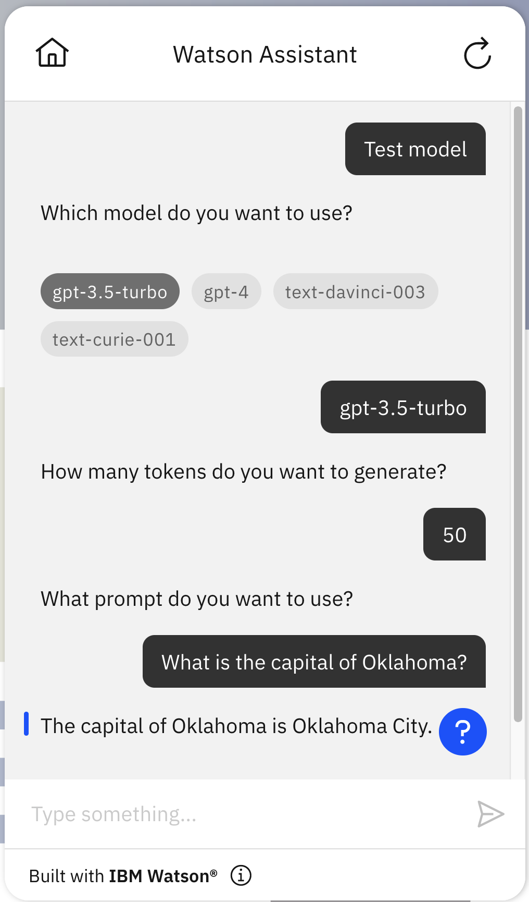

# OpenAI language model starter kit

OpenAI is an AI research and deployment company, which is best known for the [ChatGPT](https://openai.com/blog/chatgpt) conversational application.OpenAI provides an [API](https://platform.openai.com/docs/api-reference) for interacting with their generative language models. Azure OpenAI also provides an [API](https://learn.microsoft.com/en-us/azure/cognitive-services/openai/reference). You can use this starter kit to connect IBM watsonx Assistant to the [OpenAI API](#openai-starter-kit-set-up-instructions) directly, or with [Azure](#azure-openai-starter-kit-set-up-instructions).

This starter kit does not provide any examples of anything that you can _do_ with this extension. Instead, we have three general-purpose kits that show _use cases_ for generative language models, and we may add more in the future. The three use case starter kits we have now are:

- [language-model-comversational-search](../language-model-conversational-search/)
- [language-model-personalization](../language-model-personalization)
- [language-model-summarization](../language-model-summarization)

The OpenAPI specifications in this starter kit describe two endpoints, and a few of the most important of the configuration options that these endpoints provide.

| Endpoint               | Description                                                                                                                                                                                                                                                                                                                                                                                                                                                                                                                                                                                      |
| ---------------------- | ------------------------------------------------------------------------------------------------------------------------------------------------------------------------------------------------------------------------------------------------------------------------------------------------------------------------------------------------------------------------------------------------------------------------------------------------------------------------------------------------------------------------------------------------------------------------------------------------ |
| Create completion      | Used with the OpenAI text completion models such as `text-davinci-003` and `text-curie-001`. You provide text as a prompt and it returns the text that follows that prompt.                                                                                                                                                                                                                                                                                                                                                                                                                      |
| Create chat completion | Used with the OpenAI chat models such as `gpt-3.5-turbo` and `gpt-4`. You provide a chat transcript consisting of an optional system instruction and then a partial chat transcript. It then returns the next response in that chat. This starter kit uses this API in an extremely simple way. It doesn't send a system instruction. It sends a single text prompt to the model as a single user utterance to get a single response from the model. For more complex use cases, you might want to include multiple utterances in the API call to provide some additional context for a request. |

## OpenAI starter kit setup instructions

### Create an API key for OpenAI

1. Create an account with [OpenAI](https://openai.com/).
1. Manage your account to [create a new API Key](https://platform.openai.com/account/api-keys). Save this API key somewhere safe and accessible. You can't view it again in your OpenAI account. If you lose this secret key, you need to generate a new one.

### Create an assistant

This starter kit requires that you use the [new IBM watsonx Assistant](https://cloud.ibm.com/docs/watson-assistant?topic=watson-assistant-welcome-new-assistant).

Create a new, empty assistant that you can use to test this starter kit. For more information, see [Adding more assistants](https://cloud.ibm.com/docs/watson-assistant?topic=watson-assistant-assistant-add).

### Connect your assistant to OpenAI

Download the [OpenAPI specification](./openai-openapi.json) from this starter kit and use it to add a custom extension to your assistant as described below.

### Build and add a custom extension for OpenAI

1.  In your assistant, on the **Integrations** page, click **Build custom extension** and use the [OpenAPI specification file](./openai-openapi.json) to build a custom extension named `OpenAI`. For general instructions on building any custom extension, see [Building the custom extension](/docs/watson-assistant?topic=watson-assistant-build-custom-extension#building-the-custom-extension).

1.  After you build the OpenAI extension and it appears on your **Integrations** page, click **Add** to add it to your assistant. For general instructions on adding any custom extension, see [Adding an extension to your assistant](/docs/watson-assistant?topic=watson-assistant-add-custom-extension).

1.  In **Authentication**, choose **Bearer auth**. Copy and paste the OpenAI API key that you created in [this section](#create-an-api-key-for-openai) into the **Token** field.

For more information about the extension parameters, see the OpenAI API Reference:

- [Create completion](https://platform.openai.com/docs/api-reference/completions)
- [Create chat completion](https://platform.openai.com/docs/api-reference/chat)

If you need any capabilities that are in the documentation but not in the OpenAPI specification provided in this starter kit, feel free to add them to the OpenAPI specification. The specification in the kit is intended to be a simple example of how to get started, not a comprehensive encoding of everything that the API can do.

### Upload sample actions

Use **Actions Global Settings** to upload the [`openai-actions.json`](./openai-actions.json) file in this kit to your assistant. For more information, see [Uploading](https://cloud.ibm.com/docs/watson-assistant?topic=watson-assistant-admin-backup-restore#backup-restore-import). You may also need to refresh the action Preview chat after uploading in order to get all the session variables initialized before these actions will work correctly.

The starter kit [sample actions JSON file](./openai-actions.json) has these sample actions that are configured to use the OpenAI custom extension.

| Action                         | Description                                                                                                                                                |
| ------------------------------ | ---------------------------------------------------------------------------------------------------------------------------------------------------------- |
| Invoke GPT Chat Completion API | Connects to OpenAI with the `gpt-3.5-turbo` model, which provides a level of quality that is nearly as good as `text-davinci-003` at a much lower cost.    |
| Invoke GPT Completion API      | Connects to OpenAI with the `text-davinci-003` model, which is more expensive. For more information, see [OpenAI Pricing](https://openai.com/pricing).     |
| Test model                     | Simple test action that asks what model, prompt, and length you want and then calls either of the two actions above depending on which model you selected. |

Note that both of the "Invoke" actions include a step that invokes an extension and includes a parameter named `model`. You can set the `model_for_chat` session variable to control which model is used by `Invoke GPT Chat Completion API` and you can set the `model_for_completions` session variable to control which model is used by `Invoke GPT Completion API`. You can see which models work with the Chat Completion API and which models work with the Completion API on [OpenAI's model compatibility page](https://platform.openai.com/docs/models/model-endpoint-compatibility).

Here is an example of how to use the `Test model` action:

Note that one of the options in `Test model` is `gpt-4`, but at the time we are publishing this kit, that model is only available in accounts that have been selected for early access to this model, so this value will not work for other OpenAI accounts.

## Azure OpenAI starter kit setup instructions

### Create an API key for Azure OpenAI

1. Apply for access to [Azure OpenAI](https://learn.microsoft.com/en-us/azure/cognitive-services/openai/faq#how-do-i-get-access-to-azure-openai).
1. When you have onboarded to Azure OpenAI, you can find the API key in the "Keys & Endpoint" section for the resource in the Azure portal.

### Create an assistant

Follow [these instructions](#create-an-assistant) to create a new assistant.

### Connect your assistant to Azure OpenAI

Download the [Azure OpenAPI specification](./azure-openai-openapi.json) from this starter kit and use it to add a custom extension to your assistant as described below.

### Build and add a custom extension for Azure OpenAI

1.  In your assistant, on the **Integrations** page, click **Build custom extension** and use the [Azure OpenAPI specification file](./azure-openai-openapi.json) to build a custom extension named `Azure OpenAI`. For general instructions on building any custom extension, see [Building the custom extension](/docs/watson-assistant?topic=watson-assistant-build-custom-extension#building-the-custom-extension).

1.  After you build the Azure OpenAI extension and it appears on your **Integrations** page, click **Add** to add it to your assistant. For general instructions on adding any custom extension, see [Adding an extension to your assistant](/docs/watson-assistant?topic=watson-assistant-add-custom-extension).

1.  In **Authentication**, choose **API key auth**. Copy and paste the Azure OpenAI API key that you created [in this section](#create-an-api-key-for-azure-openai) into the **API key** field.
1.  Specify your server variables for a valid URL for requests. For example, to complete this url `https://{endpoint}/openai`, you add the name of your Azure OpenAI resource that you created have created with Azure OpenAI to complete this endpoint `{your-azure-resource-name}.openai.azure.com`.

If you need any capabilities that are in the documentation but not in the Azure OpenAPI specification provided in this starter kit, feel free to add them. The specification in the kit is intended to be a simple example of how to get started, not a comprehensive encoding of everything that the API can do.

For more information about the extension parameters, see the [Azure OpenAI API Reference](https://learn.microsoft.com/en-us/azure/cognitive-services/openai/reference).

### Upload sample actions

Use **Actions Global Settings** to upload the [`azure-openai-actions.json`](./azure-openai-actions.json) file in this kit to your assistant. For more information, see [Uploading](https://cloud.ibm.com/docs/watson-assistant?topic=watson-assistant-admin-backup-restore#backup-restore-import). You may need to refresh the action Preview chat after uploading in order to get all the session variables initialized before these actions will work correctly.

### Session variables

These are the session variables used in this example. Most of values are set in the process of setting up the starter kit so you do not need to set them yourself unless you want to make changes. You must, however, set the azure deployment id variables `azure_deployment_id_chat` and `azure_deployment_id_completions` to the respective values of the models that you have deployed with Azure OpenAI.

- `azure_api_version` The version of the Azure OpenAI api spec, defaults to `2023-03-15-preview`.
- `azure_deployment_id_chat` You **MUST** set this value to be the deployment id of the model (e.g., `my-gpt-3.5-turbo-deployment`) you deployed with Azure OpenAI for chat.
- `azure_deployment_id_completions` You **MUST** set this value to be the deployment id of the model (e.g., `my-text-davinci-003-deployment`) you deployed with Azure OpenAI.
- `messages` : Input to the OpenAI model; includes the `search_results` and the `model_prompt`.
- `model_for_chat` : The OpenAI model used, defaults to `gpt-3.5-turbo`.
- `model_for_completions` : The OpenAI model used for completions, defaults to `text-davinci-003`.
- `model_max_tokens` : The maximum number of text fragments to input to the model. The starter kit uses 200.
- `model_prompt`: You MAY change this to do prompt engineering, but a default will be used by the model if you don’t pass a prompt here.
- `model_response`: The text generated by the model in response to the `messages`.

The starter kit [sample actions JSON file](./azure-openai-actions.json) has these sample actions that are configured to use the Azure OpenAI custom extension.

| Action                         | Description                                                                                                                                                   |
| ------------------------------ | ------------------------------------------------------------------------------------------------------------------------------------------------------------- |
| Invoke GPT Chat Completion API | Connects to Azure OpenAI with the `gpt-3.5-turbo` model, which provides a level of quality that is nearly as good as `text-davinci-003` at a much lower cost. |
| Invoke GPT Completion API      | Connects to Azure OpenAI with the `text-davinci-003` model to complete a text prompt.                                                                         |
| Test model                     | Simple test action that asks what model, prompt, and length you want and then calls either of the two actions above depending on which model you selected.    |

Note that both of the "Invoke" actions include a step that invokes an extension and includes a parameter named `model`. You can set the `model_for_chat` session variable to control which model is used by `Invoke GPT Chat Completion API` and you can set the `model_for_completions` session variable to control which model is used by `Invoke GPT Completion API`. Whichever model(s) you select must have a corresponding deployment in your Azure OpenAI resource that you reference with the appropriate deployment id variables described above.

Here is an example of how to use the `Test model` action:

## Use at your own risk

You can get the actions to just respond to _anything_ a user says by updating "No action matches" (and optionally "Fallback") built-in actions in IBM watsonx Assistant to set `model_prompt` to `input.text`, call one of these actions, and then put the `model_response` in "Assistant says". With more work, you can even keep track of things the assistant and the user have said to each other and put them into the prompt too, ideally as separate entries in the `messages` list of the chat completion API as described in the [chat completion API documentation](https://platform.openai.com/docs/api-reference/chat) and [Azure OpenAI API Reference](https://learn.microsoft.com/en-us/azure/cognitive-services/openai/reference#chat-completions); the result would be something similar to the ChatGPT experience in which you would have an ongoing conversation with the model. This can be a fun thing to try out, but _we strongly recommend that you do not do this for any serious chatbot that you use to represent your enterprise_, since you would have no control over what it will say.
