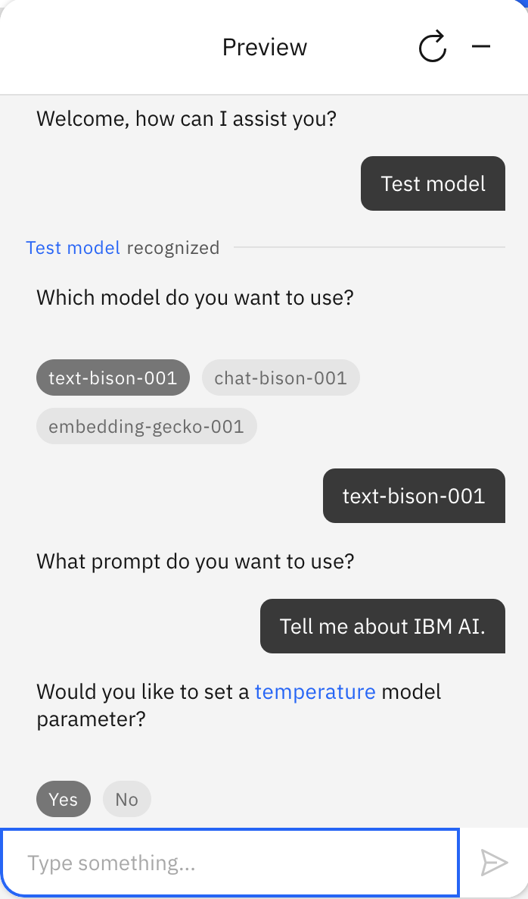
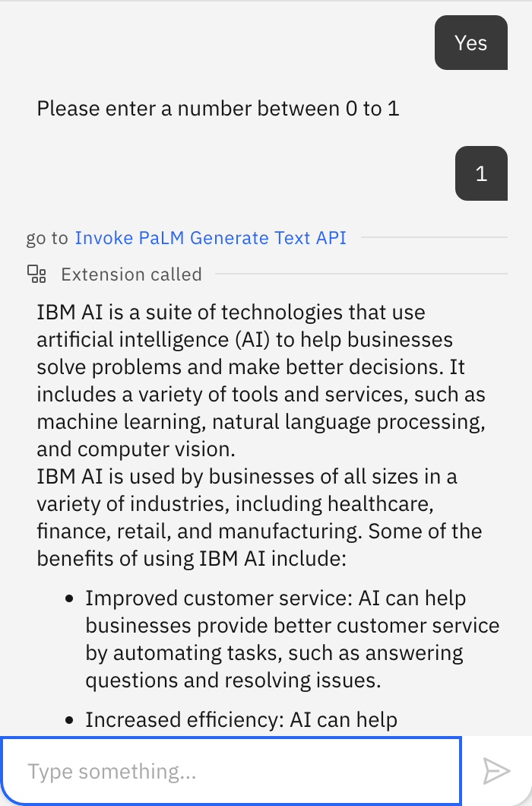
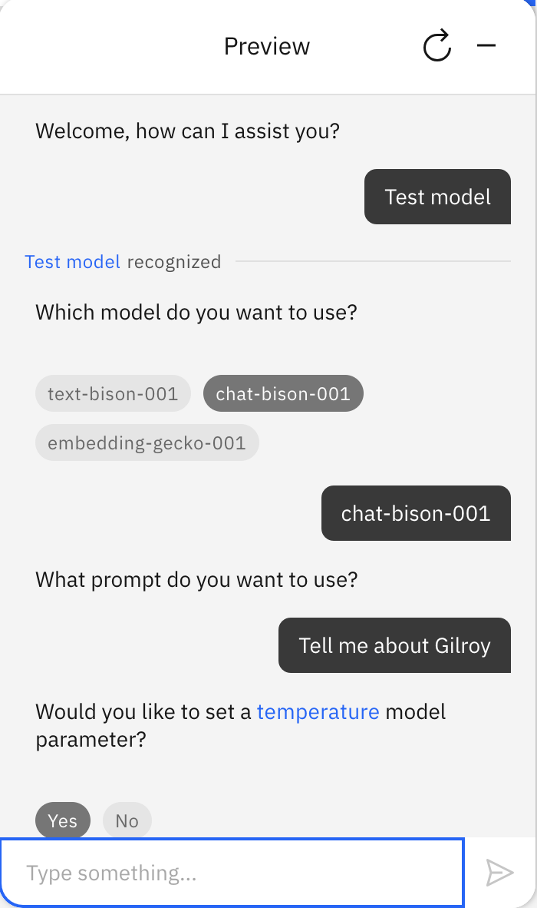
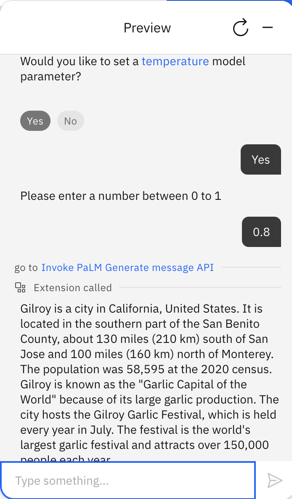
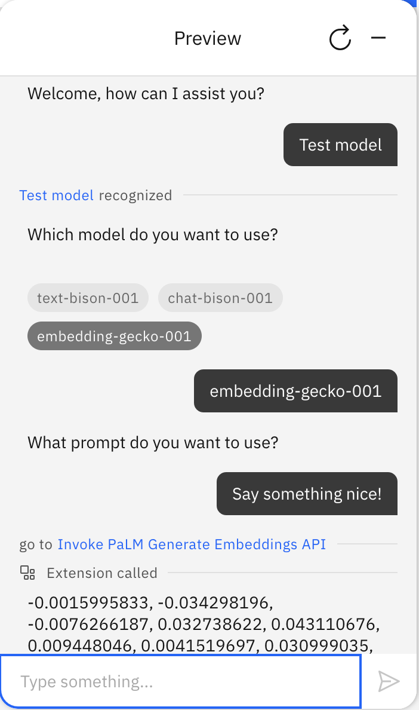

# Google PaLM (Powerful Language Model) starter kit

Google [PaLM](https://developers.generativeai.google/guide/palm_api_overview) is a language model developed by Google. It offers various capabilities for generating text, engaging in conversational interactions, and extracting text embeddings. This guide provides an example of how to use the PaLM API to integrate three specific models: text-bison-001, chat-bison-001, and embedding-gecko-001. The use of the PaLM API in this example was not made in partnership with, sponsorship with, or with endorsement from Google.

The OpenAPI specification in the starter kit describes three endpoints, and a few of the most important of the configuration options that these endpoints provide.

| Endpoint        | Description                                                                                                                                                                                                  |
| --------------- | ------------------------------------------------------------------------------------------------------------------------------------------------------------------------------------------------------------ |
| Text Generation | Used with the PaLM2 text generation model `text-bison-001`. A text generation model that takes a prompt as input and generates coherent text as output.                                                      |
| Chat            | Used with the PaLM2 chat model `chat-bison-001`. A chat model that engages in conversational interactions. It requires a chat transcript as input and provides a response based on the conversation history. |
| Embedding       | Used with the PaLM2 embedding model `embedding-gecko-001`. An embedding model that converts text into numerical vectors, allowing for semantic similarity calculations.                                      |

## Prerequisites

### Create an API key

1. Create an account with [PaLM API](https://developers.generativeai.google/products/palm).
1. [Get an API key](https://developers.generativeai.google/tutorials/setup) for accessing the Google PaLM API by joining a waitlist. Save this key securely, as it will be required for authentication during the integration process. If you lose the API key, generate a new one.

### Create an assistant

This starter kit requires that you use the [new Watson Assistant](https://cloud.ibm.com/docs/watson-assistant?topic=watson-assistant-welcome-new-assistant).

Create a new, empty assistant that you can use to test this starter kit. For more information, see [Adding more assistants](https://cloud.ibm.com/docs/watson-assistant?topic=watson-assistant-assistant-add).

## Connect your assistant to PaLM

You connect your assistant by using an OpenAPI specification to add a custom extension.

### Download the OpenAPI specification

Download the OpenAPI specification file from the extension starter kit: [palm2.openapi.json](./palm2-openapi.json).

You use this specification file to create and add the extension to your assistant.

### Build and add extension

1.  In your assistant, on the **Integrations** page, click **Build custom extension** and use the OpenAPI specification file to build a custom extension named `PaLMAPI`. For general instructions on building any custom extension, see [Building the custom extension](/docs/watson-assistant?topic=watson-assistant-build-custom-extension#building-the-custom-extension).

1.  After you build the PaLM extension and it appears on your **Integrations** page, click **Add** to add it to your assistant. For general instructions on adding any custom extension, see [Adding an extension to your assistant](/docs/watson-assistant?topic=watson-assistant-add-custom-extension).

1.  In **Authentication**, choose **API key auth**. Copy and paste your PaLM API key into the **API key** field.

For more information about the extension parameters, see the PaLM API Reference:

- [Generate text](https://developers.generativeai.google/guide/palm_api_overview#generate_text)
- [Generate message](https://developers.generativeai.google/guide/palm_api_overview#generate_message)
- [Generate embeddings](https://developers.generativeai.google/guide/palm_api_overview#generate_embeddings)

If you need any capabilities that are in the documentation but not in the OpenAPI specification that we provided, feel free to add them to the OpenAPI specification. The specification in the kit is intended to be a simple example of how to get started, not a comprehensive encoding of everything that the API can do.

## Upload sample actions

Use **Actions Global Settings** to upload the [`palm2-actions.json`](./palm2-actions.json) file in this kit to your assistant. For more information, see [Uploading](https://cloud.ibm.com/docs/watson-assistant?topic=watson-assistant-admin-backup-restore#backup-restore-import). You may also need to refresh the action Preview chat after uploading in order to get all the session variables initialized before these actions will work correctly.

The starter kit includes a JSON file with the following sample actions that are configured to use the PaLM extension.

| Action                              | Description                                                                                                                                                                                                |
| ----------------------------------- | ---------------------------------------------------------------------------------------------------------------------------------------------------------------------------------------------------------- |
| Invoke PaLM Generate Text API       | Connects to PaLM2 with the `text-bison-001` model.                                                                                                                                                         |
| Invoke PaLM Generate Embeddings API | Connects to PaLM2 with the `embedding-gecko-001` model.                                                                                                                                                    |
| Invoke PaLM Generate message API    | Connects to PaLM2 with the `chat-bison-001` model.                                                                                                                                                         |
| Test model                          | Simple test action that asks what model, prompt, and temperature (only in the case of Text API & message API ) you want and then calls the subsequent actions above depending on which model you selected. |

Here is an example of how to use the `Test model` action:

## Use at your own risk

You can get either of these actions to just respond to _anything_ a user says by updating "No action matches" (and optionally "Fallback") built-in actions in Watson Assistant to set `model_prompt` to `input.text`, call one of these actions, and then put the `model_response` in "Assistant says". With more work, you can even keep track of things the assistant and the user have said to each other and put them into the prompt too; the result would be something similar to the PaLM experience in which you would have an ongoing conversation with the model. This can be a fun thing to try out, but _we strongly recommend that you do not do this for any serious chatbot that you use to represent your enterprise_, since you would have no control over what it will say.

For detailed information about the Google PaLM API and its capabilities, refer to the official documentation: [Google PaLM API Documentation](https://developers.generativeai.google/guide/palm_api_overview)
