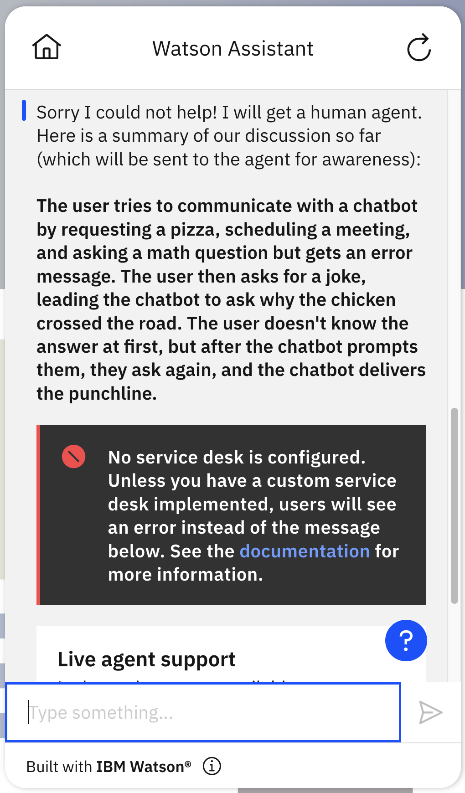

# Language Model Summarization starter kit

This starter kit uses a generative language model to collect and summarize a customer's answers.  It sends the summary to a customer service agent when the assistant escalates to an agent.  This can enable a customer service agent who enters a chat session to have an overview of what has been said in the chat so far without having to read an entire transcript.

## Prerequisites

This starter kit requires that you use the [new Watson Assistant](https://cloud.ibm.com/docs/watson-assistant?topic=watson-assistant-welcome-new-assistant).

Create a new, empty assistant that you can use to test this starter kit. For more information, see [Adding more assistants](https://cloud.ibm.com/docs/watson-assistant?topic=watson-assistant-assistant-add).

## Connect your assistant to a language model using a custom extension

You connect your assistant by using an OpenAPI specification to add a custom extension. You can see an example of how to do this in the [OpenAI starter kit](../language-model-openai), which shows how to connect to OpenAI models like GPT 3.5 and 4. However, you can also do the same thing with any other generative language model that has a REST API using the same approach. For details on how to use an alternative language model, see below.

## Upload sample actions

Use **Actions Global Settings** to upload the `Transcript-Summary-Using-LLMs-action.json` file in this kit to your assistant. For more information, see [Uploading](https://cloud.ibm.com/docs/watson-assistant?topic=watson-assistant-admin-backup-restore#backup-restore-import).  You may also need to refresh the action Preview chat after uploading in order to get all the session variables initialized before these actions will work correctly.

The starter kit includes a JSON file with these sample actions:

| Action | Description |
| --- | --- |
| Invoke GPT Chat Completion API | Connects to OpenAI with the `gpt-3.5-turbo` model, which provides a level of quality that is nearly as good as `text-davinci-003` at a much lower cost. |
| Invoke GPT Completion API | Connects to OpenAI with the `text-davinci-003` model. For more information, see [OpenAI Pricing](https://openai.com/pricing). |
| Tell a joke | Simple action to test the conversation and call the *Record context* action |
| Record context | Uses a variable that collects the session history of the conversation. |
| Escalate to Agent | Simple example of how OpenAI can be used to provide a summary of a customer conversation. Connects to OpenAI using the `Invoke GPT Chat Completion API` action and shows the summary to the user.  It also triggers an escalation to a customer service agent with the summary in the message sent to the agent. |
| Tell a joke without recording context | Simple action without any context recording. Included as a comparison to the *Tell a joke* action. |

To use the sample actions:

1. Download the sample actions from this starter kit: [Transcript-Summary-Using-LLMs-action.json](./Transcript-Summary-Using-LLMs-action.json).

1. Use **Actions Global Settings** to upload the JSON file to your assistant. For more information, see [Uploading](https://cloud.ibm.com/docs/watson-assistant?topic=watson-assistant-admin-backup-restore#backup-restore-import).

## Preview the sample actions

To preview the sample actions, you'll use the Tell a joke action to simulate a conversation, then ask to escalate to an agent to see a summary provided by OpenAI.

1. On the **Actions** page, click **Preview**.

1. Enter `Tell a joke`. The assistant says `Why did the chicken cross the road?`.

1. Enter something silly, such as `I like chicken salad`. The assistant answers `If you want to get the answer, you need to ask "why"!` and tells the joke again. Wait to use the word `why` until later.

1. Enter something unrelated, such as `I want to close my bank account`.

1. Enter something funny, such as `It was the path to freedom`.

1. To complete the conversation, enter something like `Tell me why`. The assistant says `To get to the other side!` and the action ends.

1. To see the summary, enter `human agent`. This causes Watson Assistant to invoke the `Fallback` action, which is configured to call the `Escalate to Agent` action.  This then triggers the `Invoke GPT Chat Completion API` action and shows the response that is returned.

An example response might look something like this: `The user asked the chatbot to tell a joke. The chatbot asked "Why did the chicken cross the road?" but the user talked about liking chicken salad instead. The chatbot repeated the joke question and the user asked to close their bank account. The chatbot kept asking the same question until finally revealing the classic punchline - the chicken crossed the road to get to the other side.`

1. After showing the summary to the user, it then initiates a transfer to a human agent. Unless you have configured a contact center, this will not work, but it is included in the kit to show how it would be invoked if you did have one configured.  See details in the next section.

## Technical Details

You can see how session history recording is enabled by contrasting the `Tell a joke` action with the `Tell a joke without recording context` action.  The assistant in the starter kit also has session history recording in the "No action matches" action (in the "Set by assistant" section of the actions list).  As you can see in the examples, you can enable this behavior in your own actions by applying the following changes:

1. Add the `Record context` action to your assistant by copying the one in the kit.
2. At each step in each action that you want to record:
  - Set the `query_text` session variable to the text that the user says to the assistant (or empty string if there is no user input at that step)
  - Set the `response` session variable to the the text that the assistant says to the user (or empty string if there is no assistant output at that step) -- you can then use that session variable in the "Assistant says" portion of the step so you are not repeating the same text twice.
  - In the "And then" portion of the step, go to the `Record context` action and then continue after that action completes.
  - If your existing step had something other than continuing to the next step in the "And then" portion, add a _new_ step that just does that additional "And then" behavior.  For example, step 3 in `Tell a joke without recording context` says "If you want to get the answer, you need to ask 'why'!" and then goes back to step 1.  When this is converted into `Tell a joke`, it gets split into two steps: the first says the same thing and records the context and the second goes back to step 1.

Recording the context at each step of each action can be extremely tedious for a complex assistant with many actions.  In the future, Watson Assistant might add a feature that collects the history in a session variable automatically.  If it does, we will update the kit, and it will be much simpler and easier to use.

Once the context is recorded, we've configured the human agent escalation process to use the language model to summarize the session and present the summary to both the user and the human agent.  You can see that the model response is sent to the agent by going to step 3 of the `Escalate to Agent` action and clicking on "Edit settings" in the "Connect to agent" block at the bottom of the step.  You should see this:

As you can see, the "Message to agent" field is set to the `model_response`, i.e., the summary that the language model generated.

In the starter kit, this is not configured to a real contact center, so no actual human agent is contacted.  See [Adding contact center support](https://cloud.ibm.com/docs/watson-assistant?topic=watson-assistant-deploy-web-chat-haa) in the Watson Assistant documentation for details on how to connect to a real contact center.  Here is what the output looks like in the Preview page of Watson Assistant (including the error message because no contact center has been configured):

