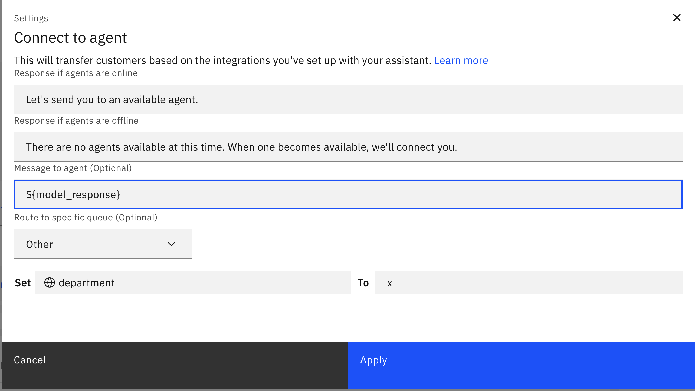
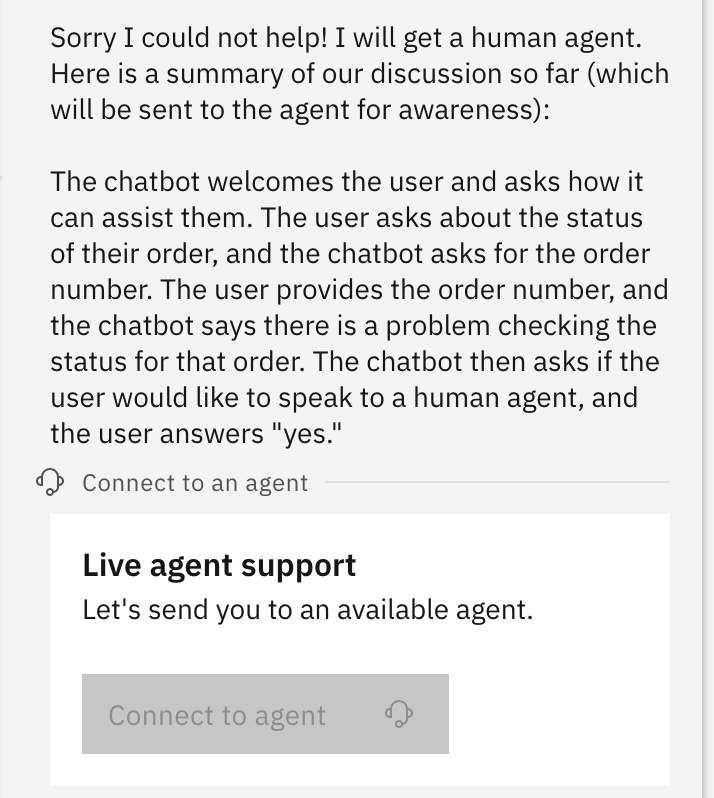

# Language Model Summarization starter kit

This starter kit uses a generative language model to summarize the interaction between an assistant and a user via the Watson Assistant [session_history variable](https://cloud.ibm.com/docs/watson-assistant?topic=watson-assistant-publish-overview#publish-overview-environment-settings-session-history). The assistant includes the AI-generated summary when it escalates to a human agent. A summary of session history can enable a customer service agent who enters a chat session to have an overview of what has been said in the chat so far without having to read an entire transcript.

This starter kit includes examples of how to configure different language models with Watson Assistant for summarization.

1. The first example shows how to use [watsonx for summarization](#example-1-watsonx)
1. The second example shows how to use [OpenAI for summarization](#example-2-openai)

## Prerequisites

This starter kit requires that you use the [new Watson Assistant](https://cloud.ibm.com/docs/watson-assistant?topic=watson-assistant-welcome-new-assistant).

Create a new, empty assistant that you can use to test this starter kit. For more information, see [Adding more assistants](https://cloud.ibm.com/docs/watson-assistant?topic=watson-assistant-assistant-add).

# Example 1: watsonx

### Connect your assistant to watsonx using a custom extension

You connect your assistant by using an OpenAPI specification to add a custom extension. You can see an example of how to do this in the [watsonx starter kit](../language-model-watsonx/README.md), which shows how to connect to watsonx models such as `google/flan-ul2`.

### Upload sample actions

Use **Actions Global Settings** to upload the [summarization-watsonx-actions.json](summarization-watsonx-actions.json) file in this kit to your assistant. For more information, see [Uploading](https://cloud.ibm.com/docs/watson-assistant?topic=watson-assistant-admin-backup-restore#backup-restore-import). You may also need to refresh the action Preview chat after uploading in order to get all the session variables initialized before these actions will work correctly.

The starter kit includes a JSON file with these sample actions:

| Action                        | Description                                                                                                                                                                                                                                                                                                                                                               |
| ----------------------------- | ------------------------------------------------------------------------------------------------------------------------------------------------------------------------------------------------------------------------------------------------------------------------------------------------------------------------------------------------------------------------- |
| Check order status            | Simple action to check the status of a customer order.                                                                                                                                                                                                                                                                                                                    |
| Escalate to Agent             | Simple example of how watsonx can be used to provide a summary of a customer conversation. Connects to watsonx using the `Invoke watsonx Generation API` action to summarize the session history and then shows the summary to the user. It triggers an escalation to a customer service agent and includes the session history summary in the message sent to the agent. |
| Invoke watsonx Generation API | Connects to watsonx with the `google/flan-ul2` model.                                                                                                                                                                                                                                                                                                                     |

### Session variables

Below is a list of the session variables used in this example. Most of them are automatically set with defaults in the sample actions JSON file that you uploaded, so you do not need to set them yourself unless you want to make changes. You **must**, however, set the `watsonx_project_id` to the watsonx project id that you want to use for answer generation.

- `model_id`: The ID of the watsonx model that you select for this action. Defaults to `google/flan-ul2`.
- `model_input`: The input to the model.
- `model_parameters_min_new_tokens`: The minimum number of the new tokens to be generated. Defaults to 20.
- `model_parameters_max_new_tokens` : The maximum number of new tokens to be generated. Defaults to 300.
- `model_parameters_repetition_penalty`: Represents the penalty for penalizing tokens that have already been generated or belong to the context. The range is 1.0 to 2.0 and defaults to 1.1.
- `model_parameters_stop_sequences`: Stop sequences are one or more strings which will cause the text generation to stop if/when they are produced as part of the output. Stop sequences encountered prior to the minimum number of tokens being generated will be ignored. The list may contain up to 6 strings. Defaults to ["\n\n"]
- `model_parameters_temperature` : The value used to control the next token probabilities. The range is from 0.05 to 1.00; 0 makes it _mostly_ deterministic.
- `model_response`: The text generated by the model in response to the `model_input`.
- `session_history_ai_format`: The session history variable formatted for the ai model.
- `verbose`: Boolean variable that when `true` prints debug output from the assistant. Defaults to `false`.
- `watsonx_api_version` - watsonx api date version. It currently defaults to `2023-05-29`.
- `watsonx_project_id`: You **MUST** set this value to your own [project ID value from watsonx](https://dataplatform.cloud.ibm.com/docs/content/wsj/manage-data/manage-projects.html). Typically, this is a [sandbox project id](https://dataplatform.cloud.ibm.com/docs/content/wsj/manage-data/sandbox.html) that is automatically created for you when you sign up for watsonx.ai.

### Preview the sample actions

To preview the sample actions, use the `Check order status` action to start a conversation regarding the user's order. The assistant will then escalate to an agent together with a summary provided by the generative language model.

1. On the **Actions** page, click **Preview**.

1. Enter `Check order status`.

1. Enter an order number when prompted by the assistant.

1. The assistant will report that there is a problem checking the order status and ask if it's ok to escalate to a human agent.

1. If the user response is yes, the system escalates to a human agent with a summary of the interaction. An example summary might look something like this:
   `The user asks about the status of their order. The chatbot asks for the order number. The user provides the order number, but the chatbot tells them there is a problem checking the status. The chatbot offers to escalate the issue to a human agent and asks if the user wants to do this. The user agrees to escalate the issue.`

1. The assistant shows the summary to the user and then initiates a transfer to a human agent. Unless you have configured a contact center, this will not work, but it is included in the kit to show how it would be invoked if you did have one configured. See details in the next section.

1. If the user declines to escalate to an agent, the transaction ends.

#### Troubleshooting

Tips if the sample actions do not work as described:

1. Make sure you have set the value of your `watsonx_project_id` as described [above](#session-variables).
1. Refresh the preview

## Example 2: OpenAI

### Connect your assistant to OpenAI using a custom extension

You connect your assistant by using an OpenAPI specification to add a custom extension. You can see an example of how to do this in the [OpenAI starter kit](../language-model-openai/README.md), which shows how to connect to OpenAI models like GPT 3.5 and 4.

### Upload sample actions

Use **Actions Global Settings** to upload the [summarization-openai-actions.json](summarization-openai-actions.json) file in this kit to your assistant. For more information, see [Uploading](https://cloud.ibm.com/docs/watson-assistant?topic=watson-assistant-admin-backup-restore#backup-restore-import). You may also need to refresh the action Preview chat after uploading in order to get all the session variables initialized before these actions will work correctly.

The starter kit includes a JSON file with these sample actions:

| Action                                      | Description                                                                                                                                                                                                                                                                                                                                                   |
| ------------------------------------------- | ------------------------------------------------------------------------------------------------------------------------------------------------------------------------------------------------------------------------------------------------------------------------------------------------------------------------------------------------------------- |
| Check order status                          | Simple action to check the status of a customer order.                                                                                                                                                                                                                                                                                                        |
| Escalate to Agent                           | Simple example of how OpenAI can be used to provide a summary of a customer conversation. Connects to OpenAI using the `Invoke GPT Chat Completion API` action to summarize the session history and then shows the summary to the user. It also triggers an escalation to a customer service agent and includes the summary in the message sent to the agent. |
| Invoke GPT Chat Completion API with history | Connects to OpenAI with the `gpt-3.5-turbo` model.                                                                                                                                                                                                                                                                                                            |

### Session variables

Below is a list of the session variables used in this example. They are automatically set with defaults in the sample actions JSON file that you uploaded, so you do not need to set them yourself unless you want to make changes.

- `messages` : Input to the OpenAI model; includes the `search_results` and the `model_prompt`.
- `model_for_chat` : The OpenAI model used, defaults to `gpt-3.5-turbo`.
- `model_max_tokens` : The maximum number of text fragments to input to the model. The starter kit uses 200.
- `model_prompt`: You MAY change this to do prompt engineering, but a default will be used by the model if you don’t pass a prompt here.
- `model_response`: The text generated by the model in response to the `messages`.
- `verbose`: Boolean variable that when `true` prints debug output from the assistant. Defaults to `false`.

### Preview the sample actions

The steps to preview the sample actions with OpenAI are the same as the [watsonx use case](#preview-the-sample-actions).

## Technical Details

The interaction between the assistant and the user is recorded in the [session_history_variable](https://cloud.ibm.com/docs/watson-assistant?topic=watson-assistant-publish-overview#publish-overview-environment-settings-session-history). This is an example of the session history for the check order status use case: `[{"a":"Welcome, how can I assist you?"},{"u":"order status","n":true},{"a":"To get started, please enter your order number"},{"u":"1234"},{"a":"Thanks! There is a problem checking the status for your order 1234\n\n
\n\n\n\nWould you like me to escalate to an agent?\noption: ["Yes","No"]"},{"u":"Yes"}]`.

This use case has configured the human agent escalation process to use a language model to summarize the session and present the summary to both the user and the human agent. You can see that the model response is sent to the agent by going to step 3 of the `Escalate to Agent` action and clicking on "Edit settings" in the "Connect to agent" block at the bottom of the step. You should see this:

As you can see, the "Message to agent" field is set to the `model_response`, i.e., the summary that the language model generated.

In the starter kit, this is not configured to a real contact center, so no actual human agent is contacted. See [Adding contact center support](https://cloud.ibm.com/docs/watson-assistant?topic=watson-assistant-deploy-web-chat-haa) in the Watson Assistant documentation for details on how to connect to a real contact center.

Here is what the output looks like in the Preview page of Watson Assistant (including the error message because no contact center has been configured):

