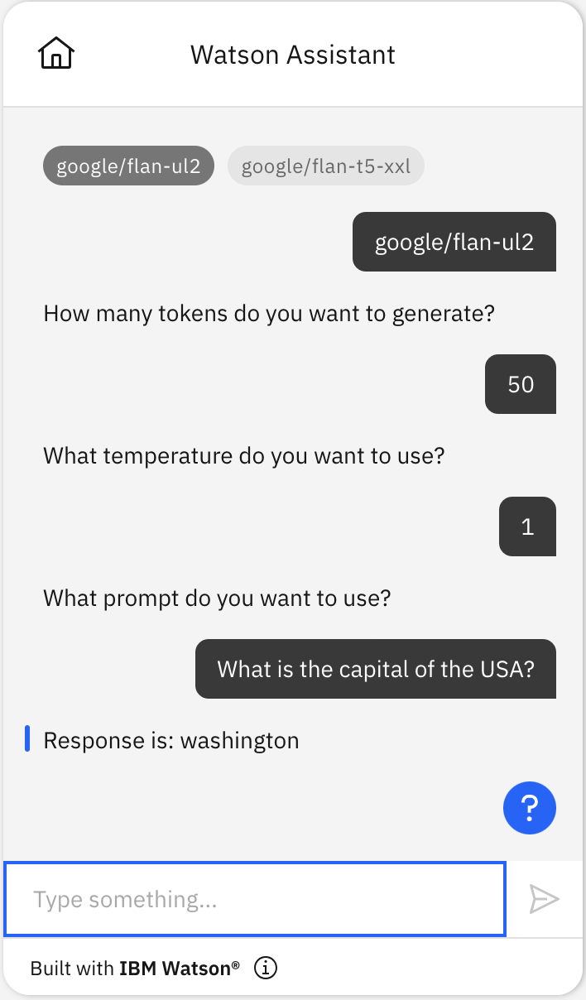

# IBM watsonx tech preview language model starter kit

> ⛔️
> **Warning: Deprecated**

- **`watsonx tech preview` will be deprecated in the near future and this starter kit will be removed.**
- **To use IBM `watsonx`, see [the watsonx starter kit](../language-model-watsonx/)**

> ⛔️
> **Warning: Deprecated**

Watsonx is our upcoming enterprise-ready AI and data platform designed to multiply the impact of AI across your business. It provides an [API](https://bam.res.ibm.com/docs/api-reference) for interacting with their generative language models. You can use this starter kit to connect IBM watsonx Assistant to the watsonx API.

This starter kit does not provide any examples of anything that you can _do_ with this extension. Instead, we have one general-purpose kit that shows a _use case_ for generative language models, and we may add more in the future. The use case starter kit we have now is:

- [language-model-conversational-search](../language-model-conversational-search)

The watsonx tech preview specification in the starter kit describes one endpoint, and a few of the most important of the configuration options that this endpoint provides.

| Endpoint | Description                                                                                                                                                                     |
| -------- | ------------------------------------------------------------------------------------------------------------------------------------------------------------------------------- |
| Generate | Used with the watsonx text completion models such as `google/flan-ul2` and `google/flan-t5-xxl`. You provide text as a prompt and it returns the text that follows that prompt. |

## Prerequisites

### Create an API key

1. Join the waitlist in the [watsonx page](https://www.ibm.com/watsonx).
1. Log into the [watsonx workbench](https://workbench.res.ibm.com/) and copy the API key. Save this API key somewhere safe and accessible.

### Create an assistant

This starter kit requires that you use the [new IBM watsonx Assistant](https://cloud.ibm.com/docs/watson-assistant?topic=watson-assistant-welcome-new-assistant).

Create a new, empty assistant that you can use to test this starter kit. For more information, see [Adding more assistants](https://cloud.ibm.com/docs/watson-assistant?topic=watson-assistant-assistant-add).

## Connect your assistant to watsonx

You connect your assistant by using a watsonx specification to add a custom extension.

### Download the watsonx tech preview specification

Download the watsonx specification file from the extension starter kit: [watsonx.ai.tech.preview.openapi.json](./watsonx.ai.tech.preview.openapi.json).

You use this specification file to create and add the extension to your assistant.

### Build and add extension

1.  In your assistant, on the **Integrations** page, click **Build custom extension** and use the watsonx specification file to build a custom extension named `watsonx`. For general instructions on building any custom extension, see [Building the custom extension](https://cloud.ibm.com/docs/watson-assistant?topic=watson-assistant-build-custom-extension#building-the-custom-extension).

1.  After you build the watsonx extension and it appears on your **Integrations** page, click **Add** to add it to your assistant. For general instructions on adding any custom extension, see [Adding an extension to your assistant](https://cloud.ibm.com/docs/watson-assistant?topic=watson-assistant-add-custom-extension).

1.  In **Authentication**, choose **Bearer auth**. Copy and paste your watsonx API key into the **Token** field.

For more information about the extension parameters, see the watsonx API Reference:

- [Generate](https://bam.res.ibm.com/docs/api-reference#generate)

If you need any capabilities that are in the documentation but not in the watsonx tech preview specification that we provided, feel free to add them to the watsonx specification. The specification in the kit is intended to be a simple example of how to get started, not a comprehensive encoding of everything that API can do.

## Upload sample action

Use **Actions Global Settings** to upload the [`watsonx-tech-preview-Extension-action.json`](watsonx-tech-preview-Extension-action.json) file in this kit to your assistant. For more information, see [Uploading](https://cloud.ibm.com/docs/watson-assistant?topic=watson-assistant-admin-backup-restore#backup-restore-import). You may also need to refresh the action Preview chat after uploading in order to get all the session variables initialized before these actions will work correctly.

The starter kit includes a JSON file with a sample action that is configured to use the watsonx extension.

| Action     | Description                                                                                                                                                                 |
| ---------- | --------------------------------------------------------------------------------------------------------------------------------------------------------------------------- |
| Test model | Simple test action that asks what model, prompt, temperature and length you want and then calls the extension so the model can generate a response to the specified prompt. |

Note that the "Test model" action includes a step that invokes an extension and includes a parameter named `model_id`. You can set the `model_id` session variable to control which model is used by `Test model`. You can see which models work with the Generate API on [the model compatibility page of the watsonx tech preview API](https://bam.res.ibm.com/docs/models).

Here is an example of how to use the `Test model` action:

