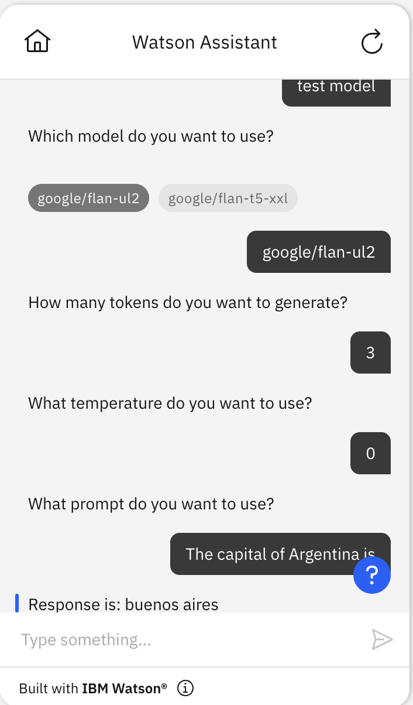

# IBM watsonx language model starter kit

watsonx is our enterprise-ready AI and data platform designed to multiply the impact of AI across your business. It provides an API for interacting with generative language models. You can use this starter kit to connect IBM Watson Assistant to the watsonx API.

## Example use cases with the watsonx custom extension

- [Complex informational tasks: Use watsonx to generate natural language answers for specific topics with only a small amount of relevant text](../language-model-complex-informational-tasks/README.md)
- [Conversational Search: Use watsonx to answer natural language queries for document search](../language-model-conversational-search/README.md)
- [Summarization: Use watsonx to summarize conversational interaction](../language-model-summarization/README.md)

The watsonx specification in the starter kit describes one endpoint and a few of the most important of the configuration options that this endpoint provides.

| Endpoint   | Description                                                                                                                                                                  |
| ---------- | ---------------------------------------------------------------------------------------------------------------------------------------------------------------------------- |
| Generation | Used with watsonx text completion models such as `google/flan-ul2` and `google/flan-t5-xxl`. You provide text as a prompt, and it returns the text that follows that prompt. |

## Prerequisites

### Create an API key and a project ID

1. Log in to [watsonx](https://dataplatform.cloud.ibm.com/wx/home?context=wx&apps=cos&nocache=true&onboarding=true&quick_start_target=watsonx) and [generate an API key](https://dataplatform.cloud.ibm.com/docs/content/wsj/analyze-data/ml-authentication.html?context=cpdaas). Save this API key somewhere safe and accessible. You need this API key to set up the watsonx custom extension later.
1. To find your watsonx project id, go to [watsonx.ai](https://dataplatform.test.cloud.ibm.com/wx) and find Projects/<project-name> (this could be your `sandbox`, which is created for you by default). Click on the <project-name> link, then follow the Project's Manage tab (Project -> Manage -> General -> Details) to find the project id.

### Create an assistant

This starter kit requires that you use the [new IBM watsonx Assistant](https://cloud.ibm.com/docs/watson-assistant?topic=watson-assistant-welcome-new-assistant).

Create a new, empty assistant that you can use to test this starter kit. For more information, see [Adding more assistants](https://cloud.ibm.com/docs/watson-assistant?topic=watson-assistant-assistant-add).

## Connect your assistant to watsonx

You connect your assistant by using a watsonx specification to add a custom extension.

### Download the watsonx specification

Download the watsonx specification file from the extension starter kit: [watsonx-openapi.json](./watsonx-openapi.json).

Use this specification file to create and add the extension to your assistant.

### Build and add extension

1.  In your assistant, on the **Integrations** page, click **Build custom extension** and use the watsonx specification file to build a custom extension named `watsonx`. For general instructions on building any custom extension, see [Building the custom extension](https://cloud.ibm.com/docs/watson-assistant?topic=watson-assistant-build-custom-extension#building-the-custom-extension).

1.  After you build the watsonx extension, and it appears on your **Integrations** page, click **Add** to add it to your assistant. For general instructions on adding any custom extension, see [Adding an extension to your assistant](https://cloud.ibm.com/docs/watson-assistant?topic=watson-assistant-add-custom-extension).

1.  In **Authentication**, choose **OAuth 2.0**. Select **Custom apikey** as the grant type in the next dropdown, and then copy and paste your [API key](#create-an-api-key-and-a-project-id) you saved earlier into the **Apikey** field.

1.  In **Servers**, choose the region from which you would like to access the watsonx.ai service. `us-south` is selected as the default region. 

If you need capabilities that are not in the watsonx specification provided, feel free to add them to the watsonx openapi specification. The specification in the kit is intended to be an example of how to get started, not a comprehensive encoding of everything that the API can do.

## Upload sample action

Use **Actions Global Settings** to upload the [`watsonx-actions.json`](./watsonx-actions.json) file in this kit to your assistant. For more information, see [Uploading](https://cloud.ibm.com/docs/watson-assistant?topic=watson-assistant-admin-backup-restore#backup-restore-import). You may also need to refresh the action Preview chat, after uploading, to get all the session variables initialized before these actions will work correctly.

1. Under Variables/Created by you within the Actions page, set the `watsonx_project_id` session variable using [a project ID value from watsonx](https://dataplatform.cloud.ibm.com/docs/content/wsj/manage-data/manage-projects.html?context=wx&audience=wdp). See [this section](#create-an-api-key-and-a-project-id) for additional details on how to find your project ID.

**NOTE**: If you import the actions _before_ configuring the extensions, you will see errors on the actions because it could not find the extensions. Configure the extensions (as described [above](#prerequisites)), and re-import the action JSON file.

The starter kit includes [a JSON file with sample actions](./watsonx-actions.json) that are configured to use the watsonx extension.

| Action                        | Description                                                                                                                                                                                   |
| ----------------------------- | --------------------------------------------------------------------------------------------------------------------------------------------------------------------------------------------- |
| Invoke watsonx Generation API | Connects to watson.ai with the selected model and the model input |
| Invoke watsonx Generation Stream API | Connects to watsonx.ai with the selected model and model input and streams the response back to the user. |
| Test model                    | Simple test action that asks what model, length, temperature, prompt you want, asks if you want to stream the response and then calls "Invoke watsonx Generation API" or "Invoke watsonx Generation Stream API" based on if streaming was required so the model can generate a response to the specified prompt. |
| No Action Matches | This is created by watsonx Assistant, but for this starter kit it is configured to trigger the "Invoke watsonx Generation Stream API" as a sub-action using the defaults and the user input. |

Note that the "Test model" action includes a step that invokes an extension and includes a parameter named `model_id`. You can set the `model_id` session variable to control which model is used by `Test model`. You can see which models work with the Generate API by viewing the supported foundation models in [the watsonx Prompt Lab](https://dataplatform.cloud.ibm.com/docs/content/wsj/analyze-data/fm-prompt-lab.html?context=wx).

### Session variables

These are the session variables used in this example.

- `model_id`: The ID of the watsonx model that you select for this action. Defaults to `ibm/granite-13b-chat-v2`.
- `model_input`: The input to the model.
- `model_parameters_max_new_tokens` : The maximum number of new tokens to be generated. Defaults to 256.
- `model_parameters_min_new_tokens`: The minimum number of the new tokens to be generated. Defaults to 1.
- `model_parameters_temperature` : The value used to control the next token probabilities. The range is from 0.05 to 1.00; 0 makes it _mostly_ deterministic.
- `model_parameters_repetition_penalty`: Represents the penalty for penalizing tokens that have already been generated or belong to the context. The range is 1.0 to 2.0 and defaults to 1.1.
- `model_parameters_stop_sequences`: Stop sequences are one or more strings which will cause the text generation to stop if/when they are produced as part of the output. Stop sequences encountered prior to the minimum number of tokens being generated will be ignored. The list may contain up to 6 strings. Defaults to ["\n\n"]
- `model_parameters_decoding_method`: The strategy used for picking the tokens during generation of the output text.
- `model_parameters_include_stop_sequence`: The value to control presence of matched stop sequences from the end of the output text.
- `model_parameters_random_seed`: A random number generator seed to use in sampling mode for experimental repeatability.
- `model_parameters_time_limit`: The amount of time in milliseconds to wait before stopping generation.
- `model_parameters_top_k`: The number of highest probability vocabulary tokens to keep for top-k-filtering.
- `model_parameters_top_p`: Similar to top_k except the candidates to generate the next token are the most likely tokens with probabilities that add up to at least top_p.
- `model_response`: The text generated by the model in response to the user input.
- `watsonx_api_version` - watsonx api date version. It currently defaults to `2023-05-29`.
- `watsonx_project_id`: You **MUST** set this value to be [a project ID value from watsonx](https://dataplatform.cloud.ibm.com/docs/content/wsj/manage-data/manage-projects.html). By default, this is a [sandbox project id](https://dataplatform.cloud.ibm.com/docs/content/wsj/manage-data/sandbox.html) that is automatically created for you when you sign up for watsonx.ai.

Here is an example of how to use the `Test model` action:

### Limitations

Adding large values for max_new_tokens & min_new_tokens can result in timeouts, if you see any timeouts please adjust the values of those tokens.
