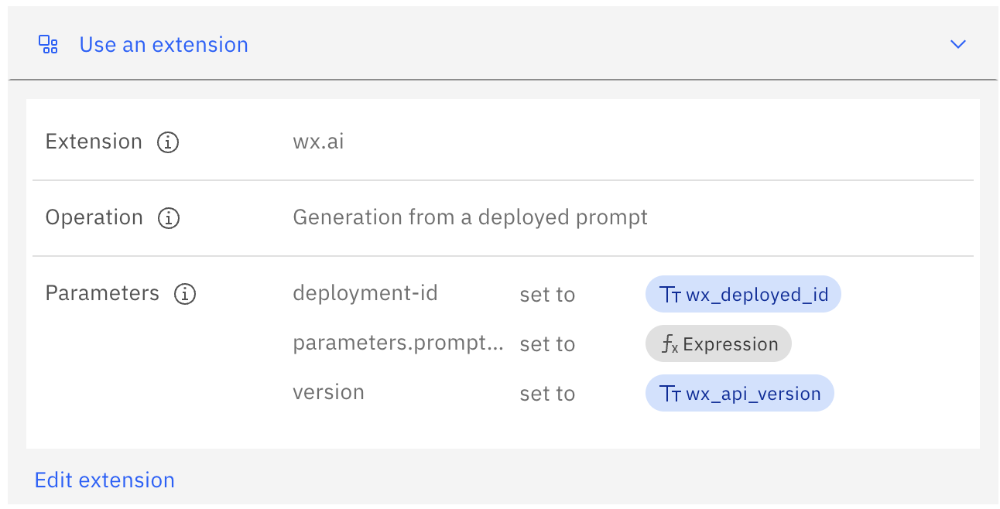
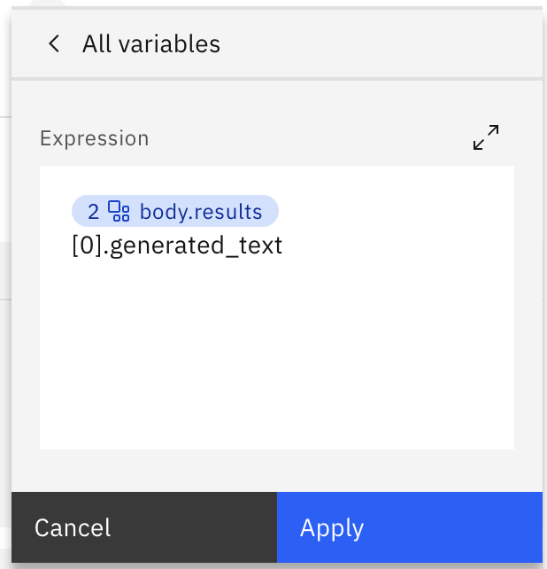
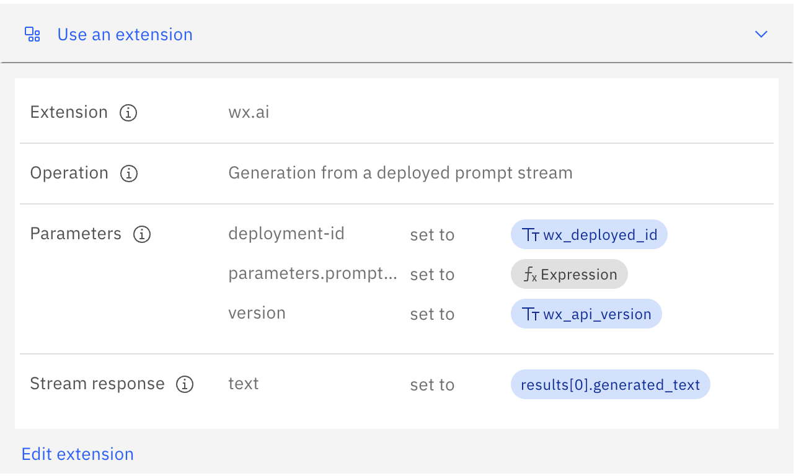
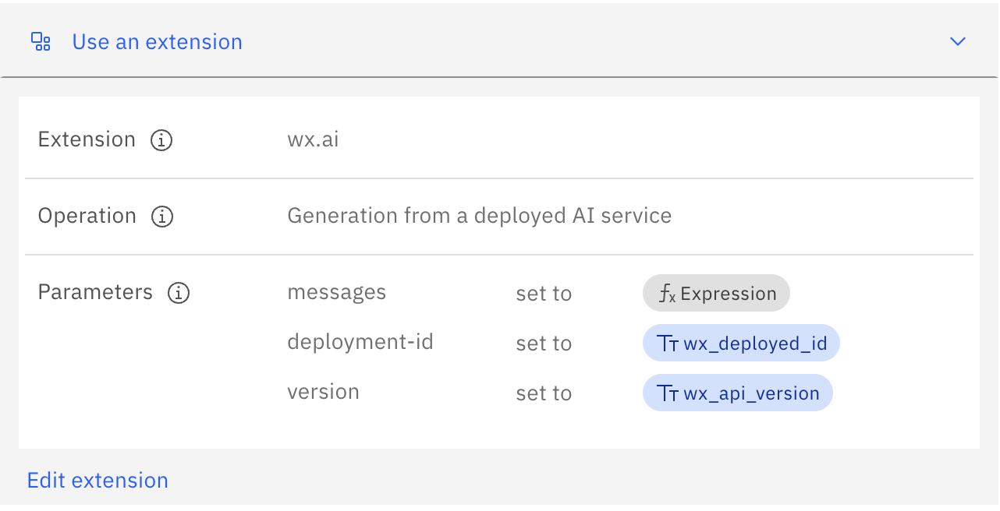
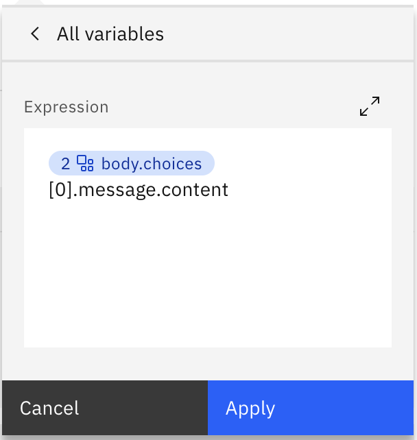
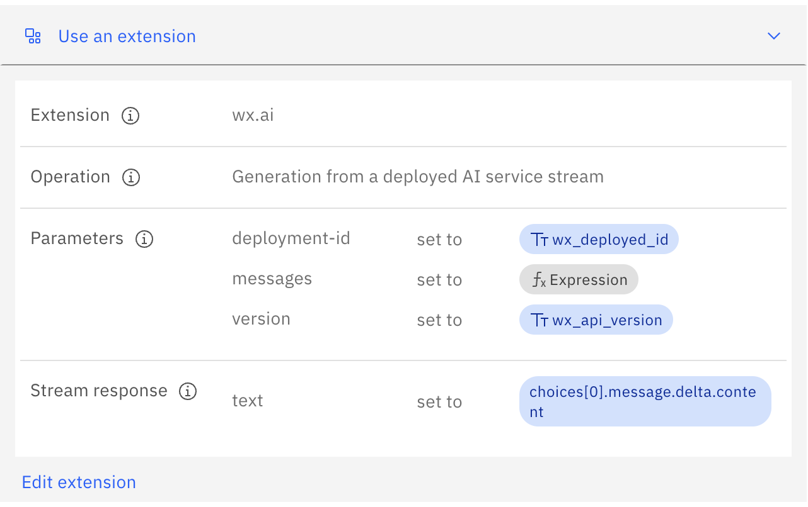

# Watsonx-ai-openapi

This is a openapi spec including all available llm endpoints. Including

| Endpoint                                         | Description                                                                |
| ------------------------------------------------ | -------------------------------------------------------------------------- |
| Generation                                       | Direct generate from wx.ai                                                 |
| Generation (stream)                              | Direct generation with streaming                                           |
| Generation from deployed model/template          | From deployed model/template without explicitly prompt                     |
| Generation from deployed model/template (stream) | From deployed model/template without explicitly prompt with streaming      |
| Generation from AI service                       | For services like RAG, agent lab, chat with document, etc.                 |
| Generation from AI service                       | For services like RAG, agent lab, chat with document, etc., with streaming |

## Before you start

You need to have a deployed model/prompt template, or a deployed AI service on Watsonx.ai
Read more:

- [Deploying a prompt template](https://eu-de.dataplatform.cloud.ibm.com/docs/content/wsj/analyze-data/prompt-template-deploy.html?context=wx&locale=en&audience=wdp)
- [Deploying a tuned foundation model](https://eu-de.dataplatform.cloud.ibm.com/docs/content/wsj/analyze-data/fm-tuning-deploy.html?context=wx&locale=en&audience=wdp)
- [Deploying AI services](https://eu-de.dataplatform.cloud.ibm.com/docs/content/wsj/analyze-data/ai-services-overview.html?context=wx&locale=en)

---

## Generation Streaming

Use streaming

1. Choose operation with _"Generation stream"_.
2. Set up streaming reponse `text` to `results[0].generated_text`.

Read more on [streaming from an extension](https://cloud.ibm.com/docs/watson-assistant?topic=watson-assistant-stream-from-extension) to config streaming in WxA.

---

## Deployed prompt template

1. Choose operation _"Generation from a deployed prompt"_

2. Set up parameters:

- `deployment-id`
- `version`
- `parameters.prompt_variables`

Input variable `parameters.prompt_variables` is object type. You should give variable values as expression depending on your deployment. For example:

```json
{ "question": "$question" }
```



Output message is in `body.results[0].generated_text`



## Deployed prompt template (stream)

1. Choose operation _"Generation from a deployed prompt (stream)"_

2. Set up parameters:

- `deployment-id`
- `version`
- `parameters.prompt_variables`

Input variable `parameters.prompt_variables` is object type. You should give variable values as expression depending on your deployment. For example:

```json
{ "question": "$question" }
```

Set up streaming reponse `text` to `results[0].generated_text`.



---

## Deployed AI service

1. Choose operation _"Generation from a deployed AI service"_

2. Set up parameters:

- `deployment-id`
- `version`
- `message`

Input variable `message` should be given as an expression in form of:

```json
[
  {
    "role": "user",
    "content": " $user_input "
  }
]
```



Output message should be `body.choices[0].message.content`



## Deployed AI service (stream)

1. Choose operation _"Generation from a deployed AI service (stream)"_

2. Set up parameters:

- `deployment-id`
- `version`
- `message`

Input variable `message` should be given as an expression in form of:

```json
[
  {
    "role": "user",
    "content": " $user_input "
  }
]
```

Output message should be `body.choices[0].message.delta.content`


