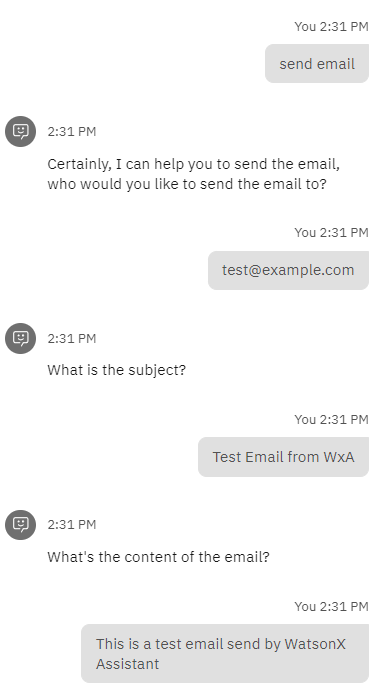
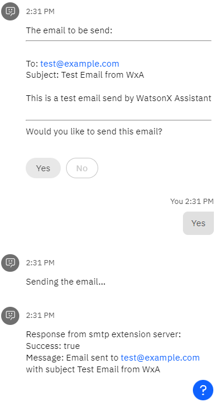

# Mail Sending

This starter kit demonstrates how to send emails with WatsonX Assistant by building a custom extension that calls the smtp extension server. The smtp extension server can be configured to use your own SMTP server, such as your company's email server or third-party services like Gmail.

## Prerequisites

In order to send emails with this starter kit, you need to have an SMTP server that you can use to send emails. If you don't have an SMTP server, you can use a third-party service like [Gmail](https://kinsta.com/blog/gmail-smtp-server/). Please note the smtp extension server provided with this starter kit only supports SMTP servers that uses either insecure connections or secure connections with TLS.

Please prepare the following information before you start:
- SMTP server address
- SMTP server port (usually 587 for secure connections with TLS)
- SMTP username
- SMTP email address (will be used as the sender email address)
- SMTP password

## Setup Steps

1. [Deploy the smtp extension server](#deploy-the-smtp-extension-server)
2. Upload the custom extension and sample actions to watsonx Assistant

## Deploy the SMTP Extension Server

### Local Deployment

The server was developed with Python flask framework. To deploy the server locally, please follow the steps below:

1. Install Python 3.8 or above
2. Clone the repo and navigate to the `integrations/extensions/starter-kits/mail-sending/server` folder
3. Create a virtual environment with `python3 -m venv venv`, and activate it with `source venv/bin/activate`
4. Install the dependencies with `pip3 install -r requirements.txt`
5. Copy the `.env-sample` file to `.env` and fill in the required information
6. Start the server with `python3 app.py`
7. The server will be running on `http://localhost:5000` by default. You should see "Teams File Upload API server is up
   and running." if open the link in browser.

To allow Watson Assistant to access the extension server, you need to expose the server to the Internet. You can use tools
like
[ngrok](https://ngrok.com/) to do that. After installing ngrok, run `ngrok http 5000` to expose the server to the
internet.

### IBM Cloud Code Engine Deployment

The server comes with the Dockerfile for Code Engine deployment. To deploy the server to Code Engine, please follow the
steps below:

1. Build the docker image
    1. Copy the `.env-sample` file to `.env` and fill in the required information
    2. Build the image with `docker build -t <image-name> .` The image name should follow the format
       of `<registry>/<namespace>/<image-name>:<tag>`. For example, `us.icr.io/your_name_space/smtp_extension_server:latest`.
2. Push the image to the container registry with `docker push <image-name>`
3. Create a Code Engine project
   and [deploy the image](https://cloud.ibm.com/docs/codeengine?topic=codeengine-deploy-app-crimage)

## Upload the custom extension and sample actions to watsonx Assistant

### Custom Extension Setup

1. [Upload the extension](https://cloud.ibm.com/docs/watson-assistant?topic=watson-assistant-build-custom-extension).
   The `mail-sending.openapi.json` provided is for creating the extension.
2. [Add the extension to the assistant](https://cloud.ibm.com/docs/watson-assistant?topic=watson-assistant-add-custom-extension).
    1. In Authentication step, select `Bearer auth` as `Authentication type`, and fill the `Token` with the value of the
       environment variable `API_SERVER_KEY` that configured in `.env` file of the API server.
    2. In Server variables section, enter the public URL of the API server and the port if needed.

### Upload Sample Actions

> Uploading actions will override all existing actions in the assistant.

To upload the actions:

1. Zip `mail-sending.action-skill.json` into a zip file `action-skill.zip` for uploading.
2. [Uploading all actions](https://cloud.ibm.com/docs/watson-assistant?topic=watson-assistant-upload-download-actions)

## Usage Example

Now you can test email sending feature by entering **"send email"** in the chat window. The assistant will ask
for the recipient email address, subject, and content of the email. After you provide the information, the assistant will
send the email to the recipient.

