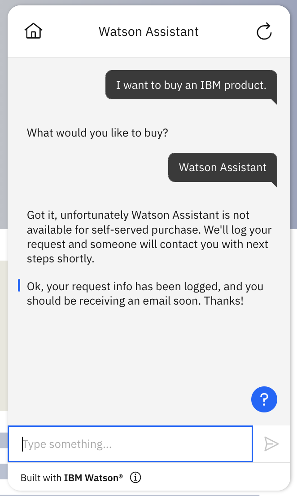
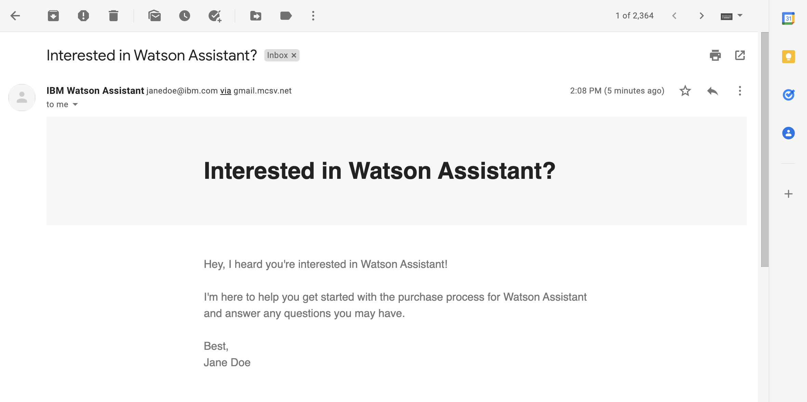

# MailChimp Campaign Management

## Background

Mailchimp is a marketing automation platform and email marketing service for managing mailing lists and creating email marketing campaigns to send to customers.
It has quite an [extensive REST API](https://mailchimp.com/developer/marketing/api/), however this extension will focus on only one API endpoint: sending a campaign.

Mailchimp provides a complete [OpenAPI specification](https://api.mailchimp.com/schema/3.0/Swagger.json?expand), but it uses OASV2.0. WA Extensions only support OAS3.0.
In addition, it is quite extensive, so if you plan on using a small part of their API, you'll be better off creating a smaller set of it. To do that, you can open the [Swagger Editor](https://editor.swagger.io/), convert the spec from OAS2.0 to OAS3.0, then only keep the endpoints you need. This is the process we used to create this starter-kit as well, and the result for `Send Campaign` is [here](./openapi.campaigns.send.json).

## Pre-Requisite Steps

1. Create an account at Mailchimp. 
2. Generate an API key and figure out which server your Mailchimp account is bound to. See https://mailchimp.com/developer/marketing/guides/quick-start/#generate-your-api-key for more details.
3. Next, to be able to send a campaign, you have to create a list (audience) and add members to it. There are two possible ways to do that:
    1. Use the API, check [this](https://mailchimp.com/developer/marketing/guides/create-your-first-audience/) for a complete guide.
    2. Use Mailchimp user interace, check [this](https://mailchimp.com/help/create-audience/) for a complete guide.

4. Lastly, before you can send a campaign, you have to create it. This again can be done either via API or in the Mailchimp tool.

Tip: Mailchimp will error and won't send the campaign unless it's structured correctly. Therefore, it is recommended to log into Mailchimp, search for the campaign, and edit it until everything has a green check mark.

## Using this Starter Kit

Upload the provided OpenAPI spec as a custom extension, add the extension to your assistant, and then in the `Authentication` configuration step:
1. For Authentication type, select `Basic auth`.
1. Add `anystring` as the Username and the password should be your API key.
1. Replace the default `server` server variable with your own.  To find the value for the server parameter, log into your Mailchimp account and look at the URL in your browser. You’ll see something like `https://us19.admin.mailchimp.com/`; the `us19` part is the server prefix. Note that your specific value may be different.

After upload, the actions should be configured to use the fields below for the skill to be fully functional. Follow the instructions [here](../../README.md#configuring-your-actions-skill-to-use-an-extension) and note the information below to do this.

- **Action 1.** I want to buy an IBM product.
    ```
    Operation: Send campaign
    Parameters:
      - campaign_id : campaignid
    ```

Note that `campaignid` is a session variable that must match the campaign you have created. If you have created your campaign via API, then in the response you should have an `id` property, that should be saved in `campaignid`. If you haven't created the campaign via the API, then you have to use the API to obtain the campaign id. To do this, [list the campaigns](https://mailchimp.com/developer/marketing/api/campaigns/list-campaigns/) then find your campaign.

Tip: This method is suitable for a starter-kit. In a production setting, however, you will most likely use other endpoints during the action to fetch the campaign id or create a campaign and *then* store the campaign id.

## Example Usage
A conversation using this starter kit could look like the following:<br>


An email should be sent to you, according to your campaign setting.
Here is an example:


