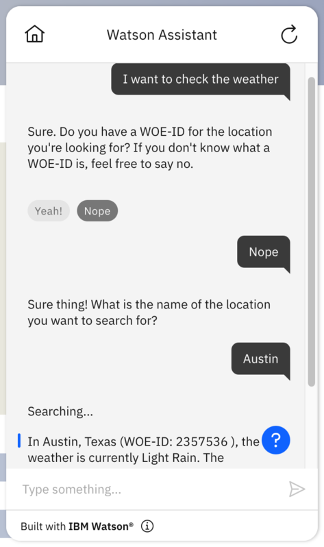

# MetaWeather Custom Extension

## Background
MetaWeather is a simple API for querying location weather data. The API supports three use cases:

- `GET Location Search`: Search for a location by a name (string) OR a lattitude and longitude value. This returns a Where-On-Earth-ID (woeid).
- `GET Location`: Use a Where-On-Earth-ID to get a location's 5-day weather forecast.
- `GET Location Day`: Use a Where-On-Earth-ID and a date to query for a location's historical weather data.

The API reference for MetaWeather is at [https://www.metaweather.com/api/](https://www.metaweather.com/api/). Note that MetaWeather does not use any API keys.

## Basic vs. Advanced Spec
In the `basic` spec, we only feature a single operation, `GET Location`, for simplicity purposes. There will be minimal configuration and no variables necessary for getting started, to help readability and understanding for ease of learning.

In the `advanced` spec/actions folder, we include more complicated OpenAPI concepts such as refs, and using extensions and results in a single skill. This spec introduces better, more creative ways to configure and utilize your extension using actions and OpenAPI specifications. The below usage example describes the functionality of the full advanced jsons.

## Using this Starter Kit
You can use the `metaweather.advanced.openapi.json` specification file to recreate the three endpoints listed above. Using the `basic` files will have limit you to using the `Location` operation, but is simpler. We recommend this for anyone who is using OpenAPI and/or actions for the first time. 

To get started with using the OpenAPI spec, you can you upload the `metaweather.advanced.actions.json` file into your Watson Assistant actions; this will upload three actions:

- **Action 1**. Search the current weather of a location using a location name.

    **Operation 1**: `Location Search`
    - Parameters:
        - `query`: `1. Sure thing! What is the name ...`

    **Operation 2**: `Location`
    - Parameters:
        - `woeid`: `location_item_0_woeid`

- **Action 2**. Search the current weather of a location using a Where-On-Earth-ID.
    - Operation: `Location`
    - Parameters:
        - `woeid`: `1. Great! What is the WOE-ID ...`

- **Action 3**. Search the past weather of a location using a date and a Where-On-Earth-ID.
    - Operation: `Location Day`
    - Parameters:
        - `woeid`: `1. OK, I can help with that. What is your ...`
        - `year`: `year`
        - `month`: `month`

If you want to know the Where-On-Earth-ID of a particular location, simply use the first action to query using the location name. The Where-On-Earth-ID of the location will be returned to you.

## Example Usage
Using this action, a typical conversation may look like this: 

