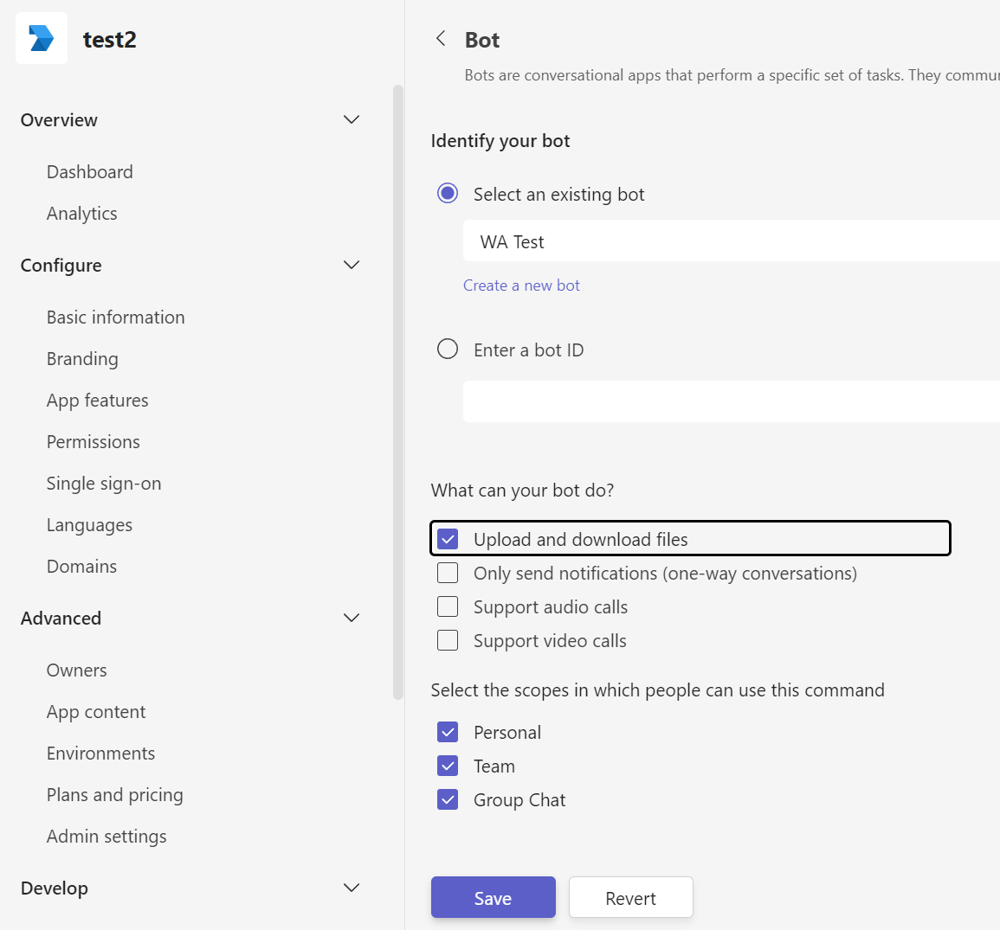
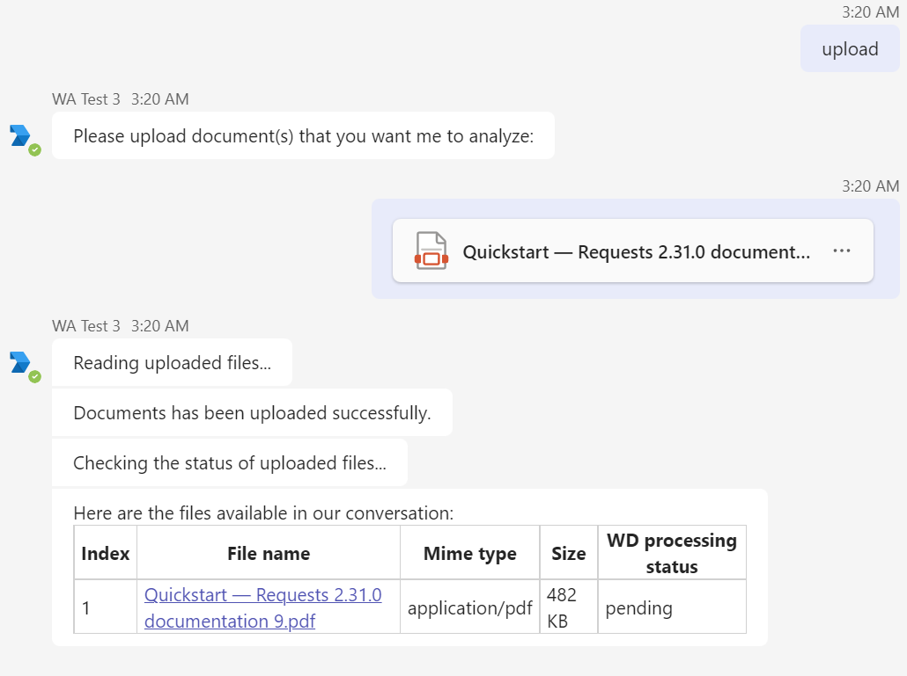
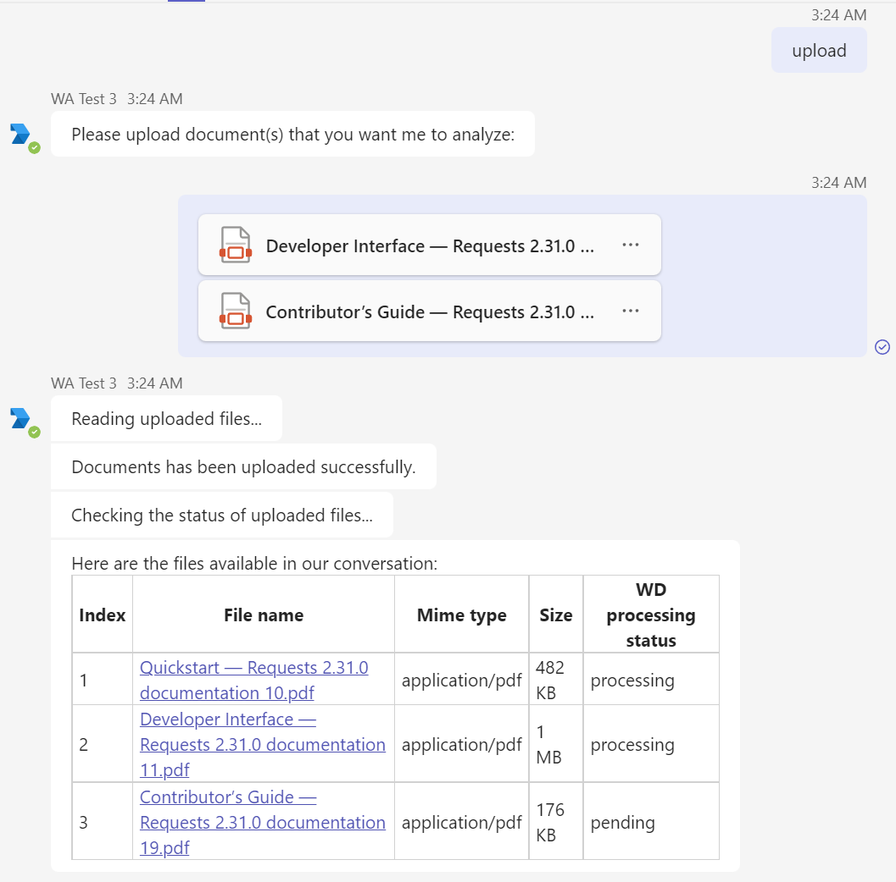
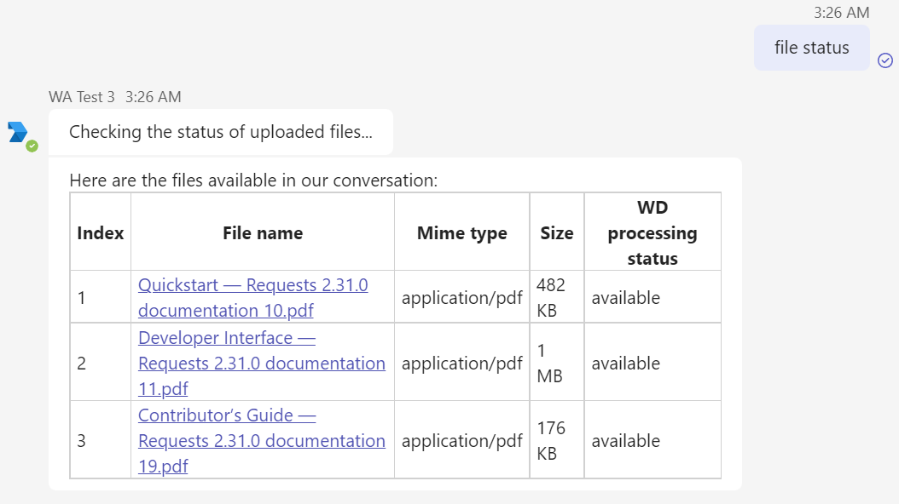
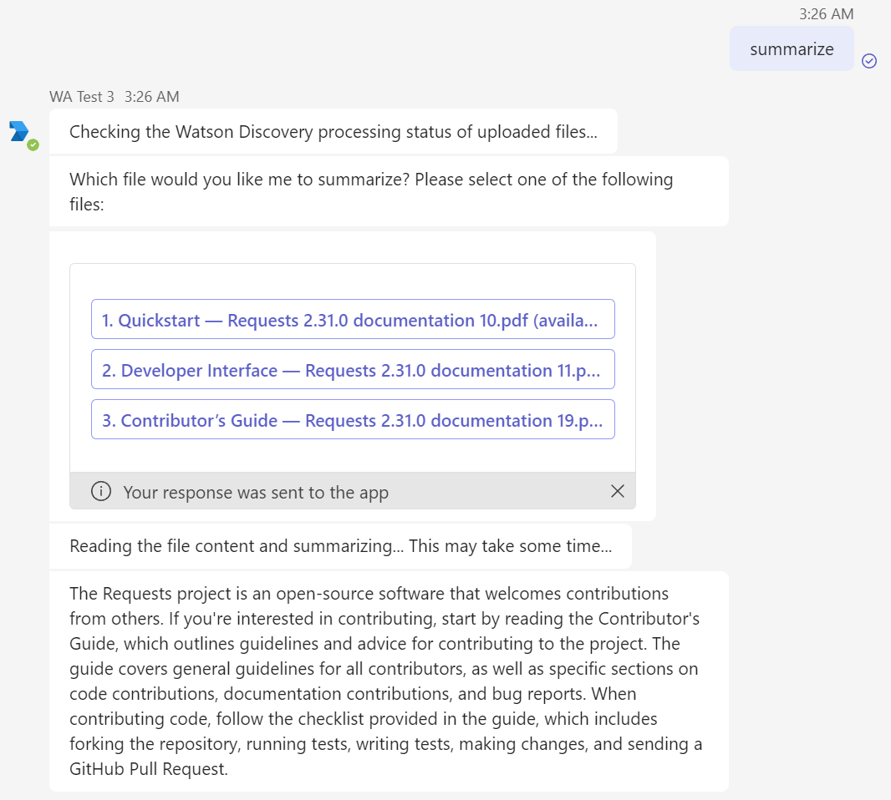
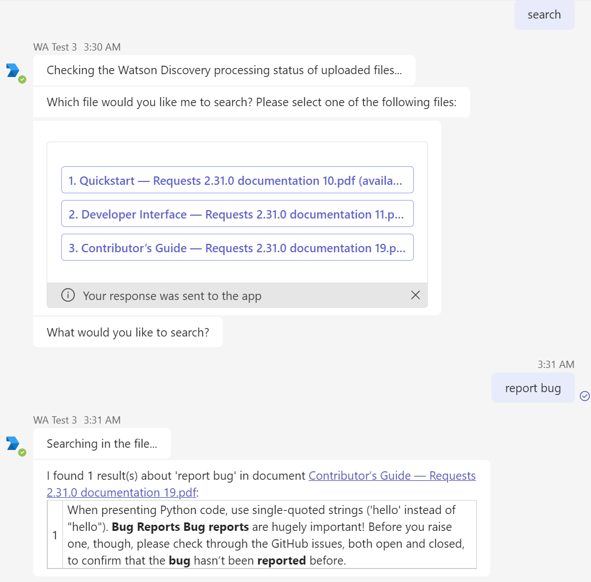

# MS Teams File Upload Starter Kit

> When using this starter kit to create assistant instances, please make sure to **first create and add the extensions
to
> the assistant, then upload the actions.** Therefore, the actions can be automatically associated with the extension.

## Goal

This is a simple example of how to enable file upload in Watson Assistant with **MS Teams** channel, and
forward the file to other services via custom extension for further processing.

This starter kit implements the following features:

- File uploading via Teams to watsonx Assistant and read file's metadata and content in the assistant actions.
- Forward the file to Watson Discovery to perform custom in-file search.
- Summarize the file content with watsonx.ai foundation models.

> The file summarization feature only supports PDF files in English.

## Preparation

Please note that you only need to follow the steps below if you want to try the in-file search and content summarization
feature. 

If you are not interested in testing these features, you can skip this section. The two features
can be disabled by setting the environment variable `WD_ENABLED` and `WATSONX_ENABLED` to `false` respectively.

### In-file search with Watson Discovery

If you would like to try the in-file search feature, you need to
[create a Watson Discovery instance](https://cloud.ibm.com/docs/discovery-data?topic=discovery-data-getting-started&locale=zh-CN#before-you-begin-tool),
then [create a project](https://cloud.ibm.com/docs/discovery-data?topic=discovery-data-projects)
and [a collection](https://cloud.ibm.com/docs/discovery-data?topic=discovery-data-collections).

Please follow [this guide](https://cloud.ibm.com/docs/discovery-data?topic=discovery-data-api-use) to
prepare the following info:

- `WD_API_URL`: The API URL of the Watson Discovery instance.
- `WD_APIKEY`: The API key of the Watson Discovery instance.
- `WD_PROJECT_ID`: The project ID of the project you created in the Watson Discovery instance
- `WD_COLLECTION_ID`: The collection ID of the collection you created in the project above

### Content summarization with watsonx.ai

If you would like to try the summarization feature, you need to create a watsonx.ai project and obtain the following
info:

- `WATSONX_API_URL`: The API URL of the watsonx.ai instance. depends on the region of the
  instance. [See here](https://ibm.github.io/watson-machine-learning-sdk/setup_cloud.html#authentication) for possible
  values.
- `WATSONX_API_KEY`: The API key of the watsonx.ai instance.
  Follow [this guide](https://dataplatform.cloud.ibm.com/docs/content/wsj/analyze-data/fm-credentials.html?context=wx&audience=wdp)
  to find it.
- `WATSONX_PROJECT_ID`: The project ID of the watsonx.ai project that you want to use to call the LLM models.
  Follow [this guide](https://dataplatform.cloud.ibm.com/docs/content/wsj/analyze-data/fm-python-lib.html?context=wx&audience=wdp#project-id)
  to find it.

## Setup Steps

1. [Deploy the watsonx Assistant Teams File Upload API Server](#deploy-the-watsonx-assistant-teams-file-upload-api-server)
2. Upload the custom extension and sample actions to watsonx Assistant
3. Integrate the watsonx Assistant with Microsoft Teams
    - Create Teams app with **file upload** feature enabled

## Deploy the watsonx Assistant Teams File Upload API Server

The custom extension requires an API server to fetch the uploaded file from Teams and forward it to other services. The
API server can be deployed locally or on the IBM Cloud Code Engine.

### Local Deployment

The server was developed with Python flask framework. To deploy the server locally, please follow the steps below:

1. Install Python 3.8 or above
2. Clone the repo and navigate to the `teams-file-upload/server` folder
3. Create a virtual environment with `python3 -m venv venv`, and activate it with `source venv/bin/activate`
4. Install the dependencies with `pip3 install -r requirements.txt`
5. Copy the `.env-sample` file to `.env` and fill in the required information
6. Start the server with `python3 app.py`
7. The server will be running on `http://localhost:5050` by default. You should see "Teams File Upload API server is up
   and running." if open the link in browser.

To allow Watson Assistant to access the API server, you need to expose the server to the internet. You can use tools
like
[ngrok](https://ngrok.com/) to do that. After installing ngrok, run `ngrok http 5050` to expose the server to the
internet.

### IBM Cloud Code Engine Deployment

The server comes with the Dockerfile for Code Engine deployment. To deploy the server to Code Engine, please follow the
steps below:

1. Build the docker image
    1. Copy the `.env-sample` file to `.env` and fill in the required information
    2. Build the image with `docker build -t <image-name> .` The image name should follow the format
       of `<registry>/<namespace>/<image-name>:<tag>`. For example, `us.icr.io/tfu_ns/tfu_api_server:latest`.
2. Push the image to the container registry with `docker push <image-name>`
3. Create a Code Engine project
   and [deploy the image](https://cloud.ibm.com/docs/codeengine?topic=codeengine-deploy-app-crimage)

## Upload the custom extension and sample actions to watsonx Assistant

### Custom Extension Setup

1. [Upload the extension](https://cloud.ibm.com/docs/watson-assistant?topic=watson-assistant-build-custom-extension).
   The `openapi.json` provided is for creating the extension.
2. [Add the extension to the assistant](https://cloud.ibm.com/docs/watson-assistant?topic=watson-assistant-add-custom-extension).
    1. In Authentication step, select `Bearer auth` as `Authentication type`, and fill the `Token` with the value of the
       environment variable `API_SERVER_KEY` that configured in `.env` file of the API server.
    2. In Server variables section, enter the public URL of the API server and the port if needed.

### Upload Sample Actions

> Uploading actions will override all existing actions in the assistant.

We provided the following sample actions to demonstrate how you can access the uploaded file in the WA actions.

| WA Action Name       | WA Trigger Word | Description                                                                                                |
|----------------------|-----------------|------------------------------------------------------------------------------------------------------------|
| Upload to WD         | "upload"        | Upload or append one or more files to current session.                                                     |
| Check File Status    | "file status"   | Check the info of the uploaded files in current session, and also their process status on Watson Discovery |
| Summarize            | "summarize"     | Summarize the file content with watsonx.ai foundation models.                                              |
| Search               | "search"        | Search the file content with Watson Discovery.                                                             |
| Clear Uploaded Files | "clear"         | Clear the uploaded files by create a new session.                                                          |

To upload the actions:

1. Zip `action-skill.json` into a zip file `action-skill.zip` for uploading.
2. [Uploading all actions](https://cloud.ibm.com/docs/watson-assistant?topic=watson-assistant-upload-download-actions)

## Integrate the watsonx Assistant with Microsoft Teams

Please follow this guide
to [integrate watsonx Assistant with MS Teams](https://cloud.ibm.com/docs/watson-assistant?topic=watson-assistant-deploy-microsoft-teams).

In order to support file uploading, you need to create a Teams app with **file upload** feature enabled.

When following the guide above,
in [Create your Teams app](https://cloud.ibm.com/docs/watson-assistant?topic=watson-assistant-deploy-microsoft-teams#deploy-microsoft-teams-app)
section, before saving the bot configuration (step 8), you need to also enable the **Upload and download files** feature
in the **What can your bot do?** section.

## Example Usage

### Upload files

First type "upload" in the chat window, then upload a file. The file's info will be displayed in the chat window.

You can type "upload" again to upload more files. The uploaded files will be appended to the current session.

### Check file status

Type "file status" in the chat window, and the file's info and process status will be displayed in the chat window.
Note that files has been processed by WD (with status `available`) and is now available for search.

### Summarize

Type "summarize" in the chat window, select the file you want to summarize, and the summary will be displayed in the
chat window after a few seconds.

### Search

Type "search" in the chat window, select the file you want to search, and then enter your search query. The search
result will be displayed in the chat window after a few seconds.

