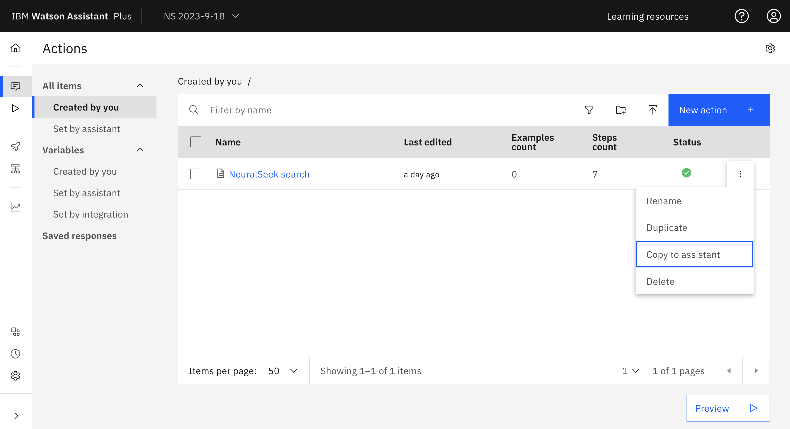

# NeuralSeek

## Background

[NeuralSeek](https://NeuralSeek.com) delivered by [TechD](https://techd.com/) is a combined search and natural language generation system designed to [enable apps, webpages, and Virtual Agents to handle open-ended, complex, contextual questions from real users, based on an organization's data](https://neuralseek.com/).  It requires that you load all your content into IBM Watson Discovery.  Then when a user asks a question, it has IBM Watson Discovery search for multiple relevant documents and then it generates a natural language answer using the contents of those documents.  In some cases, the answer might be taken directly from a single document and in others the answer can include information from multiple sources fused together into a single coherent statement.  For each query, NeuralSeek returns a single answer and a score indicating how confident it is in that answer.  In most cases, it also returns a URL of a document that influenced the answer (which may be one of several such documents).

This starter kit demonstrates the integration of NeuralSeek with IBM Watson Assistant.  The kit includes instructions for retrieving a customized OpenAPI specification (which will include a single `/seek` endpoint) for your NeuralSeek instance (which is encoded in the server URL in the OpenAPI JSON file).  The kit also includes a sample actions JSON file.  That actions file includes a sample NeuralSeek action that invokes NeuralSeek and shows the answer it provides.

## Pre-Requisite Steps

1. You will need an instance of [IBM Watson Discovery](https://www.ibm.com/cloud/watson-discovery).  Be sure that this is not an instance with important data that you are using for other purposes, because NeuralSeek can modify your data as needed to make it more effective.
2. Within that instance, create a project and load into it the documents you want to use.
3. You will also need an instance of [NeuralSeek on IBM Cloud](https://cloud.ibm.com/catalog/services/neuralseek)
4. Within that instance, go to the "Configure" page and enter the information requested about your Watson Discovery instance in the "Discovery instance details" section.
5. Also go to the "Integrate" page and click on the "OpenAPI file" link to download the `NeuralSeek.json` file configured for your instance.
6. Also on the "Integrate" page, copy the API key for NeuralSeek for use in setup (as described below).  Note that the API key for NeuralSeek is _not_ the same as the API key for Discovery that you put into the "Configure" page.  The API key for NeuralSeek is only available on the "Integrate" page.

## Other Setup Info

Simple instructions for setting up NeuralSeek are available within the NeuralSeek user interface on the "Integrate" page.  You can follow those instructions to get NeuralSeek working with Watson Assistant.  Alternatively, we provide a sample actions file in this kit that has several minor advantages:

1. The "Integrate" page instructions tell you to call the NeuralSeek extension directly into the "No Action Matches" built-in action.  The file in this kit puts the call to NeuralSeek in a separate action called "NeuralSeek" and then has the "No Action Matches" built-in action call out to that "NeuralSeek" action.  The effect is the same: NeuralSeek will be invoked whenever no other action matches the query.  However, we find having a separate action for this purpose makes it easier to add more advanced functionality later, e.g., other actions that also call out to NeuralSeek under different circumstances can all call out to a common NeuralSeek action.
2. The "Integrate" page instructions tell you to use Watson Assistant's built-in `input.text` variable as the source of the query text.  If you have spell correction enabled in your assistant, then `input.text` will reflect the user's query _after_ any spell correction has been run.  Spell correction can be very counter productive for searching because it can take specialized domain vocabulary and "correct" those terms to generic words in the language, so it is often better to apply the search on the original (uncorrected) query text, as we do in the starter kit (or just disable spell correction in your assistant completely).
3. The action in the starter kit checks to see if the call to NeuralSeek failed and prints out an error message if it did.
4. After printing out an answer, the action in the starter kit checks whether NeuralSeek returned a URL and if the score of the answer is above 0.1.  If both of those are true, it prints "For more information, see this help article" with a hyperlink on "this help article" pointing to the URL.  As noted in the background section, the URL returned by NeuralSeek may be _one_ of several pages that influenced the text, so it would not be accurate to say that the page pointed to by the URL was "the source" of the answer.  However, the framing "for more information" is neutral enough that it can introduce a link to a document without specifically promising that the answer came from that document (but that might be _assumed_ by users).  We only do this when the answer score is above 0.1 because answers with very low scores are often accompanied by URLs with minimal relevance to the query.  We recommend trying this out and seeing if the links tend to be useful in your application.  If not, feel free to delete this last step and just provide the answer alone.

The subsections below describe how to setup the sample actions file from this kit in both a new and existing assistant.

### Setup in a new Assistant

If you want to use the sample actions file, make a _new_ Assistant and take the following steps:

- Use the `NeuralSeek.json` OpenAPI specification (from the Pre-Requisite Steps) to [build a custom extension](https://cloud.ibm.com/docs/watson-assistant?topic=watson-assistant-build-custom-extension#building-the-custom-extension).
- [Add the extension to your assistant](https://cloud.ibm.com/docs/watson-assistant?topic=watson-assistant-add-custom-extension) using the API key and region you obtained in the pre-requisites above.  When you select API key authentication, it will ask for an API key.  Enter the API key for NeuralSeek that you got from the "Integrate" page during the Pre-Requisite Steps above (_not_ the API key for your Watson Discovery instance).
- Download the actions JSON file (`neuralseek-actions.json`) in this starter kit.
- [Upload the Actions JSON file to Watson Assistant](https://cloud.ibm.com/docs/watson-assistant?topic=watson-assistant-admin-backup-restore#backup-restore-import).
- Use either method listed in [Configuring Your Actions Skill to use an Extension](https://github.com/watson-developer-cloud/assistant-toolkit/blob/master/integrations/extensions/README.md#configuring-your-actions-skill-to-use-an-extension) to configure the actions you uploaded to invoke the custom extension you built.  We generally recommend "Method 1: For simple actions skills" because it tends to be quicker and easier:
   - In the step of the "NeuralSeek" action that says "Use an extension", select the extension you created, the "Seek an answer from NeuralSeek" endpoint, and set the following parameter values:
      - `question` = the `query_text` session variable
      - `context` (under Optional Parameters) = the `query_context` session variable
      - You may want to also set the optional `language` parameter to an expression containing the 2-letter language code.  See the "Integrate" page in the NeuralSeek application for a list of valid language codes (e.g., "en" or "ja").

Once this is done, skip over the "Setup in an existing Assistant" subsection below and go directly to "Using this Starter Kit".

### Setup in an existing Assistant

As above, you can follow the simple instructions for setting up NeuralSeek in the "Integrate" page of the NeuralSeek UI.  Alternatively, you can add this kit to your assistant using the following process:

- You should not upload this file directly to an existing assistant because that would overwrite your existing actions.  
- Instead, you can create a new assistant in the same instance of the Watson Assistant product, then set up the kit in that new assistant, and then in that assistant copy the `NeuralSeek search` action to your existing assistant as shown below:

 

- Next, go to "Actions" > "Set by assistant" > "No action matches" and remove all the steps from the action.  Add in a new step.  Under "And then" select "Go to another action" and select "NeuralSeek" and click "End this action after the subaction is completed".
- You may also want to go to "Actions" > "Set by assistant" > "Fallback" and do the same thing as in the previous step.  Note, however, that this will prevent your assistant from escalating to a human agent when a customer asks to connect to a human agent (which is part of the default behavior for "Fallback") so only do this if you do not have your bot connected to a human agent chat service.  For more details on connecting to human agents within Watson Assistant see [our documentation](https://cloud.ibm.com/docs/watson-assistant?topic=watson-assistant-human-agent) and [blog post](https://medium.com/ibm-watson/bring-your-own-service-desk-to-watson-assistant-b39bc920075c).

## Using this Starter Kit

Once this starter kit is properly installed, you can issue a query to your assistant. If there is no other action that you've configured that matched that query then it will generate search results for that query.  Here is an example of what results from the "NeuralSeek" action can look like:

For many use cases, NeuralSeek alone is enough to get an assistant working well enough to deploy.  If you are happy with your assistant, you may want to deploy it for real-world use right away and use the [Watson Assistant analytics](https://cloud.ibm.com/docs/watson-assistant?topic=watson-assistant-analytics-overview) and/or the "Curate" page on NeuralSeek to see what kinds of questions users are asking and build conversation flows that are optimized for the common user requests.  The "Curate" page on NeuralSeek can even automate the creation of new actions and generate new example utterances that trigger those actions.  It can also merge any actions you have already created with the actions that it generates so you can seamlessly update an existing assistant.  See the [NeuralSeek documentation](https://neuralseek.com/documentation) for more details.

NeuralSeek is remarkably accurate, but it is sometimes incorrect.  Of course, humans also make mistakes so there is no completely risk-free solution to answering questions.  We recommend testing any assistant that you build carefully before deploying it for real-world use.
