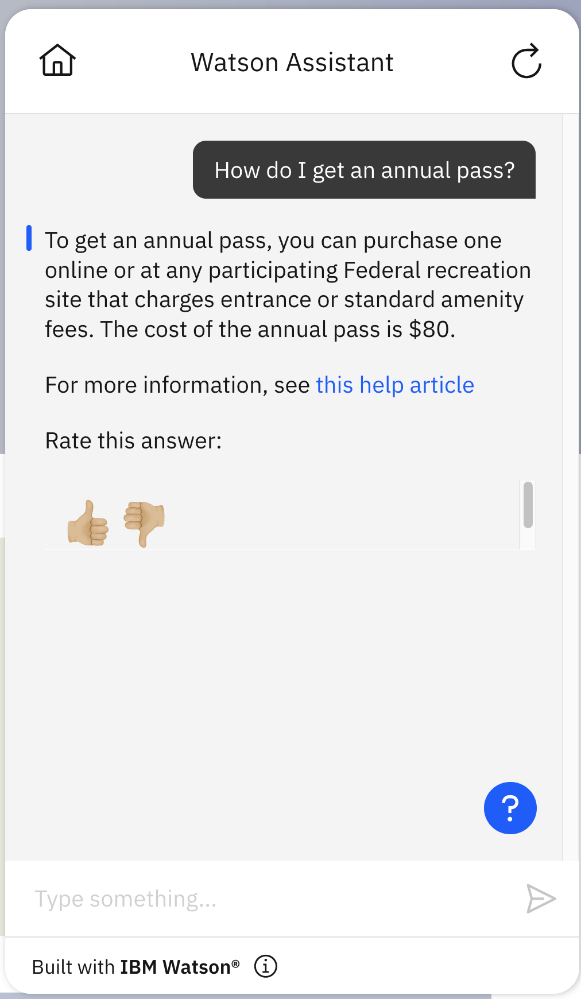

# NeuralSeek

## Background

[NeuralSeek](https://NeuralSeek.com) delivered by delivered by [TechD](https://techd.com/) is a combined search and natural-language generation system designed to [enable apps, webpages, and Virtual Agents to handle open-ended, complex, contextual questions from real users, based on an organization's data](https://neuralseek.com/).  It requires that you load all your content into IBM Watson Discovery.  Then when a user asks a question, it has IBM Watson Discovery search for multiple relevant documents and then it generates a natural-language answer using the contents of those documents.  In some cases, the answer might be taken directly from a single document and in others the answer can include information from multiple sources fused together into a single coherent statement.  For each query, NeuralSeek returns a single answer and a score indicating how confident it is in that answer.  In most cases, it also returns a URL of a document that influenced the answer (which may be one of several such documents).

These instructions demonstrate the integration of NeuralSeek with IBM Watson Assistant, including instructions for retrieving a customized OpenAPI specification (which will include a single `/seek` endpoint) for your NeuralSeek instance (which is encoded in the server URL in the OpenAPI JSON file). The assistant actions are provided with the NeuralSeek BYOS template (for setup instructions that do not include the template, see the `README.md` in this directory, which provides step-by-step walkthrough of creating actions). The actions include a sample NeuralSeek search action that invokes NeuralSeek and shows the answer it provides.

## Pre-Requisite Steps

1. You will need an instance of [IBM Watson Discovery](https://www.ibm.com/cloud/watson-discovery).  Be sure that this is not an instance with important data that you are using for other purposes, because NeuralSeek can modify your data as needed to make it more effective.
2. Within that instance, create a project and load into it the documents you want to use.
3. You will also need an instance of [NeuralSeek on IBM Cloud](https://cloud.ibm.com/catalog/services/neuralseek)
4. Within that instance, go to the "Configure" page and enter the information requested about your Watson Discovery instance in the "Discovery instance details" section.
5. Also go to the "Integrate" page and click on the "OpenAPI file" link to download the `NeuralSeek.json` file configured for your instance.
6. Also on the "Integrate" page, copy the API key for NeuralSeek for use in setup (as described below).  Note that the API key for NeuralSeek is _not_ the same as the API key for Discovery that you put into the "Configure" page.  The API key for NeuralSeek is only available on the "Integrate" page.

## Other Setup Info

Simple instructions for setting up NeuralSeek are available within the NeuralSeek user interface on the "Integrate" page.  You can follow those instructions to get NeuralSeek working with Watson Assistant.

## Setup in your Assistant

- Use the `NeuralSeek.json` OpenAPI specification (from the Pre-Requisite Steps) to [build a custom extension](https://cloud.ibm.com/docs/watson-assistant?topic=watson-assistant-build-custom-extension#building-the-custom-extension).
- [Add the extension to your assistant](https://cloud.ibm.com/docs/watson-assistant?topic=watson-assistant-add-custom-extension) using the API key and region you obtained in the pre-requisites above.  When you select API key authentication, it will ask for an API key.  Enter the API key for NeuralSeek that you got from the "Integrate" page during the Pre-Requisite Steps above (_not_ the API key for your Watson Discovery instance).

### Using a template to create a new action
- Click on `Actions` in the left menu
- Select `Quick start with templates`
- Select the `Do more with starter kits` section of the template catalog
- Select the `NeuralSeek starter kit` template
- Add the template to your assistant
- On the `Actions` page, you will see the "*NeuralSeek search" action from the template.
- Use either method listed in [Configuring Your Actions Skill to use an Extension](https://github.com/watson-developer-cloud/assistant-toolkit/blob/master/integrations/extensions/README.md#configuring-your-actions-skill-to-use-an-extension) to configure the actions you uploaded to invoke the custom extension you built.
   - In the step of the "NeuralSeek search" action that says "Use an extension", select the extension you created, the "Seek an answer from NeuralSeek" endpoint, and set the following parameter values:
      - `question` = the `*query_text` action variable
      - `context` (under Optional Parameters) = the `*query_context` action variable
      - You may want to also set the optional `language` parameter to an expression containing the 2-letter language code.  See the "Integrate" page in the NeuralSeek application for a list of valid language codes (e.g., "en" or "ja").

### Link Actions to No Action matches state
- Go to "Actions" > "Set by assistant" > "No action matches" and remove all the steps from the action.  Add in a new step.  Under "And then" select "Go to another action" and select "*NeuralSeek search" and click "End this action after the subaction is completed".
- You may also want to go to "Actions" > "Set by assistant" > "Fallback" and do the same thing as in the previous step.  Note, however, that this will prevent your assistant from escalating to a human agent when a customer asks to connect to a human agent (which is part of the default behavior for "Fallback") so only do this if you do not have your bot connected to a human agent chat service.  For more details on connecting to human agents within Watson Assistant see [our documentation](https://cloud.ibm.com/docs/watson-assistant?topic=watson-assistant-human-agent) and [blog post](https://medium.com/ibm-watson/bring-your-own-service-desk-to-watson-assistant-b39bc920075c).

## Using the NeuralSeek Extension

Once you have completed these setup instructions, you can issue a query to your assistant. If there is no other action that matched that query then it will generate search results for that query. Here is an example of what results from the "*NeuralSeek search" action can look like:

For many use cases, NeuralSeek alone is enough to get an assistant working well enough to deploy.  If you are happy with your assistant, you may want to deploy it for real-world use right away and use the [Watson Assistant analytics](https://cloud.ibm.com/docs/watson-assistant?topic=watson-assistant-analytics-overview) and/or the "Curate" page on NeuralSeek to see what kinds of questions users are asking and build conversation flows that are optimized for the common user requests. The "Curate" page on NeuralSeek can even automate the creation of new actions and generate new example utterances that trigger those actions. It can also merge any actions you have already created with the actions that it generates so you can seamlessly update an existing assistant. See the [NeuralSeek documentation](https://neuralseek.com/documentation) for more details.

NeuralSeek is remarkably accurate, but it is sometimes incorrect.  Of course, humans also make mistakes so there is no completely risk-free solution to answering questions.  We recommend testing any assistant that you build carefully before deploying it for real-world use.
