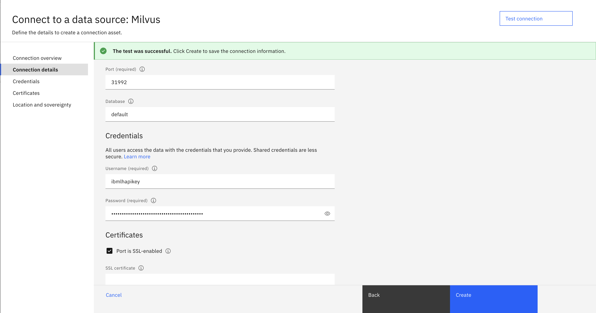
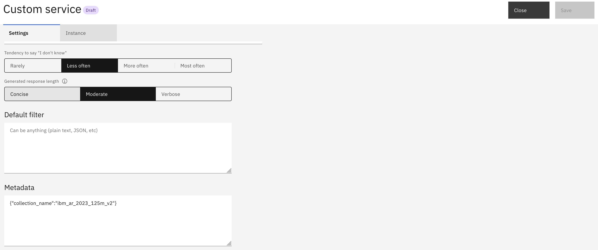

# How to set up Custom Service search with watsonx.data Milvus
This is a documentation about how to set up Custom Search with the Milvus service from watsonx.data and enable conversational search in watsonx Assistant.

## Before your begin
1. Provision an watsonx.data instance
    * watsonx.data on IBM Cloud: https://cloud.ibm.com/watsonxdata
    * watsonx.data on Cloud Pak for Data (on-prem): follow [this doc](https://www.ibm.com/docs/en/cloud-paks/cp-data/5.0.x?topic=services-watsonxdata) to install and set up watsonx.data on Cloud Pak for Data 
2. Add an Milvus service in the watsonx.data console
    * watsonx.data on IBM Cloud: [Adding a Milvus service](https://cloud.ibm.com/docs/watsonxdata?topic=watsonxdata-adding-milvus-service)
    * watsonx.data on Cloud Pak for Data (on-prem): [Adding a Milvus service](https://www.ibm.com/docs/en/watsonx/watsonxdata/2.0.x?topic=milvus-adding-service)

## Step 1: Collect Milvus connection info
### Get the username
The default username is `ibmlhapikey` for the Milvus service on watsonx.data

### Get the password
IBM API key is used as the password for the Milvus service on watsonx.data. There are two options to get the API key to access watsonx.data:
* **(Option 1) Service ID access**: Assign a watsonx.data access role to a service ID and create a new API key or use an existing one from this service ID. You can manage service IDs from the [IBM Cloud IAM Service IDs page](https://cloud.ibm.com/iam/serviceids). 
* **(Option 2) User access**: Assign a watsonx.data access role to a user and create a new API key or use an existing one from this user. You can manage user access and roles either from the [IBM Cloud IAM Users page](https://cloud.ibm.com/iam/users) or within the watsonx.data console by following the [Managing user access](https://cloud.ibm.com/docs/watsonxdata?topic=watsonxdata-manage_access) doc.


### Get other connection details
Here are the steps to collect other Milvus connection details from the watsonx.data console:

1. Go to the `Infrastructure manager` page
2. Click the Milvus service to open the `Details` page
3. Click on `View connect details` to view more connect details
4. Collect the service GRPC `host`, `port`, and the SSL certificate

## Step 2: Ingest data into Milvus
You can ingest data into Milvus vector database either through watsonx.ai or by using custom code.
### Ingest data through watsonx.ai
#### Create a Milvus connection
On the watsonx.ai Project Assets page, click on `New asset` --> choose `Connect a data source` --> choose `Milvus` --> click `Next` --> fill in the connection details, credentials and certificates as below --> `Test connection` --> click `Create`.



**NOTE: SSL certificate is only required for watsonx.data on Cloud Pak for Data.**

#### Create a vector index using the Milvus connection and upload documents
On the watsonx.ai Project Assets page, using the Milvus connection created in the previous step, you can create a vector index and upload documents into it. See the following screen recording for more details: [./assets/create-milvus-index-watsonx-ai.mov](./assets/create-milvus-index-watsonx-ai.mov).

Once the document uploading process is done, you can start testing it in the prompt lab.

**NOTE: `document_name` and `text` are the two main fields created in the Milvus collection schema by default. When searching this Milvus collection using custom code, you need to specify these two fields as output_fields.**

### Ingest data using custom code
Here is a sample code to ingest documents into Milvus: [./examples/index-with-milvus.py](./examples/index-with-milvus.py). To run it, 
* Create environment variables for Milvus credentials
  ```bash
  export MILVUS_HOST = 'Your Milvus GRPC host'
  export MILVUS_PORT = 'Your Milvus GRPC port'
  export MILVUS_USER = 'ibmlhapikey' // your Milvus username
  export MILVUS_PASSWORD = 'Your watsonx.data API key'

  export MILVUS_COLLECTION_NAME = 'Your Milvus collection name' // It can be anything
  export WATSONX_AI_APIKEY = 'Your watsonx.ai API key' // watsonx.ai embeddings model is used to create vectors
  export WATSONX_AI_PROJECT_ID = 'Your watsonx.ai project ID' // watsonx.ai project ID is required to access the models
  ```
* Install dependencies:
  ```bash
  python3 -m pip install pymilvus langchain langchain-milvus langchain-ibm ibm-watsonx-ai
  ```
* Update the `SOURCE_FILE_NAMES`, `SOURCE_URLS`, and `SOURCE_TITLES` variables at the begining of the script to your file names, urls, and titles.
* Run the script
  ```bash
  python3 ./examples/index-with-milvus.py
  ```

## Step 3: Connect to watsonx Assistant via Custom Service search
To connect your Milvus vector database to watsonx Assistant via Custom Service search, you first need to set up a custom server that is reachable by your watsonx Assistant instance. Then, you need to Configure the Custom Service by providing your server credentials.

### Set up a custom server
Here is an example server code based on Python Flask: [./examples/example-milvus-server.py](./examples/example-milvus-server.py). This example code requires setting a list of environment variables, including `MILVUS_HOST`, `MILVUS_PORT`, `MILVUS_USER`, `MILVUS_PASSWORD`, `WATSONX_AI_APIKEY`, `WATSONX_AI_PROJECT_ID`. 

You need to deploy the code as a service on either Cloud or Cloud Pak for Data and make it reachable by your watsonx Assistant instance. IBM Code Engine is recommended to host the code. See [Code Engine docs](https://cloud.ibm.com/docs/codeengine?topic=codeengine-getting-started) for more details.

### Configure the Custom Service search by providing server credentials
Follow the doc [Setting up a Custom service with server credentials](https://cloud.ibm.com/docs/watson-assistant?topic=watson-assistant-search-customsearch-add#setup-custom-service-server) to configure the Custom Service search with your custom server credentials. 

If you have used the above example code [./examples/example-milvus-server.py](./examples/example-milvus-server.py) for your custom server, you need to provide Milvus collection_name as a metadata in the Custom Service settings page. For example,  
