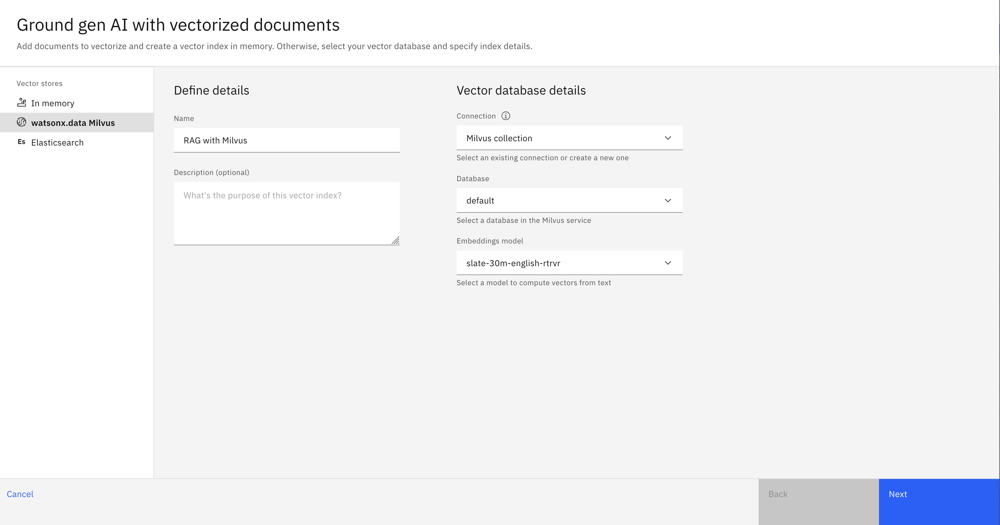

# How to set up the search integration with watsonx.data Milvus in watsonx Orchestrate or Assistant
This document explains how to set up a search integration with the Milvus service from watsonx.data for using search or conversational search feature in watsonx Orchestrate or Assistant product.

## Before you begin
1. Provision a watsonx.data instance
    * watsonx.data on IBM Cloud: https://cloud.ibm.com/watsonxdata
    * watsonx.data on Cloud Pak for Data (on-prem): follow [this doc](https://www.ibm.com/docs/en/cloud-paks/cp-data/5.0.x?topic=services-watsonxdata) to install and set up watsonx.data on Cloud Pak for Data 
2. Add an Milvus service in the watsonx.data console
    * watsonx.data on IBM Cloud: [Adding a Milvus service](https://cloud.ibm.com/docs/watsonxdata?topic=watsonxdata-adding-milvus-service)
    * watsonx.data on Cloud Pak for Data (on-prem): [Adding a Milvus service](https://www.ibm.com/docs/en/watsonx/watsonxdata/2.0.x?topic=milvus-adding-service)

## Table of contents
* [Step 1: Collect Milvus connection info](#step-1-collect-milvus-connection-info)
  * [Get the credentials](#get-the-credentials)
  * [Get other connection details](#get-other-connection-details)
* [Step 2: Ingest data into Milvus](#step-2-ingest-data-into-milvus)
  * [Option 1: Ingest data through watsonx.ai](#option-1-ingest-data-through-watsonxai)
  * [Option 2: Ingest data using custom code](#option-2-ingest-data-using-custom-code)
* [Step 3: Connect to watsonx Orchestrate or Assistant](#step-3-connect-to-watsonx-orchestrate-or-assistant)
  * [Option 1: Use the built-in Milvus search integration](#option-1-use-the-built-in-milvus-search-integration)
  * [Option 2: Use the Custom Service search](#option-2-use-the-custom-service-search)

## Step 1: Collect Milvus connection info
### Get the credentials
#### Username
The default username is `ibmlhapikey` for the Milvus service on watsonx.data

#### Password
IBM API key is used as the password for the Milvus service on watsonx.data. There are two options to get the API key to access watsonx.data:
* **(Option 1) Service ID access**: Assign a watsonx.data access role to a service ID and create a new API key or use an existing one from this service ID. You can manage service IDs from the [IBM Cloud IAM Service IDs page](https://cloud.ibm.com/iam/serviceids). 
* **(Option 2) User access**: Assign a watsonx.data access role to a user and create a new API key or use an existing one from this user. You can manage user access and roles either from the [IBM Cloud IAM Users page](https://cloud.ibm.com/iam/users) or within the watsonx.data console by following the [Managing user access](https://cloud.ibm.com/docs/watsonxdata?topic=watsonxdata-manage_access) doc.


### Get other connection details
Here are the steps to collect other Milvus connection details from the watsonx.data console:

1. Go to the `Infrastructure manager` page.
2. Click the Milvus service to open the `Details` page.
3. Click on `View connect details` to view more connection details.
4. Collect the GRPC `host`, `port`, and the SSL certificate from the service details.

## Step 2: Ingest data into Milvus
You can ingest data into Milvus vector database either through watsonx.ai or by using custom code.
### Option 1: Ingest data through watsonx.ai
#### Create a Milvus connection
On the watsonx.ai Project Assets page, click on `New asset` --> choose `Connect a data source` --> choose `Milvus` --> click `Next` --> fill in the connection details and credentials as below --> `Test connection` --> click `Create`.


**NOTE: SSL certificate is optional. If you include a certificate, it has to be signed by a known certificate authority.**

#### Create a vector index and upload documents
On the watsonx.ai Project Assets page, using the Milvus connection created in the previous step, you can create a vector index and upload documents into it. Here are the steps:
1. On the watsonx.ai Project Assets page, click on `New asset` --> choose `Ground gen AI with vectorized documents`.
2. On the left-side panel, select `watsonx.data Milvus` as the vector store --> fill in name and description --> select the Milvus connection created earlier. 
3. Select the Milvus connection created earlier -> Select `Database` and `Embeddings model` from the dropdowns --> click `Next`. For example,  


4. Click `New collection` to create a new collection.
5. Provide a unique collection name and choose files to add to the Milvus collection --> click `Create`.
6. Once the document uploading process is done, you can start testing it in the prompt lab.

The following screen recording is a demonstration of the above steps: [./assets/create-milvus-index-watsonx-ai.mov](./assets/create-milvus-index-watsonx-ai.mov).

**NOTE: `document_name` and `text` are the two main fields created in the Milvus collection schema by default. When searching this Milvus collection using custom code, you need to specify these two fields as output_fields. When setting up the built-in Milvus search integration, you need to configure the Title and Body fields with these two fields.**

### Option 2: Ingest data using custom code
Here is a sample code to ingest documents into Milvus: [../search-with-custom-service/examples/index-with-milvus.py](../search-with-custom-service/examples/index-with-milvus.py). To run it, 
1. Install dependencies:
   ```bash
   python3 -m pip install pymilvus langchain langchain-milvus langchain-ibm ibm-watsonx-ai PyPDF2
   ```
2. Create environment variables for Milvus credentials
  ```bash
  export MILVUS_HOST="Your Milvus GRPC host"
  export MILVUS_PORT="Your Milvus GRPC port"
  export MILVUS_USER="ibmlhapikey" // The default username for watsonx.data Milvus
  export MILVUS_PASSWORD="Your watsonx.data API key"

  export MILVUS_COLLECTION_NAME="Your Milvus collection name" // It can be anything
  export WATSONX_AI_APIKEY="Your watsonx.ai API key" // watsonx.ai embeddings model is used to create vectors
  export WATSONX_AI_PROJECT_ID="Your watsonx.ai project ID" // watsonx.ai project ID is required to access the embeddings models
  ```
3. Update the `SOURCE_FILES`, `SOURCE_URLS`, and `SOURCE_TITLES` variables at the begining of the script to your file names, urls, and titles respectively.
4. Run the script
   ```bash
   python3 index-with-milvus.py
   ```

## Step 3: Connect to watsonx Orchestrate or Assistant
There are two ways to connect your Milvus vector database to watsonx Orchestrate or Assistant for search and conversational search, either through the built-in Milvus search integration or using the Custom Service search.

**NOTE: The embeddings model you use for search using either option in [Step 3](#step-3-connect-to-watsonx-orchestrate-or-assistant) has to align with the embeddings model used for data ingestion in [Step 2](#step-2-ingest-data-into-milvus).**

### Option 1: Use the built-in Milvus search integration
This option allows you to integrate with your watsonx.data Milvus service through a built-in feature of watsonx Orchestrate/Assistant.

Please go to the [watsonx Assistant product docs](https://cloud.ibm.com/docs/watson-assistant?topic=watson-assistant-search-overview) to find more details about how to set up the built-in Milvus search integration.

### Option 2: Use the Custom Service search
Custom Service search provides a more advanced and flexible way to connect your Milvus vector database to watsonx Orchestrate or Assistant. It requires you to set up a custom server that must be reachable by your watsonx Orchestrate or Assistant instance. Then you need to configure the custom server by providing your server credentials and metadata.

With this option, you can implement more advanced search capabilities with Milvus, such as,
* Flexibility to use any of the embedding models supported by Milvus, and not only those provided by watsonx.ai. For a list of embedding models supported by Milvus, see: https://milvus.io/docs/embeddings.md
* Multi-vector hybrid search: https://milvus.io/docs/multi-vector-search.md
* Reranking: https://milvus.io/docs/reranking.md

#### Set up a custom server
Here is code for an example server based on Python Flask: [../search-with-custom-search/examples/example-milvus-server.py](../search-with-custom-service/examples/example-milvus-server.py). This example code requires setting a list of environment variables, including `MILVUS_HOST`, `MILVUS_PORT`, `MILVUS_USER`, `MILVUS_PASSWORD`, `WATSONX_AI_APIKEY`, `WATSONX_AI_PROJECT_ID`.

You need to deploy the code as a service on either Cloud or Cloud Pak for Data and make it reachable by your watsonx Orchestrate or Assistant instance. If you are using Cloud, IBM Code Engine is recommended to host the code. See [Code Engine docs](https://cloud.ibm.com/docs/codeengine?topic=codeengine-getting-started) for more details.

#### Configure the Custom Service search by providing server credentials
Follow the doc [Setting up a Custom service with server credentials](https://cloud.ibm.com/docs/watson-assistant?topic=watson-assistant-search-customsearch-add#setup-custom-service-server) to configure the Custom Service search with your custom server credentials. 

If you have used the above example code [../search-with-custom-search/examples/example-milvus-server.py](../search-with-custom-service/examples/example-milvus-server.py) for your custom server, you need to provide Milvus collection_name as a metadata in the Custom Service settings page. For example,  

