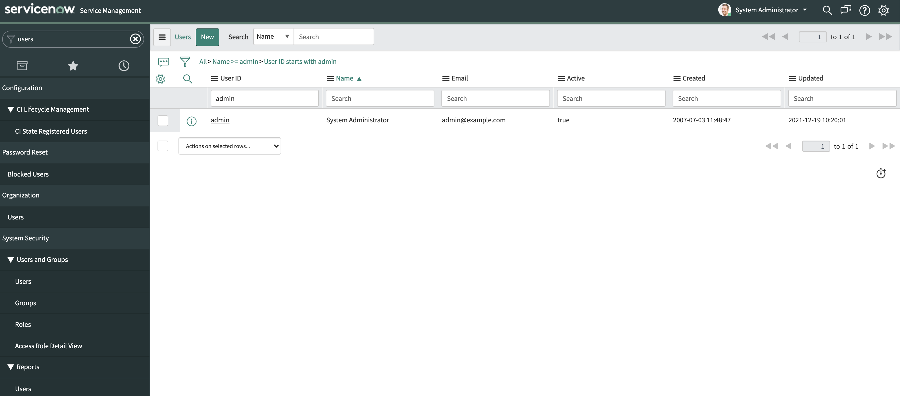
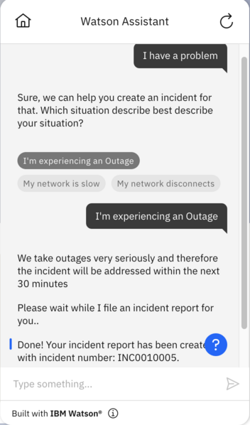

# ServiceNow Incident Report

## Background


ServiceNow is a cloud-based software platform for IT Service Management (ITSM) which helps to automate IT Business Management.
It has a variety of functionalities, however this extension will focus on Incident management, specifically creating an Incident.

Our focus would be on [ServiceNow Table API](https://developer.servicenow.com/dev.do#!/reference/api/sandiego/rest/c_TableAPI) and specifically on using `POST /now/table/{tableName}` where `tableName` is `incident`.

This extension is also described in the following [blog](update link).

## Pre-Requisite Steps

An instance is required to use ServiceNow APIs. Luckily, ServiceNow offers a Personal Developer Instance, well-suited for testing and demos. Follow the instructions [here](https://developer.servicenow.com/dev.do#!/learn/learning-plans/rome/new_to_servicenow/app_store_learnv2_buildmyfirstapp_rome_personal_developer_instances) to create an account and provision a Personal Developer Instance.
### Auth Info
The API requires authentication. To obtain the credentials login to your Developer Instance, and follow the following steps:

1. At the top menu bar click on `All`
2. On the filter, type in `User` and go to `System Security`->`Users and Groups`. 
3. Under `UserID`, search for `admin`. This should look similar to: <br>

Now,
 - Change the email to your personal email 
 - Check the `Passwords needs reset` box
 - Click on `Update`
 - Logout
 - Try to Login, you should be offered to provide a new password, remember it as it wil be used alongside your username (`admin`) as means to do Basic Authentication.

If you encounter any trouble, follow this [guideline](https://docs.servicenow.com/en-US/bundle/sandiego-platform-administration/page/administer/security/reference/change-default-credentials.html).

 Tip: ServiceNow might as you for your current password. To find it, go to your login avatar to access your account and click `Manage Instance Password`. You wlll see there your current password.


A nice way to test you have made the proper changes is to use this [Postman collection](../servicenow/assets/sn.postman.json) and call the API.
please don't forget to change the instance name in the hostname.


## Using this Starter Kit

Upload the provided OpenAPI spec as a custom extension, and 
1. Add `admin` as username and the password you just edited as `password`.
2. Replace the default instance name with yours.

After upload, the actions should be configured to use the fields below for the skill to be fully functional. Follow the instructions [here](../../README.md#configuring-your-actions-skill-to-use-an-extension) and note the information below to do this.

- **Action 1.** I want to report a problem.
    ```
    Operation: https://dev93773.service-now.com/api/now/table/incident
    Parameters:
      - impact: urgency
      - urgency: urgency
      - assignment_group: assignment_group
      - short_description: 1. Sure, we can help you create an inciden...

    ```
## Example Usage
A conversation using this starter kit could look like the following:<br>


