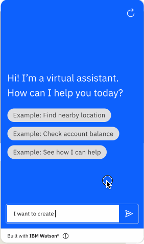
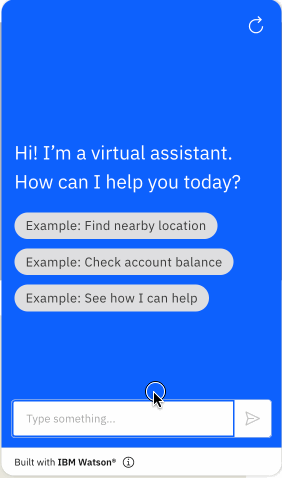

# Spotify Custom Extension

Spotify is a popular music and podcast streaming service that allows for many operations such as music exploration, auditory trait analysis info, music organization, playback, etc. Among the various functionalities that the public API provides, the provided OpenAPI specification currently covers the following calls:

- GET Get User Profile
- GET Get My Playlists
- GET Get Playlist
- GET Get Specific User's Playlists
- POST Create a Playlist
- PUT Follow a Playlist
- DELETE Unfollow a Playlist
- PUT Start/Resume Playback
- PUT Pause Playback

And among these, the provided actions skill currenly only demonstrates:
- GET Get User Profile
- POST Create a Playlist
- PUT Follow a Playlist
- DELETE Unfollow a Playlist

Spotify's Web API can be found [here](https://developer.spotify.com/documentation/web-api/). When successfully called, POST, PUT, and DELETE calls should immediately have their changes reflected in your Spotify UI, regardless if you are using the Spotify Desktop App or Web Browser.

## Pre-Req: Getting Auth Keys
Spotify uses the OAuth Authorization Code flow and **Bearer Authentication** for all API calls, so you will need to obtain an access token following the steps below.

1. If you don't already have one, [create a free Spotify account](https://www.spotify.com)
1. Obtain a Bearer Token (and in the process, create a Spotify developer app)
    - `git clone https://github.com/spotify/web-api-auth-examples`
    - We want to follow the **Authorization Code** flow.
    - Follow the README to set up the server, create a developer app, then run the server. 
        - **NOTE 1**: Make sure you add the `Redirect URI` to your created Spotify App settings in your Spotify for Developers page. If you want to use the default, enter `http://localhost:8888/callback` and Save.
        - **NOTE 2**: In `authorization_code/app.js`, add `user-follow-modify user-follow-read playlist-modify-private` as your `scope` variable:
            ```
            // your application requests authorization
            var scope = 'user-read-private user-follow-modify user-follow-read playlist-modify-private playlist-modify-public user-modify-playback-state playlist-read-private';
            ```
        - Now do the following:
            ```
            cd authorization_code
            node app.js
            ```
    - Open your redirect URI (`http://localhost:8888` if you didn't change anything) in your browser which will display a simple web page that allows you to log in to Spotify.
    - Copy the `access_token` which is displayed fully as a query parameter in the address bar (or the developer tab).
        - **NOTE:** This token expires every 60 minutes, so you will have to click `Obtain new token using the refresh token` to obtain a fresh token.
    - This is the token you can now use when configuring your extension!

The details of this entire setup process is well-documented here: https://developer.spotify.com/documentation/web-api/quick-start/.

## Using this Starter Kit
Upload the provided OpenAPI spec as a custom extension, and add your token to the Auth section when prompted. After upload, the actions should be configured to use the fields below for the skill to be fully functional. Follow the instructions [here](../../README.md#configuring-your-actions-skill-to-use-an-extension) and note the information below to do this.

- **Action 1.** I want to create a playlist.
    ```
    Operation: Create a Playlist
    Parameters:
      - user_id: 1. What is your user id?
      - name: 2. What do you want to name ...
      - description: 3. Give a short description for ...
      - public: isPublic
    ```

- **Action 2.** I want to get my profile info.
    ```
    Operation: Get User Profile
    Parameters:
      - None
    ```

- **Action 3.** I want to follow a playlist.
    ```
    Operation: Follow Playlist
    Parameters:
      - playlist_id: 1. Which playlist do you want to ...
    ```

- **Action 4.** I want to look up a specific playlist.
    ```
    Operation: Get Playlist
    Parameters:
      - playlist_id: 1. Which playlist would you like ...
    ```

Every time you add a new endpoint, you'll need to check/modify the `scope` variable in the token generation server as well, according to the documented designations: https://developer.spotify.com/documentation/general/guides/authorization/scopes/

## Example Usage
A conversation using this starter kit could look like the following:<br>




Free free to contribute to this starter kit, or add other starter kits by following these [contribution guidelines](../../docs/CONTRIBUTING.md).