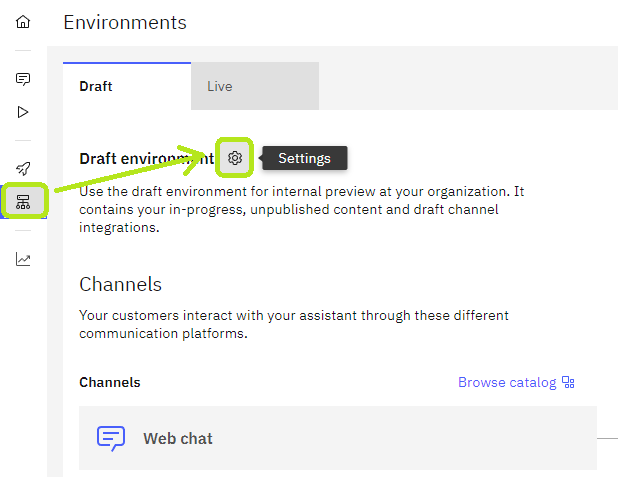
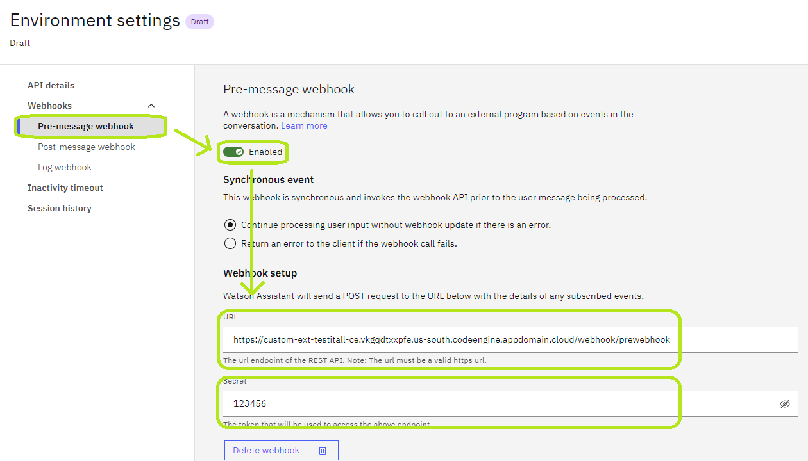

# Test it ALL

> When using this starter kit to create assistant instances, please make sure to **first create and add the extensions
to
> the assistant, then upload the actions.** Therefore, the actions can be automatically associated with the extension.

## Goal

This is an example of all the features supported by Watson Assistant when using a Custom Extension.
The OpenApi specification is vast, and hence not all of its features are supported by Watson Assistant.
This example describes all the features supported and provides a means to test them out.
It is expected that this example will grow over time as more features are supported.

## Features

The provided OpenAPI specification and WA actions currently covered the following features supported by Watson
Assistant:

- Dynamic Base Path in url
- Security: Basic, Bearer, API key and OAuth2
- Parameters: Within query string, header (including Authorization header) or URL path
- Error handling: When an extension error occurred (API server error, response size limit)
- Timeout handling: When an extension takes more than 30 seconds to execute
- Arrays: Both in request and response
- Pre and Post message webhooks

## Mock API Server

The custom extension requires a running API server to test the OpenAPI specification.

### Local Deployment

1. Install [Node.js](https://nodejs.org/en/download/).
2. Clone the repo and navigate to the `testitall/mock-server` folder.
3. Run `npm install` to install the dependencies.
4. Copy the `.env-sample` file to `.env`, and update the environment variables if needed.
5. Run `npm start` to start the server at port `4000`.
6. The server is now running at `http://localhost:4000`. You should see "The mock API server is up and running" when
   open the URL in your browser.

To allow Watson Assistant to access the API server, you need to expose the server to the internet. You can use tools
like
[ngrok](https://ngrok.com/) to do that. After installing ngrok, run `ngrok http 4000` to expose the server to the
internet.

### IBM Cloud Code Engine Deployment

The server comes with the Dockerfile for Code Engine deployment. To deploy the server to Code Engine, please follow the
steps below:

1. Build the docker image
    1. Copy the `.env-sample` file to `.env` and fill in the required information
    2. Build the image with `docker build -t <image-name> .` The image name should follow the format
       of `<registry>/<namespace>/<image-name>:<tag>`. For example, `us.icr.io/testitall_ns/testitall_server:latest`.
2. Push the image to the container registry with `docker push <image-name>`
3. Create a Code Engine project
   and [deploy the image](https://cloud.ibm.com/docs/codeengine?topic=codeengine-deploy-app-crimage)

## WA Actions and corresponding OpenAPI Endpoints

The example provides a set of actions to test the specification:

| WA Action Name                                               | WA Trigger Word            | OpenAPI Endpoint                 | Description                                                                                                                                                                                                                                                                                                  |
|--------------------------------------------------------------|----------------------------|----------------------------------|--------------------------------------------------------------------------------------------------------------------------------------------------------------------------------------------------------------------------------------------------------------------------------------------------------------|
| Test HTTP GET                                                | "GET"                      | `/test`                          | Test HTTP GET.                                                                                                                                                                                                                                                                                               |
| Test HTTP POST                                               | "POST"                     | `/test`                          | Test HTTP POST.                                                                                                                                                                                                                                                                                              |
| Test HTTP PUT                                                | "PUT"                      | `/test`                          | Test HTTP PUT.                                                                                                                                                                                                                                                                                               |
| Test HTTP DELETE                                             | "DELETE"                   | `/test`                          | Test HTTP DELETE.                                                                                                                                                                                                                                                                                            |
| Test HTTP PATCH                                              | "PATCH"                    | `/test`                          | Test HTTP PATCH.                                                                                                                                                                                                                                                                                             |
| Test handle error in response                                | "Error"                    | `/test/error`                    | The API server will return a 404 error to test error handling in WA.                                                                                                                                                                                                                                         |
| Test parse array inside object                               | "Arrays Object"            | `/test/arrays-object`            | The API server will reverse the array inside the object.                                                                                                                                                                                                                                                     |
| Test handle an almost too large response                     | "Context Almost Too Large" | `/test/context-almost-too-large` | The API server will return a response that is almost too large (129KB). The extension call itself should succeed. The action will try to store the response into a session variable which will cause any following conversation to produce a 413 error.                                                      |
| Test handle a too large response                             | "Context Too Large"        | `/test/context-too-large`        | The API server will return a response that is too large (650KB). The extension call should fail.                                                                                                                                                                                                             |
| Test set auth header with context variable                   | "Auth Header"              | `/test/auth-header`              | **Please make sure you've selected `No authentication` option in extension configuration, otherwise the auth header will be overridden.** The WA will set the Authorization header with the value provided by the user. The API server will echo the Authorization header in the response.               |
| Test post with parameters                                    | "Params"                   | `/test/params/{path_param}`      | WA will send a POST request with parameters in the query string, header and URL path. The API server will echo the parameters in the response.                                                                                                                                                               |
| Test response with a delay                                   | "Delay"                    | `/delay`                         | The API server will delay the response by the provided number of seconds (default: 3).                                                                                                                                                                                                                       |
| Test consecutive extension calls                             | "Consecutive"              | `/test`                          | WA will make 3 consecutive calls to the extension, without user interaction between them.                                                                                                                                                                                                                    |
| Test Server-Sent Events (SSE)                                | "Test Server-Sent Events (SSE)"| `/test/stream`               | The API server will start streaming SSE events.                                                                                                                                                                                                                                                              |
| Test a long response in Server-Sent Events (SSE)             | "Test a long response in Server-Sent Events (SSE)"| `/test/stream/timeout`| The API server will stream SSE events until the web chat client times out and throws an error.                                                                                                                                                                                                   |                
| Test handling an error response in Server-Sent Events (SSE)  | "Test handling an error response in Server-Sent Events (SSE)"| `/test/stream/error`| The API server will return a 404 error to test error handling in SSE.                                                                                                                                                                                                                   |
| Test non JSON response | "Test non json" | `/test/non-json-response` | The API server will send a response with an HTML page, WA is expected to fail processing the payload and mark the extension callout as a failure and contain the details of the payload and the parsing error.|
| Test calling extension with different authentication methods | "Security"                 | `/security/{method}`             | **Please make sure you've selected the corresponding auth method in extension configuration before testing it.** WA will call the API endpoint that requires authentication. Supported methods: Basic, Bearer, API key and Oauth2 (except the implicit flow). See below for default credentials. |
| Test pre-message webhook                                     | "Pre-message"              | `/webhook/prewebhook`            | **Please make sure you've enabled the Pre-Message Webhook in environment configuration before testing it.** The server will set the session variable `pre_webhook_message` while receiving the pre-message webhook call.                                                                                 |
| Test post-message webhook                                    | "Post-message"             | `/webhook/postwebhook`           | **Please make sure you've enabled the Post-Message Webhook in environment configuration before testing it.** The server will set the session variable `post_webhook_message` while receiving the post-message webhook call.                                                                              |

For detailed description of each endpoint, please see the [OpenApi Spec](./testitall.openapi.json) provided.

## Extension Authentication Configuration

When adding the extension to your Watson Assistant, you may configure the authentication method used when calling the
extension.

The credentials in this section are used by default for the corresponding authentication methods. When hosting your own
API
server, you may change them by editing the `.env` file.

### Basic

- Username: `"WA_USERNAME"`
- Password: `"WA_PASSWORD"`

### Bearer

- Token: `"WA_TOKEN"`

### API Key

- API key: `"WA_APIKEY"`

### OAuth 2.0

Watson Assistant also supports using OAuth2 to authenticate the extension. More information
available [here](https://cloud.ibm.com/docs/watson-assistant?topic=watson-assistant-add-custom-extension#add-custom-extension-oauth).
The following are the configuration for each OAuth2 grant type:

#### Authorization Code

Please first enter the Client ID:

- Client ID: `"WA_CLIENT_ID"`

> Note: You don't need to manually copy the Redirect URL to your OAuth2 provider. The URL is sent together with the
> request to the provider.

Then, click the `Grant Access` button to authorize the extension to access your OAuth2 provider. You will be redirected
to the provider's authorization page, which will ask you to authorize the
extension. After you authorize the extension, you will be redirected back to the Assistant, with the authorization code
passed to the Watson Assistant.

- Client secret: `"WA_CLIENT_SECRET"`
- Client authentication: `Send as Body` (default)
- Header prefix: `Bearer` (default)

#### Client Credentials

- Client ID: `"WA_CLIENT_ID"`
- Client secret: `"WA_CLIENT_SECRET"`
- Client authentication: `Send as Body` (default)
- Header prefix: `Bearer` (default)

#### Password

- Client ID: `"WA_CLIENT_ID"`
- Client secret: `"WA_CLIENT_SECRET"`
- Username: `"WA_USERNAME"`
- Password: `"WA_PASSWORD"`
- Client authentication: `Send as Body` (default)
- Header prefix: `Bearer` (default)

#### Custom API Key

- Custom API key secret (for custom_apikey grant type): `"WA_CUSTOM_APIKEY_SECRET"`
- Client authentication: `Send as Body` (default)
- Header prefix: `Bearer` (default)

## Assistant Pre/Post message Webhook Configuration

> If you would like to test the webhook related feature, then the API server must be running with HTTPS.

The mock server also provided endpoints for pre-message and post-message webhook. To enable them, please follow the
steps below:

1. Navigate to the `Environment` tab of your Watson Assistant instance.
2. Select an environment, and click the gear icon beside the environment's name to open the environment configuration
   page.
   
3. Select `Webhooks` > `Pre-Message Webhook` or `Post-Message Webhook` from the menu on the left.
4. Enable the webhook by clicking the toggle switch.
5. Enter the URL of the webhook.
    - Pre-message webhook: `https://myserver.com:4000/webhook/prewebhook`.
    - Post-message webhook: `https://myserver.com:4000/webhook/postwebhook`.
6. Enter the secret value in the `Secret` field.
    - Pre-message webhook: `"WA_PRE_MESSAGE_SECRET"`.
    - Post-message webhook: `"WA_POST_MESSAGE_SECRET"`.
   

Here are the list of the endpoints for the pre/post message webhook. Beside the normal pre/post message webhook, there's some additional webhook endpoints provided for testing the error handling of the webhook.
Replace the pre/post webhook URL in steps 5 with the following URLs to test different behaviors:
| Endpoint | Description |
|----------|-------------|
| `webhook/prewebhook` | The server will modify the session variable `pre_webhook_message` while receiving the pre-message webhook call. When entering "skip" for message input, the webhook will include the `X-Watson-Assistant-Webhook-Return` header in its response, tells WA to skip the message processing and return whatever the webhooks returns. In this case, it will return message "Response skipped by webhook" |
| `webhook/postwebhook` | The server will modify the session variable `post_webhook_message` while receiving the post-message webhook call |
| `/webhook/error/non-json` | The server will return a non-JSON response instead of WA conversation context |
| `/webhook/error/timeout` | The server will not respond to the webhooks request |
| `/webhook/error/code` | The server will respond with code 500 |
| `/webhook/error/code/{http_code}` | The server will respond with the provided HTTP status code |
