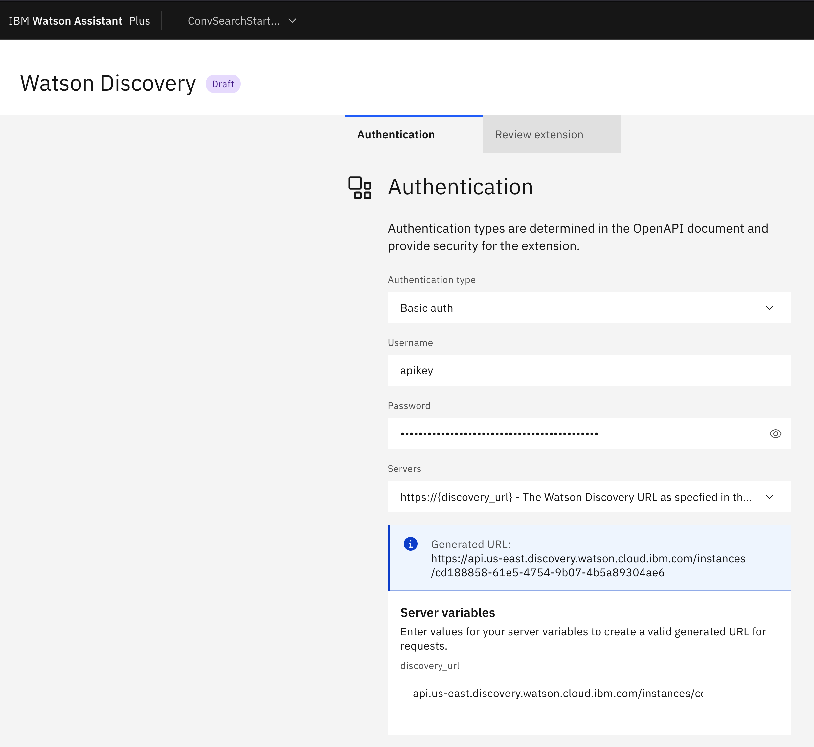
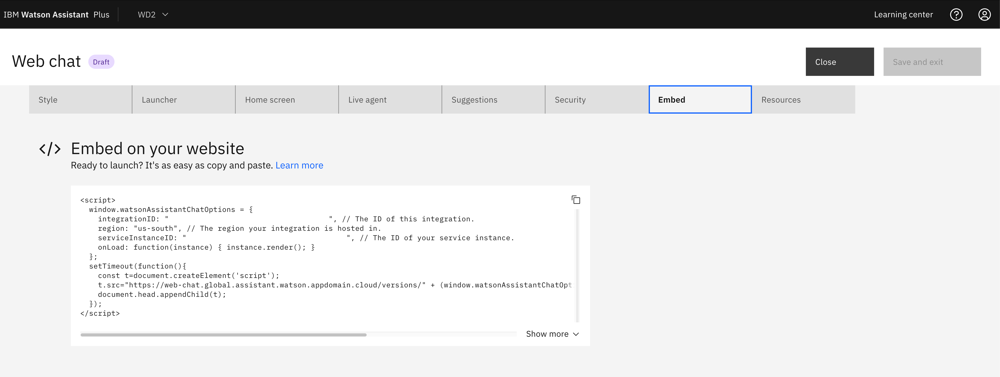
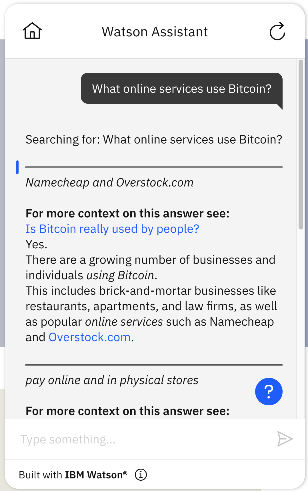
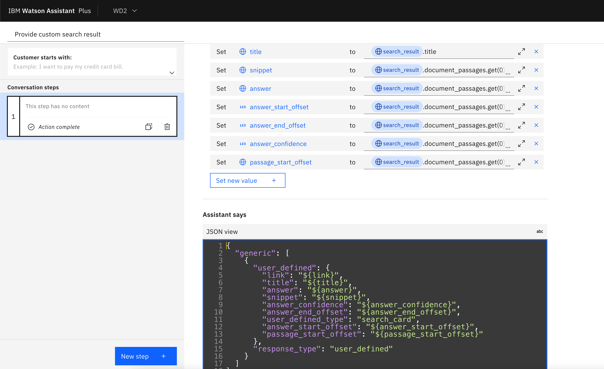
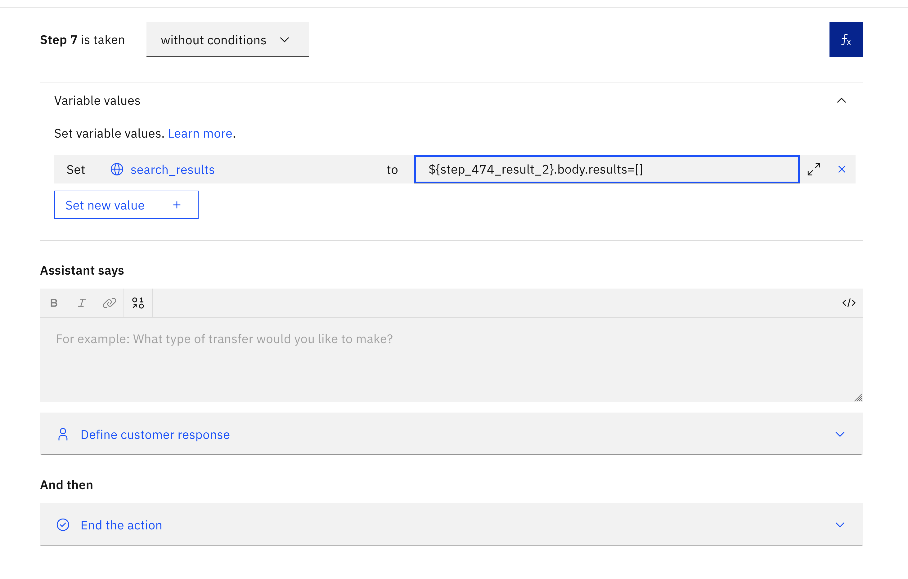

# IBM Watson Discovery:tm: v2 search

## Background

This is a starter kit for accessing the IBM Watson Discovery v2 search API via a custom extension to IBM watsonx Assistant. The purpose of doing so is to allow a chatbot built in IBM watsonx Assistant to search for information in Watson Discovery and show what it finds in the chat. This starter kit uses the custom extensions feature in [the new IBM watsonx Assistant experience](https://cloud.ibm.com/docs/watson-assistant?topic=watson-assistant-watson-assistant-faqs#faqs-new-experience) using actions. Anyone with an older IBM watsonx Assistant instance based on the classic experience and dialogs will need to upgrade to the new IBM watsonx Assistant experience before they can use the features described here.

The OpenAPI spec in this starter kit includes the following endpoint:

- `POST /v2/projects/{project_id}/query`: Query a project.

That endpoint is described in detail [in the Watson Discovery query API reference](https://cloud.ibm.com/apidocs/discovery-data?code=java#query). The OpenAPI spec in this starter kit is a simplified version of the full OpenAPI spec for Watson Discovery. You can also download the full spec for the entire service by going to [the Watson Discovery documentation](https://cloud.ibm.com/apidocs/discovery-data) and clicking on the menu in the upper right. The simplified version in this kit differs from that specification in a variety of ways, e.g.:

1. The one in this kit includes only the POST/query endpoint, and the full one includes all the endpoints.
2. The one in this kit complies with the [restricted subset of OpenAPI that is supported in IBM watsonx Assistant extensions](https://cloud.ibm.com/docs/watson-assistant?topic=watson-assistant-build-custom-extension#build-custom-extension-openapi-file).
3. The one in this kit has a variable for the region where your Watson Discovery is located, while the full spec lists `us-south` as the only location so you need to edit the OpenAPI if your Watson Discovery is in a different region.
4. The one in this kit uses only basic authentication. The full spec uses the more powerful but also more complex IAM authentication.

An alternative to this starter kit is to connect your Watson Discovery instance to IBM watsonx Assistant via the [built-in search integration](https://cloud.ibm.com/docs/watson-assistant?topic=watson-assistant-search-add). That is generally a simpler, quicker, and easier experience so we would recommend that for beginning users who have relatively simple needs from Watson Discovery. However, the built-in search integration uses Watson Discovery in some limited, restricted ways and doesn't expose the full power of Watson Discovery. In contrast, using custom extensions can allow you to use all of the parameters that the Watson Discovery APIs expose and to access all of the values that API returns. For example, the built-in search integration has an "Emphasize the Answer" option, and if you turn it on, IBM watsonx Assistant will identify the chunk of text within each response that it thinks is most likely to be the direct, concise answer to the question that was asked and will emphasize that text within the search result card. That can be a great feature, but it can also be somewhat annoying and distracting when it is showing a search result that has no useful answer but it still highlights whatever it thinks is most likely to be the answer in each card. Watson Discovery provides an answer _confidence_ for each answer that provides an estimate of the probability that the answer is correct, so a user of Watson Discovery can use that probability to decide whether the answer is plausible enough that it should be emphasized. The built-in search integration in IBM watsonx Assistant does not expose the answer confidence because it is designed to provide simple, minimal functionality. In contrast, a custom extension lets you access all of the outputs of Watson Discovery. In the kit, we show how this can be used to emphasize answers with high confidence while ignoring answers with low confidence.

Because the primary path for beginning users to connect Watson Discovery to IBM watsonx Assistant is via the built-in search integration, this starter kit is relatively advanced and assumes some basic familiarity with both products. If you want a more basic introduction to connecting IBM watsonx Assistant to a search API via a custom extension, you may want to start with one of the other starter kits for custom extensions for search, e.g., the [Coveo search extension starter kit](https://github.com/watson-developer-cloud/assistant-toolkit/tree/master/integrations/extensions/starter-kits/coveo/README.md).

## Pre-Requisite Steps

### Deciding whether to use this kit or the built-in search integration

As noted above, the built-in search integration is a simpler, easier, but less flexible way to connect IBM watsonx Assistant to Watson Discovery. If you don't need the added flexibility that the custom extension in this starter kit provides, then we would recommend using the built-in search integration. In the starter kit, we show the following examples of why you might need the flexibility of a custom extension:

1. We show how to use the _confidence_ in a concise answer to decide whether to emphasize it within a passage. (In doing so, we show how to call your own Javascript functions on the outputs of Watson Discovery, which could also be applicable to many other needs.)
2. We show how to restrict the `count` of search results for one intent without changing it for others. (In doing so, we show how to set any of the Watson Discovery parameters to any value you want, which could also be applicable to many other needs.)

Here are some additional examples of things you might need to do when connecting IBM watsonx Assistant to Watson Discovery that could require the added flexibility of a custom extension:

1. If your Watson Discovery documents have a complex schema with many fields (which can happen if you are uploading CSV files or JSON files or if you have a customized Smart Document Understanding model), the custom extension approach allows you to use any or all of the fields you want. (In contrast, the built-in integration only lets you select one title field, one text field, and one URL field).
2. If your Watson Discovery documents include fields that are arrays or complex nested structures, you can concatenate or otherwise arrange elements from those arrays or structures. (In contrast, the built-in integration will take the first element of each array only and will only allow you to pick a single atomic field within a nested structure).
3. You can use metadata in a field in your schema to set the color or shape or other visual elements of a search response.
4. You can show a small graph or table in your response card (or even have a larger one pop up when you click or mouse over).
5. You can get information from custom enrichments in Watson Discovery (e.g., entities or text classifications) and use that information to affect how results are presented to the user.
6. You can restrict a search to one or more collection using the `collection_ids` parameter. This can be helpful if your project has multiple collections (e.g., because it combines multiple sources) and you know that you want to restrict the search to a particular subset of them under some circumstances.

More broadly, anything you can do with Watson Discovery parameters and Watson Discovery outputs, you can do with a custom extension (at least within the size limitation: see the "Limit on Size of Search Results" section later in this document for details). However, a custom extension will be more work, so if you just need simple search results, consider using the [built-in search integration](https://cloud.ibm.com/docs/watson-assistant?topic=watson-assistant-search-add).

### Setting up Watson Discovery

Before starting, you will need an instance of [IBM Watson Discovery](https://www.ibm.com/cloud/watson-discovery). You will also need the URL for that instance and either an API key or a bearer token for that instance. Typically API keys are used for IBM Cloud instances and bearer tokens are used for instances running in Cloud Pak for Data outside of the IBM Cloud. Both the URL and the API key or bearer token are found on the credentials page for the instance on IBM Cloud or on Cloud Pak for Data.

You will also need to load some data into IBM Watson Discovery. The example actions in this starter kit were tested on an IBM Watson Discovery project in which we ingested the page `https://bitcoin.org/en/faq` and configured Discovery to follow 0 links (i.e., load that one page only). To try out this starter kit, you can also ingest that example page, or you can connect directly to your own data and modify the details of the starter kit as needed to be relevant to your data. Either way, be sure to get the project ID for the project containing your data.

If you are using Watson Discovery in Cloud Pak for Data, this kit will only work if your Watson Discovery instance has a valid SSL certificate signed by a trusted authority _or_ you are connecting to Watson Discovery using a IBM watsonx Assistant on Cloud Pak for Data version 4.6.3 or later. In practice, we find that it is rare for anyone to have a Cloud Pak for Data instance that has a valid SSL certificate signed by a trusted authority, so using this kit with Cloud Pak for Data _mostly_ only works for version 4.6.3 or later. This issue does not apply if you are running Watson Discovery in the public cloud, because the public cloud has a valid certificate signed by a trusted authority.

Also note that Watson Discovery in Cloud Pak for Data does not include the answer finding feature, so you will not get concise answers identified within the passages. You may want to update the "Show search result" action to remove the code that sets the `answer` session variable and includes it in the response before the `snippet`. However, the action will still work even if you don't make this change -- it will just have a blank answer.

## Other Setup Info

### Setup in a new Assistant

If you want to make a _new_ Assistant using this starter kit, take the following steps:

- Download the OpenAPI specification (`watson-discovery-query-openapi.json`) and either Actions JSON file (`watson-discovery-query-actions-generic.json` or `watson-discovery-query-actions-with-examples.json`) in this starter kit.
  - The `watson-discovery-query-actions-generic.json` actions file uses search only when no action matches and does not apply any filters on the search -- it just searches a complete project. It is a general purpose solution usable with any data set.
  - The `watson-discovery-query-actions-with-examples.json` actions file includes everything in the generic actions file _plus_ some specialized examples that show the use of filters and other customization for particular settings or intents. See the "Exploring the actions in the actions file with examples" section of this document for more details.
- Use the OpenAPI specification to [build a custom extension](https://cloud.ibm.com/docs/watson-assistant?topic=watson-assistant-build-custom-extension#building-the-custom-extension).
- [Add the extension to your assistant](https://cloud.ibm.com/docs/watson-assistant?topic=watson-assistant-add-custom-extension) using the API key and region you obtained in the pre-requisites above.
  - If you have an API key (as typical on IBM Cloud), select basic authentication, and it will ask for a username and password; for the username, enter the word - `apikey` (and not the actual api key you have) and for the password enter the actual API key you obtained in the pre-requisites above.
  - If you have a bearer token (as typical on Cloud Pak for Data), select bearer authentication, and it will ask for your bearer token.
  - At the bottom of the `Authentication` pane, under `discovery_url` fill in the URL for your Discovery instance (without the `https://` prefix).
    
- [Upload the Actions JSON file](https://cloud.ibm.com/docs/watson-assistant?topic=watson-assistant-admin-backup-restore#backup-restore-import).
- Under "variables"/"created by you" (within the Actions page), set the `discovery_project_id` session variable using the value you obtained in the pre-requisites above.
- If you are using the OpenAPI specification _exactly_ as it is in this starter kit, you should find that your actions are correctly configured to use this extension as is. However, if you have made any changes to the OpenAPI specification, you will need to manually configure your search action as follows:
  - In the step of the "Search" action that says "Use an extension", select the extension you created, the "Query a project" endpoint, and set the following parameter values (some of which are listed under "optional parameters", which you need to click on to see):
    - `project_id` = the `discovery_project_id` session variable
    - `version` = the `discovery_date_version` session variable
    - `count` = an expression with the value `3` (because we are showing up to 3 results -- adjust this if you want to show a different number)
    - `passages.characters` = an expression with the value `250` (you can adjust this to get longer or shorter passages)
    - `passages.enabled` = an expression with the value `true`
    - `passages.fields` = an expression with the value `["text"]` (this is the fields where you will extract passages from, so it is important to set correctly)
    - `passages.find_answers` = an expression with the value `true`
    - `table_results.enabled` = an expression with the value `false` (because we are not using tables in this example)
    - `return` = an expression with the value `["title","metadata.source.url"]` (these are the fields for which the entire text is returned; see the "Limit on Size of Search Results" section of this document for more details on why it is extremely important to set this)
    - `natural_language_query` = the `query_text` session variable
  - If you used the actions file with examples (`watson-discovery-query-actions-with-examples.json`) you also need to setup some domain-specific example actions:
    - In the extension step of the "Search within the mining topic" action, set all the same values as "Search" plus the following:
      - `filter` = an expression with the value `mining`
    - In the extension step of the "How many Bitcoins can exist?" action, set all the same values as "Search" plus the following:
      - `count` = an expression with the value `1` (instead of the `3` in search)
      - `filter` = an expression with the value `finite`

### Setup in a pre-existing Assistant

If you want to add this starter kit to an _existing_ assistant, you cannot use the Actions JSON file since it will overwrite your existing configuration. Anyone wanting to add this capability to an existing bot may thus want to start by setting up the starter kit in a new Assistant (as described in the previous section), spend some time looking at how it works and what it does, and then apply what was learned to their existing assistant. You should be able to use the OpenAPI specification (`watson-discovery-query-openapi.json`) to [build a custom extension](https://cloud.ibm.com/docs/watson-assistant?topic=watson-assistant-build-custom-extension#building-the-custom-extension) without making any changes to it. However, you will need to make your own Actions, including the ones in the generic actions file and perhaps some that are inspired by the additional examples in the "with examples" actions file.

### (Optional/Advanced) Setup the sample index.html file

Included in this kit is an `index.html` file in the `client/javascript` subdirectory. To use this file, do the following:

- Setup the assistant (as described in "Setup in a new Assistant" above).
- Open the web chat configuration screen (from the Environments or Integrations pages).
- Select the "Embed" tab, which should look like the (redacted) image below:  
  
- From the included snippet, copy only the three lines starting with `integrationID`, `region`, and `serviceInstanceID`. Don't copy the others, because the `index.html` file in this kit already has all that.
- Edit the `index.html` file in this kit to replace those same three lines in the kit (which have dummy placeholder values) with the ones you copied in the previous step. Now the script is pointing specifically to _your_ assistant.

## Using this Starter Kit

If you did the "Optional/Advanced" setup of `index.html`, you can load `index.html` in the `client/javascript` subdirectory into a browser (e.g., Firefox or Chrome or Safari). You will see the sample site in the background, and a circle in the lower right where you can open the web chat. Click on it, and type in a query. Here is an example of what the results might look like:


You can also go to the "Preview" tab of IBM watsonx Assistant tooling and see what the results look like without the special features in `index.html`. Here is an example of what the results might look like in this case:



### Exploring the generic actions

In this subsection, we describe the actions that are present in _both_ the `watson-discovery-query-actions-generic.json` and `watson-discovery-query-actions-with-examples.json` files. In the following subsection, we will discuss the domain examples that are only present in the latter.

To explore the actions, go to the Actions page in IBM watsonx Assistant. You may want to start with the "Set by assistant" list of actions and click on "No action matches". The first step of this action calls out to the "Search" action (which is in the "Created by you" list of actions). If you have an assistant for which you expect search to be common and important, you may want to end your "No action matches" action there, so that when no action matches, you will _only_ get search results. However, in our starter kit, we've included some extra logic that might be useful for assistants where search results are expected to be infrequent and less relevant. Specifically, we check to see if "No action matches" has triggered 3 or more times. If not, we end the action, but if so, we also trigger an "escalate to agent" event, which gives the user an option to connect directly to your service desk (if you have configured one). The motivation here is that if a user has issued that many queries that did not match any of your actions and only produced search results, they may not be getting the information they need and may need more help. Of course, if you do not have a service desk configured, then you should get rid of this logic and terminate after the first step.

As noted above, "No action matches" calls out to "Search" in "Created by you". The first step of "Search" sets the `query_text` to `input.original_text`. As noted in the [documentation for spell checking](https://cloud.ibm.com/docs/assistant?topic=assistant-dialog-runtime-spell-check#dialog-runtime-spell-check-how-it-works), `input.original_text` is set _only_ if the utterance from the user was altered due to spell correction and then it records the original request from the user and not the spell corrected text. Spell correction can be very counter productive for searching because it can take specialized domain vocabulary and "correct" those terms to generic words in the language, so it is often better to apply the search on the original text. The next step in Search then checks to see if the `query_text` is set (which it will be only if spell correction activated) and if not, it falls back to `input.text`. At this point, `query_text` is guaranteed to be the exact original query issued by the user. The next step calls the Watson Discovery search extension. The next step provides an error message if the search failed. The following step then calls out to the "Show search results" action. The final step then empties out both the result list in the extension response and the search results variable. This is done to avoid keeping too much data in memory; see the "Limit on Size of Search Results" section later in this document for more details on why this is important.

The "Show search results" action calls the "Show search result" action up to three times depending on how many search results were received. The "Show search result" action first checks to see if `user_defined_responses_enabled` is true. This session variable is initialized to `false` (under "variables"/"set by you" within the Actions page). However, it is set to `true` in `index.html` (discussed below). So when this action is called from `index.html`, it produces one behavior (see below) and when it is called directly from the IBM watsonx Assistant preview or a simpler web chat configuration, it produces another. Specifically, when "user_defined_responses_enabled" is false, "Show search result" continues on to the next two steps, which just renders the search result directly using simple HTML. The second step shows a full response with a concise answer and a passage: it presents the answer first and then says "For more context on this answer see:" and then the title with a link to the page and the full passage from which the answer was extracted. This is a bit cumbersome and not really a recommended way to show search results, but it was done this way in this starter kit to illustrate that you can take whatever information you want from the Discovery search API and organize it any way you want in a response.

When `user_defined_responses_enabled` is `true`, "Show search result" calls out to "Provide custom search result" and terminates. The "Provide custom search result" action takes selected information from the Discovery search API and passes it along to the calling application in a user-defined block of JSON. If you click on the `</>` button on the upper right of the "Assistant says" editor, you can see what that looks like:



This JSON information is ignored by the default web chat, but the sample `index.html` in this starter kit includes a `searchCardHandler` function that processes this JSON and renders a search result card. That function calls the `reformat` function, which checks to see if the confidence in the answer is greater than 0.4 and if it is, it removes all the keyword italicization in the search results and instead puts the concise answer in big, bold, underlined letters to indicate that Watson is confident that this is the direct answer to the question (you can see an example of this in the phrase "Namecheap and Overstock.com" in the sample chat image up at the start of this section). If the confidence in the answer is not greater than 0.4, then the concise answer is ignored and the answer is presented with simple keyword italicization (provided by Watson Discovery). The "Provide custom search result" action and this code illustrate the power and flexibility of connecting to Watson Discovery via a custom extension -- you can take any information you want from Watson Discovery and pass it along to your web chat and then write any Javascript you want to process and render that information. In contrast, the built-in search integration with the "Emphasize the Answer" option will let you emphasize concise answers, but you can either turn it on and emphasize all answers or turn it off and emphasize no answers; either way the built-in search integration will not return the confidence of the answer to the calling application so there is no way to condition the behavior on answer confidence. The [Watson Discovery query API](https://cloud.ibm.com/apidocs/discovery-data?code=java#query) provides a large amount of information that is not passed along by the built-in search integration, because that integration is designed for simple, basic applications. A custom extension, as shown in this starter kit, is much more powerful and flexible but requires more work to configure and use.

### Exploring the actions in the actions file with examples

The `watson-discovery-query-actions-with-examples.json` contains some additional actions that illustrate some ways that you might want to further customize the behavior for specific kinds of users or queries. It includes all the same actions as the generic actions file plus a few more described below that are specific to the Bitcoin FAQ example data set. In addition, the generic "Search" action includes an extra step at the beginning that checks if the `application_topic` matches `mining` and if it is, calls out to the "Search within the mining topic" action instead of doing a generic search.

The "Search within the mining topic" action shows how you can configure search based on information you already know about the user. In `index.html`, there is a commented out line that sets the value for `application_topic` to `mining`. If you remove the `//` at the start of the line containing the word "mining" in `index.html`, you will see that you _only_ get search results with the word "mining" in the question portion of the question/answer pair. An application might want to do this to restrict search to a particular topic if it is invoked from a particular part of a web site, or if it has users who are logged in and has information in the profile with information about the kind of user. The action calls the Watson Discovery extension with the `filter` parameter set to `title:mining` (i.e., restricting the search to question-answer pairs with "title" in the question, because the FAQ Extractor in Watson Discovery puts the question text into its `title` field). This is just one of the many ways that the [Watson Discovery query API](https://cloud.ibm.com/apidocs/discovery-data?code=java#query) lets you configure a query, and all of them are available in this custom extension (unlike the built-in search integration, which provides a much simpler set of configuration options). When "Search within the mining topic" gets search results, it calls out to the same "Show search results" action that "Search" does, to show results in the same way.

The "How many Bitcoins can exist?" action illustrates how you can build a tailored search for a particular user intent. Unlike the actions mentioned above which are only triggered directly or indirectly from "No action matches", the "How many Bitcoins can exist?" has a list of sample utterances under "Customer starts with", e.g., "What is the limit on the quantity of bitcoins in circulation?" and "What is the number of bitcoins that will eventually exist?". It calls the Watson Discovery extension with a specific query text, a `count` of 1 (so that it only gets the one result that we know is good for this specific query), and a `filter` that further restricts what result you get. This sort of action can be useful for fine tuning how the search behaves for specific queries that you expect the user to ask. Of course, you could also just put a response for this query into IBM watsonx Assistant directly, and often that is the best approach. However, if your responses change frequently and are maintained outside of Watson (e.g., on a web site or in a content-mangement system), then using something like this to fetch responses from Watson Discovery can be useful. Watson Discovery can be configured to recrawl your sources on a regular schedule (e.g., daily or weekly) so when the sources change, your responses get updated automatically.

The "Bitcoin FAQ search" action acts as a counterbalance to the "How many Bitcoins can exist?" action. If you delete that action, you will see that _many_ different queries match "How many Bitcoins can exist?" because there is just nothing else for them to match to. The "Bitcoin FAQ search" action also has a list of sample utterances under "Customer starts with" that include an assortment of generic keywords relating to Bitcoin plus an example of a query that was triggering "How many Bitcoins can exist?" but should not have. The "Bitcoin FAQ search" just calls the "Search" action and terminates. If you have search within a larger assistant that has a variety of actions, it can be helpful to have a generic action like this to catch a variety of different utterances that you want to trigger a search.

In the Actions global settings (which you get to from the gear icon in the upper right of the Actions page), the sample actions file has configured "Ask clarifying questions" to `Off`. If you turn it back to `On` (which is the default), then whenever IBM watsonx Assistant has a moderate semantic match for "Bitcoin FAQ search" _and_ a moderate semantic match for "How many Bitcoins can exist?" it will first ask which of these you mean. In practice, almost anything relating to Bitcoin or cryptocurrency will have at least a moderate semantic match to both of these, so the net effect is that you get this interaction on nearly every query. This makes for a somewhat tedious experience, which is why we have turned it off in the starter kit. On the other hand, leaving this off does result in some cases where a question is not intending to ask "how many bitcoins can exist?" but that action gets matched anyway. So you may want to try both ways and see which experience you prefer.

## Limit on Size of Search Results

If you look closely at the configurations in the actions that call the search extension ("Search", "Search within the mining topic", and "How many Bitcoins can exist?") you will notice that they set an assortment of parameters that impact how many bytes of data Watson Discovery returns. Most notably, the `count` field is set to 3 (so we are asking for at most 3 search results) and the `return` field is set to `["title","metadata.source.url"]` so we are only getting the title and URL from the document schema (in addition to the passages from the `text` field, because `passages.enabled` is `true` and `passages.fields` is `["text"]`). If we omitted the `return` field, we would be getting back everything in the schema which in our demo example would include the full HTML of the FAQ page (which is fairly large). In addition, we set `table_results.enabled` to `false` because we don't need tables in this application (but small tables may well be fine within the context of this limit).

IBM watsonx Assistant extensions have a hard limit of 100kb on the size of information stored in Assistant context variables (which includes search results). If the results from your extension exceed that limit, the action will fail without any visible warning or error. So be sure to configure your Watson Discovery query cautiously and avoid pulling in anything you do not actually need. As long as you are only asking for text that could plausibly fit into a search result you would want to display in a conversational bot, this limit should not be a severe restriction -- 100kb is a very sizable amount of text. However, if you configure Watson Discovery carelessly (e.g., omitting the `return` parameter) and drag in a lot of extra content you do not intend to use or display, then it is possible to hit this limit and cause your searches to fail. If you are not sure whether your Watson Discovery queries will generate responses that are more than 100kb in size, try calling the Watson Discovery API directly using the API testing tool of your choice and measuring the size of the response.

Here is an example of how to test out the Watson Discovery query API using `curl`, a popular command-line tool for testing APIs. This can also be done using a graphical tool like [Insomnia](https://insomnia.rest/) or [Postman](https://www.postman.com/). Here is the `curl` command with a configuration that matches the one in the general-purpose "Search" action:

```
curl --request POST \
  --user apikey:${APIKEY} \
  --url https://api.us-south.discovery.watson.cloud.ibm.com/\
instances/${INSTANCE_ID}/v2/projects/${PROJECT_ID}/query?version=2022-08-01 \
  --header 'Content-Type: application/json' \
  --data '{
 "natural_language_query": "How secure is Bitcoin?",
 "count": 3,
 "return": ["title","metadata.source.url"],
 "passages": {
  "enabled": true,
  "fields": ["text"],
  "find_answers": true,
  "characters": 250
 },
 "table_results": {
  "enabled": false
 }
}' > temp.txt
```

This command requires that the APIKEY, INSTANCE_ID, and PROJECT_ID be set as [shell or environment variables](https://www.digitalocean.com/community/tutorials/how-to-read-and-set-environmental-and-shell-variables-on-linux) -- set these values to the same ones you used to configure your Assistant. Once you have run the command, look at the size of the file produced (using `ls -lh temp.txt` from a Mac or Linux command line, or using a graphical file manager). The query shown above produces a result of around 2.4kb -- well below the 100kb limit. Since the only fields being returned in full are `title` and `metadata.source.url`, the number of bytes returned in each search result is fairly small. Passages are pulled from the `text` field, but passages are limited in length. So you should be able to use this same configuration on other data sets that have much longer documents and still get results that are not much more than a couple kilobytes in size, as long as the titles and URLs are fairly short.

You may want to test the API on several different queries, especially if you are asking for more fields or longer passages or anything else that might result in more data. You want to make sure that the results are reliably below 100kb, since the search will fail whenever they are not.

In addition, if your results are fairly large (e.g., 10kb or more) then it is also sensible to empty them out at the end of your search action. The reason is that 100kb is a limit on the _total_ amount of data stored in all the variables that the assistant uses. So if you are storing a large amount of left-over data at the end of your search action, it is consuming memory that other actions in your assistant might need and could cause those other later actions to stop working when they run out of memory. The last step of the search actions in `watson-discovery-query-actions-generic.json` or `watson-discovery-query-actions-with-examples.json` do this. Here you can see an how they are set up:



In the example above, the expression on the right sets `${step_474_result_2}.body.results` to an empty list (where `${step_474_result_2}` is the response variable from the extension and the `.body.results` field is the list containing the search results from the Watson Discovery API). The `search_results` variable is then also set to that value. After this step, neither the response variable from the extension nor the `search_results` variable stores all those potentially large search results, so all the memory they were using is freed up.

## Note about the Example

We use bitcoin.org in this starter kit because it is an example of a 3rd party site with a well-structured FAQ page that has a lot of question and answers in a variety of topics. The operators of bitcoin.org were not involved in the making of this starter kit, and this starter kit is not intended to endorse or dispute any content on that site.
