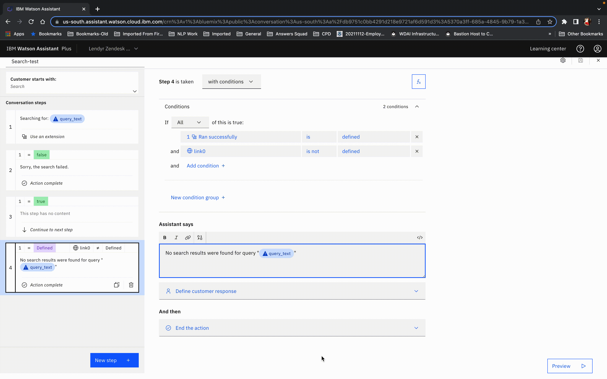
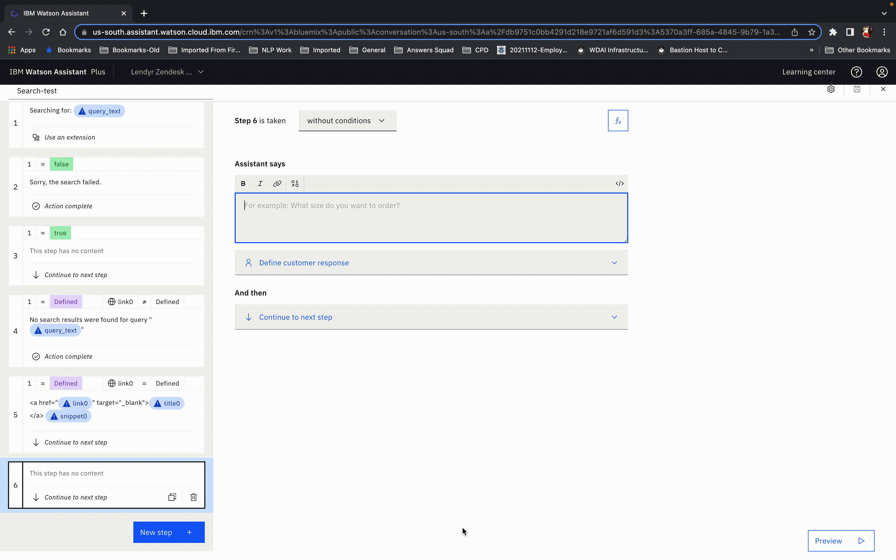
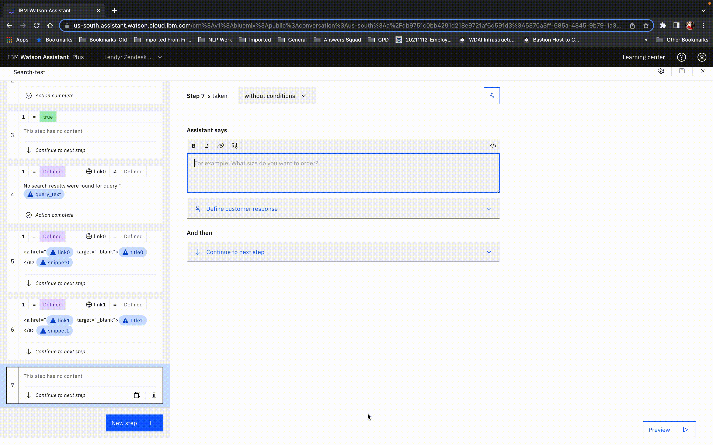
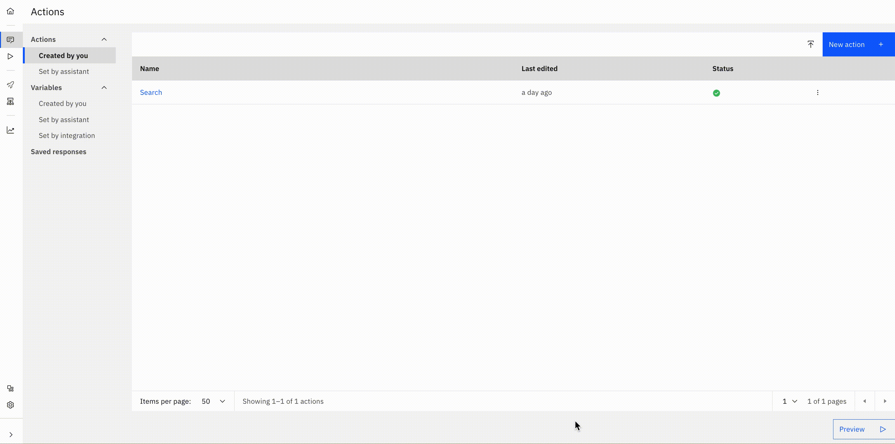

# Zendesk Guide article search

## Background

This is a starter kit for accessing the Zendesk "Search Articles" API, which is part of the Zendesk Guide feature.  It is one of two starter kits we have for working with Zendesk.  The other is the [Zendesk Support](https://github.com/watson-developer-cloud/assistant-toolkit/tree/master/integrations/extensions/starter-kits/zendesk-support) starter kit, which enables submitting and querying support tickets for the Zendesk Support feature.

The OpenAPI spec in this starter kit includes the following endpoint:

- `GET /api/v2/help_center/articles/search`: Search for articles relevant to a given query.

That endpoint is described in detail at https://developer.zendesk.com/api-reference/help_center/help-center-api/search/#search-articles.

## Basic vs Advanced
The `basic` starter kit implements a single yet useful API call for retrieving articles. If you are new to custom extensions, we recommend you start there to get an idea on how to use custom extensions with skills. The `advanced` folder contains a kit with the more advanced functionality of API parameters for filtering your search results, which you can use as a creative springboard for more complex use cases.

## Pre-Requisite Steps

Follow the steps listed in [Pre-Req: Getting Auth Keys and Configuring Your Server](https://github.com/watson-developer-cloud/assistant-toolkit/tree/master/integrations/extensions/starter-kits/zendesk-support#pre-req-getting-auth-keys-and-configuring-your-server) to configure Zendesk to let you access its APIs.

## Other Setup Info

### Setup in a new Assistant

If you want to make a _new_ Assistant using this starter kit, take the following steps:

- Download the OpenAPI specification (`zendesk-article-search-openapi.json`) and Actions JSON file (`zendesk-article-search-actions.json`) from the `basic` folder in this starter kit.
- Use the OpenAPI specification to [build a custom extension](https://cloud.ibm.com/docs/watson-assistant?topic=watson-assistant-build-custom-extension#building-the-custom-extension). In the `Import OpenAPI` step, you will upload (by click or drag-and-drop) the `zendesk-article-search-openapi.json` file to specify the authentication and methods for your extension. You will be able to review the list of the servers and server variables found within the OpenAPI document.
- [Add the extension to your assistant](https://cloud.ibm.com/docs/watson-assistant?topic=watson-assistant-add-custom-extension) using the credentials you obtained in the first step above.
  - For Authentication, select the authentication type provided in your openapi specification from the drop-down menu. In this starter kit, it is `Basic auth`.
  - Next, enter the Zendesk username and password (typically {your_email}/token and the API token) that you obtained in the `Pre-Requisite Steps` section above.
  - Finally, enter the value for your subdomain to access zendesk.com. For example, if your url is https://my-test-domain.zendesk.com, you would enter `my-test-domain` in the Server variables section.
  - Review your extension setup and close to move on to the next steps.
- Now you are ready to add the actions from the starter kit. Select `Actions` in the upper left menu. Then select `Global settings` at the top right of the Actions window and select the `Upload/Download` tab. Now [upload `zendesk-article-search-actions.json`](https://cloud.ibm.com/docs/watson-assistant?topic=watson-assistant-admin-backup-restore#backup-restore-import) to define the actions in this starter kit. Return to `Actions` and you will see the `Search` action from the starter kit in the `Created by you` section.
- Use either method listed in [Configuring Your Actions Skill to use an Extension](https://github.com/watson-developer-cloud/assistant-toolkit/blob/master/integrations/extensions/README.md#configuring-your-actions-skill-to-use-an-extension) to configure the actions you uploaded to invoke the custom extension you built.

### Setup in a pre-existing Assistant

If you want to add this starter kit to an _existing_ assistant, you cannot use the Actions JSON file since it will overwrite your existing configuration.  So instead, follow the following process:

- Download the OpenAPI specification in this starter kit.
- Use the OpenAPI specification to [build a custom extension](https://cloud.ibm.com/docs/watson-assistant?topic=watson-assistant-build-custom-extension#building-the-custom-extension).
- [Add the extension to your assistant](https://cloud.ibm.com/docs/watson-assistant?topic=watson-assistant-add-custom-extension) using the credentials you obtained in the pre-requisite step above.
- Go to `Variables > Created by you` and add `query_text`, `link0`, `link1`, `link2`, `title0`, `title1`, `title2`, `snippet0`,`snippet1`, and `snippet2`.
- Create a new action and put "Search" in "What does your customer say to start this interaction?".  Add step 1:
  - Click the fX button to add a variable and add new session variable `query_text` and select "Expression" type and then put `input.text` or `input.original_text` as the expression.  The former will employ spelling correction to fix any detected spelling errors before sending the query, which can be helpful but it can also be counterproductive if your documents include specialized terminology that is not in our dictionary (such as product names) so you can use `input.original_text` as the alternative in such cases.
  - Optional: In "Assistant says", put `Searching for: ${query_text}`
  - In "And then", select "Use an extension", select the extension you made back in step 2, and select the search endpoint and set the `query` paramter to the `query_text` session variable.

<br>

- Click "New Step" and change "without conditions" to "with conditions" and select "Ran successfully" is "false".  Also set "And then" to "End the action".  Then add the following to the "Assistant says":
Sorry.  The search failed!  Please try again another time.

<br>

- Still in the "Search" action, add a "New Step".  In the new step:
  - In "Assistant says" hit `$` and select "Ran Successfully" and then click on `</>` in the upper right of that box to see the full JSON for the response.  In there, you should see a field called `variable` with a value that looks something like `step_123_result_1`.  Copy that value.
  - Click "abc" in the upper right and delete the variable in "Assistant says" (we only put it there to copy the variable name).
  - Click the fX button to add variables and add all of the following new session variables, replacing `step_123_result_1` with the actual variable name and selecting "Expression" each time. For context on why we do this and what these mean, see [Extensions Made Easy with Watson Assistant Starter Kits](https://medium.com/ibm-watson/extensions-made-easy-with-watson-assistant-starter-kits-6b177f624697):
```
link0 = ${step_123_result_1}.body.results.get(0).html_url
title0 = ${step_123_result_1}.body.results.get(0).title
snippet0 = ${step_123_result_1}.body.results.get(0).snippet
link1 = ${step_123_result_1}.body.results.get(1).html_url
title1 = ${step_123_result_1}.body.results.get(1).title
snippet1 = ${step_123_result_1}.body.results.get(1).snippet
link2 = ${step_123_result_1}.body.results.get(2).html_url
title2 = ${step_123_result_1}.body.results.get(2).title
snippet2 = ${step_123_result_1}.body.results.get(2).snippet
```
- Change "without conditions" to "with conditions" and select "true" for "Ran successfully"

<br>

- Click "New Step" and change "without conditions" to "with conditions" and select "Ran successfully" is "true" and "link0" is not "defined".  Also set "And then" to "End the action".  Then add the following to the "Assistant says":
No search results were found for query "${query_text}"

<br>

- Click "New Step" and also change "without conditions" to "with conditions" and select "Ran successfully" is "true" and "link0" is "defined".  Then add the following to the "Assistant says":

```
<a href="${link0}" target="_blank">${title0}</a>
${snippet0}
```

<br>

- Click "New Step" and change "without conditions" to "with conditions" and select "Ran successfully" is "true" and "link1" is "defined".  Then add the following to the "Assistant says":

```
<a href="${link1}" target="_blank">${title1}</a>
${snippet1}
```

<br>

- Click "New Step" and change "without conditions" to "with conditions" and select select "Ran successfully" is "true" and "link2" is "defined".  For this step, set "And then" to "End the action".  Then add the following to the "Assistant says":

```
<a href="${link2}" target="_blank">${title2}</a>
${snippet2}
```

<br>

- Close the action editor (by clicking X in the upper right)
- Go to "Actions" > "Set by assistant" > "No action matches" and remove all the steps from the action.  Add in a new step.  Under "And then" select "Go to another action" and select "Search" and click "End this action after the subaction is completed".
- You may also want to go to "Actions" > "Set by assistant" > "Fallback" and do the same thing as in the previous step.  Note, however, that this will prevent your assistant from escalating to a human agent when a customer asks to connect to a human agent (which is part of the default behavior for "Fallback") so only do this if you do not have your bot connected to a human agent chat service.  For more details on connecting to human agents within Watson Assistant see [our documentation](https://cloud.ibm.com/docs/watson-assistant?topic=watson-assistant-human-agent) and [blog post](https://medium.com/ibm-watson/bring-your-own-service-desk-to-watson-assistant-b39bc920075c).
- Go to the Search action and remove "Search" from the "Customer starts with" list so that the search action _only_ triggers via the "Go to another action" settings described in steps 13-15 above.  If you skip this, then the "Search" action will also be considered by the intent recognizer as a possible intent, which adds unnecessary complexity to the intent recognition and thus could result in lower overall intent recognition accuracy.

## Using this Starter Kit

### Basic
Once this starter kit is properly installed, you can issue a query to your bot and if there is no other action that you've configured that matched that query then it will generate search results for that query.

### Advanced
[The Zendesk article search API](https://developer.zendesk.com/api-reference/help_center/help-center-api/search/#search-articles) includes several parameters that can be used to filter the search results. For example, you can filter results based on when a document was created or updated. To use the advanced starter kit, follow the installation instructions given above, but use the OpenAPI specification (`zendesk-article-advanced-search-openapi.json`) and Actions JSON file (`zendesk-article-advanced-search-actions.json`) from the `advanced` folder in this starter kit.

#### Example Usage for Filtered Query by Document Creation Date
- Go to `Variables` -> `Created by you`. Create a session variable `created_by_date` and set it to a date. In this example it is 2022-07-15. This will be the value of the `created_after` query parameter.

<br>

- Go to `Actions` -> `Created by you`. Duplicate the basic search action.
- Rename the new action to "Search by document creation date", or something similar.
- Enter the actions editor by clicking on the new action that you have just created. Enter phrases that a customer types or says to start the conversation to trigger this filtered search. In this example, we use "recent rates" and "recent interest rates" to identify the `Search by document creation date` action.

<br>

- Next, go to the first conversation step and add the filter parameter to your extension. In "And then", select "edit extension" to set the `created_after` parameter to the session variable `created_by_date` that you just created.

<br>

- Now the set up of your filtered search by creation date action is complete. You can try out your new filtered search action by typing "recent rates" in the Preview.

<br>
