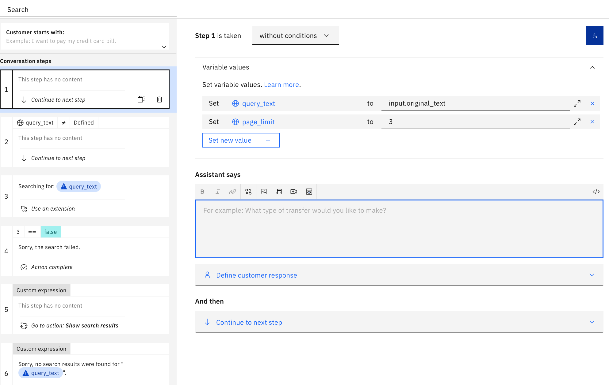
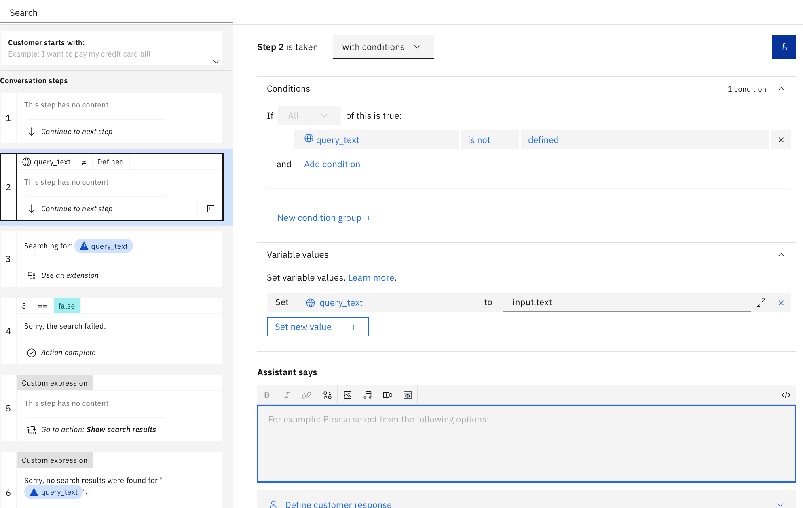
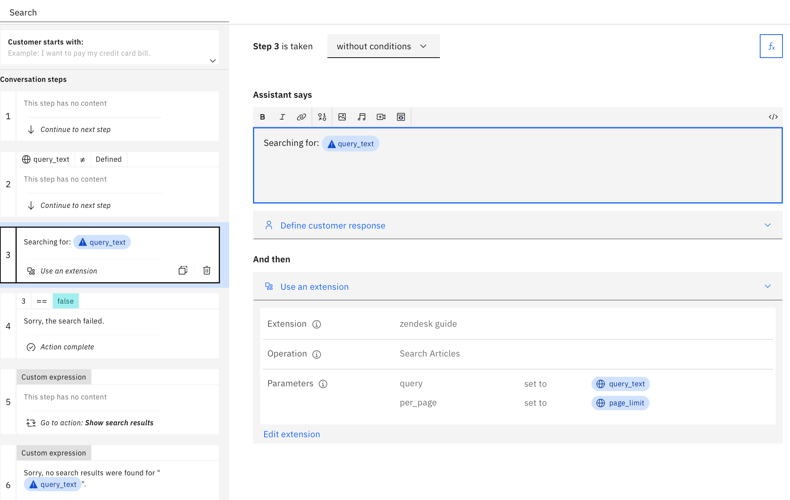
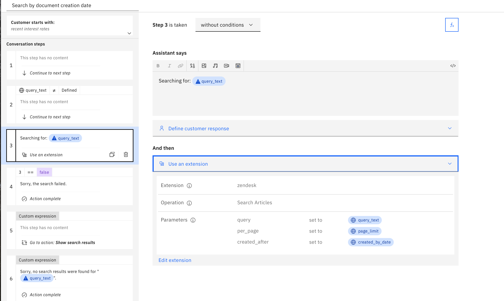
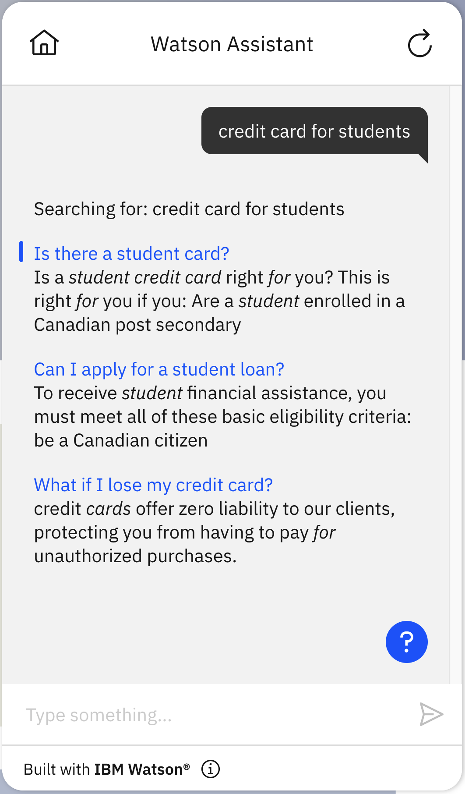
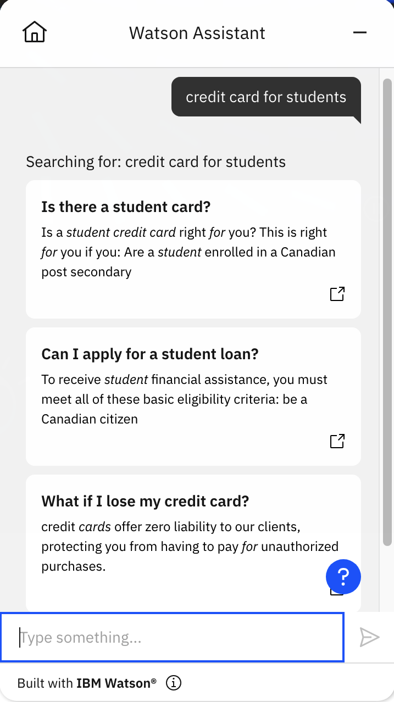

# Zendesk Guide article search

## Background

This is a starter kit for accessing the Zendesk "Search Articles" API, which is part of the Zendesk Guide feature.  It is one of two starter kits we have for working with Zendesk.  The other is the [Zendesk Support](https://github.com/watson-developer-cloud/assistant-toolkit/tree/master/integrations/extensions/starter-kits/zendesk-support) starter kit, which enables submitting and querying support tickets for the Zendesk Support feature.

The OpenAPI spec in this starter kit includes the following endpoint:

- `GET /api/v2/help_center/articles/search`: Search for articles relevant to a given query.

That endpoint is described in detail at https://developer.zendesk.com/api-reference/help_center/help-center-api/search/#search-articles.

## Basic vs Advanced
The `basic` starter kit implements a single yet useful API call for retrieving articles. If you are new to custom extensions, we recommend you start there to get an idea on how to use custom extensions with skills. The `advanced` folder contains a kit with additional API parameters for filtering your search results, which you can use as a creative springboard for more complex use cases. The sample actions in the `advanced` folder include an example in which the query "recent rates" is configured to only search for documents whose creation date is recent.

In addition, the `advanced` version can return _custom search results_ to the calling application.  The `client/javascript` folder has an example `index.html` file that uses those custom search results to render the search results as cards rather than as plain text.  You can see examples of both formats in the "Using this Starter Kit" section later in this document.

## Pre-Requisite Steps

Follow the steps listed in [Pre-Req: Getting Auth Keys and Configuring Your Server](https://github.com/watson-developer-cloud/assistant-toolkit/tree/master/integrations/extensions/starter-kits/zendesk-support#pre-req-getting-auth-keys-and-configuring-your-server) to configure Zendesk to let you access its APIs.

## Other Setup Info

### Setup in a new Assistant

If you want to make a _new_ Assistant using this starter kit, take the following steps:

- Download the OpenAPI specification and Actions JSON file from the `basic` or `advanced` folder in this starter kit. (see "Basic vs Advanced" above).
- Use the OpenAPI specification to [build a custom extension](https://cloud.ibm.com/docs/watson-assistant?topic=watson-assistant-build-custom-extension#building-the-custom-extension). In the `Import OpenAPI` step, you will upload (by click or drag-and-drop) the file in your chosen directory whose name ends in `openapi.json`. This specifies the authentication method, endpoints, and parameters for your extension.
- [Add the extension to your assistant](https://cloud.ibm.com/docs/watson-assistant?topic=watson-assistant-add-custom-extension) using the credentials you obtained in the first step above.
  - For Authentication, select the authentication type provided in your openapi specification from the drop-down menu. In this starter kit, it is `Basic auth`.
  - Next, enter the Zendesk API username and password (typically `{your_email}/token` and the API token) that you obtained in the `Pre-Requisite Steps` section above.
  - Finally, enter the value for your subdomain to access zendesk.com. For example, if your url is https://my-test-domain.zendesk.com, you would enter `my-test-domain` in the Server variables section.
  - Review your extension setup and close to move on to the next steps.
- Now you are ready to add the actions from the starter kit. Select `Actions` in the upper left menu. Then select `Global settings` at the top right of the Actions window and select the `Upload/Download` tab. [Upload the file](https://cloud.ibm.com/docs/watson-assistant?topic=watson-assistant-admin-backup-restore#backup-restore-import) ending in `actions.json` from either the `basic` or `advanced` folder.  This defines the actions in this starter kit. Return to `Actions` and you will see three actions: `Search`, `Show search results`, and `Show search result` from the starter kit in the `Created by you` section (and one more action if you are using the `advanced` configuration).
- Use either method listed in [Configuring Your Actions Skill to use an Extension](https://github.com/watson-developer-cloud/assistant-toolkit/blob/master/integrations/extensions/README.md#configuring-your-actions-skill-to-use-an-extension) to configure the actions you uploaded to invoke the custom extension you built.  We generally recommend "Method 1: For simple actions skills" because it tends to be quicker and easier:
  - Click on the step of the "Search" action that says "Use an extension".  Click on "Edit Extension" and select the extension you created in the earlier steps and the "Search Articles" endpoint.  Then set the following parameter values:
    - `query = query_text`
    - `per_page = page_limit`
  - (Advanced) If you are setting up the advanced search actions, click on the step of the "Search by document creation date" action that says "Use an extension".  Click on "Edit Extension" and select the extension you created in the earlier steps and the "Search Articles" endpoint.  Then set the following parameter values:
    - `query = query_text`
    - `per_page = page_limit`
    - `created_after = created_by_date`

Setting `per_page` is very important for the reliability of the search because IBM watsonx Assistant has a limit of 100kb on how much information can be saved in the session state. For more details see [this note about the limits on the sizes of search results](https://github.com/watson-developer-cloud/assistant-toolkit/tree/master/integrations/extensions/starter-kits/watson-discovery#limit-on-size-of-search-results).

### (Optional/Advanced) Setup the sample index.html file

Included in this kit is an `index.html` file in the `client/javascript` subdirectory.  To use this file, do the following:

- Setup the assistant (as described in "Setup in a new Assistant" above).
- Open the web chat configuration screen (from the Environments or Integrations pages).
- Select the "Embed" tab, which should look like the (redacted) image below:  
  
- From the included snippet, copy only the three lines starting with `integrationID`, `region`, and `serviceInstanceID`.  Don't copy the others, because the `index.html` file in this kit already has all that.
- Edit the `index.html` file in this kit to replace those same three lines in the kit (which have dummy placeholder values) with the ones you copied in the previous step.  Now the script is pointing specifically to _your_ assistant.

### Setup in a pre-existing Assistant

*Note*: If you already did the "Setup in a new Assistant" process above, you can skip over this section and go directly to "Using this Starter Kit" below.

If you want to add this starter kit to an _existing_ assistant, you cannot use the actions JSON file (e.g.,`zendesk-article-search-actions.json`) since it will overwrite your existing configuration. So instead, do the following:

- Download the OpenAPI specification from the `basic` or `advanced` folder in this starter kit. (see "Basic vs Advanced" above).
- Use the OpenAPI specification to [build a custom extension](https://cloud.ibm.com/docs/watson-assistant?topic=watson-assistant-build-custom-extension#building-the-custom-extension).
- [Add the extension to your assistant](https://cloud.ibm.com/docs/watson-assistant?topic=watson-assistant-add-custom-extension) using the credentials you obtained in the pre-requisite step above.
- Go to `Variables > Created by you` and add `query_text`, `page_limit`, `search_results`, `search_result`, `link`, `title`, and `snippet`.
- Go to `Actions > Created by you` and create three new actions titled "Search", "Show search results", and "Show search result" respectively.
- Click on the `Search` action and add step 1. Click the fX button to add a variable and add new session variable `query_text` and select "Expression" type and then put `input.original_text` as the expression. As noted in the [documentation for spell checking](https://cloud.ibm.com/docs/assistant?topic=assistant-dialog-runtime-spell-check#dialog-runtime-spell-check-how-it-works), `input.original_text` is set _only_ if the utterance from the user was altered due to spell correction and then it records the original request from the user and not the spell corrected text. Spell correction can be very counter productive for searching because it can take specialized domain vocabulary and "correct" those terms to generic words in the language, so it is often better to apply the search on the original text, as we are doing here. In addition, click `Set new value` and set `page_limit` to Expression type and then put 3 as the expression. This limits the size of the results returned by the query to avoid hitting the 100kb limit on session state.

<br>

- Add step 2, and change "without conditions" to "with conditions" and set the condition `query_text` is not defined. Then set the variable `query_text` to `input.text`. This is needed because the `input.original_text` is only set when spell correction changed the text. When there was no spell correction, you need to use `input.text` instead. After step 2, `query_text` is guaranteed to be the exact original query issued by the user.

<br>

- Add step 3 to run the search on the query using your extension. In "Assistant says", put `Searching for: ${query_text}`. In "And then", select "Use an extension", select the extension you made back in step 2, and select the search endpoint and set the `query` parameter to the `query_text` session variable and the `per_page` parameter to the `page_limit` variable.

<br>

- Click "New Step" and change "without conditions" to "with conditions" and select "Ran successfully" is "false".  Also set "And then" to "End the action".  Then add the following to the "Assistant says":
Sorry.  The search failed!  Please try again another time.

<br>

- Still in the "Search" action, add a "New Step".  In the new step:
  - In "Assistant says" hit `$` and select "Ran Successfully" and then click on `</>` in the upper right of that box to see the full JSON for the response.  In there, you should see a field called `variable` with a value that looks something like `step_123_result_1`.  Copy that value.
  - Click "abc" in the upper right and delete the variable in "Assistant says" (we only put it there to copy the variable name).
  - Change "without conditions" to "with conditions" and select `true` for "Ran successfully" and add the expression `${step_123_result_1.body.results}.size > 0`
  - Click on "Variable values" and set `search_results` to `${step_123_result_1.body.results}`. This allows you to pass the search results to actions that display them.
  - Set "And then" to "Go to another action" and select "Show search results" and "End current action" upon return.

<br>

- Click "New Step" and change "without conditions" to "with conditions" and select "Ran successfully" is `true` and `${step_123_result_1.body.results}.size = 0`.  Also set "And then" to "End the action".  Then add the following to the "Assistant says":

```
Sorry, no search results were found for "${query_text}"
```

<br>

- Close the "Search" action.
- Click on the "Show search results" action and Add step 1:
  - Change "without conditions" to "with conditions" and add the expression `${search_results}.size> 0`.
  - In "Variable values" set `search_result` to `${search_results}.get(0)`
  - Set "And then" to "Go to another action" and select "Show search result" and "Continue" upon return.
- Duplicate this step by clicking on the "duplicate" icon in the left menu to show the next result.
  - Update the condition and the `search_result` variable assignment to the next available result. For the second result, set the condition to `${search_results}.size> 1`, and the `search_result` to `${search_results}.get(1)`.
  - Duplicate this step for as many results as you want to display. For example, if you want to show 3 results, you will have 3 steps in this action, with "search_result" set to `${search_results}.get(0)`, `${search_results}.get(1)`, and `${search_results}.get(2)`, respectively.
- Close the "Show search results" action.

<br>


- Click on the "Show search result" action and Add step 1:
  - In "Variable values" set `link` to `$search_result.html_url`, set `title` to `$search_result.title`, and set `snippet` to `$search_result.snippet`
  - Then add the following to the "Assistant says" to display the result and then set "And then" to "End the action".

```
<a href="${link}" target="_blank">${title}</a>
${snippet}
```

- Close the "Show search result" action.

<br>

- Close the action editor (by clicking X in the upper right)
- Go to "Actions" > "Set by assistant" > "No action matches" and remove all the steps from the action.  Add in a new step.  Under "And then" select "Go to another action" and select "Search" and click "End this action after the subaction is completed".
- You may also want to go to "Actions" > "Set by assistant" > "Fallback" and do the same thing as in the previous step.  Note, however, that this will prevent your assistant from escalating to a human agent when a customer asks to connect to a human agent (which is part of the default behavior for "Fallback") so only do this if you do not have your bot connected to a human agent chat service.  For more details on connecting to human agents within IBM watsonx Assistant see [our documentation](https://cloud.ibm.com/docs/watson-assistant?topic=watson-assistant-human-agent) and [blog post](https://medium.com/ibm-watson/bring-your-own-service-desk-to-watson-assistant-b39bc920075c).
- Go to each of the actions you created ("Search", "Show search results", and "Show search result").  For each one, go to the "Customer starts with" list and remove the action name for that list.  This ensures that these actions _only_ trigger via the "Go to another action" settings described in the steps above.  If you skip this, then these actions will also be considered by the intent recognizer as a possible intent, which adds unnecessary complexity to the intent recognition and thus could result in lower overall intent recognition accuracy.

At this point, you will have recreated all of the actions in the `basic` version of the starter kit.  If you want to also use the filtered searching capability from the `advanced` kit, you can take the following additional steps to setup the sample action from the advanced actions file (or something similar to set up a filtered search more suited to your specific application):

- Go to `Variables` -> `Created by you`. Create a session variable `created_by_date` and set it to a date. In this example it is 2022-07-15. This will be the value of the `created_after` query parameter used to filter the results in this example.

<br>

- Go to `Actions` -> `Created by you`. Duplicate the basic search action.
- Rename the new action to "Search by document creation date", or something similar.
- Enter the actions editor by clicking on the new "Search by document creation date" action that you just created. Enter phrases that a customer types or says to start the conversation to trigger this filtered search. In this example, we use "recent rates" and "recent interest rates" to identify the `Search by document creation date` action.

<br>

- Next, go to the conversation step that uses your extension and add the filter parameter to your extension as follows: in "And then", select "edit extension" to set the `created_after` parameter to the session variable `created_by_date` that you just created.

<br>

Now the set up of your filtered search by creation date action is complete.

## Using this Starter Kit

### Basic

Once this starter kit is properly installed, you can issue a query to your bot and if there is no other action that you've configured that matched that query then it will generate search results for that query.  Here is an example of what a basic search result can look like:



### Advanced

[The Zendesk article search API](https://developer.zendesk.com/api-reference/help_center/help-center-api/search/#search-articles) includes several parameters that can be used to filter the search results. There are multiple parameters to filter results based on when a document was created or updated, which can be very helpful for limiting query results to the most recent documents or to documents that include a specific modification. There is also a `locale` parameter that can limit query results to e.g., English only documents.

The `Search by document creation date` is preconfigured in the starter kit to conduct the query search in documents created only after `created_by_date`. This section describes how to create this filtered search action.

 You can try out your new filtered search action by typing "recent rates" in the Preview.

<br>

Also, if you did the "Optional/Advanced" setup of `index.html`, you can load `index.html` in the `client/javascript` subdirectory of this starter kit into a browser (e.g., Firefox or Chrome or Safari).  You will see the sample site in the background, and a circle in the lower right where you can open the web chat.  Click on it, and type in a query.  Here is an example of what the results might look like:


