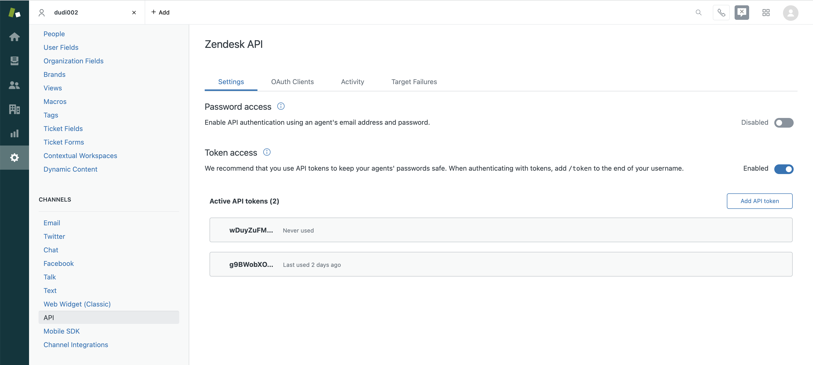
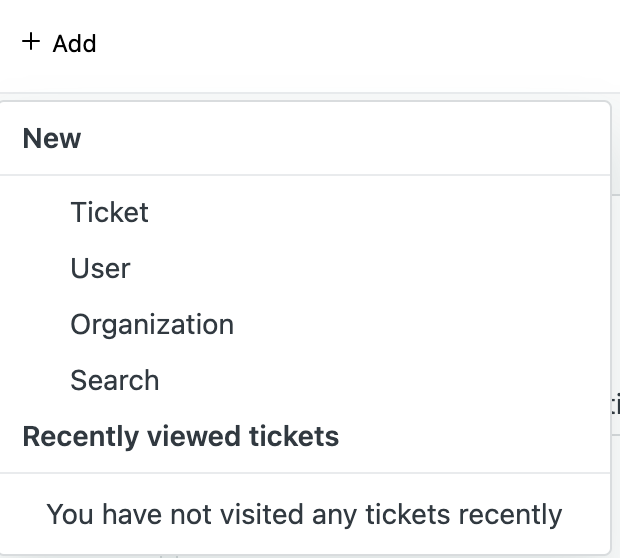
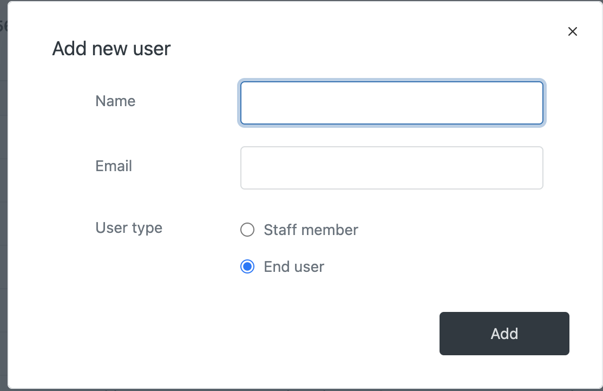

# Zendesk Support Custom Extension


Zendesk is a business tool for facilitating effective customer service, managing teams, and monitoring associated metrics.

In this starter kit, we have the following API endpoints implemented for use:
- POST Create Ticket
- GET List Tickets
- PUT Update Ticket
- GET Get Ticket Comments

Zendesk Support uses `Requests API` to manage tickets - you can find the documentation [here](https://developer.zendesk.com/api-reference/ticketing/tickets/ticket-requests).

## Pre-Req: Getting Auth Keys
Zendesk requires you to generate an API key in order to use their endpoints.

1. Navigate to `Admin` > `Channels` > `API` in the Zendesk Support admin interface.
1. Click `Add New Token`.<br>


Detailed instructions can be found on the Zendesk docs [here](https://developer.zendesk.com/api-reference/ticketing/tickets/ticket-requests/#api-token).
### End Users
An end user can open an *anonymous* ticket, but the features available and the capacity of such tickets are limited. In order to create a ticket that is associated with a non-anonymous user, you will have to manually create the user. Don't forget to verify the user!
 

You will want to take note of the end user email - you will need it later in the authentication header.<br>


## Using this Starter Kit
Upload the provided OpenAPI spec as a custom extension, and add your token to the Auth section when prompted, and you should be able to start using the Zendesk Support API within your assistant and actions skill.

- **Action 1.** Create a Ticket
    ```
    Operation: Create Ticket
    Parameters:
      - user_id: 1. What is your user id?
      - name: 2. What do you want to name ...
      - description: 3. Give a short description for ...
      - public: isPublic
    ```

## Example Usage
A conversation using this starter kit could look like the following:<br>


Free free to contribute to this starter kit, or add other starter kits by following these [contribution guidelines](../../docs/CONTRIBUTING.md).