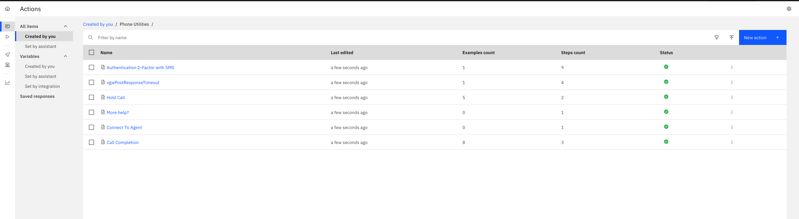
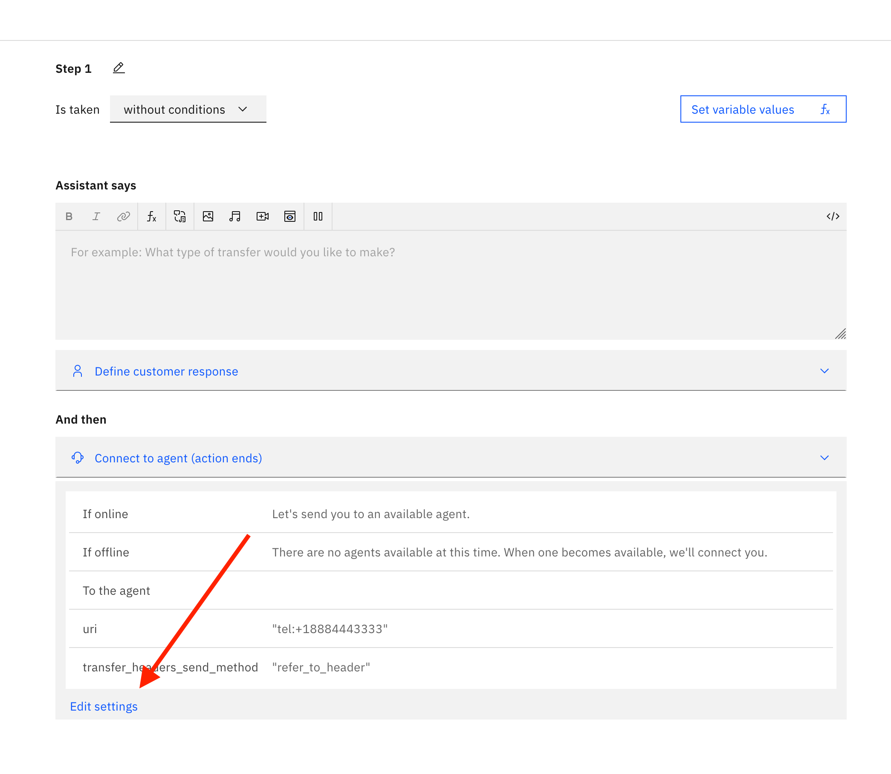
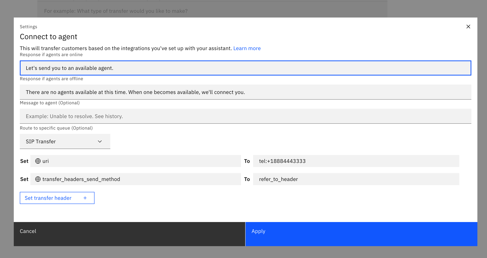
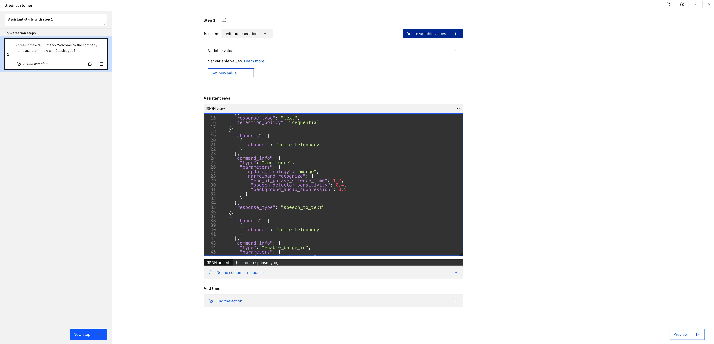

## Phone Starter Kit

This example contains IBM watsonx Assistant phone integration actions that demonstrate:

- How to use the phone and SMS channel for two-factor authentication via the [send a text message](https://cloud.ibm.com/docs/watson-assistant?topic=watson-assistant-phone-actions#phone-actions-sms.)
- How to tune the Watson Speech-to-Text parameters in the Greetings action for background noise (`background_audio_suppression`) and increase the speech capture time (`end_of_phrase_silence_time`) by using the [speech_to_text](https://cloud.ibm.com/docs/watson-assistant?topic=watson-assistant-phone-actions#phone-actions-speech-advanced) response type.
- How to disable and enable Text-to-Speech barge-in via the [text_to_speech](https://cloud.ibm.com/docs/watson-assistant?topic=watson-assistant-phone-actions#phone-actions-text-advanced) response type.
- How to handle the input timeout from the phone channel via the `vgwPostResponseTimeout` keyword.
- How to disconnect the call when the caller is done, using the [end_session](https://cloud.ibm.com/docs/watson-assistant?topic=watson-assistant-phone-actions#phone-actions-hangup) response type.
- How to transfer a call via session-initiated protocol (SIP) transfer using the [Connect to Agent Resolver](#transferring-the-call-via-the-sip-transfer-option-in-the-connect-to-agent-resolver).

### Setting up your own assistant

This example is configured to use an existing assistant set up for common use. If you want to set up your own assistant, you need to perform the following steps:

1. Import the [actions.json](./action.json) file located in the repository for this example.
2. Create an [SMS integration](https://cloud.ibm.com/docs/watson-assistant?topic=watson-assistant-deploy-sms) to use the phone and SMS channel for two-factor authentication (optional).
3. Go to `Actions Settings > Change Conversation Topic > Conversation Topic` and enable `Allow changing the conversation topic for all actions` to handle user-input timeouts as digressions.
4. Go to the `Actions > All items > Created by you` to view a `Phone Utilities` folder with a list of actions that can be used for phone interactions.

### Using the phone channel

Once you've set up the starter kit, you can deploy a [phone integration](https://cloud.ibm.com/docs/watson-assistant?topic=watson-assistant-deploy-phone) if you don't yet have one provisioned.

Here are some example phrases you can use to trigger the different phone utilities while on the phone with your IBM watsonx Assistant:

| Utterance | Phone behavior | Action title |
| --- | --- | --- |
| `Goodbye` or `You've answered all of my questions` | IBM watsonx Assistant will disconnect the call. | `Call Completion` |
| `<<< SILENCE >>>` | IBM watsonx Assistant will reprompt on the phone. | `vgwPostResponseTimeout` |
| `Can I speak to an agent` | IBM watsonx Assistant will attempt to transfer your call. | `Connect to Agent` |

### Starter Kit Details
#### Transferring a call via SIP transfer in the Connect to Agent Resolver

For phone interactions, typically a SIP transfer is required for transferring the call to an upstream SIP provider. In the IBM watsonx Assistant actions, you can use the SIP Transfer option in the Connect to Agent resolver to achieve this. 

1. Go to the "Connect to Agent" action, click the first Action Step and click`Edit Settings` under the `Connect to Agent Resolver`.

2. Add your SIP transfer information by editing fields such as `uri` and adding SIP headers in the configuration options of the Connect to Agent Resolver:

For more information on call transfers, see [Transferring a call to a human agent](https://cloud.ibm.com/docs/assistant?topic=assistant-dialog-voice-actions#dialog-voice-actions-transfer) documentation.

#### Speech Recognition Settings

There may be use cases when you need to tune the speech recognition parameters for phone interactions. For example, in the `Greeting` action (`Actions > Set by Assistant > Greeting`), specifying a `speech_to_text` response type allows you to modify the speech recognition settings for interactions with IBM watsonx Assistant over the phone.

For more information on modifying speech recognition settings, see [Applying advanced settings to the Speech to Text service](https://cloud.ibm.com/docs/assistant?topic=assistant-dialog-voice-actions#dialog-voice-actions-speech-advanced). 

