# Agent Verify

## Background
This agent-assist starter kit combines Watson Assistant's webchat with a wraper application that monitors real-time caller/agent transcriptions to provide the following features:

1. Agent prompting based on customer input.
2. Verification that agent speaks certain prompts back to the caller verbatim.
3. The ability to use caller's speech transcriptions as input to Watson Assistant.

The real-time transcriptions are delivered to the agent-verify application. This sample does NOT include Watson speech support for delivering the real-time transcriptions.

The client application that comes with this starter kit can be embedded into the following agent dashboards:

1. Genesys Cloud CX: This version of the client application relies on Genesys voice transcriptions to drive the Watson Assistant conversational flow.
2. Dashboard Simulator - The starter kit includes a simulator application that can be used for testing outside the chosen CCaaS.

## Structure of the Agent Verify Sample

Below this directory you will find the following two directories:

1. `client` - This directory includes both the HTML and JavaScript files that are used to launch the embedded client applciation.
2. `sample` - This directory contains a sample Watson Assistant actions skill that can be used to demonstrate the fuctionality of this starter kit.
3. `images` - Images contained in this README.
4. `videos` - Contains videos that demo this application.

Here is a quick rundown of all the relevant files:

- `.\client\genesys-agent-assist-verify.html` - Loads the agent-verify app along with the genesys connector. Can be loaded into the genesys agent dashboard.
- `.\client\simulator-agent-assist-verify.html` - Loads both a simulator and the agent-verify application. Can be loaded directly into a browser to locally test the application. 
- `.\client\javascript\agent-verify.js` - Contains the wrapper for the Watson Assistant webchat app. It handles the real-time transcription events published from the various connectors.
- `.\client\javascript\agent-verify.css` - Used to render the agent-verify app.
- `.\client\javascript\connectors\genesys-transcription-connector.js` - This is the code that interfaces with the Genesys notification APIs to receive voice transcription events. It publishes these events directly to the agent-verify application.
- `.\sample\agent-assistant-atlas-airlines.actions.json` - Sample Action skill that can be used to test the agent-verify app.
- `.\sample\aa_transcript.md` - A caller/agent transcript that can be used to test the Atlas Airline skill.
- `.\videos\agent-verify-demo.mp4` - Demo of the agent-verify sample Action and script that is included with this sample application.

## Pre-Requisites

To test this application with a particular Contact Center as a Server (CCaaS) provider requires an account with that provider. It may also require specific permissions within the account. In addition, you will need a Watson Assistant instance.

### Genesys
Genesys Voice Transcription requires customers to have Genesys Cloud CX 1 WEM Add-on II, Genesys Cloud CX 2 WEM Add-on I, or Genesys Cloud CX 3 licenses. You will need voice transcription to be enabled to run this demo.Go here for details on the [Genesys Fair Use Policy](https://help.mypurecloud.com/articles/genesys-cloud-fair-use-policy/). This demo was built using [Genesys Transcription Notifications](https://developer.genesys.cloud/analyticsdatamanagement/speechtextanalytics/transcription-notifications).

You will also need to setup and configure a webserver to serve up the static HTML pages, CSS and javascript contained in this sample project. 

#### Authentication
The Genesys connector included with this sample relise on a type of OAuth called **Token Implicit Grant** browser for authentication. The parameters needed to perform this authentication are passed to the agent-verify application through query parameters. Details on setting up 

#### Agent Groups
You must define a group that will contain agents within the Genesys Admin dashboard. Please refer to Genesys documentation for how to set this up. Note that you will need this group when configuring the agent-verify Interation Widget.

## Watson Assistant Setup

This sample relies on a context variable called `custom_command` received from Watson Assistant to initiate the verbatim check. For any response you wish for the agent to read back verbatim, you can program the Action (or Dialog) step to return the `custom_command` context variable set to `read-verbatim` and the application will display the response in red and convert the response color to green after it receives an agent transcription that closely matches the response from Watson Assistant.

Additionally, you will need to modify the `.\client\javascript\agent-verify.js` to configure the following variables that can be pulled from the Web Chat `Embed` tab that is associated with your Assistant:

- integrationID
- region
- serviceInstanceID

## Test Simulator Setup
Before setting up this sample application with a specific CCaaS service provider, its best to setup and run the test simulator on your agent-verify Watson Assistant Actions. After setting up Watson Assistant as described above, simply load the `simulator-agent-assist-verify.html` file into a browser. Once loaded you can enter both caller and agent input into the text boxes on the left side of the screen and observe the Watson Assistant responses on the right.

You can use the sample Actions skill and transcript included in the samples directory to test if you'd like.

## Web Server Setup
This agent-verify widget runs completely in the browser. There is no server-side runtime included or needed with this sample. The sample HTML and JavaScript must be served up by a web server to be loaded into the Genesys agent dashboard. You can use the following Node.js application to test locally: [http-server](https://www.npmjs.com/package/http-server). To run this in a production environment you will need to serve up all the content below the `client` directory from a web server running on the public internet.

Note that the Test Simulator does NOT require an HTTP server. You can simply load the HTML file directly in the browser to test.

## Genesys Setup
There are two parts to the Genesys setup. The first part covers setting up the queue and creating the widget integration. This includes all the setup needed to embed the agent-verify widget into the Genesys agent dashboard. This README will walk you step by step through this setup. 

The second part of the Genesys setup is to define the inbound call flow to reach the call queue that was set up in part 1 of this guide. The second part of the Genesys setup is not covered in this README. You will need to consult the Genesys documentation for details on how to setup the call flow. Note that there are several different options for this including:

- the use of a Genesys provider to setup a phone number
- the use of an external SIP trunking provider such as Twilio
- the use of a Genesys call simulator

### Step 1: Login to your Genesys account and navigate to the admin page

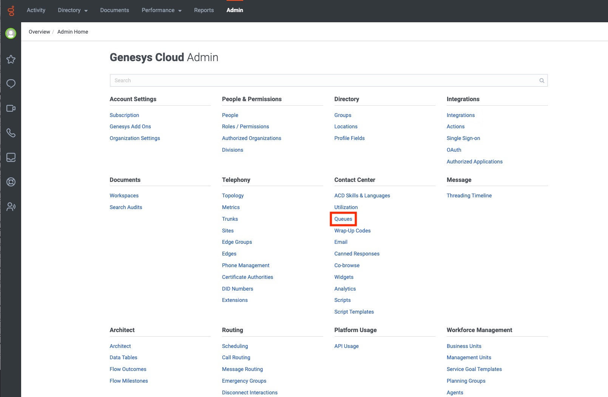

From the Admin panel click on the `Queues` link to create a new queue that will be used to associate the agent-verify Interaction Widget with the agent dashboard that will be loaded whenever a call is answered off the queue.

### Step 2: Create a new queue

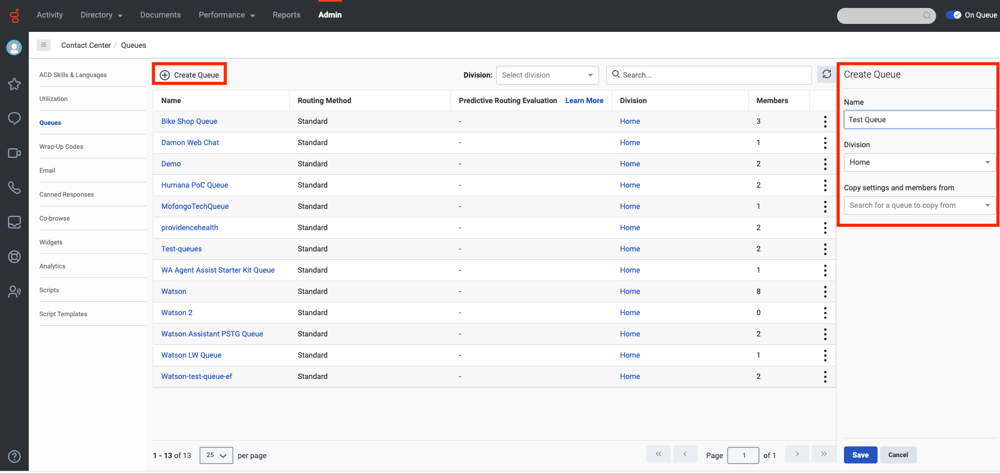

Click create queue and specify a name for the new queue. Read about queue options [here](https://help.mypurecloud.com/articles/create-queues).

### Step 3: Configure the queue

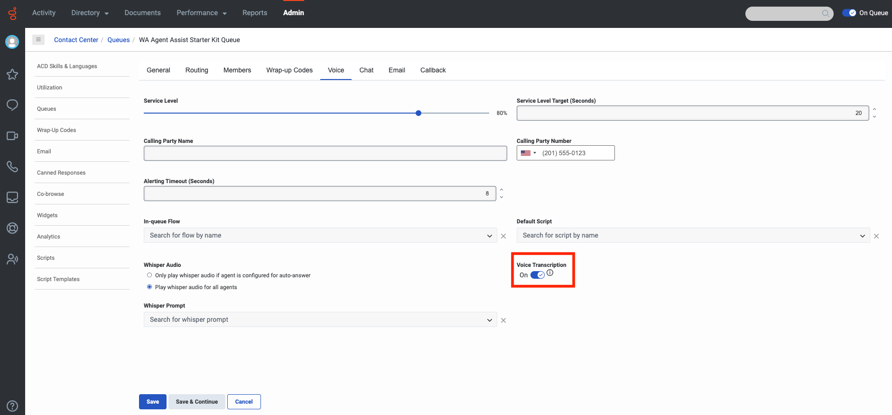

After specifying the members or groups associated with the new queue, you can simply take the defaults for the queue configuration with the exception of the `Voice Transcription` field outlined in red in the above image which needs to be set to On.


### Step 4: Go to the Integrations page from the Admin panel

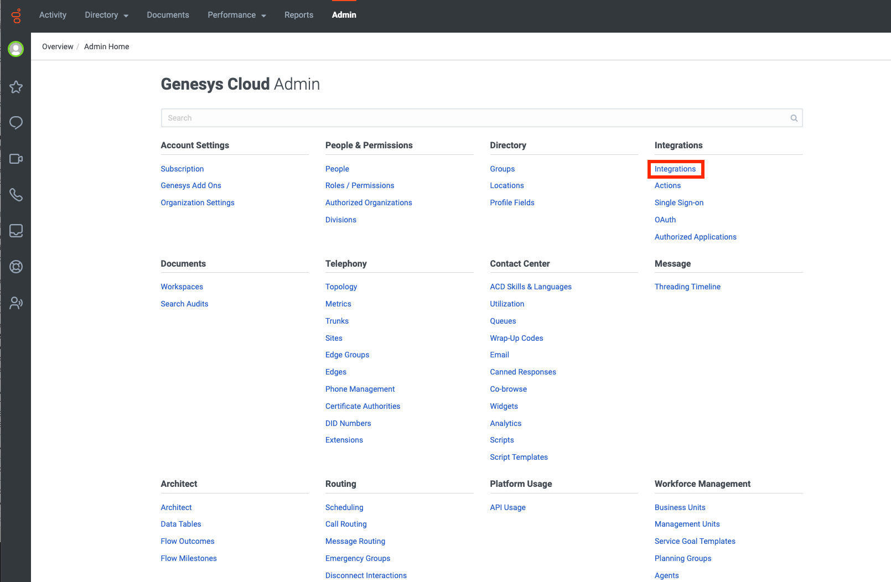

From the Admin panel click on the `Integrations` link to create a new integration.

### Step 5: Create a new integration

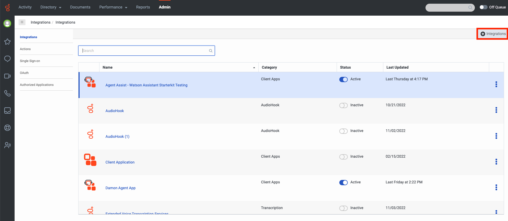

Add a new integration by clicking the + sign in the top right of the page.

### Step 6: Install the Interaction Widget

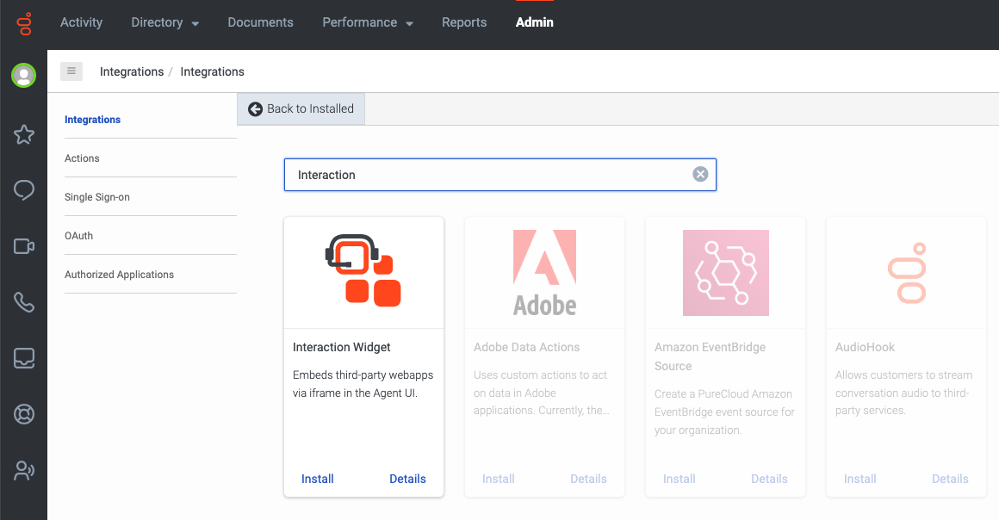

The Interaction Widget is needed to embed third-party webapps via an iframe in the Agent UI.

### Step 7: Configure the Interaction Widget

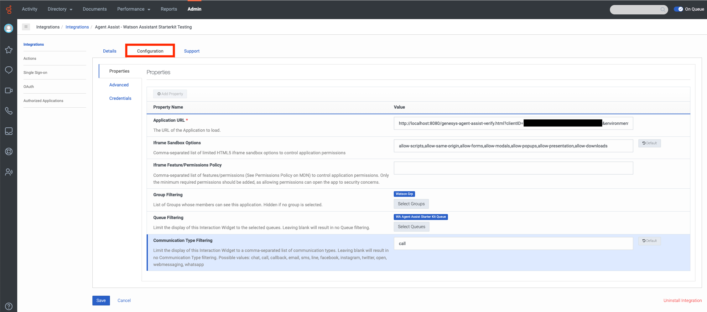

After you provide a name for your widget on the Details tab, you will need to navigate to the Configuration tab. From here you will need to configure both the `Application URL`, the `Iframe Sandbox Options` and `Group Filtering`.

#### Application URL
The `Application URL` should take the following form:

```
http://<webserver>/genesys-agent-assist-verify.html?clientID=<genesys client id>&environment=mypurecloud.com&conversationID={{pcConversationId}}
```
`webserver`: host address and port for the webserver that is serving up the client application files included in this sample application.

`clientID`: generated when you create the OAuth credentials to be used for the implicit token login (see below).

`environment`: based on the location of your Genesys account. The environment shown works for North American accounts.

`conversationID`: generated by Genesys at runtime and the field will be populated by the agent application.

#### Iframe Sandbox Options
The `Iframe Sandbox Options` should be filled in with these options:

```
allow-scripts,allow-same-origin,allow-forms,allow-modals,allow-popups,allow-presentation,allow-downloads
```
#### Group Filtering
The `Group Filtering` section is selected from a pre-configured group that can be created from the Admin page under Directory->Groups. You need to make sure that all agents that require the new agent-verify widget are listed within the chosen group.

### Step 8: Configure OAuth for the Interaction Widget

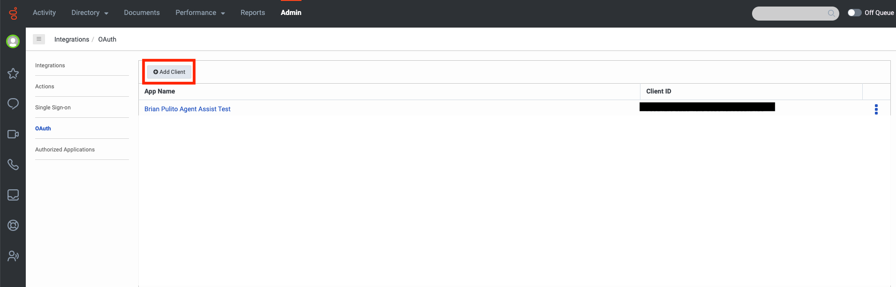
Start by going to `OAuth` under Integrations and it `Add Client` to create a new OAuth client.

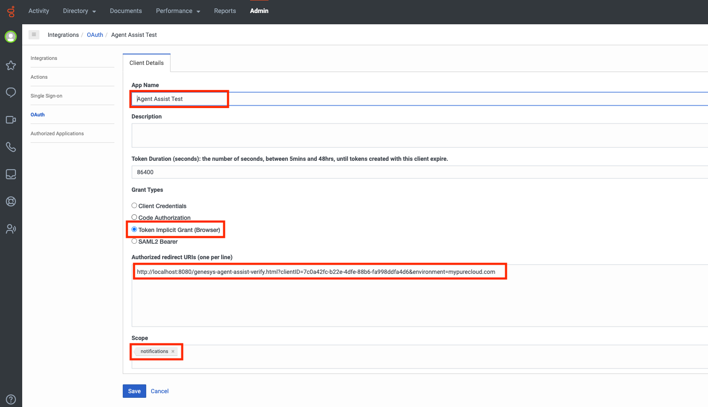
Here you'll need to configure the App Name associated with the credentials, the Grant Type which must be `Token Implicit Grant (Browser)`, the redirect URL which is shown below:
```
http://localhost:8080/genesys-agent-assist-verify.html?clientID=xxxxx&environment=mypurecloud.com
```
and the Scope which is set to `notifications`. Note that the redirect URL does not need to include the conversationID.


Once the previous page is saved, you will be presented with more details about your OAuth configuration including the Client ID which is needed when configuring the Interaction Widget.

### Step 9: Setup Speech and Text Analytics

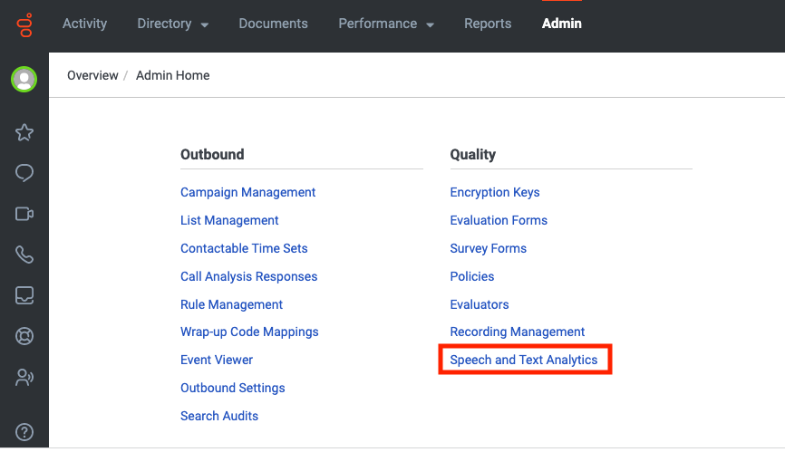

Navigate to the `Speech and Text Analytics` page from the Admin page.

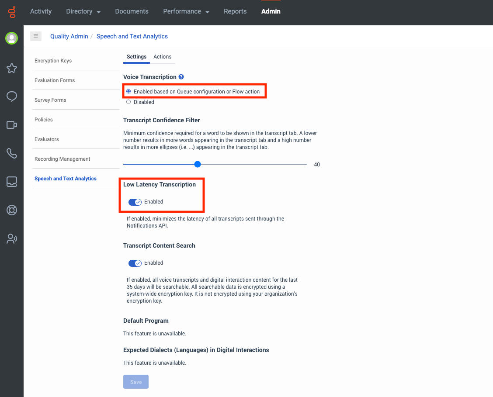

On this page you will need to enable voice transcriptions and `Low Latency Transcription`. You can read more about the settings on this page [here](https://help.mypurecloud.com/articles/speech-and-text-analytics).

----

After completing these steps you will need to setup a call flow to test that the agent-verify widget is being loaded into the Agent Desktop. Here are a few links to help you get started:

- [Integrating Watson Assistant with phone and Genesys Cloud](https://cloud.ibm.com/docs/watson-assistant?topic=watson-assistant-deploy-phone-genesys)
- [Genesys: Create a trunk under BYOC Cloud](https://help.mypurecloud.com/articles/create-a-byoc-cloud-trunk/)
- [About Genesys Cloud Voice](https://help.mypurecloud.com/articles/about-genesys-cloud-voice/)
- [Details on Genesys Voice Transcription](https://help.mypurecloud.com/articles/about-voice-transcription/)

## Miscelaneous

This sample relies on the `string-similarity` algorithm implemented [here](https://github.com/aceakash/string-similarity) to do the verbatim check.

You can download a video of the sample from [here](videos/agent-verify-demo.mp4).


